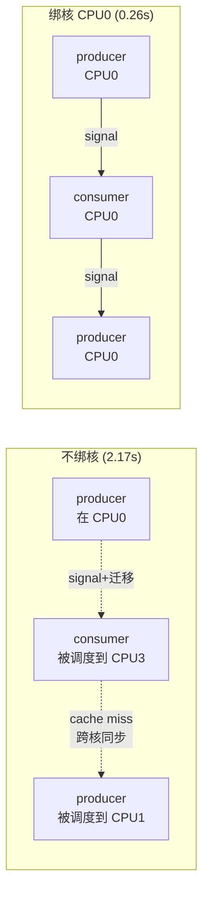

perf stat ./cs 100000
start
producer finished
consumer finished

 Performance counter stats for './cs 100000':

       1262.305920      task-clock (msec)         #    0.579 CPUs utilized
           200,016      context-switches          #    0.158 M/sec
               141      cpu-migrations            #    0.112 K/sec
               221      page-faults               #    0.175 K/sec
                 0      cycles                    #    0.000 GHz
                 0      stalled-cycles-frontend   #    0.00% frontend cycles idle
                 0      stalled-cycles-backend    #    0.00% backend  cycles idle
                 0      instructions              #    0.00  insns per cycle
                 0      branches                  #    0.000 K/sec
                 0      branch-misses             #    0.000 K/sec

       2.178470386 seconds time elapsed


perf stat taskset -c 0 ./cs 100000
start
producer finished
consumer finished

 Performance counter stats for 'taskset -c 0 ./cs 100000':

        260.161009      task-clock (msec)         #    0.999 CPUs utilized
           200,021      context-switches          #    0.769 M/sec
                 3      cpu-migrations            #    0.012 K/sec
               441      page-faults               #    0.002 M/sec
                 0      cycles                    #    0.000 GHz
                 0      stalled-cycles-frontend   #    0.00% frontend cycles idle
                 0      stalled-cycles-backend    #    0.00% backend  cycles idle
                 0      instructions              #    0.00  insns per cycle
                 0      branches                  #    0.000 K/sec
                 0      branch-misses             #    0.000 K/sec

       0.260536213 seconds time elapsed

perf stat -e L1-dcache-load-misses,branch-load-misses,L1-icache-load-misses,cpu-cycles,instructions,cs,migrations,faults taskset -c 0 ./cs 100000
start
producer finished
consumer finished

 Performance counter stats for 'taskset -c 0 ./cs 100000':

         4,792,581      L1-dcache-load-misses                                       
         2,736,372      branch-load-misses                                          
         3,567,462      L1-icache-load-misses                                       
                 0      cpu-cycles                                                  
     1,084,268,090      instructions                                                
           200,002      cs                                                          
                 0      migrations                                                  
               320      faults                                                      

       0.331861776 seconds time elapsed

       0.157618000 seconds user
       0.174210000 seconds sys

perf stat -e L1-dcache-load-misses,branch-load-misses,L1-icache-load-misses,cpu-cycles,instructions,cs,migrations,faults ./cs 100000
start
producer finished
consumer finished

 Performance counter stats for './cs 100000':

       138,067,703      L1-dcache-load-misses                                       
         8,590,027      branch-load-misses                                          
       163,284,022      L1-icache-load-misses                                       
                 0      cpu-cycles                                                  
     1,315,712,942      instructions                                                
           200,001      cs                                                          
                 7      migrations                                                  
               157      faults                                                      

       4.495827633 seconds time elapsed

       0.022917000 seconds user
       3.790797000 seconds sys

[任务规划完成]
# 为什么 `taskset -c 0` 让 cpu-migrations 大幅减少，但 context-switches 基本不变

这是一个非常好的观察！要理解这个现象，需要先厘清 **context-switch（上下文切换）** 和 **cpu-migration（CPU 迁移）** 这两个概念的本质区别。

## 一、两个概念的本质

### 1. Context Switch（上下文切换）
**定义**：CPU 从执行一个线程切换到执行另一个线程（或进程）的过程。无论这两个线程是否在同一个 CPU 上，只要发生了"换人执行"，就计为一次上下文切换。

**触发场景**：
- 线程主动让出 CPU（如调用 `pthread_cond_wait`、`pthread_mutex_lock` 阻塞、`sleep` 等）
- 时间片耗尽被抢占
- 被更高优先级线程抢占
- I/O 阻塞

### 2. CPU Migration（CPU 迁移）
**定义**：一个线程**从一个 CPU 核心被调度到另一个 CPU 核心**上继续执行。它是 context-switch 的一个**子集场景**——即"切换且换核"。

**触发场景**：
- 调度器进行负载均衡（load balancing），把线程从繁忙核迁到空闲核
- 线程被唤醒时，原来运行的核正忙，调度器选择了别的核

---

## 二、回到你的代码分析

你的`context_switch.c` 中，`producer` 和 `consumer` 通过 `pthread_cond_wait` / `pthread_cond_signal` 严格交替执行：

```
producer 生产数据 → signal → wait 在 cond 上
consumer 被唤醒 → 消费数据 → signal → wait 在 cond 上
producer 被唤醒 → 生产数据 → ...
```

每一轮"生产-消费"循环必然产生 **2 次上下文切换**（producer 阻塞→consumer 运行，consumer 阻塞→producer 运行）。

`LOOP_COUNT = 100000`，所以理论上 ≈ 200,000 次 context-switch，与你观测的 `200,016` 和 `200,021` 完全吻合。

---

## 三、为什么 `taskset -c 0` 后 context-switch 不变？

| 指标 | 不绑核 | 绑核到 CPU0 | 变化原因 |
|------|--------|--------------|----------|
| **context-switches** | 200,016 | 200,021 | **几乎不变** ✅ |
| **cpu-migrations** | 141 | 3 | **大幅减少** ⬇️ |
| **task-clock** | 1262 ms | 260 ms | **降到 1/5** ⬇️ |
| **耗时** | 2.17 s | 0.26 s | **快了 8 倍** ⚡ |

### 关键原因：

#### ① context-switch 由"程序逻辑"决定，与核数无关

你的程序的同步逻辑决定了 producer 和 consumer 必须**交替阻塞与唤醒**。无论它们运行在：
- 1 个核上（轮流上 CPU0）
- 2 个核上（一个在 CPU0，一个在 CPU3）

**每一轮交接都是一次 context-switch**。`taskset -c 0` 只是限制了"在哪儿换"，不能消除"换"这个动作本身。

#### ② cpu-migration 由"调度器行为"决定，绑核后被禁用

不绑核时，Linux CFS 调度器会做负载均衡：
- producer 醒来时，CPU0 可能正在跑 consumer，调度器把 producer 派到 CPU1
- 下一轮 consumer 醒来，可能又被派到 CPU2
- → 产生 141 次迁移

绑核到 CPU0 后，两个线程**只能在 CPU0 上跑**，调度器无处可迁，迁移自然降到 3（剩下的 3 次可能是初始化阶段或内核辅助任务造成的）。

---

## 四、为什么绑核后耗时反而快了 8 倍？

这是这个实验最有意思的地方，可以画图理解：



**绑核后变快的原因**：
1. **缓存亲和性（Cache Affinity）**：`mutex`、`cond`、`shared_data` 这些共享变量始终在 CPU0 的 L1/L2 缓存里，无需跨核同步缓存行（避免了 MESI 协议的 cache line bouncing）
2. **避免 IPI（Inter-Processor Interrupt）**：跨核唤醒线程需要发送处理器间中断，开销很大
3. **task-clock 从 1262ms 降到 260ms**：说明 CPU 真正"做事"的时间大幅减少，之前大部分时间花在了跨核协调上

> 注意 `CPUs utilized`：不绑核时是 0.579（多核但利用率低），绑核后是 0.999（单核但用满）。这恰恰说明**这种强同步的生产者-消费者模型并不能从多核中获益，反而被多核拖累**。

---

## 五、结论

| 指标 | 决定因素 | taskset 是否影响 |
|------|---------|------------------|
| **context-switch** | 程序的同步/阻塞逻辑 | ❌ 不影响 |
| **cpu-migration** | 调度器跨核迁移决策 | ✅ 直接消除 |

一句话总结：
> **绑核消除的是"换核"，不是"换线程"**。你的程序逻辑要求 producer 和 consumer 必须互相等待、轮流执行，所以 context-switch 数量由 `LOOP_COUNT × 2` 决定，与是否绑核无关；而 cpu-migration 是调度器的"自由发挥"，绑核后调度器没了选择空间，自然就降为 0 附近。

这也是高性能服务（如 Redis、DPDK、数据库的关键线程）通常会绑核的原因——**消除 cpu-migration 带来的 cache 失效，比追求"多核并行"更划算**，尤其对于强同步的工作负载。


[任务规划完成]
# 为什么 `cpu-cycles` 显示为 0？—— perf 硬件事件的 PMU 计数器冲突问题

这是一个非常专业且常见的 perf 使用陷阱！你观察到的现象**不是 bug**，而是 **PMU（Performance Monitoring Unit，性能监控单元）硬件计数器数量不足导致的"事件复用失败"**。

## 一、核心原因：硬件 PMU 计数器数量有限

CPU 内部有专门的硬件寄存器来统计性能事件，这些寄存器叫 **PMC（Performance Monitor Counter）**。它们的数量是**物理固定的**，无法扩展：

| CPU 类型 | 通用计数器（GP）| 固定计数器（Fixed）|
|----------|----------------|-------------------|
| Intel 主流 x86 | 4 个（HT 开启时） / 8 个（HT 关闭）| 3 个（cycles, instructions, ref-cycles 专用）|
| AMD Zen | 6 个 | 无（或少量）|
| ARM | 通常 4~6 个 | 1 个（cycle counter）|

> 你在容器/虚拟机里跑 perf 时，**Hypervisor 通常只暴露 2~4 个通用计数器**，甚至完全屏蔽固定计数器。这是关键！

## 二、你的命令请求了多少个硬件事件？

```bash
perf stat -e L1-dcache-load-misses,branch-load-misses,L1-icache-load-misses,\
            cpu-cycles,instructions,cs,migrations,faults ./cs 100000
```

我们逐个分类：

| 事件 | 类型 | 是否占用硬件 PMC |
|------|------|------------------|
| `L1-dcache-load-misses` | Hardware cache event | ✅ 占 1 个 GP 计数器 |
| `branch-load-misses` | Hardware cache event | ✅ 占 1 个 GP 计数器 |
| `L1-icache-load-misses` | Hardware cache event | ✅ 占 1 个 GP 计数器 |
| `cpu-cycles` | Hardware event | ✅ 占 1 个固定计数器（或 GP）|
| `instructions` | Hardware event | ✅ 占 1 个固定计数器（或 GP）|
| `cs`（context-switches）| **Software event** | ❌ 内核软件统计，不占 PMC |
| `migrations`（cpu-migrations）| **Software event** | ❌ 内核软件统计，不占 PMC |
| `faults`（page-faults）| **Software event** | ❌ 内核软件统计，不占 PMC |

**结论**：你请求了 **5 个硬件事件**！

---

## 三、为什么 `cpu-cycles` 偏偏是 0？

当请求的硬件事件数量 > 可用 PMC 数量时，内核会启动 **"事件多路复用"（multiplexing）** 机制：
- 内核轮流让每组事件占用 PMC 一段时间，最后按比例缩放（scale）出估算值
- perf 输出会显示一列 `[xx.xx%]` 表示该事件实际被监控的时间占比

但是在以下情况，事件会**完全无法计数（显示为 0）**：

### 情况 ①：在容器/KVM/云主机里，PMU 被严格限制

很多虚拟化平台（尤其是公有云、Docker 默认配置）会：
- 只暴露 1~3 个 GP 计数器
- **完全禁用固定计数器**（`fixed counters`）

而 `cpu-cycles` 在 Intel 上会**优先尝试用固定计数器**（fixed counter 1）。如果固定计数器被禁，又恰好所有 GP 计数器都被前面的 cache 事件抢占了，调度器可能"分配失败"，结果就是 **0**。

### 情况 ②：事件冲突（Event Scheduling Conflict）

某些 cache 事件在硬件上有"约束"——只能在特定的 PMC 槽位上跑（例如 Intel 的某些 offcore/uncore 事件只能用 PMC0/PMC1）。当多个有约束的事件相互冲突，内核调度器（perf_event scheduler）放不下时，**部分事件会被静默丢弃**。

### 情况 ③：内核版本/权限问题

- `/proc/sys/kernel/perf_event_paranoid` 等级过高（≥2）会限制硬件事件
- 容器没有 `CAP_PERFMON` 或 `CAP_SYS_ADMIN` 能力

---

## 四、为什么 `perf stat ./cs 100000`（不指定 -e）就正常？

不带 `-e` 时，perf 使用**默认事件集**（Default Event Set），通常是：

```
task-clock, context-switches, cpu-migrations, page-faults,    ← 全是 software event
cpu-cycles, instructions, branches, branch-misses              ← 4 个 hardware event
```

这 4 个硬件事件经过内核精心挑选，**正好能放进大多数 CPU 的 PMC 里**（2 个固定 + 2 个通用，或 4 个通用），不会冲突，所以 `cpu-cycles` 能正确计数。

而你手动指定的 5 个硬件事件超出了容器的 PMC 配额，触发了上述冲突。

---

## 五、如何验证和解决？

### 验证：查看事件复用比例

加 `-v`（verbose）参数运行：

```bash
perf stat -v -e L1-dcache-load-misses,branch-load-misses,L1-icache-load-misses,\
              cpu-cycles,instructions ./cs 100000
```

正常输出会在每行末尾看到 `[100.00%]`；如果是 `[60.00%]` 表示该事件只被监控了 60% 的时间；如果显示 `<not counted>` 或 `<not supported>`，则说明硬件不支持或被禁用。

### 查看你机器的 PMC 数量

```bash
# 方式 1: dmesg
dmesg | grep -i "perf"
# 通常会看到类似:
# Performance Events: PEBS fmt2+, Skylake events, 4-deep LBR, generic architected perfmon, full-width counters, Intel PMU driver.
# ... generic registers: 4

# 方式 2: 直接看 cpuid
cat /sys/devices/cpu/caps/pmu_name
ls /sys/bus/event_source/devices/cpu/format/
```

### 解决方案

#### 方案 1：减少同时统计的硬件事件数（推荐）

把事件分两次跑：

```bash
# 第一组：cache 相关
perf stat -e L1-dcache-load-misses,branch-load-misses,L1-icache-load-misses ./cs 100000

# 第二组：cycles 和 instructions（必须一起跑才能算 IPC）
perf stat -e cpu-cycles,instructions,cs,migrations,faults ./cs 100000
```

#### 方案 2：让 perf 自动多路复用并标注比例

```bash
perf stat --no-merge -e L1-dcache-load-misses,branch-load-misses,L1-icache-load-misses,cpu-cycles,instructions,cs,migrations,faults ./cs 100000
```

输出会带 `[xx.xx%]`，缩放后的值仍然有参考价值。

#### 方案 3：如果在容器里，提升权限

```bash
# 宿主机调整
echo -1 > /proc/sys/kernel/perf_event_paranoid

# 或启动容器时加权限
docker run --cap-add=SYS_ADMIN --cap-add=PERFMON ...
```

---

## 六、关于"perf 事件之间有冲突吗？" —— 直接回答

✅ **是的，确实存在冲突**，主要有三种：

```mermaid
graph TD
    A[perf 事件冲突] --> B[1.数量冲突<br/>Counter Exhaustion]
    A --> C[2.约束冲突<br/>Constraint Conflict]
    A --> D[3.分组冲突<br/>Group Scheduling]

    B --> B1[事件总数 > PMC 数量<br/>触发 multiplexing 或丢弃]
    C --> C1[某些事件只能用特定 PMC 槽位<br/>Intel offcore/PEBS 等]
    D --> D1[使用 -e '{a,b,c}' 强制分组<br/>组内事件必须同时上 PMC<br/>放不下整组就全部失败]
```

### 关于事件分组（顺便了解）

如果你想让多个事件**严格同时计数**（比如算 IPC = instructions / cycles），可以用花括号分组：

```bash
perf stat -e '{cpu-cycles,instructions}' -e '{L1-dcache-loads,L1-dcache-load-misses}' ./cs 100000
```

**同一组内的事件要么全部成功，要么全部失败**，不会出现"cycles 是 0 但 instructions 有值"这种数据不一致的情况。

---

## 七、总结

| 问题 | 答案 |
|------|------|
| 为什么 `cpu-cycles` 是 0？ | 你同时请求了 5 个硬件事件（3 个 cache + cycles + instructions），超过了机器（很可能是容器/虚拟机）可用的 PMC 数量，内核调度器无法给 `cpu-cycles` 分配到计数器槽位 |
| 为什么默认 `perf stat` 正常？ | 默认事件集只有 4 个硬件事件，精心设计为不冲突 |
| perf 事件有冲突吗？ | 有，分为**数量冲突**、**硬件约束冲突**、**分组调度冲突**三类 |
| 如何避免？ | ① 拆分多次运行 ② 用 `-v` 查看每个事件的实际监控比例 ③ 减少同时统计的硬件事件 ④ 在容器里需提升 perf 权限 |

> 💡 **经验法则**：用 `perf stat -e ...` 时，**硬件事件总数控制在 4 个以内**最安全；如果必须看更多事件，分多次运行，或者接受多路复用带来的精度损失。另外注意 `cs`、`migrations`、`faults`、`task-clock` 都是软件事件，不占 PMC，可以随便加。

# perf 无法观测对应的事件排查
# 1. 是否在容器里
[ -f /.dockerenv ] && echo "IN DOCKER" || echo "not docker"
cat /proc/1/cgroup | head -5          # 看 cgroup path 有没有 docker/kubepods

# 2. paranoid 级别
cat /proc/sys/kernel/perf_event_paranoid
sudo sysctl -w kernel.perf_event_paranoid=1

| 值 | 含义 |
|---|---|
| `3` | 完全禁用（Debian/Ubuntu 默认有时是这个） |
| `2` | 只允许用户态采样，**不能采内核** |
| `1` | 允许用户态 + 内核态 |
| `0` | 允许 CPU 事件 |
| `-1` | 允许所有，包括原始 tracepoint |

# 3. CPU 是否暴露了 PMU
grep -E 'vmx|svm|pdpe1gb|arch_perfmon' /proc/cpuinfo | head -2
#   若没有 arch_perfmon → PMU 对你不可见（典型虚机/容器）

# 4. 直接尝试采 cycles，立刻知道行不行
perf stat -e cycles,instructions -- sleep 1
#   可能的报错:
#     "<not supported>"   → PMU 被屏蔽
#     "Permission denied" → paranoid 太高
#     正常数字            → PMU 能用

# 5. dmesg 里找 PMU 相关信息
dmesg | grep -i -E 'perf|pmu' | head