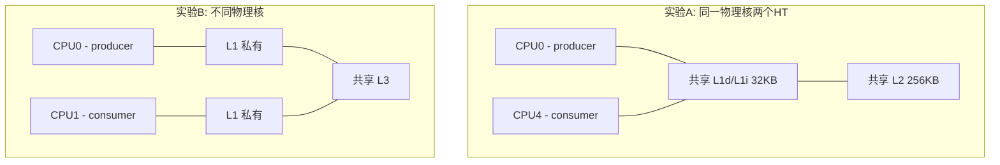
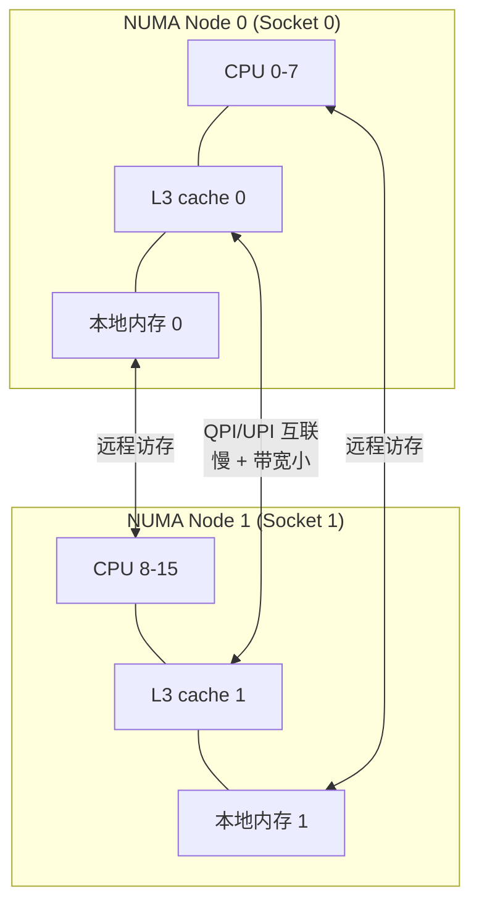
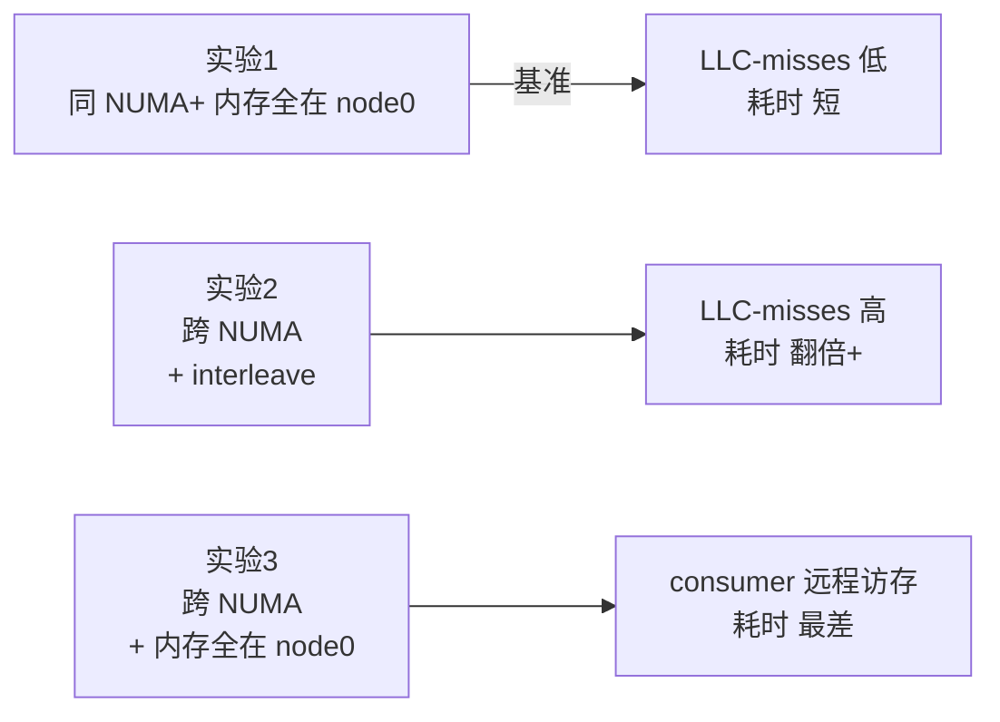

perf stat -v -e L1-dcache-load-misses,cache-misses,L1-icache-load-misses,cpu-clock,cs,migrations,faults ./fs 100000
Using CPUID GenuineIntel-6-9E-A
start
[producer] bound to CPU 1
[consumer] bound to CPU 2
producer finished
consumer finished
L1-dcache-load-misses: 164119995 3553749830 3553749830
cache-misses: 1776758 3553749830 3553749830
L1-icache-load-misses: 186318115 3553749830 3553749830
cpu-clock: 3432194793 3444108904 3444108904
cs: 199976 3444108904 3444108904
migrations: 2 3444108904 3444108904
faults: 164 3444108904 3444108904

Performance counter stats for './fs 100000':

       164,119,995      L1-dcache-load-misses                                       
         1,776,758      cache-misses                                                
       186,318,115      L1-icache-load-misses                                       
          3,432.19 msec cpu-clock                 #    0.746 CPUs utilized          
           199,976      cs                        #    0.058 M/sec                  
                 2      migrations                #    0.001 K/sec                  
               164      faults                    #    0.048 K/sec                  

       4.599110652 seconds time elapsed

       0.000000000 seconds user
       3.956702000 seconds sys


perf stat -v -e L1-dcache-load-misses,cache-misses,L1-icache-load-misses,cpu-clock,cs,migrations,faults ./fs_opt 100000
Using CPUID GenuineIntel-6-9E-A
start
[producer] bound to CPU 1
[consumer] bound to CPU 2
producer finished
consumer finished
L1-dcache-load-misses: 163494987 3566519266 3566519266
cache-misses: 1537377 3566519266 3566519266
L1-icache-load-misses: 188143018 3566519266 3566519266
cpu-clock: 3446885702 3457386084 3457386084
cs: 199964 3457386084 3457386084
migrations: 2 3457386084 3457386084
faults: 168 3457386084 3457386084

Performance counter stats for './fs_opt 100000':

       163,494,987      L1-dcache-load-misses                                       
         1,537,377      cache-misses                                                
       188,143,018      L1-icache-load-misses                                       
          3,446.89 msec cpu-clock                 #    0.730 CPUs utilized          
           199,964      cs                        #    0.058 M/sec                  
                 2      migrations                #    0.001 K/sec                  
               168      faults                    #    0.049 K/sec                  

       4.724753355 seconds time elapsed

       0.002526000 seconds user
       4.003852000 seconds sys

# cache-misses基本一致，没有验证false sharing的效果
两个线程绝大多数时间都在睡眠/唤醒(内核态系统调用 + 上下文切换，每次几百到几千ns、命中无数 kernel 代码的 cache miss)交替运行，
根本没在目标 cache line(shared_data) 上同时"高频读写"(shared_data的cache miss只占几个 ns)， 最终导致目标 cache line的cache miss被掩没

## 对比一下 false sharing 真正"显现"的条件

经典 false sharing 实验需要满足三个条件，缺一不可：

| 条件 | 你当前代码 | 经典实验 |
 |---|---|---|
| 两个 CPU **并发**执行（不串行） | ❌ 锁强制串行 | ✅ 无锁 |
| 写频率 **极高**（纳秒级） | ❌ 200K 次/秒 | ✅ 数亿次/秒 |
| 没有其它**强 cache 流量**主导 | ❌ mutex/cond 占主导 | ✅ 只读写目标变量 |


## 几个常见坑

| 坑 | 说明                                                                |
|----|-------------------------------------------------------------------|
| 编译报错 `cpu_set_t` 未定义 | `_GNU_SOURCE` 没放在 `#include` 之前                                   |
| `pthread_setaffinity_np` 返回 22 (EINVAL) | 指定的 CPU 编号超过了机器实际 CPU 数，可用 `nproc` 或 `lscpu` 查看                   |
| 容器里绑核失败 | Docker/K8s 容器需要看 cgroup 的 `cpuset` 限制，绑的核必须在容器允许的集合内              |
| macOS 下编译能过但绑核无效 | macOS 没有真正的亲和性 API，这是预期行为，需到 Linux 上跑                             |
| 结果方差大 | 绑的两个核如果是同一物理核的两个超线程（HT），会互相干扰，建议绑到**不同物理核**；用 `lscpu -e` 查 CORE 列 |


[任务规划完成]
# 把生产者和消费者绑到同一物理核的两个超线程 HT 上

## 一、先理解：什么是"同一物理核的两个超线程 HT"

现代 x86 CPU 一般每个**物理核（core）** 包含 **2 个逻辑核（hyper-thread）**：

```
物理核 Core 0
├── 逻辑 CPU 0   ┐
└── 逻辑 CPU N/2 ┘  ← 两个 HT 共享同一份 L1d / L1i / L2 cache、执行单元
```

不同机器的逻辑 CPU 编号规则不同，常见两种：
- **方案 A（多数 Intel/Linux 默认）**：`CPU0` 和 `CPU(N/2)` 是同一物理核。比如 8 逻辑核机器，CPU0 和 CPU4 是兄弟 HT。
- **方案 B（部分 AMD / 新 BIOS）**：`CPU0` 和 `CPU1` 是同一物理核，CPU2 和 CPU3 是同一物理核……


## 二、在 Linux 机器上查兄弟 HT 的 2 种方法

```bash
# 方法 1：cpu拓扑结构最直观，CORE 列相同的就是同一物理核
lscpu -e
# 输出示例（CORE 列相同 = 同一物理核）：
# CPU NODE SOCKET CORE L1d:L1i:L2:L3 ONLINE
#   0    0      0    0 0:0:0:0       yes      ┐ 兄弟 HT
#   1    0      0    1 1:1:1:0       yes      
#   2    0      0    2 2:2:2:0       yes      
#   3    0      0    3 3:3:3:0       yes      
#   4    0      0    0 0:0:0:0       yes      ┘ 兄弟 HT (与 CPU0 同 CORE)
#   5    0      0    1 1:1:1:0       yes
#   ...

# 方法 2：直接看每个 CPU 的兄弟列表
cat /sys/devices/system/cpu/cpu0/topology/thread_siblings_list
# 输出可能是 "0,4"  → 表示 CPU0 和 CPU4 是兄弟 HT
```

## 三、对比预期与原理分析



| 指标 | 实验 A（同物理核 HT）| 实验 B（不同物理核）| 原因 |
|------|------|------|------|
| **cache-misses** | 🟢 低 | 🔴 高 | A 共享 L1d，cache line 不需要在核间传递 |
| **耗时** | 🟢 通常更快 | 🔴 通常更慢 | A 没有 cache line bouncing |
| **指令吞吐率（IPC）** | 🔴 略低 | 🟢 略高 | A 中两个 HT 抢执行单元、ROB、LSU |
| **cpu-migrations** | 0 | 0 | 都绑核了 |

### 关键观察点

1. **强同步、共享数据多 → 同物理核 HT 占优**
   你这个生产者-消费者场景就属于这一类。`mutex`、`cond`、`shared_data` 都频繁被两边写，绑到同一物理核可以让 cache line 始终留在共享 L1d 中，**避免跨核的 MESI 协议流量**。

2. **计算密集、共享数据少 → 不同物理核占优**
   两个 HT 抢同一物理核的执行单元（ALU、AGU、Load/Store 单元、ROB 槽位），互相拖累。这种场景应该把线程分到不同物理核。

3. **特别有趣的现象**
   你之前实验观察到"绑到 CPU0 单核后比不绑核快 8 倍"，本质就是因为**两个互相 ping-pong 的线程被强制串行化在一个核上后，反而消除了 cache 一致性流量**。绑到同物理核两个 HT 应该会得到**比绑到 CPU0 单核更接近、甚至更好**的性能（因为不再需要 context-switch，两个 HT 可以并发推进），是这个实验最有趣的预期结果。

## 四、注意事项

| 注意点 | 说明 |
|------|------|
| 兄弟 HT 编号查清楚 | 千万不要假设 `CPU0/CPU1` 是兄弟，必须 `lscpu -e` 确认 |
| 关闭 turbo / 固定频率 | 否则 perf 数据噪声很大：`echo performance \| sudo tee /sys/devices/system/cpu/cpu*/cpufreq/scaling_governor` |
| 关闭其它干扰进程 | 用 `nice -n -20` 提优先级，或用 `cset shield` 隔离核 |
| 运行多次取均值 | `perf stat -r 5` 重复 5 次取平均 |
| 容器场景 | 容器内能否绑到指定 HT 取决于 cgroup 的 `cpuset.cpus`，确认那台机器把对应 CPU 放进了容器的 cpuset |


[任务规划完成]
# 把生产者和消费者绑到不同 NUMA node 上

让两个线程跨越 NUMA 节点边界通信，可以观察到 **跨 NUMA 的 cache 一致性流量** 和 **远程内存访问** 带来的代价。

## 一、先理解 NUMA

NUMA（Non-Uniform Memory Access，非一致内存访问）：
- 多路服务器（一般 ≥2 颗 CPU socket）每个 socket 配套自己的本地内存控制器和内存
- **本 NUMA 节点访问本地内存快**，访问其它 NUMA 节点的内存要走 QPI/UPI/Infinity Fabric 互联，**慢得多**（延迟 1.5~3 倍，带宽减半）
- L3 cache 通常每个 NUMA 节点（socket）一份，**跨 NUMA 不共享 L3**



跨 NUMA 时的代价：
1. **cache line bouncing 走 QPI/UPI**，比同 socket 内的 L3 ↔ L1 慢得多
2. **远程内存访问**，访问对端 NUMA 的 RAM 延迟翻倍
3. **互联带宽有限**，高并发下会拥塞

## 二、查询 NUMA 拓扑（Linux 上）

```bash
# 方法 1：最直观
numactl --hardware
# 输出示例：
# available: 2 nodes (0-1)
# node 0 cpus: 0 1 2 3 4 5 6 7 16 17 18 19 20 21 22 23   ← node 0 的 CPU 列表
# node 0 size: 64253 MB
# node 0 free: 50000 MB
# node 1 cpus: 8 9 10 11 12 13 14 15 24 25 26 27 28 29 30 31  ← node 1 的 CPU 列表
# node 1 size: 64512 MB
# node 1 free: 50000 MB
# node distances:
# node   0   1
#   0:  10  21      ← 自己访问自己 = 10，跨 NUMA = 21 (相对值，越大越慢)
#   1:  21  10

# 方法 2：从 /sys 读
ls /sys/devices/system/node/
cat /sys/devices/system/node/node0/cpulist
cat /sys/devices/system/node/node1/cpulist

# 方法 3：lscpu 也能看
lscpu | grep -i numa
```

## 三、跨 NUMA 实验的关键：**别忘了内存也要绑 NUMA**

⚠️ 这是最容易被忽视的点。**只绑 CPU 不绑内存，实验结论会失真**。

`shared_data`、`mutex`、`cond` 这些全局变量在程序启动时由内核分配，默认遵循 **first-touch 策略**：哪个 CPU 第一次写入这页，这页内存就分配在哪个 NUMA node 上。如果是 `main` 线程（通常在 node 0）先访问，那 `mutex` 这页就一直挂在 node 0 上，consumer 在 node 1 访问时**永远要走远程访存**。

要做严谨实验，推荐用 `numactl` 强制控制内存策略：(参数"0 1"用于控制线程绑定的cpu node)

```bash
# 让程序的所有数据均匀分布到所有 NUMA node 上（推荐做对比实验时用）
numactl --interleave=all ./cs_fs 1000000 0 1

# 或：让程序的内存绑定在 node 0
numactl --membind=0 ./cs_fs 1000000 0 1
# 此时 producer 是本地访存，consumer 是远程访存（极端不对称场景）

# 或：让程序的内存绑定在 node 1
numactl --membind=1 ./cs_fs 1000000 0 1
# 此时 producer 远程，consumer 本地
```

## 四、预期对比结果



| 指标 | 同 NUMA + 单 node 内存 | 跨 NUMA + interleave | 跨 NUMA + 单 node 内存 |
|------|---------|----------------------|------------------------|
| **task-clock** | 🟢 低    | 🔴 中等↑↑ | 🔴 高 |
| **LLC-load-misses** | 🟢 低    | 🔴 显著升高 | 🔴 显著升高 |
| **耗时** | 1x（基准）  | 1.5~3x | 2~5x |
| **互联流量** | 0       | 频繁 cache line 跨 socket 传递 | 同上 + 远程访存 |

## 五、为什么这个实验在你这个场景下"格外"慢

回顾你的代码：

```c
pthread_mutex_t mutex;       // 锁本身
pthread_cond_t  cond;        // 条件变量
volatile int data_ready;     // 标志位
data_t shared_data;          // 共享数据
```

每次 `lock/unlock` 和 `signal/wait` 都涉及对**锁的内部状态字段做 atomic CAS**（cmpxchg 指令），这个原子操作要：

1. **拿到这个 cache line 的 Exclusive/Modified 状态**
2. 同物理核两个 HT：cache line 在共享 L1，开销几个 cycle
3. 同 NUMA 两个核：cache line 在共享 L3 中传递，开销几十个 cycle
4. **跨 NUMA 两个核：cache line 要走 QPI/UPI 互联，开销可能上百到几百 cycle**

你这种"双线程互相 ping-pong 同一个锁"的代码，是**最暴露 NUMA 互联代价**的场景。预计跨 NUMA 实验跑出来会比同 NUMA **慢 2-5 倍**。

## 六、注意事项

| 注意点 | 说明 |
|--------|------|
| 必须有 ≥2 个 NUMA node | 单 socket 机器没法做这个实验，`numactl --hardware` 看到 `available: 1 nodes` 就别折腾了 |
| 装好 numactl | `apt install numactl` 或 `yum install numactl` |
| 内存策略要明确 | 否则 first-touch 会引入难以解释的偏差 |
| 区分 NUMA 距离 | 4 路服务器的 node 0 vs node 3 比 node 0 vs node 1 还慢，看 `node distances` 矩阵 |
| 容器/虚机 | 云上小规格虚机通常只暴露 1 个 NUMA node；裸金属或大规格实例才有多 NUMA |
| 关掉自动 NUMA 平衡 | `cat /proc/sys/kernel/numa_balancing`，做实验时可临时关掉避免内核自己迁移页面：`echo 0 \| sudo tee /proc/sys/kernel/numa_balancing` |

## 七、可选进阶：用 `libnuma` 显式控制内存

如果想在代码层精细控制（而不是靠 `numactl` 命令），可以链接 `libnuma`：

```c
#include <numa.h>
#include <numaif.h>

// 把整个进程的内存策略设为 interleave
numa_set_interleave_mask(numa_all_nodes_ptr);

// 或者把某段内存绑到指定 node
numa_tonode_memory(&shared_data, sizeof(shared_data), /*node=*/0);
```

编译：`gcc -O0 -pthread -lnuma context_switch_false_sharing.c -o cs_fs`


# 为什么绑核后跑出来的cpu-migrations还是比较大
1、 在main函数中绑核导致**绑定延迟**，目标线程已经运行一定时间，改为线程内绑核
2、 内核的 "load balancing" 在某些边界场景仍可能动作：(context-switches太多导致频繁触发**wake-affine**决策)
   - 你这个程序大量调用 `pthread_cond_wait` → 线程进入睡眠 → 被唤醒时
   - 唤醒方（producer）在 CPU1 上调用 `pthread_cond_signal`，内核的 **wake-affine** 机制倾向于把被唤醒的线程拉到 **唤醒者所在的 CPU 附近**
   - 当被唤醒线程的 affinity mask 只包含一个 CPU 时，它最终会被强制送回那个 CPU；但**这个"重新落位"的过程在某些内核版本会被记一次 migration**


