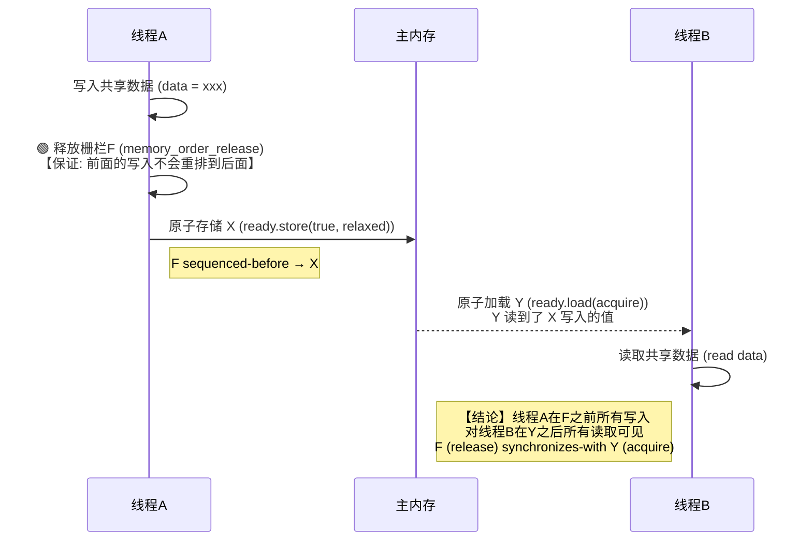
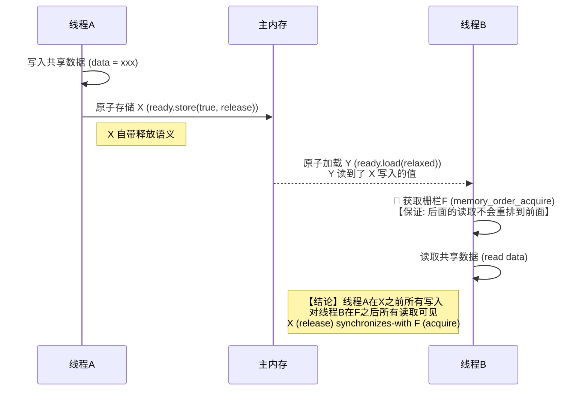
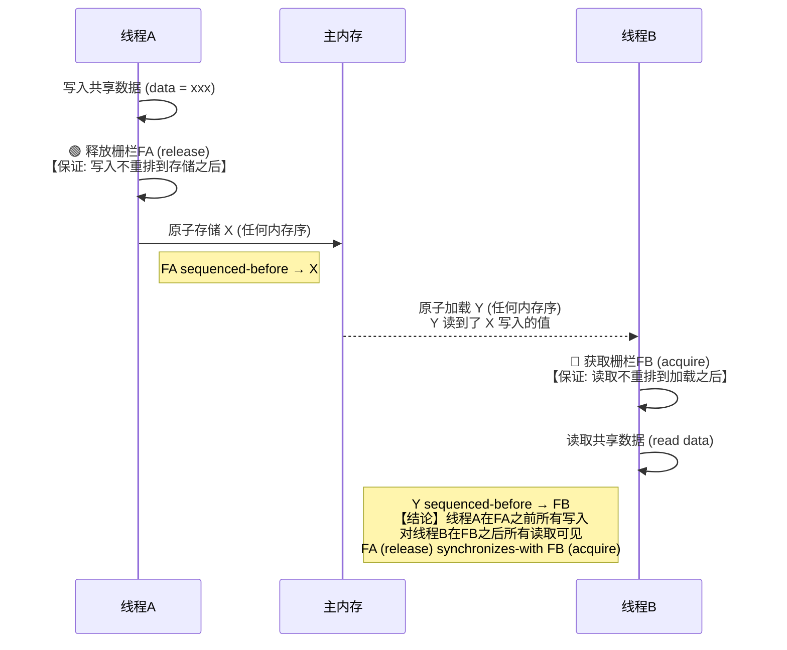

`std::atomic_thread_fence` 是 C++11 引入的一种内存同步原语，定义在 `<atomic>` 头文件中。

以下是关于 `atomic_thread_fence` 的所有关键操作、参数行为及同步机制的详细解析：

1. 函数原型

```cpp
void std::atomic_thread_fence(std::memory_order order) noexcept;
```

*   参数 `order`：指定栅栏执行的内存顺序约束。
*   返回值：无。
*   异常：`noexcept`，不抛出异常。

2. 不同 `memory_order` 参数的行为

`atomic_thread_fence` 的行为完全取决于传入的 `std::memory_order` 参数。如果 `order` 为 `std::memory_order_relaxed`，则该操作无任何效果。

| 参数值 | 栅栏类型 | 行为描述 |
| :--- | :--- | :--- |
| `std::memory_order_acquire` | 获取栅栏 (Acquire Fence) | 确保栅栏之后的所有读取和写入操作不会被重排到栅栏之前。它通常与另一个线程中的释放操作或释放栅栏配对，以观察其他线程发布的修改。 |
| `std::memory_order_consume` | 获取栅栏 (Acquire Fence) | 在 C++17 中已弃用，行为同 `memory_order_acquire`。确保依赖数据的加载操作不被重排到栅栏之前。 |
| `std::memory_order_release` | 释放栅栏 (Release Fence) | 确保栅栏之前的所有读取和写入操作不会被重排到栅栏之后。它通常用于在发布数据后，通过后续的原子存储操作让其他线程可见。 |
| `std::memory_order_acq_rel` | 获取-释放栅栏 | 同时具有获取栅栏和释放栅栏的效果。既防止前驱操作向后重排，也防止后继操作向前重排。通常用于读-改-写操作的同步点。 |
| `std::memory_order_seq_cst` | 顺序一致栅栏 | 同时具有获取和释放栅栏的效果，并且参与全局的顺序一致性排序。这是最强的内存序，性能开销最大，但能保证所有线程看到一致的执行顺序。 |
| `std::memory_order_relaxed` | 无效果 | 不施加任何内存排序约束。 |

3. 同步机制（如何建立 happens-before 关系）

`atomic_thread_fence` 本身不操作数据，因此它必须与至少一个原子操作配合使用才能建立线程间的同步关系。主要有以下三种同步模式：

A. 栅栏-原子同步 (Fence-Atomic Synchronization)
*   场景：线程 A 使用释放栅栏，线程 B 使用原子获取操作。
*   条件：
    1.  线程 A 中有一个释放栅栏 $F$。
    2.  线程 A 中有一个原子存储 $S$（任意内存序），且 $F$ 在序列上先于 $S$ (`sequenced-before`)。
    3.  线程 B 中有一个原子加载 $R$（获取语义，如 `memory_order_acquire`），且 $R$ 读取了 $S$ 写入的值（或 $S$ 所在释放序列的值）。
*   结果：线程 A 中在栅栏 $F$ 之前的所有非原子和宽松原子存储，对线程 B 中在加载 $Y$ 之后的所有非原子和宽松原子加载可见。

B. 原子-栅栏同步 (Atomic-Fence Synchronization)
*   场景：线程 A 使用原子释放操作，线程 B 使用获取栅栏。
*   条件：
    1.  线程 A 中有一个原子存储 $X$（释放语义，如 `memory_order_release`）。
    2.  线程 B 中有一个原子加载 $Y$（任意内存序），且 $Y$ 读取了 $X$ 写入的值。
    3.  线程 B 中有一个获取栅栏 $F$，且加载 $Y$ 在序列上先于 $F$ (`sequenced-before`)。
*   结果：线程 A 中在存储 $X$ 之前的所有非原子和宽松原子存储，对线程 B 中在栅栏 $F$ 之后的所有非原子和宽松原子加载可见。

C. 栅栏-栅栏同步 (Fence-Fence Synchronization)
*   场景：线程 A 使用释放栅栏，线程 B 使用获取栅栏。
*   条件：
    1.  线程 A 中有释放栅栏 $F_A$，其后有一个原子存储 $X$（任意内存序）。
    2.  线程 B 中有获取栅栏 $F_B$，其前有一个原子加载 $Y$（任意内存序）。
    3.  $Y$ 读取了 $X$ 写入的值。
*   结果：线程 A 中在 $F_A$ 之前的所有非原子和宽松原子存储，对线程 B 中在 $F_B$ 之后的所有非原子和宽松原子加载可见。


```cpp
// 共享数据
int data;
std::atomic<bool> ready(false);

// 线程 A (生产者)
void producer() {
    // 1. 写入非原子数据
     data = i;
    
    // 2. 释放栅栏：确保上述写入不会重排到后面的原子存储之后
    std::atomic_thread_fence(std::memory_order_release);
    
    // 3. 原子存储：发布信号
    ready.store(true, std::memory_order_relaxed);
}

// 线程 B (消费者)
void consumer() {
    // 1. 等待信号
    while(!ready.load(std::memory_order_relaxed));
    
    // 2. 获取栅栏：确保后续读取能看到生产者栅栏前的所有写入
    std::atomic_thread_fence(std::memory_order_acquire);
    
    // 3. 安全读取非原子数据
    int val = data; //  guaranteed to be 0
}
```

三种同步模式：

A. 栅栏-原子同步 (Fence-Atomic Synchronization)


B. 原子-栅栏同步 (Atomic-Fence Synchronization)


C. 栅栏-栅栏同步 (Fence-Fence Synchronization)
