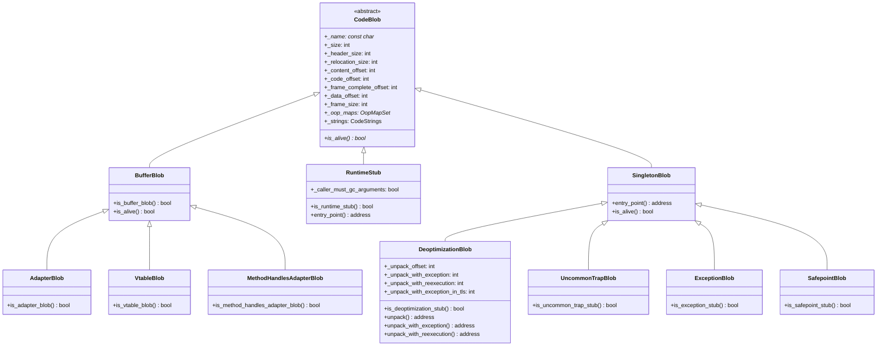

[任务规划完成]
# CodeBlob 类继承结构及作用说明

## 继承结构图



---

## 各类详细说明

### 1. `CodeBlob`（抽象基类）

所有 CodeCache 条目的超类，存储在 CodeCache 中。

**内存布局（从低地址到高地址）：**
```
[ header ] [ relocation ] [ content space (consts + insts + stubs) ] [ data space ]
```

**核心职责：**
- 管理代码块的内存边界（`header_begin/end`、`code_begin/end`、`data_begin/end`）
- 维护 OopMap（用于 GC 扫描栈帧中的对象引用）
- 提供帧信息（`_frame_size`、`_frame_complete_offset`）
- 提供类型判断的虚函数接口（`is_nmethod()`、`is_runtime_stub()` 等）
- 纯虚函数 `is_alive()` 由子类实现，供 GC 判断存活状态

---

### 2. `BufferBlob`（直接子类）

用于存放**不可重定位的机器码**，如解释器、stub 例程等。

| 特点 | 说明 |
|------|------|
| 不含重定位信息 | 代码地址固定，不需要 relocation |
| `is_alive()` 永远返回 `true` | 不参与 GC 回收 |
| 作为多个 Adapter 类的父类 | 提供通用的 buffer 管理 |

**子类：**

- **`AdapterBlob`**：持有 **C2I / I2C 适配器**代码，负责在编译代码与解释器之间进行调用约定转换
- **`VtableBlob`**：持有**虚方法表（vtable）调用桩**代码
- **`MethodHandlesAdapterBlob`**：持有 **MethodHandles 适配器**代码，支持 `java.lang.invoke` 机制

---

### 3. `RuntimeStub`（直接子类）

描述编译代码调用 **C++ 运行时静态方法**时使用的桩（stub）。

| 特点 | 说明 |
|------|------|
| `_caller_must_gc_arguments` | 标记调用者是否需要负责 GC 参数 |
| `entry_point()` | 返回 `code_begin()`，即桩的入口地址 |
| `is_alive()` 永远返回 `true` | 运行时桩不会被回收 |

---

### 4. `SingletonBlob`（直接子类，中间抽象层）

所有**全局唯一实例** Blob 的父类，提供默认行为。

- `is_alive()` 永远返回 `true`
- `entry_point()` 返回 `code_begin()`
- 构造时固定使用 `CodeOffsets::frame_never_safe` 作为 `frame_complete` 偏移

**子类：**

| 子类 | 作用 |
|------|------|
| **`DeoptimizationBlob`** | 处理**去优化（Deoptimization）**，将编译帧还原为解释器帧。包含多个入口：`unpack`、`unpack_with_exception`、`unpack_with_reexecution`、`unpack_with_exception_in_tls`（专为 C1 设计） |
| **`UncommonTrapBlob`** | 仅 **C2（Server Compiler）** 使用，处理**非常规陷阱（Uncommon Trap）**，触发去优化 |
| **`ExceptionBlob`** | 仅 **C2** 使用，处理编译代码中的**异常展开（Exception Unwinding）** |
| **`SafepointBlob`** | 处理安全点期间发生的**非法指令异常**，确保线程能安全到达安全点 |

---

## 总结

```
CodeBlob（抽象基类，CodeCache 中所有代码块的统一抽象）
├── BufferBlob（不可重定位代码，如解释器/stub）
│   ├── AdapterBlob（C2I/I2C 调用约定适配）
│   ├── VtableBlob（虚方法表调用桩）
│   └── MethodHandlesAdapterBlob（MethodHandles 适配）
├── RuntimeStub（调用 C++ 运行时的桩）
└── SingletonBlob（全局唯一实例的 Blob 基类）
    ├── DeoptimizationBlob（去优化处理，C1/C2 共用）
    ├── UncommonTrapBlob（非常规陷阱，仅 C2）
    ├── ExceptionBlob（异常展开，仅 C2）
    └── SafepointBlob（安全点非法指令处理）
```

> **注意**：`nmethod`（编译后的 Java 方法）也是 `CodeBlob` 的子类，但其定义在 `nmethod.hpp` 中，未在此文件中展示。它是 CodeCache 中最重要的 Blob 类型，代表 JIT 编译后的 Java 方法代码。