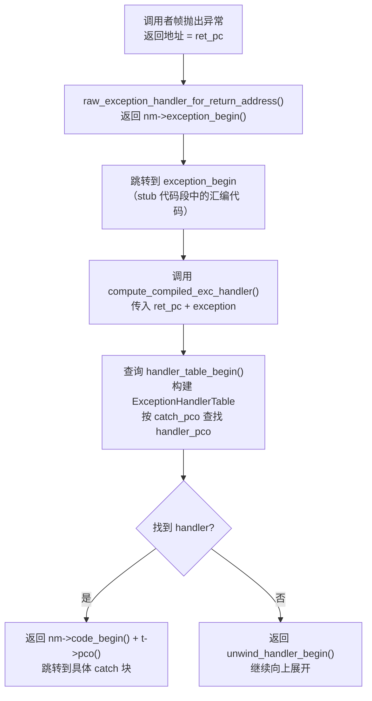

## nmethod中的 `exception_begin` 与 `handler_table_begin` 的区别

这两者是 nmethod 中**完全不同层次**的异常处理机制，分别服务于不同的场景。

---

### 一、`exception_begin` —— 编译方法的通用异常入口（代码段）

```cpp
// nmethod.hpp:381
address exception_begin() const { return header_begin() + _exception_offset; }
```

**位置**：位于 nmethod 的 **stub 代码段**（`_stub_offset` 之后）

```cpp
// nmethod.cpp:878
_exception_offset = _stub_offset + offsets->value(CodeOffsets::Exceptions);
```

**本质**：这是一段**真正可执行的汇编代码**，是编译方法的"通用异常处理入口"。

**作用**：当一个编译方法的**调用者**（callee）抛出异常并返回时，控制流会跳转到这里。它的职责是：
1. 接收异常对象（通过寄存器传递）
2. 调用 `SharedRuntime::compute_compiled_exc_handler()` 查找当前帧内的处理器
3. 如果找到 handler，跳转过去；否则继续向上展开

**使用场景**（`sharedRuntime.cpp:513`）：

```cpp
// raw_exception_handler_for_return_address()
// 当从编译帧返回时，如果有异常，就跳到 exception_begin
if (nm->is_deopt_pc(return_address)) {
    return SharedRuntime::deopt_blob()->unpack_with_exception();
} else {
    return nm->exception_begin();  // ← 跳到这里
}
```

---

### 二、`handler_table_begin` —— 编译期生成的异常处理器映射表（数据段）

```cpp
// nmethod.hpp:397
address handler_table_begin() const { return header_begin() + _handler_table_offset; }
```

**位置**：位于 nmethod 的**调试信息区**（`_dependencies_offset` 之后），是纯数据，不可执行。

```cpp
// nmethod.cpp:899
_handler_table_offset = _dependencies_offset + round_to(dependencies->size_in_bytes(), oopSize);
```

**本质**：这是一张 `ExceptionHandlerTable`，存储的是 **`catch_pco → handler_pco` 的映射关系**，即"在哪个 catch 点（PC 偏移）、对应哪个 handler 的编译代码入口（PC 偏移）"。

**数据结构**（`exceptionHandlerTable.hpp`）：

```
table    = { subtable }
subtable = header + entries
header   = (entry_count, catch_pco, unused)   // catch_pco: CatchNode 的 PC 偏移
entry    = (handler_bci, handler_pco, scope_depth)  // handler_pco: 编译后 handler 的 PC 偏移
```

**使用场景**（`sharedRuntime.cpp:695`）：

```cpp
// compute_compiled_exc_handler() 内部
int catch_pco = ret_pc - nm->code_begin();

ExceptionHandlerTable table(nm);  // ← 从 handler_table_begin() 读取数据
HandlerTableEntry *t = table.entry_for(catch_pco, handler_bci, scope_depth);
// ...
return nm->code_begin() + t->pco();  // 返回 handler 的实际地址
```

---

### 三、两者的关系与协作流程



---

### 四、核心区别总结

| 对比项 | `exception_begin` | `handler_table_begin` |
|--------|-------------------|-----------------------|
| **本质** | 可执行的汇编代码（stub） | 不可执行的数据表 |
| **位置** | stub 代码段（`_stub_offset` 之后） | 调试信息区（`_dependencies_offset` 之后） |
| **内容** | 通用异常处理入口汇编指令 | `catch_pco → handler_pco` 映射表 |
| **粒度** | 整个 nmethod 只有**一个**入口 | 每个 `try-catch` 块有**一条**记录 |
| **调用时机** | 异常从 callee 返回时，由 `raw_exception_handler_for_return_address` 返回 | 在 `exception_begin` 的处理逻辑内部被查询 |
| **作用** | 异常处理的**统一入口**，负责分发 | 提供**精确的 handler 地址**，供分发使用 |
| **编译器** | C1/C2 均有 | C1/C2 均有 |

简而言之：**`exception_begin` 是"门"，`handler_table_begin` 是"地图"**。异常先进门（`exception_begin`），再查地图（`handler_table`）找到具体的 catch 块地址，最后跳过去执行。