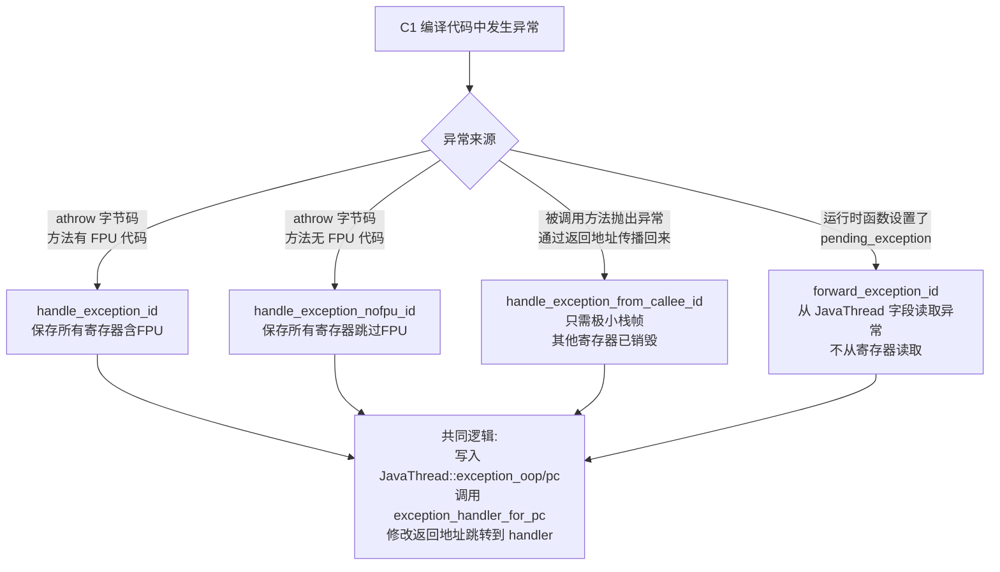

# 为什么有多种 `generate_handle_exception`

`generate_handle_exception` 是一个**共享的代码生成函数**，它根据传入的 `StubID` 参数，生成 4 种不同的异常处理 Stub。之所以设计成多种，是因为**异常发生时的寄存器状态、栈帧状态、异常来源各不相同**，需要不同的前置处理逻辑。

---

## 四种 StubID 及其触发场景

### 1. `handle_exception_id` — 标准异常处理

**触发点**：`LIR_Assembler::throw_op()`，即 C1 编译的方法中执行 `athrow` 字节码时。

```cpp
// c1_LIRAssembler_x86.cpp:2998
if (compilation()->has_fpu_code()) {
    unwind_id = Runtime1::handle_exception_id;   // ← 有 FPU 代码时用这个
} else {
    unwind_id = Runtime1::handle_exception_nofpu_id;
}
__ call(RuntimeAddress(Runtime1::entry_for(unwind_id)));
```

**进入时的状态**：
- `rax` = exception_oop，`rdx` = exception_pc（抛出点 PC）
- **所有其他寄存器都可能是活跃的**（含 FPU 寄存器）

**处理逻辑**：
```cpp
case handle_exception_id:
    // 保存所有活跃寄存器（包括 FPU）
    oop_map = save_live_registers(sasm, 1 /*thread*/, true /*save_fpu*/);
    break;
```

---

### 2. `handle_exception_nofpu_id` — 无 FPU 的优化版本

**触发点**：同上，`throw_op()`，但编译方法中**没有 FPU 代码**时使用。

**进入时的状态**：与 `handle_exception_id` 相同，但 FPU 寄存器保证不含有效数据。

**处理逻辑**：
```cpp
case handle_exception_nofpu_id:
    // 保存所有活跃寄存器，但跳过 FPU 寄存器（节省开销）
    oop_map = save_live_registers(sasm, 1 /*thread*/, false /*save_fpu*/);
    break;
```

**与 `handle_exception_id` 的唯一区别**：`save_live_registers` 和 `restore_live_registers` 的 `save_fpu` 参数为 `false`，跳过 FPU 状态的保存/恢复，是一种**性能优化**。

---

### 3. `handle_exception_from_callee_id` — 从被调用者返回时处理异常

**触发点**：`LIR_Assembler::emit_exception_handler()`，即 C1 编译方法的**异常处理器入口**（exception handler entry）。

```cpp
// c1_LIRAssembler_x86.cpp:415
__ call(RuntimeAddress(Runtime1::entry_for(Runtime1::handle_exception_from_callee_id)));
__ should_not_reach_here();
```

**触发场景**：当一个 C1 编译方法调用了另一个方法（如 `invokevirtual`），被调用方法抛出了异常，**异常通过返回地址机制传播回来**，此时进入当前方法的 exception handler entry。

**进入时的状态**：
- `rax` = exception_oop，`rdx` = exception_pc
- **除这两个寄存器外，其他所有寄存器都已被销毁**（因为刚从 call 返回）

**处理逻辑**：
```cpp
case handle_exception_from_callee_id: {
    // 只需要一个极小的栈帧（BP + return address），不需要保存任何寄存器
    const int frame_size = 2 /*BP, return address*/ NOT_LP64(+ 1 /*thread*/);
    oop_map = new OopMap(frame_size * VMRegImpl::slots_per_word, 0);
    sasm->set_frame_size(frame_size);
    WIN64_ONLY(__ subq(rsp, frame::arg_reg_save_area_bytes));
    break;
}
```

**返回方式也不同**：
```cpp
case handle_exception_from_callee_id:
    // 不走 restore_live_registers，而是直接 leave + pop + jmp
    __ leave();
    __ pop(rcx);
    __ jmp(rcx);  // 直接跳转到 exception handler
    break;
```

---

### 4. `forward_exception_id` — 转发 pending_exception

**触发点**：`StubAssembler::call_RT()` 中，当 C++ 运行时函数（如 `new_instance`、`monitorenter` 等）执行后，检测到 `JavaThread::pending_exception` 不为空时，跳转到此 Stub。

```cpp
// c1_Runtime1_x86.cpp:125
jump(RuntimeAddress(Runtime1::entry_for(Runtime1::forward_exception_id)));
```

**触发场景**：C1 编译代码调用了某个运行时函数（如分配对象），运行时函数内部抛出了异常（如 `OutOfMemoryError`），异常被存入 `JavaThread::pending_exception`，需要转发给当前编译帧处理。

**进入时的状态**：
- 异常对象在 `JavaThread::pending_exception` 字段中，**不在寄存器里**
- 寄存器已被 C++ 调用破坏，但已通过 `save_live_registers` 保存在栈上

**处理逻辑**：
```cpp
case forward_exception_id:
    oop_map = generate_oop_map(sasm, 1 /*thread*/);
    // 从 JavaThread 字段中取出 pending_exception → rax
    __ movptr(exception_oop, Address(thread, Thread::pending_exception_offset()));
    __ movptr(Address(thread, Thread::pending_exception_offset()), NULL_WORD);
    // 从 rbp+1*BytesPerWord 取出返回地址作为 exception_pc → rdx
    __ movptr(exception_pc, Address(rbp, 1*BytesPerWord));
    // 清空 vm_result
    __ movptr(Address(thread, JavaThread::vm_result_offset()),   NULL_WORD);
    __ movptr(Address(thread, JavaThread::vm_result_2_offset()), NULL_WORD);
    break;
```

---

## 四种 Stub 的对比总结



| Stub | 触发点 | 异常来源 | 寄存器状态 | FPU 保存 | 返回方式 |
|------|--------|----------|------------|----------|----------|
| `handle_exception_id` | `throw_op()` | `rax`/`rdx` | 所有寄存器活跃 | ✅ 保存 | `restore + ret` |
| `handle_exception_nofpu_id` | `throw_op()` | `rax`/`rdx` | 所有寄存器活跃 | ❌ 跳过 | `restore + ret` |
| `handle_exception_from_callee_id` | exception handler entry | `rax`/`rdx` | 只有 rax/rdx 有效 | ❌ 无需 | `leave + pop + jmp` |
| `forward_exception_id` | `call_RT()` 检测 pending | `JavaThread::pending_exception` | 已被 C++ 破坏 | ✅ 保存 | `restore + ret` |

---

## 核心设计思想

**共用一个函数，通过 `switch(id)` 区分差异**：四种 Stub 的**中间逻辑完全相同**（写入 JavaThread 字段 → 调用 `exception_handler_for_pc` → 修改返回地址），只有**前置的寄存器保存**和**后置的恢复/返回方式**因状态不同而有差异。这种设计避免了代码重复，同时通过 `StubID` 参数精确控制每种场景的特殊处理。