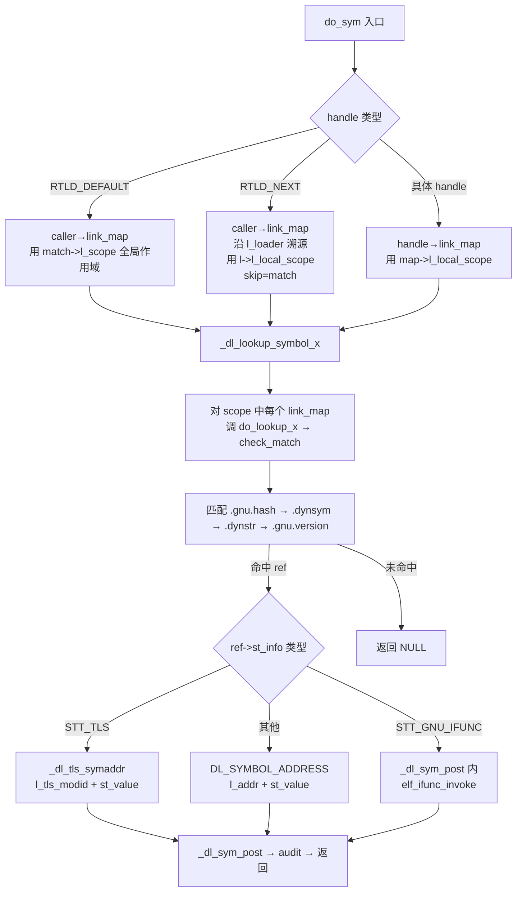

[任务规划完成]
# `do_sym` 函数逻辑分析

`do_sym` 是 [dl-sym.c](/glibc-2.38/elf/dl-sym.c) 中实现 `dlsym()` / `dlvsym()` 的核心函数。它的职责是：**根据用户传入的 handle 语义（`RTLD_DEFAULT` / `RTLD_NEXT` / 具体 handle），选择正确的搜索作用域（scope），再通过 `_dl_lookup_symbol_x` 在若干 ELF 模块中查找符号，最终把符号解析为运行时地址返回给调用者**。

---

## 一、函数签名

```c
static void *
do_sym (void *handle,             // dlopen 返回的 handle 或 RTLD_DEFAULT / RTLD_NEXT
        const char *name,         // 要查找的符号名
        void *who,                // 调用者返回地址（__builtin_return_address 传入）
        struct r_found_version *vers, // 版本约束（dlvsym 时非 NULL）
        int flags);               // 查找标志（DL_LOOKUP_RETURN_NEWEST 等）
```

它对应的两个上层入口：
- `_dl_sym(handle, name, who)` —— `dlsym()` 用，传 `vers=NULL`, `flags=DL_LOOKUP_RETURN_NEWEST`
- `_dl_vsym(handle, name, version, who)` —— `dlvsym()` 用，先算出 `vers.hash = _dl_elf_hash(version)`，传 `flags=0`

---

## 二、根据 handle 选择"搜索作用域"（scope）

`do_sym` 最关键的分支是**根据 handle 决定去哪一批 ELF 模块里查找**。作用域直接决定了后续 `_dl_lookup_symbol_x` 会扫描哪些 `link_map`。

### 分支 1：`handle == RTLD_DEFAULT`（第 92~123 行）

```c
match = _dl_sym_find_caller_link_map (caller);
...
result = GLRO(dl_lookup_symbol_x) (name, match, &ref,
                                   match->l_scope, vers, 0,
                                   flags | DL_LOOKUP_ADD_DEPENDENCY, NULL);
```

- 通过 `caller` 地址（调用者返回地址）在 **所有已加载 `link_map` 的 `l_map_start ~ l_map_end` 区间** 里定位调用方模块（`_dl_find_dso_for_object`）。
- 使用调用方模块的 **`l_scope`（全局作用域列表）** 作为搜索范围 —— 也就是 "本可执行文件 + 它 dlopen 出的所有全局对象" 的合并 scope。
- 多线程时用 `THREAD_GSCOPE_SET_FLAG` + `_dl_catch_exception` 保护，防止 scope 数组在查找中被并发修改。
- 加上 `DL_LOOKUP_ADD_DEPENDENCY`：找到符号后要把定义模块登记为调用方的依赖，防止被 `dlclose` 提前卸载。

### 分支 2：`handle == RTLD_NEXT`（第 125~142 行）

```c
match = _dl_sym_find_caller_link_map (caller);
...
struct link_map *l = match;
while (l->l_loader != NULL)  l = l->l_loader;
result = GLRO(dl_lookup_symbol_x) (name, match, &ref, l->l_local_scope,
                                   vers, 0, flags, match);
```

- 首先要求调用方是**动态加载**的（如果是主程序会报错 `RTLD_NEXT used in code not dynamically loaded`），依据是判断 `caller` 是否落在 `LM_ID_BASE` 主 map 的 `[l_map_start, l_map_end)` 范围内。
- 沿着 `l_loader` 链一直溯源到最上层加载者，然后使用它的 **`l_local_scope`**（本地作用域）。
- 最后一个参数传入 `match`（skip map）—— 指示 `_dl_lookup_symbol_x` **跳过调用方自身**，从加载顺序的下一个 map 开始，这正是 "RTLD_NEXT" 的语义。

### 分支 3：普通 handle（第 144~150 行）

```c
struct link_map *map = handle;
result = GLRO(dl_lookup_symbol_x) (name, map, &ref, map->l_local_scope,
                                   vers, 0, flags, NULL);
```

- `handle` 就是 `dlopen` 返回的 `link_map *`，直接用它的 **`l_local_scope`** —— 只在该对象自身及其依赖里查找。

---

## 三、进入 `_dl_lookup_symbol_x` 后，到底比对了 ELF 的哪些部分

`do_sym` 本身只组装参数，真正逐个 ELF 模块扫描是靠 `_dl_lookup_symbol_x → do_lookup_x → check_match`。对每个 scope 中的 `link_map`，涉及以下 ELF 结构：

| 阶段 | ELF 结构 / `link_map` 字段 | 作用 |
|---|---|---|
| 定位候选 | `.hash` 或 `.gnu.hash`（`l_gnu_buckets` / `l_gnu_chain_zero` / `l_buckets`）| 用符号名哈希在动态符号表中快速定位候选 |
| 符号表项 | `.dynsym`（`l_info[DT_SYMTAB]` → `ElfW(Sym)` 数组）| 取出 `st_name / st_info / st_value / st_shndx` |
| 字符串表 | `.dynstr`（`l_info[DT_STRTAB]`）| 通过 `sym->st_name` 拿到符号字符串，`strcmp` 比对 `name` |
| 版本索引 | `.gnu.version`（`l_versyms`）| 每个 `.dynsym` 项对应的版本号 |
| 版本定义 | `.gnu.version_d`（`l_versions`）| `dlvsym` 时校验 `(hash, name)` 是否一致；`dlsym` 时选默认版本（`DL_LOOKUP_RETURN_NEWEST` → 最新默认；否则最老默认） |

具体的字段级过滤规则见 `check_match`（此前已分析过）：`st_value/st_shndx/st_info` 有效性 → 类型白名单 → `.dynstr` 名字比对 → `.gnu.version` 版本仲裁。

---

## 四、找到符号后的地址计算（第 152~166 行）

```c
if (ref != NULL) {
    void *value;
#ifdef SHARED
    if (ELFW(ST_TYPE) (ref->st_info) == STT_TLS)
        value = _dl_tls_symaddr (result, ref);
    else
#endif
        value = DL_SYMBOL_ADDRESS (result, ref);

    return _dl_sym_post (result, ref, value, caller, match);
}
```

用到 `ref`（选中的 `ElfW(Sym)`）的字段：

1. **`ref->st_info` 的类型位（`ST_TYPE`）**
    - `STT_TLS` → 走 TLS 路径：`_dl_tls_symaddr` 用 `map->l_tls_modid + ref->st_value` 构造 `tls_index`，调 `__tls_get_addr` 得到当前线程的 TLS 地址。
    - `STT_GNU_IFUNC` → 在 `_dl_sym_post` 里通过 `elf_ifunc_invoke` 调用 resolver 得到真正地址。
    - 其他 → 走 `DL_SYMBOL_ADDRESS`：
      ```
      st_shndx == SHN_ABS ? 0 : map->l_addr(基址) + ref->st_value
      ```
      即 **模块加载基址 + 符号在文件中的偏移**。

2. **`ref->st_value`** —— 符号在其模块中的偏移或值。
3. **`ref->st_shndx`** —— 判断是否为 `SHN_ABS`（绝对符号，不加基址）。

最后 `_dl_sym_post` 还会：
- 处理 `STT_GNU_IFUNC` 的解析。
- 触发 auditing 回调（`la_symbind*`），让审计库有机会改写返回值。

---

## 五、总体流程图



---