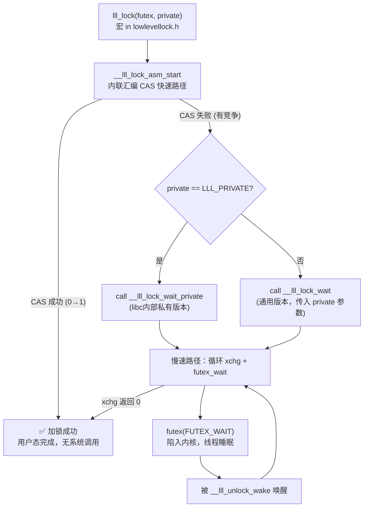

[任务规划完成]
我来查找 `lll_lock` 的实现，需要同时搜索相关头文件和汇编实现。
[查找文件]
找到了关键文件，重点读取 x86_64 的实现（最具代表性），同时读取通用 lowlevellock.c 和 lowlevellock.h：
[读取文件]
现在我有了完整的资料，可以进行深入解析了。

---

## `lll_lock` 底层锁原语实现全解析（x86_64）

整个 `lll_lock` 分为**三层**：宏定义（内联汇编快速路径）→ `__lll_lock_wait`（慢速路径 C/汇编）→ `futex` 系统调用。

---

### 一、锁的状态机（3 个值）

```
futex 变量的值含义：
  0  →  未锁定（LLL_LOCK_INITIALIZER）
  1  →  已锁定，无等待者
  2  →  已锁定，有等待者（需要 futex_wake 唤醒）
```

这是 **"三值 futex"** 经典设计，避免了无竞争时的系统调用。

---

### 二、整体调用层次



---

### 三、快速路径：`lll_lock` 宏（内联汇编）

```c
// lowlevellock.h 中的宏定义（简化版）
#define lll_lock(futex, private)                          \
  ({                                                      \
    // __lll_lock_asm_start 展开为：                       \
    // lock; cmpxchgl %4, %2   ← 原子 CAS: 0 → 1          \
    // jnz 1f                  ← 失败则跳到慢速路径         \
    //                                                    \
    // 快速路径成功，直接跳到 24f 结束                       \
    //                                                    \
    // .subsection 1 (慢速路径，放在代码段外)：              \
    // 1: lea %2, %rdi          ← futex 地址作为参数        \
    //    sub $128, %rsp        ← 保留 red zone            \
    //    callq __lll_lock_wait_private (或 __lll_lock_wait)\
    //    add $128, %rsp                                   \
    //    jmp 24f               ← 返回                     \
    // 24:                                                 \
  })
```

#### 关键指令解析

| 指令 | 作用 |
|------|------|
| `lock; cmpxchgl %4, %2` | 原子比较交换：若 `futex==0`，则写入 `1`，返回旧值 0（成功） |
| `jnz 1f` | 若 CAS 失败（旧值非 0），跳入慢速路径 |
| `sub $128, %rsp` | 保护 **x86-64 红区**（Red Zone，128字节信号安全区） |
| `callq __lll_lock_wait_private` | 调用慢速路径函数 |

> **`.subsection 1`** 技巧：慢速路径代码被放入独立的代码子段，不影响快速路径的指令缓存局部性（cache locality）。

---

### 四、慢速路径：`__lll_lock_wait_private`（汇编版）

```asm
; 文件：lowlevellock.S
__lll_lock_wait_private:
    pushq  %r10
    pushq  %rdx
    xorq   %r10, %r10       ; r10 = NULL（无超时）
    movl   $2, %edx         ; edx = 2（"有等待者"状态值）
    LOAD_PRIVATE_FUTEX_WAIT(%esi)  ; esi = FUTEX_WAIT | FUTEX_PRIVATE_FLAG

    cmpl   %edx, %eax       ; 当前 futex 值 == 2 吗？
    jne    2f               ; 不等于 2，先尝试 xchg 抢锁

1:  ; ← 循环入口：调用 futex_wait 睡眠
    movl   $SYS_futex, %eax
    syscall                 ; futex(futex_addr, FUTEX_WAIT, 2, NULL)
                            ; 若 futex != 2，内核立即返回（避免虚假睡眠）

2:  movl   %edx, %eax      ; eax = 2
    xchgl  %eax, (%rdi)    ; 原子交换：将 futex 设为 2，读出旧值到 eax
                            ; （lock 前缀隐含在 xchg 中）
    testl  %eax, %eax      ; 旧值 == 0？
    jnz    1b              ; 旧值非 0（锁仍被占用），继续睡眠

    ; 旧值为 0，说明成功抢到锁（futex 已被设为 2）
    popq   %rdx
    popq   %r10
    retq
```

#### 逐步流程说明

```
进入 __lll_lock_wait_private 时：
  %rdi = &futex（锁地址）
  %eax = 当前 futex 值（CAS 失败时读出的旧值，必然是 1 或 2）

Step 1: 检查 futex 是否已经是 2
  - 若已是 2（有等待者），直接去 futex_wait 睡眠（跳过 xchg）
  - 若是 1（无等待者），先执行 xchg 将其改为 2，再判断

Step 2: xchgl %eax, (%rdi)
  - 原子地将 futex 设为 2（标记"有等待者"）
  - 读出旧值：若旧值为 0，说明持锁者刚好释放了锁，我们抢到了！
  - 若旧值非 0，说明锁仍被占用，进入 futex_wait

Step 3: syscall futex(FUTEX_WAIT, 2)
  - 内核检查 *futex == 2，若不等则立即返回（防止错过唤醒信号）
  - 若等于 2，线程进入睡眠队列

Step 4: 被唤醒后回到 Step 2，重新竞争
```

---

### 五、C 语言版慢速路径（通用架构）

```c
// lowlevellock.c
void __lll_lock_wait_private(int *futex)
{
    // 若已是 2（有等待者），直接睡眠，避免多余的 xchg
    if (*futex == 2)
        lll_futex_wait(futex, 2, LLL_PRIVATE);

    // 循环：原子设为 2，若旧值非 0 则继续睡眠
    while (atomic_exchange_acq(futex, 2) != 0)
        lll_futex_wait(futex, 2, LLL_PRIVATE);
}
```

与汇编版逻辑完全一致，C 版用于非 x86 架构。

---

### 六、`lll_futex_wait` → `futex` 系统调用

```c
// lowlevellock.h 中的宏
#define lll_futex_timed_wait(futex, val, timeout, private)    \
  ({                                                          \
    register const struct timespec *__to __asm("r10") = timeout; \
    int __status;                                             \
    register __typeof(val) _val __asm("edx") = (val);        \
    __asm __volatile ("syscall"                               \
        : "=a" (__status)                                     \
        : "0" (SYS_futex),      /* rax = 202 (__NR_futex) */ \
          "D" (futex),          /* rdi = futex 地址 */        \
          "S" (FUTEX_WAIT | FUTEX_PRIVATE_FLAG), /* rsi */    \
          "d" (_val),           /* rdx = 期望值 2 */          \
          "r" (__to)            /* r10 = timeout (NULL) */    \
        : "memory", "cc", "r11", "cx");                       \
    __status;                                                 \
  })
```

#### Linux futex 系统调用参数（x86-64）

```
syscall 号：202 (SYS_futex)
参数：
  rdi = futex 地址（用户空间 int*）
  rsi = FUTEX_WAIT | FUTEX_PRIVATE_FLAG (= 0x80)
  rdx = 期望值 2（内核检查 *futex == 2 才睡眠）
  r10 = timeout（NULL 表示无限等待）
  r8  = 未使用
  r9  = 未使用

内核行为：
  1. 检查 *futex == val（2），若不等立即返回 -EAGAIN
  2. 相等则将当前线程加入 futex 等待队列，挂起
  3. 解锁方调用 futex(FUTEX_WAKE) 时唤醒
```

---

### 七、`private` 参数的作用

```c
// LLL_PRIVATE = 0，LLL_SHARED = FUTEX_PRIVATE_FLAG(128)
// 注意：定义是"反的"，使用时会被 XOR 翻转

#define __lll_private_flag(fl, private) \
    (((fl) | FUTEX_PRIVATE_FLAG) ^ (private))
// private=LLL_PRIVATE(0)  → fl | 128 ^ 0  = fl | 128  ✅ 私有futex
// private=LLL_SHARED(128) → fl | 128 ^ 128 = fl        ✅ 共享futex
```

| 值 | 含义 | 内核行为 |
|----|------|----------|
| `LLL_PRIVATE` (0) | 进程私有 futex | 内核用进程内哈希表，**更快** |
| `LLL_SHARED` (128) | 跨进程共享 futex | 内核用全局哈希表，支持 mmap 共享内存 |

---

### 八、完整数据流总结

```
lll_lock(futex, LLL_PRIVATE)
│
├─ [快速路径，用户态，无系统调用]
│   lock; cmpxchgl 1, futex   ← 原子 CAS: 0→1
│   成功 → 返回（~5ns）
│
└─ [慢速路径，有竞争]
    call __lll_lock_wait_private
    │
    ├─ xchgl 2, futex          ← 原子设为2（标记有等待者）
    │   旧值==0 → 抢到锁，返回
    │   旧值!=0 → 继续
    │
    └─ syscall futex(FUTEX_WAIT, 2, NULL)
        │
        ├─ 内核检查 *futex==2
        │   不等 → 立即返回（重试 xchg）
        │   相等 → 线程入睡眠队列
        │
        └─ 等待 __lll_unlock_wake 调用
            futex(FUTEX_WAKE, 1) 唤醒
            → 回到 xchgl 重新竞争
```

---

### 九、设计亮点总结

| 设计点 | 说明 |
|--------|------|
| **三值状态** | 0/1/2 区分"无锁/有锁无等待/有锁有等待"，避免无竞争时的 wake 系统调用 |
| **CAS 快速路径** | 无竞争时纯用户态完成，约 5ns，无内核陷入 |
| **xchg 设为 2** | 进入慢速路径时先将 futex 设为 2，确保解锁方知道需要唤醒等待者 |
| **futex 值检查** | `futex(WAIT, val=2)` 让内核在值不匹配时立即返回，防止 TOCTOU 竞态 |
| **Red Zone 保护** | `sub $128, %rsp` 保护 x86-64 ABI 规定的 128 字节红区，防止信号处理破坏栈 |
| **`.subsection 1`** | 慢速路径代码隔离到独立子段，提升快速路径的 I-Cache 命中率 |
| **private 优化** | 进程私有 futex 使用内核进程内哈希，减少全局锁竞争 |