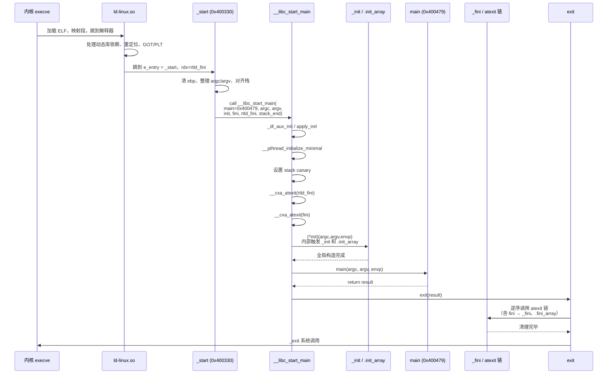

# Linux x86-64 进程启动到 main 调用的完整流程分析

## 一、总体架构：三个关键角色

在 ELF 可执行文件中，从内核 `execve` 加载到 `main` 执行，涉及三层协作：

```
内核 execve
    ↓
动态链接器 ld-linux.so (若为动态链接)
    ↓
_start (可执行文件 .text 段的入口)
    ↓
__libc_start_main (glibc)
    ↓
_init / .init_array (构造函数)
    ↓
main() ← 用户代码
    ↓
_fini / .fini_array (析构函数)
    ↓
exit()
```

---

## 二、`.init` / `.fini` 段：全局构造与析构的钩子

### 2.1 `.init` 段：`_init` 函数

你在反汇编中看到的第一段就是 `.init`：

```asm
00000000004002e0 <_init>:
  4002e0:  f3 0f 1e fa           endbr64
  4002e4:  48 83 ec 08           sub    $0x8,%rsp             ; 对齐栈
  4002e8:  48 8b 05 f1 2c 00 00  mov    0x2cf1(%rip),%rax     ; 取 __gmon_start__
  4002ef:  48 85 c0              test   %rax,%rax
  4002f2:  74 02                 je     4002f6
  4002f4:  ff d0                 call   *%rax                 ; 若非空则调用 gmon 初始化
  4002f6:  48 83 c4 08           add    $0x8,%rsp
  4002fa:  c3                    ret
```

**关键点**：
- `_init` **不是**你手写的，它是**链接器自动拼装**的产物。
- 链接器把 `crti.o` (`_init` 开头)、所有 `.o` 文件的 `.init` 片段、`crtn.o` (`_init` 收尾的 `ret`) 拼接起来，形成一个完整函数。
- 在 glibc-2.17 时代，`.init` 的主要作用就是调用 `__gmon_start__`（gprof 性能剖析初始化），你可以在 [gmon/gmon.c](/glibc-2.17/gmon/gmon.c) 里看到这段实现。
- **现代 GCC 更多用 `.init_array` 段**（一个函数指针数组）替代传统 `.init`，`__do_global_dtors_aux` / `frame_dummy` 就是通过 `.init_array` / `.fini_array` 挂进来的。

### 2.2 `.fini` 段：`_fini` 函数

```asm
0000000000400528 <_fini>:
  400528:  f3 0f 1e fa           endbr64
  40052c:  48 83 ec 08           sub    $0x8,%rsp
  400530:  48 83 c4 08           add    $0x8,%rsp
  400534:  c3                    ret
```

对称地，`_fini` 用于进程退出前执行清理动作（在此例中为空壳）。

### 2.3 谁来调用 `_init` 和 `_fini`？

**关键结论**：`_start` **不直接**调用 `_init` / `_fini`，而是**把它们的地址作为参数传给 `__libc_start_main`**，由 `__libc_start_main` 负责调用。

---

## 三、`_start`：可执行文件的真实入口

内核 `execve` 加载 ELF 后，会跳到 ELF Header 中 `e_entry` 指向的地址——也就是 `_start`。

```asm
0000000000400330 <_start>:
  400330:  f3 0f 1e fa           endbr64
  400334:  31 ed                 xor    %ebp,%ebp             ; ①清零 rbp，标记栈底
  400336:  49 89 d1              mov    %rdx,%r9              ; ②rtld_fini → 参数7 (r9)
  400339:  5e                    pop    %rsi                  ; ③argc → 参数2 (rsi)
  40033a:  48 89 e2              mov    %rsp,%rdx             ; ④argv → 参数3 (rdx)
  40033d:  48 83 e4 f0           and    $0xfffffffffffffff0,%rsp  ; ⑤16 字节对齐栈
  400341:  50                    push   %rax
  400342:  54                    push   %rsp                  ; ⑥stack_end → 参数8 (栈)
  400343:  45 31 c0              xor    %r8d,%r8d             ; ⑦fini = NULL → 参数6 (r8)
  400346:  31 c9                 xor    %ecx,%ecx             ; ⑧init = NULL → 参数5 (rcx)
  400348:  48 c7 c7 79 04 40 00  mov    $0x400479,%rdi        ; ⑨main 地址 → 参数1 (rdi)
  40034f:  ff 15 83 2c 00 00     call   *0x2c83(%rip)         ; ⑩call __libc_start_main
  400355:  f4                    hlt                          ; 保护：正常不会到这
```

### 3.1 逐行解读

| 步骤 | 汇编动作 | 作用 |
|------|---------|------|
| ① | `xor %ebp,%ebp` | 清零帧指针，标记调用栈起点（gdb backtrace 靠它停下） |
| ② | `mov %rdx,%r9` | 内核在 `rdx` 里传的是**动态链接器的清理函数 `rtld_fini`**，保存到 `r9` |
| ③ | `pop %rsi` | 从栈顶弹 `argc`（内核把 argc、argv、envp 依次压在栈上） |
| ④ | `mov %rsp,%rdx` | 此时栈顶就是 `argv[0]` 的地址，作为 `argv` 参数 |
| ⑤ | `and $-16,%rsp` | System V AMD64 ABI 要求 `call` 前 16 字节栈对齐 |
| ⑥ | `push %rax; push %rsp` | 备份栈末端 |
| ⑦⑧ | `xor %r8d,%r8d`; `xor %ecx,%ecx` | `fini` 和 `init` 传 NULL —— **原因见下方 3.3** |
| ⑨ | `mov $0x400479,%rdi` | **把 `main` 的地址 `0x400479` 作为第一个参数**！ |
| ⑩ | `call *0x2c83(%rip)` | 间接调用 `__libc_start_main`（通过 GOT，因为 glibc 是动态链接的） |

### 3.2 参数与 `__libc_start_main` 原型对应

对照 [libc-start.c](/glibc-2.17/csu/libc-start.c) 中的原型：

```c
STATIC int LIBC_START_MAIN (int (*main) (int, char **, char **),   // rdi ← 0x400479 (main)
                            int argc,                              // rsi ← 从栈上弹的 argc
                            char **ubp_av,                         // rdx ← argv
                            __typeof (main) init,                  // rcx ← 0 (NULL)
                            void (*fini) (void),                   // r8  ← 0 (NULL)
                            void (*rtld_fini) (void),              // r9  ← 内核传入的 rdx
                            void *stack_end);                      // 栈  ← 栈末端
```

### 3.3 为什么 `init` 和 `fini` 传 NULL？

这是**现代 GCC 的一个变化**。看似矛盾：明明有 `_init` 和 `_fini`，为什么 `_start` 传 NULL？

原因是：**新版工具链已经改用 `.init_array` / `.fini_array` 机制**，构造/析构函数由 `__libc_csu_init` 或直接由 `__libc_start_main` 通过遍历 `.init_array` 段调用，`_init` / `_fini` 只作为兼容性存在。你在反汇编里看到的 `__do_global_dtors_aux`、`frame_dummy` 就是通过 `.init_array` 挂载的入口。

在**较老的实现**（如 glibc-2.17 典型情况）中，`_start` 会把 `__libc_csu_init`（该函数内部调用 `_init` 并遍历 `.init_array`）传给 `rcx`，把 `__libc_csu_fini` 传给 `r8`。

---

## 四、`__libc_start_main`：粘合层

`_start` 调用 `call *0x2c83(%rip)`，目标地址在 GOT 中，指向 `# 402fd8 <__libc_start_main@GLIBC_2.34>`。这个符号来自 glibc，实现见 [libc-start.c](/glibc-2.17/csu/libc-start.c)。

### 4.1 `__libc_start_main` 的关键动作序列

按源码顺序梳理它做了什么：

```c
STATIC int
LIBC_START_MAIN (int (*main) (int, char **, char **),
                 int argc, char **ubp_av,
                 __typeof (main) init,
                 void (*fini) (void),
                 void (*rtld_fini) (void), void *stack_end)
{
    // ① 处理辅助向量 auxv（内核传递的硬件/系统信息）
    _dl_aux_init (auxvec);

    // ② 应用 IRELATIVE 重定位（IFUNC 相关）
    apply_irel ();

    // ③ 初始化线程库（pthread）
    __pthread_initialize_minimal ();

    // ④ 设置栈保护 canary（-fstack-protector）
    uintptr_t stack_chk_guard = _dl_setup_stack_chk_guard (_dl_random);

    // ⑤ 注册动态链接器的清理函数
    if (rtld_fini != NULL)
        __cxa_atexit ((void (*) (void *)) rtld_fini, NULL, NULL);

    // ⑥ 初始化 libc 自身（静态链接场景）
    __libc_init_first (argc, argv, __environ);

    // ⑦ 注册程序的析构函数
    if (fini)
        __cxa_atexit ((void (*) (void *)) fini, NULL, NULL);

    // ⑧ 调用程序的构造函数（会顺带调用 _init 和遍历 .init_array）
    if (init)
        (*init) (argc, argv, __environ);

    // ⑨ 【核心】调用 main
    result = main (argc, argv, __environ);

    // ⑩ 正常退出（exit 内部会触发 atexit 注册的析构，含 _fini）
    exit (result);
}
```

### 4.2 `__libc_start_main` 如何"找到" main？

这是问题的核心——答案是**它根本不需要"找"**：

> **`main` 的地址是 `_start` 在编译期就通过立即数 `mov $0x400479,%rdi` 写死并作为第一个参数传进来的！**

具体机制：
1. **编译阶段**：编译 `main.c` 时，`main` 只是一个普通全局符号。
2. **链接阶段**：链接器（ld）分配了 `main` 的最终地址 `0x400479`。
3. **`_start` 的构造**：`_start` 存放在 `crt1.o`（或 `Scrt1.o`）中，其源码类似：
   ```asm
   mov $main, %rdi     ; 汇编器里是符号 main，链接时被重定位
   call __libc_start_main@PLT
   ```
   链接时，链接器把 `main` 符号解析为 `0x400479`，写入到 `_start` 的指令里。
4. **运行时**：CPU 执行到 `mov $0x400479,%rdi` 时，`main` 的地址已经作为立即数硬编码在指令流中，直接进 `rdi` 寄存器。
5. **`__libc_start_main` 通过函数指针 `main` 参数调用**：
   ```c
   result = main (argc, argv, __environ);
   ```

所以 **`__libc_start_main` 只是一个"通用启动器"，谁把 `main` 地址传给它，它就调用谁**。这也是为什么你可以用 `gcc -e mymain` 改变入口函数——本质上是让链接器把 "`_start` 里传给 `__libc_start_main` 的那个符号" 改成 `mymain`。

---

## 五、完整时序图



---