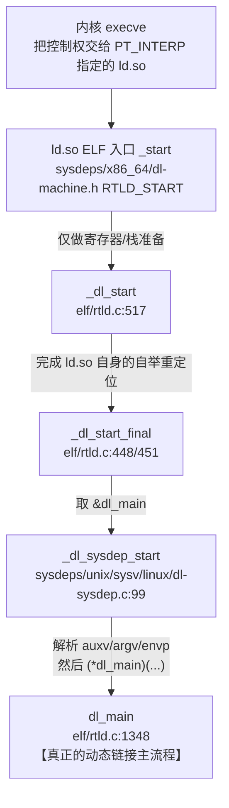
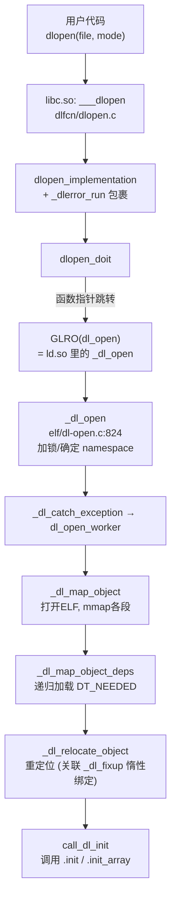

# Linux x86-64 进程启动到 main 调用的完整流程分析

**libc实现了动态加载和链接相关功能，参与到程序运行中，binutils中的ar和ld实现了静态加载和链接相关功能，参与到gcc编译过程中**

## 一、总体架构：三个关键角色

在 ELF 可执行文件中，从内核 `execve` 加载到 `main` 执行，涉及三层协作：

```
内核 execve
    ↓
动态链接器 ld.so (若为动态链接)
    ↓
_start (可执行文件 .text 段的入口)
    ↓
__libc_start_main (glibc)
    ↓
_init / .init_array (构造函数)
    ↓
main() ← 用户代码
    ↓
_fini / .fini_array (析构函数)
    ↓
exit()
```

---

## 二、`.init` / `.fini` 段：全局构造与析构的钩子

### 2.1 `.init` 段：`_init` 函数

你在反汇编中看到的第一段就是 `.init`：

```asm
00000000004002e0 <_init>:
  4002e0:  f3 0f 1e fa           endbr64
  4002e4:  48 83 ec 08           sub    $0x8,%rsp             ; 对齐栈
  4002e8:  48 8b 05 f1 2c 00 00  mov    0x2cf1(%rip),%rax     ; 取 __gmon_start__
  4002ef:  48 85 c0              test   %rax,%rax
  4002f2:  74 02                 je     4002f6
  4002f4:  ff d0                 call   *%rax                 ; 若非空则调用 gmon 初始化
  4002f6:  48 83 c4 08           add    $0x8,%rsp
  4002fa:  c3                    ret
```

**关键点**：
- `_init` **不是**你手写的，它是**链接器自动拼装**的产物。
- 链接器把 `crti.o` (`_init` 开头)、所有 `.o` 文件的 `.init` 片段、`crtn.o` (`_init` 收尾的 `ret`) 拼接起来，形成一个完整函数。
- 在 glibc-2.17 时代，`.init` 的主要作用就是调用 `__gmon_start__`（gprof 性能剖析初始化），你可以在 [gmon/gmon.c](/glibc-2.17/gmon/gmon.c) 里看到这段实现。
- **现代 GCC 更多用 `.init_array` 段**（一个函数指针数组）替代传统 `.init`，`__do_global_dtors_aux` / `frame_dummy` 就是通过 `.init_array` / `.fini_array` 挂进来的。

### 2.2 `.fini` 段：`_fini` 函数

```asm
0000000000400528 <_fini>:
  400528:  f3 0f 1e fa           endbr64
  40052c:  48 83 ec 08           sub    $0x8,%rsp
  400530:  48 83 c4 08           add    $0x8,%rsp
  400534:  c3                    ret
```

对称地，`_fini` 用于进程退出前执行清理动作（在此例中为空壳）。

### 2.3 谁来调用 `_init` 和 `_fini`？

**关键结论**：`_start` **不直接**调用 `_init` / `_fini`，而是**把它们的地址作为参数传给 `__libc_start_main`**，由 `__libc_start_main` 负责调用。

---

## 三、`_start`：可执行文件的真实入口

内核 `execve` 加载 ELF 后，会跳到 ELF Header 中 `e_entry` 指向的地址——也就是 `_start`。

```asm
0000000000400330 <_start>:
  400330:  f3 0f 1e fa           endbr64
  400334:  31 ed                 xor    %ebp,%ebp             ; ①清零 rbp，标记栈底
  400336:  49 89 d1              mov    %rdx,%r9              ; ②rtld_fini → 参数7 (r9)
  400339:  5e                    pop    %rsi                  ; ③argc → 参数2 (rsi)
  40033a:  48 89 e2              mov    %rsp,%rdx             ; ④argv → 参数3 (rdx)
  40033d:  48 83 e4 f0           and    $0xfffffffffffffff0,%rsp  ; ⑤16 字节对齐栈
  400341:  50                    push   %rax
  400342:  54                    push   %rsp                  ; ⑥stack_end → 参数8 (栈)
  400343:  45 31 c0              xor    %r8d,%r8d             ; ⑦fini = NULL → 参数6 (r8)
  400346:  31 c9                 xor    %ecx,%ecx             ; ⑧init = NULL → 参数5 (rcx)
  400348:  48 c7 c7 79 04 40 00  mov    $0x400479,%rdi        ; ⑨main 地址 → 参数1 (rdi)
  40034f:  ff 15 83 2c 00 00     call   *0x2c83(%rip)         ; ⑩call __libc_start_main
  400355:  f4                    hlt                          ; 保护：正常不会到这
```

### 3.1 逐行解读

| 步骤 | 汇编动作 | 作用 |
|------|---------|------|
| ① | `xor %ebp,%ebp` | 清零帧指针，标记调用栈起点（gdb backtrace 靠它停下） |
| ② | `mov %rdx,%r9` | 内核在 `rdx` 里传的是**动态链接器的清理函数 `rtld_fini`**，保存到 `r9` |
| ③ | `pop %rsi` | 从栈顶弹 `argc`（内核把 argc、argv、envp 依次压在栈上） |
| ④ | `mov %rsp,%rdx` | 此时栈顶就是 `argv[0]` 的地址，作为 `argv` 参数 |
| ⑤ | `and $-16,%rsp` | System V AMD64 ABI 要求 `call` 前 16 字节栈对齐 |
| ⑥ | `push %rax; push %rsp` | 备份栈末端 |
| ⑦⑧ | `xor %r8d,%r8d`; `xor %ecx,%ecx` | `fini` 和 `init` 传 NULL —— **原因见下方 3.3** |
| ⑨ | `mov $0x400479,%rdi` | **把 `main` 的地址 `0x400479` 作为第一个参数**！ |
| ⑩ | `call *0x2c83(%rip)` | 间接调用 `__libc_start_main`（通过 GOT，因为 glibc 是动态链接的） |

### 3.2 参数与 `__libc_start_main` 原型对应

对照 [libc-start.c](/glibc-2.17/csu/libc-start.c) 中的原型：

```c
STATIC int LIBC_START_MAIN (int (*main) (int, char **, char **),   // rdi ← 0x400479 (main)
                            int argc,                              // rsi ← 从栈上弹的 argc
                            char **ubp_av,                         // rdx ← argv
                            __typeof (main) init,                  // rcx ← 0 (NULL)
                            void (*fini) (void),                   // r8  ← 0 (NULL)
                            void (*rtld_fini) (void),              // r9  ← 内核传入的 rdx
                            void *stack_end);                      // 栈  ← 栈末端
```

### 3.3 为什么 `init` 和 `fini` 传 NULL？

这是**现代 GCC 的一个变化**。看似矛盾：明明有 `_init` 和 `_fini`，为什么 `_start` 传 NULL？

原因是：**新版工具链**，动态链接器 ld-linux.so 在把控制权交给 `_start` 之前通过调用 `_dl_init` → `call_init`（该函数内部调用 `_init` 并遍历 `.init_array`），`_init` / `_fini` 只作为兼容性存在。

在**较老的实现**（如 glibc-2.17 典型情况）中，`_start` 会把 `__libc_csu_init`（该函数内部调用 `_init` 并遍历 `.init_array`）传给 `rcx`，把 `__libc_csu_fini` 传给 `r8`。

---

## 四、`__libc_start_main`：粘合层

`_start` 调用 `call *0x2c83(%rip)`，目标地址在 GOT 中，指向 `# 402fd8 <__libc_start_main@GLIBC_2.34>`。这个符号来自 glibc，实现见 [libc-start.c](/glibc-2.17/csu/libc-start.c)。

### 4.1 `__libc_start_main` 的关键动作序列

按源码顺序梳理它做了什么：

```c
STATIC int
LIBC_START_MAIN (int (*main) (int, char **, char **),
                 int argc, char **ubp_av,
                 __typeof (main) init,
                 void (*fini) (void),
                 void (*rtld_fini) (void), void *stack_end)
{
    // ① 处理辅助向量 auxv（内核传递的硬件/系统信息）
    _dl_aux_init (auxvec);

    // ② 应用 IRELATIVE 重定位（IFUNC 相关）
    apply_irel ();

    // ③ 初始化线程库（pthread）
    __pthread_initialize_minimal ();

    // ④ 设置栈保护 canary（-fstack-protector）
    uintptr_t stack_chk_guard = _dl_setup_stack_chk_guard (_dl_random);

    // ⑤ 注册动态链接器的清理函数
    if (rtld_fini != NULL)
        __cxa_atexit ((void (*) (void *)) rtld_fini, NULL, NULL);

    // ⑥ 初始化 libc 自身（静态链接场景）
    __libc_init_first (argc, argv, __environ);

    // ⑦ 注册程序的析构函数
    if (fini)
        __cxa_atexit ((void (*) (void *)) fini, NULL, NULL);

    // ⑧ 调用程序的构造函数（会顺带调用 _init 和遍历 .init_array）
    if (init)
        (*init) (argc, argv, __environ);

    // ⑨ 【核心】调用 main
    result = main (argc, argv, __environ);

    // ⑩ 正常退出（exit 内部会触发 atexit 注册的析构，含 _fini）
    exit (result);
}
```

### 4.2 `__libc_start_main` 如何"找到" main？

这是问题的核心——答案是**它根本不需要"找"**：

> **`main` 的地址是 `_start` 在编译期就通过立即数 `mov $0x400479,%rdi` 写死并作为第一个参数传进来的！**

具体机制：
1. **编译阶段**：编译 `main.c` 时，`main` 只是一个普通全局符号。
2. **链接阶段**：链接器（ld）分配了 `main` 的最终地址 `0x400479`。
3. **`_start` 的构造**：`_start` 存放在 `crt1.o`（或 `Scrt1.o`）中，其源码类似：
   ```asm
   mov $main, %rdi     ; 汇编器里是符号 main，链接时被重定位
   call __libc_start_main@PLT
   ```
   链接时，链接器把 `main` 符号解析为 `0x400479`，写入到 `_start` 的指令里。

所以 **`__libc_start_main` 只是一个"通用启动器"，谁把 `main` 地址传给它，它就调用谁**。这也是为什么你可以用 `gcc -e mymain` 改变入口函数——本质上是让链接器把 "`_start` 里传给 `__libc_start_main` 的那个符号" 改成 `mymain`。

---

glibc 中的 trampoline (蹦床) 是动态链接器（ld.so）中用于延迟绑定（lazy binding）的汇编跳转桩代码：
```text
caller: call 0x400310

Disassembly of section .plt:

0000000000400300 <puts@plt-0x10>:
400300:       ff 35 ea 2c 00 00       push   0x2cea(%rip)        # 402ff0 <_GLOBAL_OFFSET_TABLE_+0x8>
400306:       ff 25 ec 2c 00 00       jmp    *0x2cec(%rip)        # 402ff8 <_GLOBAL_OFFSET_TABLE_+0x10>
40030c:       0f 1f 40 00             nopl   0x0(%rax)

0000000000400310 <puts@plt>:
400310:       ff 25 ea 2c 00 00       jmp    *0x2cea(%rip)        # 403000 <puts@GLIBC_2.2.5>
400316:       68 00 00 00 00          push   $0x0
40031b:       e9 e0 ff ff ff          jmp    400300 <_init+0x20>

403000: 0x400316
402ff8: _dl_runtime_resolve_xsavec -> _dl_fixup -> _dl_lookup_symbol_x
                                                -> elf_machine_fixup_plt -> 403000: the real addr of puts@plt
```

e_entry (入口点)是绝对地址或偏移量‌：在非 PIE 程序中，e_entry 是在静态编译链接时指定的绝对虚拟地址，基址为0；在 PIE/共享库中，e_entry 只是相对于动态加载时随机分配（ASLR）的基址的偏移量，通过查看 /proc/<pid>/maps 可得基址。 基址通常指 ELF 中第一个 PT_LOAD 段内存页对齐后的起始地址。

---

## `dl_main` 从哪里被调用

`dl_main` 是动态链接器 `ld.so` 的"业务主函数"，但它并不是由 CPU 直接跳到的入口。它以**函数指针**的形式被更底层的启动流程回调。


### 二、真正调用发生在 `_dl_sysdep_start`

`_dl_sysdep_start` 是与操作系统相关的桥接函数，Linux 平台在 sysdeps/unix/sysv/linux/dl-sysdep.c：

```c
// sysdeps/unix/sysv/linux/dl-sysdep.c:99-142
_dl_sysdep_start (void **start_argptr,
                  void (*dl_main) (const ElfW(Phdr) *, ...))
{
  struct dl_main_arguments dl_main_args;
  _dl_sysdep_parse_arguments (start_argptr, &dl_main_args);
  ...
  (*dl_main) (dl_main_args.phdr, dl_main_args.phnum,
              &dl_main_args.user_entry, GLRO(dl_auxv));
  return dl_main_args.user_entry;
}
```

它先从内核压给动态链接器的 **初始栈帧** 里解析出 `argc/argv/envp/auxv/phdr/phnum` 这些信息，然后通过函数指针 `(*dl_main)(...)` 回调回 `elf/rtld.c` 里的 `dl_main`。

### 三、更上一层的启动链路（从 `_start` 到 `dl_main`）

整个动态链接器启动路径如下：



要点：
- `_start`（汇编入口）→ `_dl_start`（C，完成 ld.so 自身的引导重定位，此时还不能用 GOT）→ `_dl_start_final`（GOT 可用后接手）→ `_dl_sysdep_start`（负责解析内核栈参数）→ **`dl_main`**（业务主流程）。
- 之所以要拆得这么细，是因为 `_dl_start` 阶段 GOT 还没搞好，不能调用任何间接跳转的库函数；后半段一定要放到独立函数里避免编译器把 GOT 访问提前。

### 四、`dl_main` 内部触发 `DT_NEEDED` 依赖加载

回到你选中的 `dl_main` 函数体，加载主程序 `DT_NEEDED` 依赖的调用点在 **elf/rtld.c 第 1971 行**：

```c
// elf/rtld.c:1966-1975
/* Load all the libraries specified by DT_NEEDED entries.  If LD_PRELOAD
   specified some libraries to load, these are inserted before the actual
   dependencies in the executable's searchlist for symbol resolution.  */
{
  RTLD_TIMING_VAR (start);
  rtld_timer_start (&start);
  _dl_map_object_deps (main_map, preloads, npreloads,
                       state.mode == rtld_mode_trace, 0);
  rtld_timer_accum (&load_time, start);
}
```

- `main_map` 是主程序（可执行文件）已建立的 `link_map`。
- `preloads/npreloads` 是 `LD_PRELOAD` 指定的库，会被插到 `DT_NEEDED` 之前。
- `_dl_map_object_deps` 会**广度优先递归**处理 `DT_NEEDED`：对每个尚未加载的依赖调用 `_dl_map_object`（`mmap` 段、建立 `link_map`），然后继续处理该依赖的 `DT_NEEDED`，直到搜索列表 `r_list` 完整建立。

之后 `dl_main` 会继续：
1. 处理 TLS：`_dl_determine_tlsoffset`；
2. 分配 TCB：`_dl_allocate_tls_storage`；
3. 对整个依赖列表做 `_dl_relocate_object`（真正的重定位，此时 PLT 若为惰性绑定，会预先写入到 `_dl_runtime_resolve` 的跳板 —— 这就衔接到你之前问过的 `_dl_fixup` 路径）；
4. 调用各 DSO 的 `.init_array` / `.init`；
5. 最后返回用户程序入口 `user_entry`，由 `_start` 的汇编尾部跳转过去，正式进入 `main`。

___

dlopen动态加载库过程：
