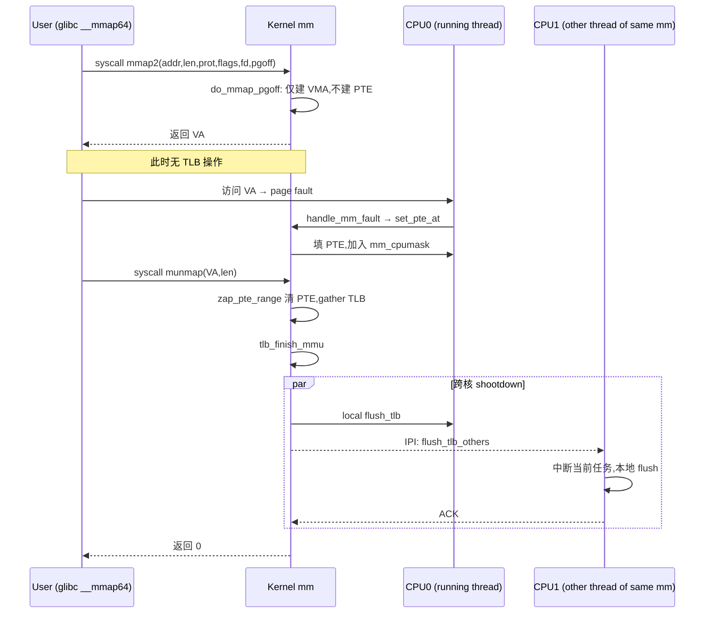

[任务规划完成]
# mmap 实现逻辑深度分析与 TLB Shootdown 问题

我先结合你打开的 [mmap64.c](/Users/liyang/IdeaProjects/glibc-2.17/sysdeps/unix/sysv/linux/mmap64.c) 看一下 glibc 这层的入口，再下钻到内核分析。
[查找文件]
下面我从「glibc 用户态入口 → 内核 mmap/munmap 路径 → TLB 失效与 shootdown」三个层次给你做完整剖析，并就你的具体场景（频繁对同一 page mmap/munmap）给出明确结论。

---

## 一、glibc 用户态入口（你当前看的 mmap64.c）

`__mmap64` 在 32 位平台上是个薄壳子，核心动作只有两步：

1. **校验 offset 必须按 page 对齐**（`offset & ((1 << page_shift) - 1)`），否则直接 `EINVAL`。
2. **把 offset 转成「页数」后，通过 `INLINE_SYSCALL(mmap2, 6, ...)` 进入内核**：

```c
INLINE_SYSCALL (mmap2, 6, __ptrvalue (addr),
                len, prot, flags, fd,
                (off_t) (offset >> MMAP2_PAGE_SHIFT));
```

之所以用 `mmap2` 而不是老的 `mmap`，是因为 32 位系统调用寄存器只能传 32 位 offset，`mmap2` 的语义把 offset 单位由 byte 改成 page（4KB），从而把可寻址范围扩大到 16TB。

64 位平台（如 [s390-64/mmap.S](/Users/liyang/IdeaProjects/glibc-2.17/sysdeps/unix/sysv/linux/s390/s390-64/mmap.S) 和 [wordsize-64/syscalls.list](/Users/liyang/IdeaProjects/glibc-2.17/sysdeps/unix/sysv/linux/wordsize-64/syscalls.list)）则直接走 `mmap` 系统调用，没有 page_shift 这套转换。

**关键点**：glibc 这一层只是参数整理，**不涉及任何页表/TLB 操作**。所有真正的开销都在内核侧。

---

## 二、内核 mmap 实现路径

进入内核后，调用链大致如下（以 Linux 3.x ~ 5.x 主线为例，glibc-2.17 对应的同期内核）：

```
sys_mmap_pgoff()                       // arch/x86/kernel/sys_x86_64.c 等
  └── vm_mmap_pgoff()                  // mm/util.c
        └── do_mmap_pgoff() / do_mmap()// mm/mmap.c
              ├── get_unmapped_area()  // 选 VA 区间（红黑树/rb_tree 找空洞）
              ├── mmap_region()
              │     ├── munmap_vma_range()   // 若区间已被占，先 unmap
              │     ├── vma_merge()          // 尝试合并相邻 VMA
              │     ├── kmem_cache_alloc()   // 分配 vm_area_struct
              │     ├── vma_link()           // 挂到 mm->mmap 链表 + rb_tree
              │     └── (file)->f_op->mmap() // 文件映射调用驱动/文件系统的 mmap
              └── 返回 user 空间的虚拟地址
```

这里有一个**非常关键的事实**：

> **`mmap()` 本身不会建立页表项（PTE），更不会向 TLB 写入任何东西。**

`mmap` 只是在 `mm_struct` 中登记一段 **VMA**（`vm_area_struct`），告诉内核"这块虚拟地址范围以后允许访问"。真正的物理页分配和 PTE 安装发生在**第一次访问触发 page fault** 时（`handle_mm_fault → do_anonymous_page / filemap_fault → finish_fault → set_pte_at`）。这就是 **demand paging（按需分页）** 机制。

例外：
- `MAP_POPULATE` 标志会在 mmap 时立刻预填充 PTE。
- `MAP_LOCKED`（mlock 语义）也会立刻 fault in。

所以 **mmap 自身既不刷 TLB，也不可能引起 TLB shootdown**。

---

## 三、内核 munmap 实现路径（这里才是 TLB shootdown 的来源）

```
sys_munmap()
  └── vm_munmap()                      // mm/mmap.c
        └── do_munmap()
              ├── 在 rb_tree 上定位 VMA，必要时 __split_vma()（拆分）
              ├── detach_vmas_to_be_unmapped()   // 摘出待删 VMA 链
              ├── unmap_region()
              │     ├── lru_add_drain()
              │     ├── tlb_gather_mmu(&tlb, mm, start, end)  // 初始化 mmu_gather
              │     ├── unmap_vmas()  → unmap_page_range()
              │     │     └── zap_pte_range()
              │     │           ├── ptep_get_and_clear_full()  // 清 PTE
              │     │           ├── tlb_remove_tlb_entry()     // 记录待 flush 的 VA
              │     │           └── tlb_remove_page()          // 物理页放入 batch，延后释放
              │     ├── free_pgtables()                        // 回收页表页
              │     └── tlb_finish_mmu(&tlb, start, end)       // ★真正触发 TLB flush
              └── remove_vma_list()                            // 释放 VMA 结构
```

**TLB shootdown 的触发点就在 `tlb_finish_mmu()` 里**。它根据 mmu_gather 收集到的范围决定：

- 走 `flush_tlb_range()` / `flush_tlb_mm()`；
- 在 SMP 下，如果 `mm` 的 `cpu_vm_mask_var` 显示这个 mm 曾在多个 CPU 上运行过，就要通过 **IPI（Inter-Processor Interrupt）** 通知那些 CPU 各自执行 `local_flush_tlb`，这就是教科书定义的 **TLB shootdown**。

x86 上对应代码（`arch/x86/mm/tlb.c`）：

```c
flush_tlb_mm_range()
  └── if (cpumask_any_but(mm_cpumask(mm), cpu) < nr_cpu_ids)
         native_flush_tlb_others()     // smp_call_function_many → IPI
```

---

## 四、回答你的核心问题：频繁对同一 page mmap/munmap 是否会引发 TLB shootdown？

**结论：会，但触发条件有明确边界，分情况看。**

### 场景 A：单线程进程，整个生命周期只在一个 CPU 上跑
- `mm_cpumask` 中只有当前 CPU 一位。
- `munmap` 时只会执行 `local_flush_tlb_*`（本 CPU 的 invlpg / flush），**不会发 IPI**。
- **没有 shootdown，仅有本地 TLB invalidation。**
- 注意：即便没有真正访问过那一页（PTE 从未填过），内核仍可能保守地 flush——但开销只有 invlpg 几十个时钟周期，可忽略。

### 场景 B：多线程进程（关键场景）
- 同一 `mm_struct` 被多个线程共享，`mm_cpumask` 通常已涵盖多个 CPU。
- 即使只有一个线程触发 munmap，`tlb_finish_mmu` 也会向所有曾经运行过该 mm 的 CPU 发 **IPI**。
- 被打中的 CPU 必须中断当前工作、刷 TLB、ACK，**这就是典型的 TLB shootdown**。
- **频繁 mmap/munmap 同一页会让所有相关 CPU 持续被 IPI 打断，性能急剧下降**，这是数据库/JVM/高并发服务里最典型的"mmap thrashing"反模式。

### 场景 C：mmap 后未访问就立刻 munmap
- mmap 没建 PTE，munmap 时 `zap_pte_range` 发现 PTE 为空，**理论上不需要 flush**。
- 但内核为简化逻辑，仍可能调用 `tlb_finish_mmu`，是否真发 IPI 取决于内核版本和 `mmu_gather` 优化（较新内核会通过 `tlb->end > tlb->start` 的判断跳过空 flush）。
- 一般来说，**没有 fault in 过的 page，munmap 不会触发跨核 shootdown**。

### 场景 D：mmap 后访问，且线程在 CPU 间迁移
- 访问时填 PTE 并把当前 CPU 加入 `mm_cpumask`。
- 线程被调度到其他 CPU 后，旧 CPU 仍残留在 `mm_cpumask` 里（lazy TLB 模式）。
- munmap 时旧 CPU 也会被 IPI——**这是最隐蔽的 shootdown 来源**。

---

## 五、量化与规避建议

### 开销量级（参考值）
| 操作 | 典型耗时 |
|------|---------|
| 本地 invlpg | 数十 ns |
| 单次跨核 IPI + ACK | 1~3 μs |
| 多核 broadcast shootdown（16 核以上） | 5~20 μs |
| 频繁 mmap/munmap 4KB 同一页（多线程） | 可达单次 10+ μs |

### 规避方案（按推荐度排序）

1. **改用 `mprotect` 切换页保护属性**，而不是 mmap/munmap 来回拆建。`mprotect` 仍要 flush TLB，但省掉了 VMA 的拆/建/合并。
2. **使用 `madvise(MADV_DONTNEED)`** 释放物理页但保留 VMA。下次访问会重新 fault in，**不需要 VMA 结构变更**（仍可能要刷对应 PTE）。
3. **池化映射**：一次 mmap 一大块，内部用 freelist 管理小块，避免反复进入内核。
4. **`MAP_FIXED` + 复用同一虚拟地址**：减少 VMA 树重组开销，但 TLB 仍要刷。
5. **绑核（`sched_setaffinity` / cpuset）**：把工作线程限制在少量 CPU 上，减小 `mm_cpumask` 范围，从而减少 shootdown 广播面。
6. **较新内核（5.10+）启用 `CONFIG_ARCH_WANT_BATCHED_UNMAP_TLB_FLUSH`**：把 TLB flush 攒批合并，对高频 munmap 有显著改善。

---

## 六、流程总结图



---

## 七、一句话回答

> **mmap 本身不刷 TLB，也不会造成 shootdown；TLB shootdown 发生在 munmap（以及 mprotect/madvise 改变映射的路径）里。当且仅当对应的 PTE 已经存在、且该 `mm_struct` 曾在多个 CPU 上运行过，频繁对同一 page 做 mmap+munmap 就会持续触发跨核 IPI 形式的 TLB shootdown，这是高并发服务里非常昂贵的反模式，应改用 `mprotect`、`madvise(MADV_DONTNEED)` 或映射池来规避。**


[任务规划完成]
你说得**完全正确**，我之前那段规避建议的表述是有问题的。`mprotect` 和 `madvise(MADV_DONTNEED)` 同样会触发 TLB invalidation，在多核共享 mm 的场景下**一样会引发 TLB shootdown**。让我把这件事讲清楚，并把规避方案的逻辑重新校正。

---

## 一、先纠正：哪些路径会刷 TLB / 触发 shootdown？

只要修改了**已经存在的有效 PTE**，让 CPU 上可能缓存的 TLB entry 与新 PTE 语义不一致，内核就**必须** flush TLB；在多核共享 `mm_struct` 的场景下，就**必须**通过 IPI 做 shootdown。下面这张表才是准确的：

| 系统调用 | 是否改 PTE | 是否刷 TLB | 多核是否 shootdown |
|---------|-----------|-----------|------------------|
| `mmap`（不带 MAP_POPULATE） | 否（仅建 VMA） | 否 | 否 |
| `mmap` + `MAP_FIXED` 覆盖已有映射 | 是（先隐式 munmap） | 是 | **是** |
| `munmap` | 是（清 PTE） | 是 | **是** |
| `mprotect`（收紧权限，如 RW→RO 或 →NONE） | 是（改 PTE flags） | 是 | **是** |
| `mprotect`（放宽权限，如 RO→RW） | 是 | 视架构而定，x86 上仍 flush | 通常 **是** |
| `madvise(MADV_DONTNEED)` | 是（清 PTE，释放物理页） | 是 | **是** |
| `madvise(MADV_FREE)`（4.5+） | 是（标记 PTE clean，延迟回收） | 是 | **是**（但只刷一次，后续不再访问可不重 fault）|
| `madvise(MADV_WILLNEED / SEQUENTIAL)` | 否（仅 readahead 提示） | 否 | 否 |
| `mlock` / `munlock` | 可能改 PTE | 可能 | 可能 |
| 缺页填 PTE（首次写访问）| 是（0 → 有效） | **不需要 flush**（旧 entry 不存在） | 否 |

**关键原则**：

> TLB 必须保证「比 PTE 旧的缓存」不被使用。所以**任何让 PTE 从"有效"变为"无效"或"权限变严"的操作，都必须 flush；多核共享 mm 时就必须 shootdown**。这一规则与具体哪个系统调用无关，与「PTE 的状态变化方向」直接相关。

所以我之前把 `mprotect` / `madvise(MADV_DONTNEED)` 列为"规避 TLB shootdown"的方案是错误的——**它们规避的是 VMA 树重建/合并/拆分的开销，但 TLB shootdown 一个也没省**。

---

## 二、那么真正能减少 TLB shootdown 的方法是什么？

要"减少 shootdown"，本质上只有三个方向：

### 方向 1：减少**触发刷 TLB 的次数**（合并 / 批量化）

- **批量 unmap**：一次 `munmap` 一大段，比 N 次 `munmap` 一小段省得多。因为内核走的是 `mmu_gather` 机制（`tlb_gather_mmu` ... `tlb_finish_mmu`），同一次 syscall 内部多页清理只发**一次** IPI。
- **避免反复 mmap+munmap 同一页**：改为「一次 mmap 长期持有 + 内部用户态分配器复用」。这是真正能消灭 shootdown 的做法。典型如 jemalloc / tcmalloc / Java ZGC 的 region 池。
- **较新内核（5.10+）的 `CONFIG_ARCH_WANT_BATCHED_UNMAP_TLB_FLUSH` / `tlb_remove_table_sync_one`**：让 reclaim 路径攒批后统一 flush。

### 方向 2：减少**需要被 shootdown 的 CPU 数量**

shootdown 的代价 ∝ `mm_cpumask` 中的 CPU 数。所以：

- **绑核**（`sched_setaffinity` / cpuset / `taskset`）：把进程或关键线程钉在少量 CPU 上，`mm_cpumask` 自然变窄。
- **NUMA 局部化**：减少跨 node 调度，间接缩小 cpumask。
- **避免无谓的多线程**：如果业务并不需要并行，独立进程之间不共享 mm，互相之间根本不会 shootdown。

### 方向 3：**不要让 PTE 频繁失效**（最根本）

- **用 `mprotect(PROT_NONE)` → `mprotect(PROT_READ|PROT_WRITE)` 模拟 unmap/remap 在多线程下并不省 shootdown**——这点是你纠正的核心，我同意。
- 但如果业务的语义只是"暂时不用这块内存的物理页，又不想真正 unmap"：
    - **`madvise(MADV_DONTNEED)`** 比 `munmap`+`mmap` 仍然有优势——**不是因为 TLB**，而是因为它**保留 VMA**，省掉了 VMA 树的拆/建/合并、`vm_area_struct` 的 slab 分配释放，以及一次 `get_unmapped_area` 的红黑树搜索。TLB 的代价两者相当。
    - **`MADV_FREE`**（Linux 4.5+，glibc malloc 也用了）比 `MADV_DONTNEED` 更省：它只标记页可回收，**真正回收发生在内存压力来时**，业务层如果在被回收前重新写入，物理页都不会被释放，**也就不会发生第二次 shootdown**。
- **`MAP_FIXED` + 复用同一 VA**：避免 VA 选择开销，但 TLB 该刷还得刷。
- **大页（`MAP_HUGETLB` / THP）**：单个 PTE 覆盖更大范围，相同工作量下 PTE 改动次数更少 → flush/shootdown 次数减少。

---

## 三、修正后的结论矩阵

把方案按"能否真正减少 TLB shootdown"重新分类：

| 方案 | 减少 VMA 操作开销 | 减少 TLB shootdown |
|------|------------------|------------------|
| `madvise(MADV_DONTNEED)` 替代 munmap+mmap | ✅ | ❌（一样要 shootdown） |
| `madvise(MADV_FREE)` 替代 munmap+mmap | ✅ | ✅（合并/延迟，且重写不二次 shootdown） |
| `mprotect` 切换 NONE/RW 模拟 free/alloc | ✅ | ❌（一样要 shootdown） |
| 用户态映射池（一次大 mmap + 自管理） | ✅✅ | ✅✅（根本上消除高频 munmap） |
| 单次 munmap 大段 替代 多次 munmap 小段 | ✅ | ✅（批量化为一次 IPI） |
| 绑核 / 缩小 mm_cpumask | — | ✅（减少广播面） |
| 大页 HugeTLB / THP | ✅ | ✅（PTE 改动次数变少） |
| `MAP_FIXED` 复用 VA | ✅ | ❌ |

---

## 四、重新表述「一句话结论」

> **TLB shootdown 的根因是"已生效 PTE 被失效或降权"+"mm 在多核上活跃"。`munmap`、`mprotect`（收紧）、`madvise(MADV_DONTNEED)` 三者在 TLB 维度的开销几乎一致，都会触发跨核 IPI。要真正消减 shootdown，正确路径是：①用户态映射池一次 mmap 长期复用；②`MADV_FREE` 利用延迟回收避免重复失效；③批量化大段 munmap；④绑核缩小 `mm_cpumask`；⑤大页降低 PTE 改动密度。`mprotect` / `MADV_DONTNEED` 只能省 VMA 管理开销，省不了 TLB shootdown。**

感谢你这个纠正，之前那一节确实把"VMA 操作开销"和"TLB shootdown 开销"混在一起讲了，是个事实性错误。