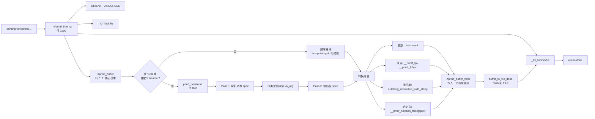

## 一、`printf` 家族的"三级内存"模型

以你打开的 [printf.c](/glibc-2.38/stdio-common/printf.c) 为起点，数据其实经过了 **3 层用户态内存**：


三层都是**纯用户态内存**，`__vfprintf_internal` 从头到尾只在前两层活动。

---

## 二、从源码看数据流转

### 阶段 1：格式化 → work_buffer

`vfprintf-internal.c` 第 517 行开始的 `Xprintf_buffer` 状态机，把 `%d`、`%s` 等参数转成字符，先落到栈上的 `work_buffer[1000]`（整数）或直接生成到 `stage`。

### 阶段 2：Xprintf_buffer_write → stage 或 FILE 内部缓冲

看 [printf_buffer_to_file.c:28](/glibc-2.38/stdio-common/printf_buffer_to_file.c) 的 `__printf_buffer_to_file_switch`：

```c
if (buf->fp->_IO_write_ptr < buf->fp->_IO_write_end)
{
    /* FILE 已经有缓冲区，就直接写进 FILE 内部缓冲 */
    buf->base.write_ptr = buf->fp->_IO_write_ptr;
    buf->base.write_end = buf->fp->_IO_write_end;
}
else
{
    /* FILE 还没缓冲区，先写进 stage 临时缓冲 */
    buf->base.write_ptr = buf->stage;
    buf->base.write_end = array_end (buf->stage);
}
```

**关键洞察**：glibc 尽可能让 `Xprintf_buffer_write` 直接把字节 memcpy 到 `FILE` 结构体自带的缓冲区（通常 4KB 或 8KB），**跳过一次中间拷贝**。这就是为什么整个格式化过程 100% 无系统调用。

### 阶段 3：flush 到 FILE（依然是用户态）

`__printf_buffer_flush_to_file` 第 54-67 行：

```c
if (buf->base.write_end == array_end (buf->stage))
{
    size_t count = buf->base.write_ptr - buf->stage;
    if ((size_t) _IO_sputn (buf->fp, buf->stage, count) != count)   // ★
        ...
}
```

`_IO_sputn` **仍然是用户态调用**：它调用 `fp->vtable->__xsputn`（对于普通 `FILE` 就是 `_IO_new_file_xsputn`），本质上还是 `memcpy` 到 FILE 的 `_IO_write_ptr`。

### 阶段 4：只有在 FILE 缓冲区满 / 显式 flush 时才 syscall

真正调用 `write(2)` 的地方在 [libio/fileops.c](/glibc-2.38/libio/fileops.c) 的 `_IO_new_do_write` / `_IO_new_file_overflow`，触发条件是：

| 触发条件 | 场景 |
|----------|------|
| `FILE` 缓冲区满 | 输出量超过 `BUFSIZ`（一般 8KB） |
| 遇到 `\n` 且为行缓冲 | 终端上的 stdout 默认行缓冲 |
| 用户显式 `fflush()` | 手动强制刷新 |
| 程序退出 | `exit()` → `_IO_cleanup()` |
| 无缓冲流 | 如 `stderr`（每次 printf 都 syscall） |

代码路径上就是 [printf_buffer_to_file.c:74](/glibc-2.38/stdio-common/printf_buffer_to_file.c) 处 `__overflow(buf->fp, ...)`：**只有这个函数最终会 syscall**，而在缓冲区没满时它根本不会被调到。

---

## 三、 `__vfprintf_internal` 逻辑分析

`__vfprintf_internal` 是 glibc 所有 `printf` 家族函数的**共同格式化核心**

