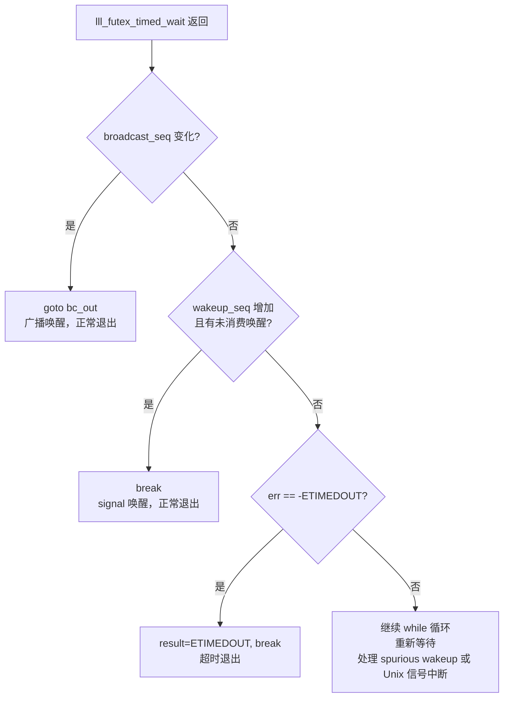

[任务规划完成]
## `__pthread_cond_timedwait` 在有信号触发时会被唤醒执行吗？

**会被唤醒，但需要区分两种"信号"的含义。**

---

### 一、`pthread_cond_signal` / `pthread_cond_broadcast` 触发的唤醒

**会被唤醒，且这是正常的工作机制。**

代码中通过 `futex` 等待：

```c
err = lll_futex_timed_wait (&cond->__data.__futex, futex_val, &rt, pshared);
```

当另一个线程调用 `pthread_cond_signal` 或 `pthread_cond_broadcast` 时，会修改 `__futex` 的值并唤醒等待的线程。

唤醒后通过序列号判断是否是"真实唤醒"：

```c
/* Check whether we are eligible for wakeup. */
val = cond->__data.__wakeup_seq;
if (val != seq && cond->__data.__woken_seq != val)
    break;  // ← 真实唤醒，退出循环
```

- `val != seq`：`__wakeup_seq` 增加了，说明有 `signal/broadcast` 发生
- `cond->__data.__woken_seq != val`：这个唤醒还未被其他线程消费

两个条件都满足 → `break` 退出，函数正常返回。

---

### 二、Unix 信号（`SIGINT`、`SIGUSR1` 等）触发的唤醒

**也可能被唤醒，但会被循环重新处理。**

Unix 信号会中断 `futex` 系统调用，导致 `lll_futex_timed_wait` 提前返回，返回值为 `-EINTR`。

此时：
- `__wakeup_seq` 没有变化（没有 `pthread_cond_signal` 发生）
- `err != -ETIMEDOUT`（不是超时）

所以代码中的判断：

```c
val = cond->__data.__wakeup_seq;
if (val != seq && cond->__data.__woken_seq != val)
    break;  // ← 不满足，不会 break

if (__builtin_expect (err == -ETIMEDOUT, 0))
    { ... break; }  // ← 也不满足

// 继续 while(1) 循环，重新等待
```

**Unix 信号导致的唤醒会被 `while(1)` 循环"吸收"，重新计算剩余时间后继续等待。**

---

### 三、完整的唤醒路径总结



| 唤醒原因 | `futex` 返回值 | 最终行为 |
|---------|--------------|---------|
| `pthread_cond_signal` | `0` | `break`，正常返回 `0` |
| `pthread_cond_broadcast` | `0` | `goto bc_out`，正常返回 `0` |
| 超时 | `-ETIMEDOUT` | `break`，返回 `ETIMEDOUT` |
| Unix 信号中断 | `-EINTR` | 继续循环，重新等待 |
| Spurious wakeup | `0` | 继续循环，重新等待 |