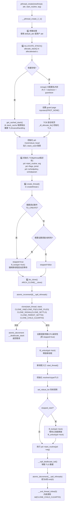
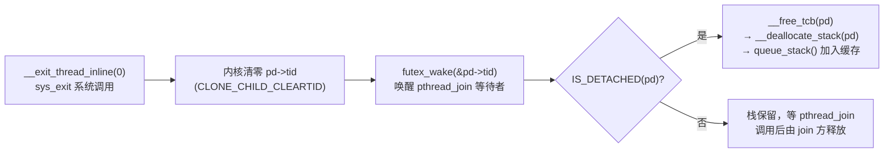

[任务规划完成]
我来同时读取 `createthread.c` 和 `allocatestack.c`，结合已有的 `pthread_create.c` 内容进行完整分析。
[查找文件]
[读取文件]
现在我有了所有关键文件的完整内容，可以进行全面解析。

---

## `pthread_create` 完整流程解析

整个流程横跨三个文件：[pthread_create.c](/Users/liyang/IdeaProjects/glibc-2.17/nptl/pthread_create.c)、[allocatestack.c](/Users/liyang/IdeaProjects/glibc-2.17/nptl/allocatestack.c)、[createthread.c](/Users/liyang/IdeaProjects/glibc-2.17/nptl/sysdeps/pthread/createthread.c)，共分为 **5 个阶段**。

---

### 总体流程图



---

### 一、参数处理（`__pthread_create_2_1`）

```c
const struct pthread_attr *iattr = (struct pthread_attr *) attr;
if (iattr == NULL)
    iattr = &default_attr;  // 默认 guardsize=1（向上取整到页大小）
```

- 若用户传 `NULL`，使用 `default_attr`（guardsize=1，其余为0）
- 存在 `__pthread_create_2_0`（GLIBC_2_0 兼容版本），会将旧格式 attr 转换后调用 2_1 版本

---

### 二、栈分配（`allocate_stack`）

这是最复杂的阶段，分两条路径：

#### 路径 A：用户提供栈（`ATTR_FLAG_STACKADDR`）

```c
pd = (struct pthread *)((uintptr_t)attr->stackaddr - TLS_TCB_SIZE - adj);
memset(pd, '\0', sizeof(struct pthread));
pd->user_stack = true;
list_add(&pd->list, &__stack_user);  // 加入用户栈链表
```

用户自己管理内存，不会被缓存回收。

#### 路径 B：系统自动分配（常规路径）

```
┌─────────────────────────────────────────────────────┐
│                   mmap 分配的内存块                   │
├──────────┬──────────────────────────────┬────────────┤
│ guard    │       可用栈空间              │  TCB + TLS │
│ (PROT_   │   (_STACK_GROWS_DOWN)        │  (pthread) │
│  NONE)   │                              │            │
└──────────┴──────────────────────────────┴────────────┘
↑ mem                                    ↑ pd (栈顶)
```

**关键步骤：**

1. **尝试缓存复用**：`get_cached_stack()` 在 `stack_cache` 链表中找大小匹配的旧栈
    - 找到且大小不超过 4 倍需求 → 复用（重置 TLS、cancelhandling、nextevent）
    - 未找到 → `mmap()` 新分配

2. **TCB 位置**：放在栈内存的**高地址端**（栈向下增长时的"顶部"）
   ```c
   pd = (struct pthread *)((char *)mem + size - coloring) - 1;
   ```

3. **Stack Coloring**（栈着色）：每个新线程偏移 `COLORING_INCREMENT` 字节，避免多线程栈在 cache 中产生别名冲突

4. **Guard Page**：`mprotect(guard, guardsize, PROT_NONE)` 设置不可访问区域，触碰时产生 SIGSEGV

5. **TLS 初始化**：`_dl_allocate_tls()` 分配并初始化线程本地存储的 DTV（动态线程向量）

6. **Robust mutex 初始化**：
   ```c
   pd->robust_head.futex_offset = offsetof(pthread_mutex_t, __data.__lock)
                                 - offsetof(pthread_mutex_t, __data.__list.__next);
   pd->robust_head.list = &pd->robust_head;  // 空链表自指
   ```

---

### 三、TCB 初始化（`__pthread_create_2_1` 中段）

```c
pd->start_routine = start_routine;   // 用户函数指针
pd->arg = arg;                        // 用户参数
pd->flags = ...;                      // 继承父线程调度标志
pd->joinid = detached ? pd : NULL;    // detached 时自指
pd->eventbuf = self->eventbuf;        // 继承调试事件掩码
pd->schedpolicy = self->schedpolicy;  // 继承调度策略
pd->schedparam = self->schedparam;    // 继承调度参数
```

若设置了 `ATTR_FLAG_NOTINHERITSCHED`，则从 attr 中读取调度参数，并通过 `sched_get_priority_min/max` 校验优先级范围。

---

### 四、`create_thread` — 决定是否 stopped 启动

```c
int clone_flags = CLONE_VM | CLONE_FS | CLONE_FILES
                | CLONE_SIGNAL          // = CLONE_SIGHAND | CLONE_THREAD
                | CLONE_SETTLS          // 设置新线程的 TLS 寄存器
                | CLONE_PARENT_SETTID   // 内核将 tid 写入 &pd->tid（父进程地址空间）
                | CLONE_CHILD_CLEARTID  // 线程退出时内核清零 pd->tid 并 futex_wake
                | CLONE_SYSVSEM;
```

| clone flag | 作用 |
|-----------|------|
| `CLONE_VM` | 共享地址空间（线程本质） |
| `CLONE_FS/FILES` | 共享文件系统/文件描述符 |
| `CLONE_SIGNAL` | 共享信号处理（POSIX 要求） |
| `CLONE_SETTLS` | 设置新线程的 FS/GS 寄存器指向 TCB |
| `CLONE_PARENT_SETTID` | 父线程可立即读到新线程 tid |
| `CLONE_CHILD_CLEARTID` | 线程退出时自动唤醒 `pthread_join` 等待者 |

**stopped 启动机制**（用于需要在线程运行前设置调度参数的场景）：

```c
// do_clone 中：
if (stopped)
    lll_lock(pd->lock, LLL_PRIVATE);  // 父线程先锁住

// clone 后新线程在 start_thread 中：
lll_lock(pd->lock, LLL_PRIVATE);      // 新线程阻塞在这里
lll_unlock(pd->lock, LLL_PRIVATE);    // 等父线程设置完调度参数后释放

// 父线程设置完调度参数后：
lll_unlock(pd->lock, LLL_PRIVATE);    // 释放新线程
```

---

### 五、新线程入口：`start_thread`

```c
static int start_thread(void *arg) {
    struct pthread *pd = (struct pthread *) arg;

    // 1. 初始化 resolver 状态（DNS 查询线程本地状态）
    __resp = &pd->res;
    __ctype_init();

    // 2. 允许 setxid（uid/gid 变更）
    if (atomic_exchange_acq(&pd->setxid_futex, 0) == -2)
        lll_futex_wake(&pd->setxid_futex, 1, LLL_PRIVATE);

    // 3. 注册 robust mutex 链表到内核
    INTERNAL_SYSCALL(set_robust_list, err, 2,
                     &pd->robust_head, sizeof(struct robust_list_head));

    // 4. 设置取消跳转点（setjmp）
    not_first_call = setjmp(unwind_buf.cancel_jmp_buf);
    if (!not_first_call) {
        THREAD_SETMEM(pd, cleanup_jmp_buf, &unwind_buf);

        // 5. 若 stopped，等待父线程释放
        if (pd->stopped_start) {
            lll_lock(pd->lock, LLL_PRIVATE);
            lll_unlock(pd->lock, LLL_PRIVATE);
        }

        // 6. 执行用户函数
        THREAD_SETMEM(pd, result, pd->start_routine(pd->arg));
    }

    // 7. 清理 TLS 析构函数（最多 PTHREAD_DESTRUCTOR_ITERATIONS 轮）
    __nptl_deallocate_tsd();
    __libc_thread_freeres();

    // 8. 最后一个线程则 exit(0)
    if (atomic_decrement_and_test(&__nptl_nthreads))
        exit(0);

    // 9. 报告 TD_DEATH 调试事件（若需要）

    // 10. 标记 EXITING_BIT
    atomic_bit_set(&pd->cancelhandling, EXITING_BIT);

    // 11. 处理 robust mutex（内核不支持时的用户态回退）
    // 12. madvise 释放栈内存（MADV_DONTNEED）
    // 13. 若 detached，调用 __free_tcb() 释放 TCB
    // 14. __exit_thread_inline(0) → sys_exit
    //     内核因 CLONE_CHILD_CLEARTID 清零 pd->tid，唤醒 pthread_join
}
```

---

### 六、线程退出与栈回收



**栈缓存机制**：`__deallocate_stack` 不直接 `munmap`，而是将栈放入 `stack_cache` 链表，下次 `pthread_create` 时优先复用，避免频繁 mmap/munmap 的系统调用开销。缓存上限默认 **40 MiB**（`stack_cache_maxsize`）。

---

### 七、关键数据结构关系

```
pthread (TCB) 布局（_STACK_GROWS_DOWN，TLS_TCB_AT_TP）：

高地址
┌─────────────────────┐ ← mmap 末尾
│   struct pthread    │ ← pd（TCB）
│   (线程描述符)       │   包含: tid, lock, robust_head,
│                     │         start_routine, arg, result,
│                     │         specific(TLS key-value), ...
├─────────────────────┤
│   Static TLS Block  │ ← __thread 变量存储区
├─────────────────────┤ ← stacktop（clone 的 sp 参数）
│                     │
│   可用栈空间         │ ← 线程实际使用的调用栈
│   (向下增长)         │
│                     │
├─────────────────────┤
│   Guard Page        │ ← PROT_NONE，触碰 → SIGSEGV
└─────────────────────┘ ← mem（mmap 起始地址）
低地址
```