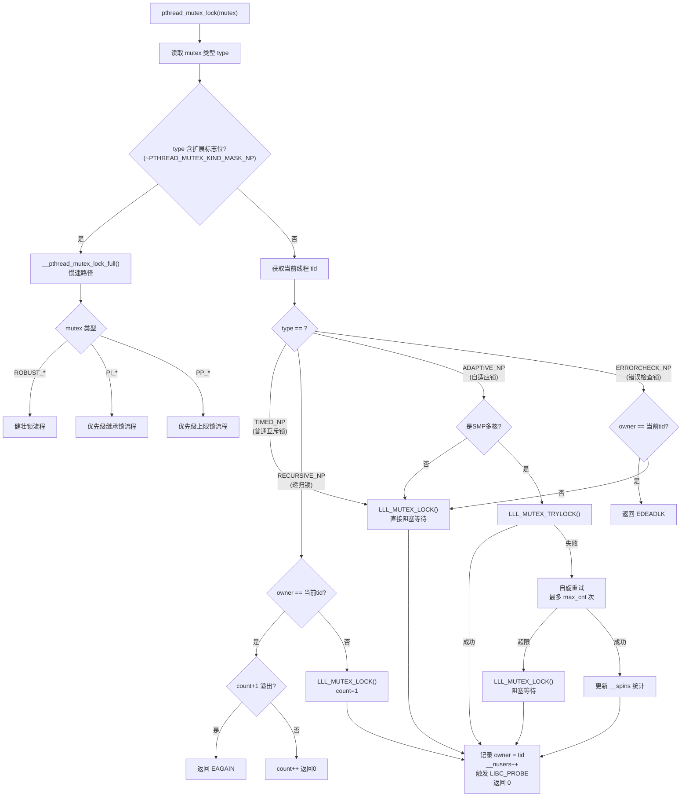

[任务规划完成]
我来读取 `pthread_mutex_lock.c` 的完整内容，详细分析上锁流程。
[读取文件]
## `__pthread_mutex_lock` 上锁流程详解

整个上锁逻辑分为**快速路径**（`__pthread_mutex_lock`）和**慢速路径**（`__pthread_mutex_lock_full`）两层。

---

### 总体流程图



---

### 一、快速路径：`__pthread_mutex_lock`

#### 第1步：类型检测与分流

```c
unsigned int type = PTHREAD_MUTEX_TYPE (mutex);
if (__builtin_expect (type & ~PTHREAD_MUTEX_KIND_MASK_NP, 0))
    return __pthread_mutex_lock_full (mutex);
```

- 读取 mutex 的 `__kind` 字段获取类型
- 若类型含有 **Robust / PI / PP** 等扩展标志位，进入慢速路径 `__pthread_mutex_lock_full`
- 普通类型（TIMED / RECURSIVE / ADAPTIVE / ERRORCHECK）在快速路径处理

---

#### 第2步：按类型分支处理

| 类型 | 常量 | 处理策略 |
|------|------|----------|
| 普通锁 | `PTHREAD_MUTEX_TIMED_NP` | 直接调用 `LLL_MUTEX_LOCK` 阻塞 |
| 递归锁 | `PTHREAD_MUTEX_RECURSIVE_NP` | 检查是否重入，是则 `count++`，否则加锁 |
| 自适应锁 | `PTHREAD_MUTEX_ADAPTIVE_NP` | SMP下先自旋，超限再阻塞 |
| 错误检查锁 | `PTHREAD_MUTEX_ERRORCHECK_NP` | 检测死锁（重入返回 `EDEADLK`） |

**① 普通锁（TIMED_NP）**
```c
LLL_MUTEX_LOCK(mutex);  // 展开为 lll_lock，底层是 futex 系统调用
```
直接阻塞，无任何额外检查。

**② 递归锁（RECURSIVE_NP）**
```c
if (mutex->__data.__owner == id) {
    if (mutex->__data.__count + 1 == 0) return EAGAIN; // 计数溢出
    ++mutex->__data.__count;
    return 0;  // 重入成功
}
LLL_MUTEX_LOCK(mutex);
mutex->__data.__count = 1;
```
同一线程可多次加锁，通过 `__count` 计数，解锁时需对应次数的 unlock。

**③ 自适应锁（ADAPTIVE_NP）**
```c
if (LLL_MUTEX_TRYLOCK(mutex) != 0) {
    int max_cnt = MIN(MAX_ADAPTIVE_COUNT, mutex->__data.__spins * 2 + 10);
    do {
        if (cnt++ >= max_cnt) { LLL_MUTEX_LOCK(mutex); break; }
        BUSY_WAIT_NOP;  // CPU 空转（pause 指令）
    } while (LLL_MUTEX_TRYLOCK(mutex) != 0);
    mutex->__data.__spins += (cnt - mutex->__data.__spins) / 8; // 动态调整
}
```
- 先尝试 `trylock`，失败后在 SMP 上**自旋等待**
- 自旋上限 `max_cnt` 根据历史 `__spins` 动态调整（指数加权平均）
- 超过上限才陷入内核阻塞，减少不必要的上下文切换

**④ 错误检查锁（ERRORCHECK_NP）**
```c
if (mutex->__data.__owner == id) return EDEADLK; // 检测死锁
goto simple;  // 否则走普通锁流程
```

---

#### 第3步：记录所有权

```c
mutex->__data.__owner = id;   // 记录持有者 tid
++mutex->__data.__nusers;     // 使用计数+1
LIBC_PROBE(mutex_acquired, 1, mutex); // SystemTap 探针（性能追踪）
return 0;
```

---

### 二、慢速路径：`__pthread_mutex_lock_full`

处理三类高级 mutex：

#### ① Robust 健壮锁（`PTHREAD_MUTEX_ROBUST_*`）

```
目的：持有锁的线程崩溃后，其他线程能检测到并恢复
```

关键流程：
1. 将 mutex 地址写入线程的 `robust_head.list_op_pending`（崩溃恢复链表）
2. 检查 `FUTEX_OWNER_DIED` 标志位 → 若前任持有者已死，用 **CAS** 原子抢锁
3. 抢到后设置 `__owner = PTHREAD_MUTEX_INCONSISTENT`，返回 `EOWNERDEAD`（通知调用者数据可能不一致）
4. 检查 `PTHREAD_MUTEX_NOTRECOVERABLE` → 若不可恢复，返回 `ENOTRECOVERABLE`
5. 正常加锁后调用 `ENQUEUE_MUTEX` 将 mutex 加入线程的 robust 链表

#### ② PI 优先级继承锁（`PTHREAD_MUTEX_PI_*`）

```
目的：解决优先级反转问题，低优先级持锁时临时提升其优先级
```

关键流程：
1. 用 **CAS** 尝试将 `__lock` 从 0 改为当前 tid
2. 失败（锁被占用）→ 调用 `futex(FUTEX_LOCK_PI)` 系统调用，**由内核负责优先级继承**
3. 内核会将持锁线程的优先级提升到等待者中的最高优先级
4. 处理 `FUTEX_OWNER_DIED` 场景（同 Robust 逻辑）

#### ③ PP 优先级上限锁（`PTHREAD_MUTEX_PP_*`）

```
目的：防止优先级反转，规定持锁线程的优先级上限
```

关键流程：
1. 读取 mutex 中存储的 `ceiling`（优先级上限值）
2. 若当前线程优先级 > ceiling → 返回 `EINVAL`
3. 调用 `__pthread_tpp_change_priority` 将当前线程优先级提升到 ceiling
4. 用 **CAS + futex_wait** 循环竞争锁

---

### 三、底层锁原语：`lll_lock` / futex

```
LLL_MUTEX_LOCK(mutex)
    └── lll_lock(&mutex->__data.__lock, pshared)
            └── 原子 CAS：0 → 1（无竞争，用户态完成）
                失败 → futex(FUTEX_WAIT) 陷入内核等待
```

- **无竞争**：纯用户态原子操作，无系统调用开销
- **有竞争**：调用 `futex(FUTEX_WAIT)` 让线程睡眠，由内核在锁释放时唤醒