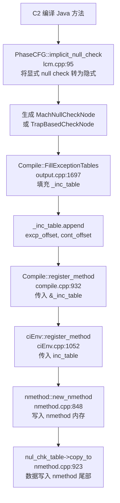

## `_nul_chk_table_offset` 在 C2 编译时会生成对应数据吗？

**会的**，C2 编译时会生成对应的数据，但**不是必然有内容**——只有当方法中存在"隐式空指针检查"（implicit null check）时，表才会有实际条目。

---

### 整体流程



---

### 关键代码路径

#### 1. C2 生成隐式空指针检查节点（`lcm.cpp`）

```cpp
// lcm.cpp:438
MachNode *nul_chk = new (C) MachNullCheckNode(old_tst->in(0), best, bidx);
```

`PhaseCFG::implicit_null_check()` 会把显式的 null 判断 + 跳转，优化为一个 `MachNullCheckNode`，让内存访问指令本身触发 SIGSEGV 来代替显式检查。

#### 2. 填充 `_inc_table`（`output.cpp:1697`）

```cpp
void Compile::FillExceptionTables(...) {
    _inc_table.set_size(cnt);
    ...
    // Handle implicit null exception table updates
    if (n->is_MachNullCheck()) {
        uint block_num = block->non_connector_successor(0)->_pre_order;
        _inc_table.append(inct_starts[inct_cnt++], blk_labels[block_num].loc_pos());
        continue;
    }
    // Handle implicit exception table updates: trap instructions.
    if (n->is_Mach() && n->as_Mach()->is_TrapBasedCheckNode()) {
        uint block_num = block->non_connector_successor(0)->_pre_order;
        _inc_table.append(inct_starts[inct_cnt++], blk_labels[block_num].loc_pos());
        continue;
    }
}
```

每个 `MachNullCheck` 节点都会向 `_inc_table` 追加一条记录：`<触发异常的指令PC偏移, 异常处理继续执行的PC偏移>`。

#### 3. 传递给 `nmethod`（`compile.cpp:932`）

```cpp
env()->register_method(..., &_handler_table, &_inc_table, ...);
```

#### 4. 写入 nmethod 内存（`nmethod.cpp:898, 923`）

```cpp
_nul_chk_table_offset = _handler_table_offset + round_to(handler_table->size_in_bytes(), oopSize);
_nmethod_end_offset   = _nul_chk_table_offset + round_to(nul_chk_table->size_in_bytes(), oopSize);
...
nul_chk_table->copy_to(this);  // 数据写入 nmethod 尾部
```

---

### 表的格式（`exceptionHandlerTable.hpp`）

```
// 零长度时不占空间（size_in_bytes() == 0）
// 非零时：[length] [excp_offset0, cont_offset0] [excp_offset1, cont_offset1] ...
int size_in_bytes() const {
    return len() == 0 ? 0 : ((2 * len() + 1) * sizeof(implicit_null_entry));
}
```

---

### 运行时使用（`nmethod.cpp:2606`）

当 JVM 捕获到 SIGSEGV 信号时，通过 `continuation_for_implicit_exception()` 查表：

```cpp
address nmethod::continuation_for_implicit_exception(address pc) {
    int exception_offset = pc - code_begin();
    int cont_offset = ImplicitExceptionTable(this).at(exception_offset);
    // 找到则跳转到 NullPointerException 处理代码
    return code_begin() + cont_offset;
}
```

---

### 总结

| 情况 | `_nul_chk_table_offset` 是否有数据 |
|------|--------------------------------------|
| 方法中有可被优化为隐式 null check 的访问 | ✅ 有，表中有若干 `<excp_pc, cont_pc>` 条目 |
| 方法中没有 null check，或 `ImplicitNullChecks=false` | ✅ 字段存在，但 `size_in_bytes()==0`，不占额外空间 |

`_nul_chk_table_offset` 字段**始终存在**于 nmethod 结构中，但只有当 C2 成功将 null check 转换为隐式检查时，对应的表才会有实际内容。