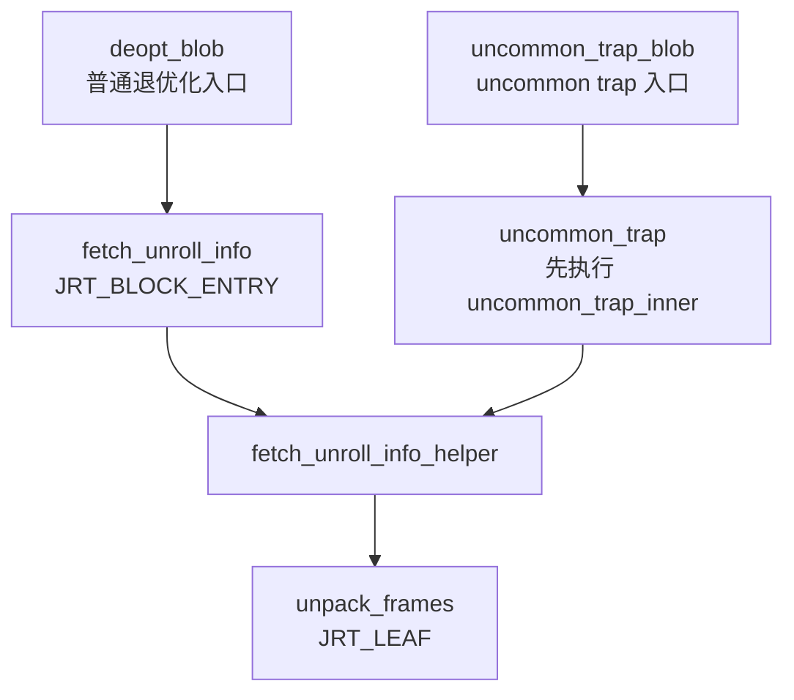
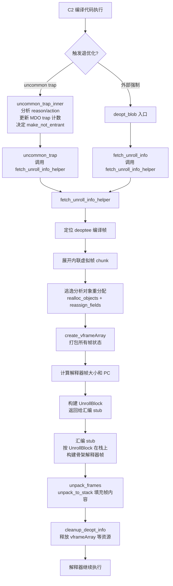

## 退优化（Deoptimization）代码逻辑解析

退优化的核心目标是：**将一个正在执行的 C2 编译帧（可能含内联帧）"拆解"成若干个解释器帧，然后继续在解释器中执行**。整个过程分为两条入口路径，但共享同一套核心机制。

---

### 一、两条入口路径



| 入口 | 触发场景 | 函数 |
|------|---------|------|
| `deopt_blob` | 外部强制退优化（如类重定义、依赖失效） | `fetch_unroll_info()` |
| `uncommon_trap_blob` | C2 编译代码中的 uncommon trap 触发 | `uncommon_trap()` → `uncommon_trap_inner()` |

---

### 二、`uncommon_trap_inner`：决策阶段

这是 uncommon trap 路径独有的阶段，负责**分析原因、更新 MDO、决定后续动作**。

#### 1. 解析 trap_request

```cpp
// deoptimization.cpp:1349
DeoptReason reason = trap_request_reason(trap_request);
DeoptAction action = trap_request_action(trap_request);
jint unloaded_class_index = trap_request_index(trap_request);
```

`trap_request` 是一个编码整数，包含三个字段：
- **reason**：为什么退优化（如 `Reason_null_check`、`Reason_class_check`）
- **action**：建议采取什么动作
- **index**：相关常量池索引（用于类加载）

#### 2. 更新 MDO（MethodData）

```cpp
// deoptimization.cpp:1368
MethodData* trap_mdo = get_method_data(thread, trap_method, create_if_missing);
// ...
pdata = query_update_method_data(trap_mdo, trap_bci, reason, nm->method(), ...);
```

`query_update_method_data` 做两件事：
- 递增该 BCI 处的 trap 计数器（`inc_trap_count`）
- 在 `pdata->trap_state` 中记录 reason 位和 recompile 位

#### 3. Action 决策状态机

```cpp
// deoptimization.cpp:1505
bool make_not_entrant = false;
bool make_not_compilable = false;
bool reprofile = false;

switch (action) {
case Action_none:
    update_trap_state = false;          // 保留旧代码，不做任何事
    break;
case Action_maybe_recompile:
    break;                              // 允许旧代码继续跑，后台触发重编译
case Action_reinterpret:
    make_not_entrant = true;            // 废弃当前编译代码
    reprofile = true;                   // 重置调用计数，让解释器多跑一会儿
    break;
case Action_make_not_entrant:
    make_not_entrant = true;            // 立即废弃，触发重编译
    break;
case Action_make_not_compilable:
    make_not_entrant = true;
    make_not_compilable = true;         // 永久放弃编译此方法
    break;
}
```

#### 4. 防止无限重编译的三道防线

```cpp
// 防线1：同一 BCI 触发次数超过 PerBytecodeTrapLimit → 强制 make_not_entrant
if (maybe_prior_trap && this_trap_count >= (uint)PerBytecodeTrapLimit) {
    make_not_entrant = true;
}

// 防线2：同一 BCI 多次重编译 → 增加 overflow_recompile_count
if (make_not_entrant && maybe_prior_recompile) {
    inc_recompile_count = maybe_prior_trap;
}

// 防线3：overflow_recompile_count 超过 PerBytecodeRecompilationCutoff → 永久放弃
if ((uint)trap_mdo->overflow_recompile_count() > (uint)PerBytecodeRecompilationCutoff) {
    make_not_compilable = true;
}
```

#### 5. 执行 make_not_entrant

```cpp
// deoptimization.cpp:1637
if (make_not_entrant) {
    if (!nm->make_not_entrant()) {
        return; // nmethod 状态未改变，直接返回
    }
    // 在 pdata 中记录 recompile 位
    pdata->set_trap_state(trap_state_set_recompiled(tstate0, true));
}
```

`make_not_entrant()` 会将 nmethod 入口处的指令 patch 成跳转到 `deopt_blob`，使得下次调用该方法时自动触发退优化。

---

### 三、`fetch_unroll_info_helper`：核心打包阶段

两条路径在此汇合，负责**将编译帧的状态打包成 vframeArray**。

#### 1. 定位被退优化的帧

```cpp
// deoptimization.cpp:185
frame stub_frame = thread->last_frame();   // deopt_blob / uncommon_trap_blob 的帧
RegisterMap map(thread, true);
frame deoptee = stub_frame.sender(&map);   // 被退优化的编译帧
thread->set_deopt_nmethod(deoptee.cb()->as_nmethod_or_null());
```

#### 2. 展开内联虚拟帧

```cpp
// deoptimization.cpp:200
GrowableArray<compiledVFrame*>* chunk = new GrowableArray<compiledVFrame*>(10);
vframe* vf = vframe::new_vframe(&deoptee, &map, thread);
while (!vf->is_top()) {
    chunk->push(compiledVFrame::cast(vf));
    vf = vf->sender();
}
chunk->push(compiledVFrame::cast(vf));
```

一个编译帧可能对应多个内联的 Java 方法，`chunk` 中从 index 0（最内层）到 index N（最外层）依次存放所有虚拟帧。

#### 3. 逃逸分析对象重分配（C2 专属）

```cpp
// deoptimization.cpp:220
if (EliminateAllocations) {
    GrowableArray<ScopeValue*>* objects = chunk->at(0)->scope()->objects();
    realloc_failures = realloc_objects(thread, &deoptee, objects, THREAD);
    reassign_fields(&deoptee, &map, objects, realloc_failures);
}
if (EliminateLocks) {
    relock_objects(monitors, thread, realloc_failures);
}
```

被标量替换（scalar replaced）的对象需要在堆上重新分配，并恢复字段值。

#### 4. 创建 vframeArray

```cpp
// deoptimization.cpp:302
vframeArray* array = create_vframeArray(thread, deoptee, &map, chunk, realloc_failures);
thread->set_vframe_array_head(array);
```

`vframeArray` 是一个 C 堆对象，保存了每个虚拟帧的完整状态（局部变量、操作数栈、BCI、锁信息等）。

#### 5. 计算解释器帧大小和 PC

```cpp
// deoptimization.cpp:375
intptr_t* frame_sizes = NEW_C_HEAP_ARRAY(intptr_t, number_of_frames, mtCompiler);
address*  frame_pcs   = NEW_C_HEAP_ARRAY(address, number_of_frames + 1, mtCompiler);

// 最后一个 PC 是解释器的 deopt_entry
frame_pcs[number_of_frames] = Interpreter::deopt_entry(vtos, 0);

for (int index = 0; index < array->frames(); index++) {
    // 从最外层到最内层计算每个解释器帧的大小
    frame_sizes[number_of_frames - 1 - index] = BytesPerWord *
        array->element(index)->on_stack_size(callee_parameters, callee_locals, ...);
    // 临时 PC，后续 unpack_to_stack 会填入正确值
    frame_pcs[number_of_frames - 1 - index] = Interpreter::deopt_entry(vtos, 0) - frame::pc_return_offset;
}

// frame_pcs[0] 是调用者的真实 PC（deoptee 的 caller）
frame_pcs[0] = deopt_sender.raw_pc();
```

#### 6. 构建 UnrollBlock

```cpp
// deoptimization.cpp:480
UnrollBlock* info = new UnrollBlock(
    array->frame_size() * BytesPerWord,   // 被退优化帧的大小
    caller_adjustment * BytesPerWord,      // 调用者栈帧需要的调整量
    callee_parameters,                     // 最外层方法的参数个数
    number_of_frames,                      // 需要展开的帧数
    frame_sizes,                           // 每个解释器帧的大小
    frame_pcs,                             // 每个解释器帧的返回 PC
    return_type                            // 返回值类型
);
array->set_unroll_block(info);
return info;
```

`UnrollBlock` 是传递给汇编 stub 的"施工图纸"，告诉 stub 如何在栈上构建解释器帧。

---

### 四、`unpack_frames`：解包阶段（汇编 stub 调用）

```cpp
// deoptimization.cpp:566
JRT_LEAF(BasicType, Deoptimization::unpack_frames(JavaThread* thread, int exec_mode))
    vframeArray* array = thread->vframe_array_head();
    UnrollBlock* info = array->unroll_block();

    // 核心：将 vframeArray 中的状态写入已经由汇编 stub 分配好的骨架帧
    array->unpack_to_stack(stub_frame, exec_mode, info->caller_actual_parameters());

    BasicType bt = info->return_type();
    if (exec_mode == Unpack_exception)
        bt = T_OBJECT;  // 异常模式下保留 exception_oop

    cleanup_deopt_info(thread, array);  // 清理 deopt 相关数据结构
    return bt;
JRT_END
```

`exec_mode` 有四种：

| exec_mode | 含义 |
|-----------|------|
| `Unpack_deopt` | 普通退优化，从当前 BCI 继续执行 |
| `Unpack_exception` | 异常处理退优化 |
| `Unpack_uncommon_trap` | uncommon trap 触发，重新执行当前字节码 |
| `Unpack_reexecute` | 重新执行（如 JVMTI PopFrame） |

---

### 五、完整流程总览



---

### 六、关键数据结构关系

```
JavaThread
  ├── vframe_array_head → vframeArray (C堆)
  │     ├── element[0] (最内层 vframe，含局部变量表、操作数栈、BCI、锁)
  │     ├── element[1]
  │     └── element[N] (最外层 vframe)
  │     └── unroll_block → UnrollBlock
  │           ├── frame_sizes[]  (每个解释器帧的字节大小)
  │           ├── frame_pcs[]    (每个解释器帧的返回 PC)
  │           ├── number_of_frames
  │           └── caller_adjustment (调用者栈帧调整量)
  └── deopt_nmethod → 被退优化的 nmethod
```