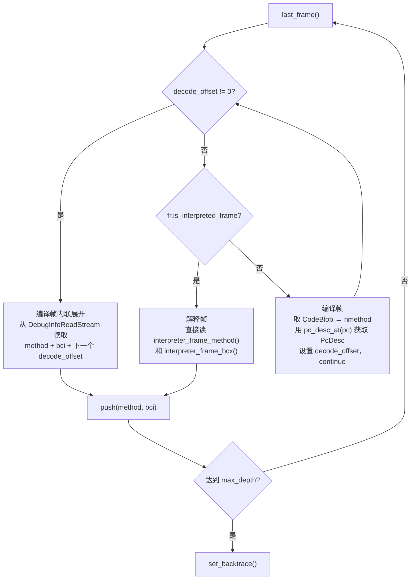

## 异常堆栈的生成逻辑

### 一、整体入口

`fill_in_stack_trace` 有两个重载版本：

```
// 外层：做前置检查，调用内层
fill_in_stack_trace(Handle throwable, methodHandle method)
    ↓
// 内层：真正的实现
fill_in_stack_trace(Handle throwable, methodHandle method, TRAPS)
```

外层负责：
- 检查 `StackTraceInThrowable` 开关
- 检查 `Universe::should_fill_in_stack_trace`（OOM 预分配对象跳过）
- 捕获并忽略填充过程中产生的异常（`CLEAR_PENDING_EXCEPTION`）

---

### 二、BacktraceBuilder —— 堆栈数据的存储结构

堆栈数据以**链式 chunk** 的形式存储在 Java 堆上，每个 chunk 是一个 `objArray`：

```
chunk (objArrayOop, size=5)
  [0] methods  → typeArrayOop (short[])   方法 ID (orig_method_idnum)
  [1] bcis     → typeArrayOop (int[])     bci | version 合并值
  [2] mirrors  → objArrayOop              类的 java.lang.Class 镜像（防止类被卸载）
  [3] cprefs   → typeArrayOop (short[])   方法名在常量池中的索引（防止重定义后名字丢失）
  [4] next     → objArrayOop              下一个 chunk（链表指针）
```

每个 chunk 默认容纳 `trace_chunk_size`（32）帧，满了后调用 `expand()` 分配新 chunk 并链接。

**`push()` 的存储逻辑**：

```cpp
_methods->ushort_at_put(_index, method->orig_method_idnum());
_bcis->int_at_put(_index, merge_bci_and_version(bci, method->constants()->version()));
_cprefs->ushort_at_put(_index, method->name_index());
_mirrors->obj_at_put(_index, method->method_holder()->java_mirror());
```

`bci` 和 `version` 被合并进同一个 `int`（高16位=bci，低16位=version），用于后续判断方法是否被重定义。

---

### 三、帧遍历的核心逻辑

遍历从 `thread->last_frame()` 开始，向调用者方向逐帧推进，分三种情况处理：



**内联方法的展开**是关键设计：一个编译帧可能对应多个内联方法，通过 `PcDesc::scope_decode_offset()` 找到 `DebugInfoReadStream`，然后循环读取每一层内联的 `method + bci`，直到 `decode_offset == 0` 为止，才推进到下一个物理帧。

---

### 四、帧过滤逻辑

遍历过程中会跳过以下帧（按顺序检查）：

```
1. fillInStackTrace / fillInStackTrace0 方法帧
       ↓ 全部跳过（skip_fillInStackTrace_check）
2. 异常类及其父类的 <init> 构造方法帧
       ↓ 全部跳过（skip_throwableInit_check）
3. 隐藏帧（method->is_hidden()）
       ↓ 若 !ShowHiddenFrames 则跳过
4. 正常帧 → push 进 BacktraceBuilder
```

这保证了用户看到的堆栈从**真正抛出异常的业务代码**开始，而不是从 `Throwable.<init>` 开始。

---

### 五、预分配异常的特殊路径

对于 OOM 等预分配异常（`fill_in_stack_trace_of_preallocated_backtrace`），使用 `vframeStream` 而非手动帧遍历，且**不跳过** `fillInStackTrace` 和 `<init>` 帧，因为预分配异常不是由 Java 代码创建的。

---

### 六、堆栈的打印（`print_stack_element_to_buffer`）

读取时从 chunk 链表中还原每一帧，格式化为：

```
at com.example.Foo.bar(Foo.java:42)
at com.example.Foo.bar(Native Method)
at com.example.Foo.bar(Redefined)
at com.example.Foo.bar(Unknown Source)
```

通过 `method->line_number_from_bci(bci)` 将 bci 转换为源码行号，通过 `holder->get_klass_version(version)` 处理类重定义场景。