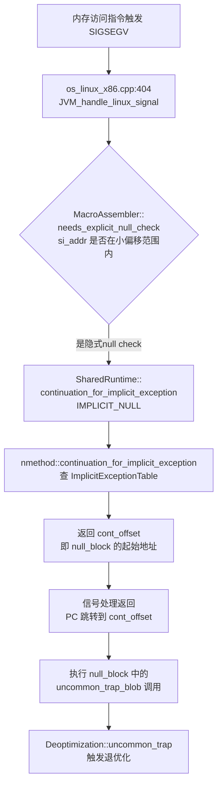

## 隐式空指针检查触发 SIGSEGV 后，C2 编译的代码会退优化吗？

**不会直接退优化（deoptimize）**，但会触发一次 **uncommon trap（非常规陷阱）**，最终导致重新编译，而重新编译时会禁止该优化。整个过程分两个阶段：

---

### 阶段一：SIGSEGV 信号处理 → 跳转到 uncommon trap



---

### 关键证据：`null_block` 里是 uncommon trap，不是 deopt

在 `lcm.cpp:95` 的 `implicit_null_check()` 中，C2 **只有在 null_block 里找到 uncommon trap 时才会做这个优化**：

```cpp
// lcm.cpp:127 - 必须找到 uncommon trap 才能做隐式 null check 优化
bool found_trap = false;
for (uint i1 = 0; i1 < null_block->number_of_nodes(); i1++) {
    Node* nn = null_block->get_node(i1);
    if (nn->is_MachCall() &&
        nn->as_MachCall()->entry_point() == SharedRuntime::uncommon_trap_blob()->entry_point()) {
        // ...
        if (is_set_nth_bit(allowed_reasons, (int) reason)
            && action != Deoptimization::Action_none) {
            found_trap = true;  // 必须有 uncommon trap 才继续
        }
    }
}
if (!found_trap) {
    return;  // 没有 uncommon trap，放弃优化
}
```

`FillExceptionTables` 中记录的 `cont_offset` 就是这个 `null_block` 的起始地址：

```cpp
// output.cpp:1769
if (n->is_MachNullCheck()) {
    uint block_num = block->non_connector_successor(0)->_pre_order;
    // ↑ successor(0) 就是 null_block（含 uncommon_trap_blob 调用）
    _inc_table.append(inct_starts[inct_cnt++], blk_labels[block_num].loc_pos());
}
```

---

### 阶段二：uncommon trap 触发退优化 + 防止再次优化

| 步骤 | 发生了什么 |
|------|-----------|
| 1 | SIGSEGV → 跳转到 `null_block` |
| 2 | `null_block` 调用 `uncommon_trap_blob` |
| 3 | `Deoptimization::uncommon_trap()` 执行，**当前栈帧退优化**，回到解释器执行 |
| 4 | `C->too_many_traps()` 计数器递增 |
| 5 | 下次重新 C2 编译时，`too_many_traps` 为 true，`implicit_null_check()` 不再做此优化 |
| 6 | 重新编译的代码保留**显式 null check**（`if (ptr == null) throw NPE`） |

---

### 总结

> **隐式空指针检查触发 SIGSEGV 后，不会立即让整个 nmethod 退优化，而是：**
> 1. 信号处理器通过 `ImplicitExceptionTable` 查表，将 PC 跳转到 `null_block`
> 2. `null_block` 中预置的 `uncommon_trap` 调用触发**当前帧的退优化**，回到解释器
> 3. 多次触发后，`too_many_traps` 阻止下次编译再做此优化，改用显式 null check

这是一种"乐观优化 + 失败回退"的典型 JIT 策略：**正常路径零开销，异常路径付出退优化代价**。