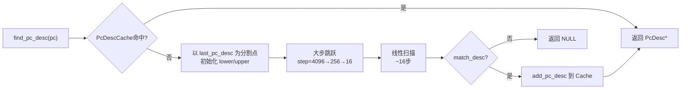

## PcDesc 详解

### 一、核心定位

`PcDesc`（PC Descriptor）是 JIT 编译后的 nmethod 中的一张**映射表条目**，它将一个**物理 PC 地址**（机器码偏移量）映射到对应的**调试信息入口**（scope 解码偏移量）。

```
物理 PC 地址  ──→  PcDesc  ──→  ScopeDesc（方法 + bci + 局部变量 + ...）
```

没有 PcDesc，JVM 就无法在编译帧中还原 Java 层的调用栈、局部变量、异常处理等信息。

---

### 二、数据结构

```cpp
class PcDesc VALUE_OBJ_CLASS_SPEC {
  int _pc_offset;           // 相对于 nmethod code_begin() 的字节偏移
  int _scope_decode_offset; // 指向 scopes_data 区域的解码偏移（ScopeDesc 入口）
  int _obj_decode_offset;   // 指向对象池（object pool）的解码偏移
  int _flags;               // 标志位
};
```

| 字段 | 含义 |
|------|------|
| `_pc_offset` | 机器码偏移，`real_pc = code_begin() + _pc_offset` |
| `_scope_decode_offset` | 指向 `scopes_data` 区的偏移，用于构造 `ScopeDesc` 链 |
| `_obj_decode_offset` | 指向对象池的偏移，用于还原 `ScopeValue` 中的对象引用 |
| `_flags` | 三个标志位（见下） |

**三个标志位**：

| 标志 | 含义 |
|------|------|
| `PCDESC_reexecute` | 异常恢复时需要**重新执行**该字节码（deopt 场景） |
| `PCDESC_is_method_handle_invoke` | 该 PC 点是 MethodHandle 调用点 |
| `PCDESC_return_oop` | 该 PC 点的返回值是 oop（GC 需要知道） |

---

### 三、PcDesc 在 nmethod 中的布局

nmethod 的内存布局中，所有 PcDesc 连续排列在 `scopes_pcs` 区域，**按 `_pc_offset` 升序排列**：

```
nmethod 内存布局：
┌─────────────────────┐
│  header             │
├─────────────────────┤
│  relocation info    │
├─────────────────────┤
│  code body          │  ← code_begin()
├─────────────────────┤
│  scopes_data        │  ← ScopeDesc 的序列化数据（被 scope_decode_offset 索引）
├─────────────────────┤
│  scopes_pcs         │  ← PcDesc[] 数组（按 pc_offset 升序）
│  [PcDesc0]          │    sentinel: pc_offset = lower_offset_limit
│  [PcDesc1]          │
│  ...                │
│  [PcDescN]          │    sentinel: pc_offset = upper_offset_limit
├─────────────────────┤
│  dependencies       │
└─────────────────────┘
```

---

### 四、PcDesc → ScopeDesc 的链式结构

一个 PcDesc 通过 `scope_decode_offset` 指向 `ScopeDesc` 链的头部，链中每个节点代表一层内联方法：

```
PcDesc
  └─ scope_decode_offset
        ↓
     ScopeDesc[0]  (最内层内联方法, e.g. String.charAt)
       method = String.charAt, bci = 5
       _sender_decode_offset ──→
     ScopeDesc[1]  (外层方法, e.g. Foo.bar)
       method = Foo.bar, bci = 42
       _sender_decode_offset ──→
     ScopeDesc[2]  (最外层, is_top() == true)
       method = Main.main, bci = 10
       _sender_decode_offset = serialized_null
```

这就是为什么一个编译帧能展开出多个内联方法的堆栈帧。

---

### 五、查找算法（`find_pc_desc_internal`）

查找给定 PC 对应的 PcDesc 使用**三级加速搜索**：

```
1. 先查 PcDescCache（4个槽的热点缓存）
        ↓ miss
2. 准二分搜索（radix=16，步长 4096 → 256 → 16）
        ↓
3. 线性扫描（最后 ~16 个元素）
        ↓
4. match_desc() 精确/近似匹配
        ↓
5. 命中则写入 PcDescCache
```



**`approximate` 参数**：
- `false`（`pc_desc_at`）：精确匹配，`pc_offset` 必须完全相等
- `true`（`pc_desc_near`）：近似匹配，返回 `>= pc_offset` 的第一个 PcDesc，用于异常处理表查找

---

### 六、PcDescCache

```cpp
class PcDescCache {
  enum { cache_size = 4 };
  volatile PcDescPtr _pc_descs[cache_size]; // 环形缓存，[0] 是最近命中的
};
```

- 大小仅 **4 个槽**，但命中率接近 100%（因为 JVM 执行时 PC 局部性极强）
- 元素必须是 `volatile`，因为多线程可能并发读写（如 GC 线程和编译线程）
- `_pc_descs[0]` 始终是最近一次命中的 PcDesc，也作为二分搜索的初始分割点

---

### 七、使用场景总结

| 场景 | 使用方式 |
|------|---------|
| 异常堆栈填充 | `fill_in_stack_trace` 中通过 `pc_desc_at(pc)` 获取 PcDesc，再读 `scope_decode_offset` 展开内联帧 |
| Deoptimization | 通过 PcDesc 的 `should_reexecute` 标志决定是否重新执行字节码 |
| GC 根扫描 | 通过 `obj_decode_offset` 找到当前 PC 点的所有 oop 引用 |
| 调试器/JVMTI | 通过 ScopeDesc 链还原局部变量、表达式栈的值 |
| 异常处理表查找 | `pc_desc_near` 找到最近的 PcDesc，定位 handler |