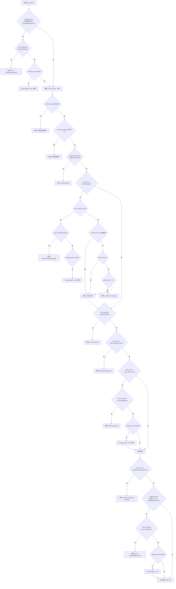

## `try_to_inline` 函数逻辑解析

函数位于 [bytecodeInfo.cpp](/Users/liyang/IdeaProjects/jdk8u/hotspot/src/share/vm/opto/bytecodeInfo.cpp)，第 315 行，是 JIT 编译器（C2）内联决策的核心函数，**返回 `true` 表示允许内联，`false` 表示拒绝内联**。

---

### 函数签名

```cpp
bool InlineTree::try_to_inline(ciMethod* callee_method, ciMethod* caller_method,
                               int caller_bci, JVMState* jvms, ciCallProfile& profile,
                               WarmCallInfo* wci_result, bool& should_delay)
```

| 参数 | 含义 |
|------|------|
| `callee_method` | 被调用方（待内联的方法） |
| `caller_method` | 调用方 |
| `caller_bci` | 调用点的字节码索引 |
| `jvms` | JVM 状态（调用栈信息） |
| `profile` | 调用点的 profiling 数据 |
| `wci_result` | 热度信息（WarmCallInfo） |
| `should_delay` | 输出参数，是否延迟内联（增量内联） |

---

### 整体流程图



---

### 各检查阶段详解

#### **阶段 1：总字节码大小预检（ClipInlining）**

```cpp
if (ClipInlining && (int)count_inline_bcs() >= DesiredMethodLimit) {
```

- 检查当前已内联的总字节码数是否已达到 `DesiredMethodLimit`（默认 8000 字节）
- 若超限且不是强制内联，直接拒绝
- 若是强制内联（`force_inline`）且开启增量内联（`IncrementalInline`），则设置 `should_delay = true`，**延迟到增量内联阶段处理**

---

#### **阶段 2：正向过滤 `should_inline`**

```cpp
if (!should_inline(callee_method, caller_method, caller_bci, profile, wci_result)) {
    return false;
}
```

`should_inline` 的判断逻辑（正向，满足则内联）：
- `CompilerOracle` 强制内联 → 允许
- `@ForceInline` 注解 → 允许
- `ciReplay` 回放数据要求内联 → 允许
- 方法抛出异常次数多（`interpreter_throwout_count > InlineThrowCount`）且代码不太大 → 提高 profit，允许
- **调用频率高**（`freq >= InlineFrequencyRatio` 或 `count >= InlineFrequencyCount`）→ 使用更大的 `freq_inline_size` 阈值
- 非热点路径：若已有编译版本且大于 `InlineSmallCode/4` → 拒绝（"already compiled into a medium method"）
- 最终按 `code_size <= max_inline_size` 决定

---

#### **阶段 3：负向过滤 `should_not_inline`**

```cpp
if (should_not_inline(callee_method, caller_method, jvms, wci_result)) {
    return false;
}
```

`should_not_inline` 的判断逻辑（负向，满足则拒绝）：
- **正确性约束**（必须拒绝）：抽象方法、类未初始化、native 方法、`@DontInline` 注解、签名中有未加载类
- `CompilerOracle` 禁止内联 → 拒绝
- `ciReplay` 禁止内联 → 拒绝
- 已编译版本 > `InlineSmallCode` → 拒绝（"already compiled into a big method"）
- 被调用方是 `Throwable` 子类，但顶层方法不是 → 拒绝（避免内联异常代码）
- 代码 > `MaxTrivialSize` 时，检查执行频率：
    - 从未执行过 → 拒绝（"never executed"）
    - 执行次数 < `MinInliningThreshold` → 拒绝（"executed < MinInliningThreshold times"）

---

#### **阶段 4：accessor 方法快速通道**

```cpp
if (InlineAccessors && callee_method->is_accessor()) {
    set_msg("accessor");
    return true;
}
```

accessor（简单的 getter/setter）方法**跳过后续所有限制**，直接允许内联。

---

#### **阶段 5：非 trivial 方法的额外检查**

仅当 `code_size > MaxTrivialSize` 时执行：

1. **节点数超限检查**（`over_inlining_cutoff`）：编译图节点数过多时拒绝或延迟
2. **调用点可达性检查**：`profile.count() == 0` 表示该调用点从未被执行到，拒绝内联（"call site not reached"）
    - 例外：Xcomp/CTW 模式下的 EA 构造器、强制内联

#### 核心原因：`profile.count() == 0`

`profile` 是一个 `ciCallProfile` 对象，它来自**解释器收集的 profiling 数据**（Method Data Object，MDO）。`profile.count()` 表示**这个调用点（call site）在解释执行期间被执行的次数**。

`count() == 0` 意味着：**这个调用点在解释器中从未被执行过**。

常见的实际场景：

| 场景 | 说明 |
|------|------|
| **冷路径代码** | 调用点位于 `if` 分支内，但该分支在触发 JIT 编译前从未被走到 |
| **异常处理路径** | 调用点在 `catch` 块中，但异常从未发生 |
| **方法刚加载** | 方法刚被加载，MDO 数据还未积累 |
| **OSR 编译** | 从方法中间开始的 OSR 编译，某些调用点的 profile 数据不完整 |

#### 为什么 `MaxTrivialSize` 是前置条件？


对于**极小的方法**（默认 `MaxTrivialSize = 6` 字节，通常是简单的 getter/setter），JIT 直接内联，不需要 profile 数据支撑。只有**非 trivial 方法**才需要 profile 数据来判断是否值得内联。

#### 与 `never executed` 的区别

在 `should_not_inline` 中还有一个类似的消息：

```cpp
if (!callee_method->has_compiled_code() &&
    !callee_method->was_executed_more_than(0)) {
  set_msg("never executed");
  return true;
}
```

| 消息 | 检查对象 | 含义 |
|------|---------|------|
| `never executed` | **callee 方法本身**的执行次数 | 被调用方法从未被解释器执行过 |
| `call site not reached` | **调用点**的 profile 计数 | 这个具体的调用点从未被执行到（方法本身可能在其他地方被调用过） |

---

#### **阶段 6：内联深度检查**

```cpp
if (inline_level() > MaxForceInlineLevel) { ... }   // 绝对深度上限
if (inline_level() > _max_inline_level) { ... }     // 正常深度上限
```

- `MaxForceInlineLevel`：强制内联的绝对深度上限，超过直接拒绝
- `_max_inline_level`：正常内联深度上限，超过时若是强制内联则延迟，否则拒绝（"inlining too deep"）

---

#### **阶段 7：递归内联检测**

```cpp
if (inline_level > MaxRecursiveInlineLevel) {
    set_msg("recursive inlining is too deep");
    return false;
}
```

遍历整个 JVM 调用栈，统计 `callee_method` 出现的次数：
- 对于普通方法：直接计数
- 对于 **compiled lambda form**（方法句柄适配器）：只有当参数 0（receiver）相同时才算递归，允许不同 receiver 的重用

超过 `MaxRecursiveInlineLevel` 则拒绝。

---

#### **阶段 8：最终字节码大小检查**

```cpp
if (ClipInlining && (int)count_inline_bcs() + size >= DesiredMethodLimit) {
```

与阶段 1 类似，但这次加上了 callee 自身的 `size`，做最终的大小边界检查。

---

### 总结

`try_to_inline` 是一个**多层过滤器**，按以下优先级依次决策：

| 优先级 | 检查项 | 结果 |
|--------|--------|------|
| 1 | 总字节码预检 | 拒绝 / 延迟 |
| 2 | `should_inline` 正向过滤 | 拒绝 |
| 3 | `should_not_inline` 负向过滤 | 拒绝 |
| 4 | accessor 快速通道 | **允许** |
| 5 | 节点数超限 + 调用点可达性 | 拒绝 / 延迟 |
| 6 | `do_inlining` 全局开关 | 拒绝 |
| 7 | 内联深度限制 | 拒绝 / 延迟 |
| 8 | 递归深度检测 | 拒绝 |
| 9 | 最终字节码大小检查 | 拒绝 / 延迟 |
| 10 | 全部通过 | **允许内联** |

`should_delay = true` 是增量内联（`IncrementalInline`）机制的关键：当前编译轮次不内联，但标记为"稍后再试"，在后续增量编译阶段重新评估。