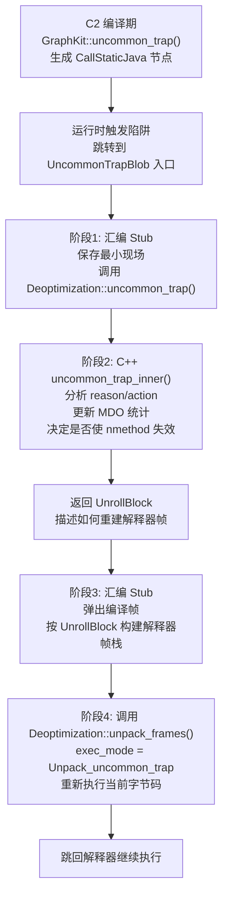

# UncommonTrapBlob 的实现原理

## 一、什么是 UncommonTrap（非常规陷阱）

`UncommonTrap` 是 **C2 编译器独有**的一种去优化机制。C2 在编译时会做出激进的假设（如：某个分支永远不会走、某个类型永远是 X），并在这些假设可能被违反的地方插入一个"陷阱"。一旦运行时真的走到了这个陷阱，就触发 `UncommonTrap`，将当前编译帧**回退到解释器重新执行**。

---

## 二、整体流程概览



---

## 三、阶段1：C2 编译期插入 trap 节点

在 C2 编译时，`GraphKit::uncommon_trap()` 在 IR 图中插入一个 `CallStaticJava` 节点，调用目标是 `UncommonTrapBlob` 的入口地址：

```cpp
// graphKit.cpp:2072
address call_addr = SharedRuntime::uncommon_trap_blob()->entry_point();
Node* call = make_runtime_call(RC_NO_LEAF | RC_UNCOMMON | ...,
                               OptoRuntime::uncommon_trap_Type(),
                               call_addr, "uncommon_trap", no_memory_effects,
                               intcon(trap_request));  // ← 编码了 reason + action
```

`trap_request` 是一个 32 位整数，编码了两个关键信息：

```
trap_request = ~((reason << 3) | action)
```

| 字段 | 位宽 | 含义 |
|------|------|------|
| `action` | 3 bits | 去优化后的动作（`Action_none/maybe_recompile/reinterpret/make_not_entrant/make_not_compilable`） |
| `reason` | 5 bits | 触发原因（`Reason_null_check/class_check/range_check/unloaded` 等 21 种） |

调用之后紧跟一个 `HaltNode`，表示这条路径**永远不会返回**（trap 后控制流转给解释器）。

---

## 四、阶段2：UncommonTrapBlob 汇编 Stub（x86_64）

`SharedRuntime::generate_uncommon_trap_blob()` 生成的汇编代码分为两段，中间夹着一次 C++ 调用：

### 第一段：建立最小栈帧，调用 C++ 运行时

```cpp
// sharedRuntime_x86_64.cpp:3610
// 1. 建立极简栈帧（只保存 rbp，不保存其他寄存器）
__ subptr(rsp, SimpleRuntimeFrame::return_off << LogBytesPerInt);
__ movptr(Address(rsp, SimpleRuntimeFrame::rbp_off << LogBytesPerInt), rbp);

// 2. C2 把 trap_request 放在 j_rarg0，转移到 c_rarg1
__ movl(c_rarg1, j_rarg0);

// 3. 设置 last_Java_frame（让 GC 和栈遍历能找到这里）
__ set_last_Java_frame(noreg, noreg, NULL);

// 4. 调用 Deoptimization::uncommon_trap(thread, trap_request)
__ mov(c_rarg0, r15_thread);
__ call(RuntimeAddress(CAST_FROM_FN_PTR(address, Deoptimization::uncommon_trap)));
// 返回值 rax = UnrollBlock*
```

**为什么只保存 rbp，不保存其他寄存器？**  
因为 `uncommon_trap` 是一个**不返回的路径**（trap 后不会回到编译代码），所以不需要恢复任何寄存器，只需要最小的栈帧让 GC 能正确扫描。

---

## 五、阶段3：C++ 层 `uncommon_trap_inner()` 的核心逻辑

```cpp
// deoptimization.cpp:1319
JRT_ENTRY(void, Deoptimization::uncommon_trap_inner(JavaThread* thread, jint trap_request)) {
    // 1. 从 trap_request 解码 reason 和 action
    DeoptReason reason = trap_request_reason(trap_request);
    DeoptAction action = trap_request_action(trap_request);

    // 2. 找到触发 trap 的编译帧（stub_frame 的 sender）
    frame fr = stub_frame.sender(&reg_map);
    nmethod* nm = cvf->code();

    // 3. 更新 MDO（方法数据对象）中的 trap 统计
    //    记录在哪个 BCI、什么原因触发了多少次 trap
    pdata = query_update_method_data(trap_mdo, trap_bci, reason, ...);

    // 4. 根据 action 决定如何处理 nmethod
    switch (action) {
    case Action_none:           // 不失效，继续用编译代码（但这次走解释器）
    case Action_maybe_recompile:// 不立即失效，但触发后台重编译
    case Action_reinterpret:    // 使 nmethod 失效 + 重置调用计数（让解释器热身）
        make_not_entrant = true;
        reprofile = true;
        break;
    case Action_make_not_entrant:   // 立即使 nmethod 失效，触发重编译
        make_not_entrant = true;
        break;
    case Action_make_not_compilable:// 永久放弃编译此方法
        make_not_entrant = true;
        make_not_compilable = true;
        break;
    }

    // 5. 如果 trap 次数超过 PerBytecodeTrapLimit，强制 make_not_entrant
    if (maybe_prior_trap && this_trap_count >= PerBytecodeTrapLimit)
        make_not_entrant = true;

    // 6. 执行 nmethod 失效
    if (make_not_entrant)
        nm->make_not_entrant();
}
```

`uncommon_trap()` 在调用 `uncommon_trap_inner()` 后，继续调用 `fetch_unroll_info_helper()` 返回 `UnrollBlock`：

```cpp
UnrollBlock* Deoptimization::uncommon_trap(JavaThread* thread, jint trap_request) {
    uncommon_trap_inner(thread, trap_request);   // 分析 + 使 nmethod 失效
    return fetch_unroll_info_helper(thread);     // 构建 UnrollBlock，描述如何重建解释器帧
}
```

---

## 六、阶段4：汇编 Stub 重建解释器帧栈

C++ 返回 `UnrollBlock*`（在 `rax`/`rdi`）后，汇编代码继续：

```cpp
// 1. 弹出 UncommonTrapBlob 自身的栈帧
__ addptr(rsp, (SimpleRuntimeFrame::framesize - 2) << LogBytesPerInt);

// 2. 弹出被去优化的编译帧
__ movl(rcx, Address(rdi, UnrollBlock::size_of_deoptimized_frame_offset_in_bytes()));
__ addptr(rsp, rcx);

// 3. 循环构建解释器帧（从 UnrollBlock 中读取 frame_sizes[] 和 frame_pcs[]）
Label loop;
__ bind(loop);
__ movptr(rbx, Address(rsi, 0));  // 读取帧大小
__ pushptr(Address(rcx, 0));      // 压入返回地址
__ enter();                        // 建立 rbp 链
__ subptr(rsp, rbx);              // 分配帧空间
__ decrementl(rdx);
__ jcc(Assembler::notZero, loop);

// 4. 重建自身帧，调用 unpack_frames()
__ mov(c_rarg1, Deoptimization::Unpack_uncommon_trap);  // exec_mode = 2
__ call(RuntimeAddress(CAST_FROM_FN_PTR(address, Deoptimization::unpack_frames)));
```

`unpack_frames()` 以 `exec_mode = Unpack_uncommon_trap`（值为 2）被调用，这意味着**重新执行当前字节码**（而不是从下一条字节码继续）。

---

## 七、与普通 Deoptimization 的关键区别

| 对比项 | 普通 Deoptimization | UncommonTrap |
|--------|---------------------|--------------|
| **触发方式** | 外部强制（如依赖失效、safepoint） | 编译代码主动跳转 |
| **使用编译器** | C1 + C2 | **仅 C2** |
| **exec_mode** | `Unpack_deopt`（0）= 继续执行 | `Unpack_uncommon_trap`（2）= **重新执行当前字节码** |
| **寄存器保存** | 保存所有寄存器（RegisterSaver） | 只保存 rbp（极简） |
| **nmethod 处理** | 由外部决定 | 由 `action` 字段决定是否失效 |
| **MDO 更新** | 不更新 trap 统计 | **更新 trap 计数，影响下次编译决策** |
| **目的** | 修正错误状态 | **自适应优化反馈循环** |

---

## 八、防止无限循环的保护机制

`uncommon_trap_inner` 内置了多层保护，防止"编译→trap→重编译→再trap"的无限循环：

```
1. PerBytecodeTrapLimit：同一 BCI 的 trap 次数超限 → 强制 make_not_entrant
2. PerMethodTrapLimit：同一方法的 trap 总次数超限 → 强制 make_not_entrant  
3. PerMethodRecompilationCutoff：重编译次数超限 → Action 降级为 Action_none
4. PerBytecodeRecompilationCutoff：同一 BCI 重编译超限 → make_not_compilable
```

这套机制保证了 JVM 的自适应优化是**收敛的**，不会因为激进优化假设失败而陷入死循环。