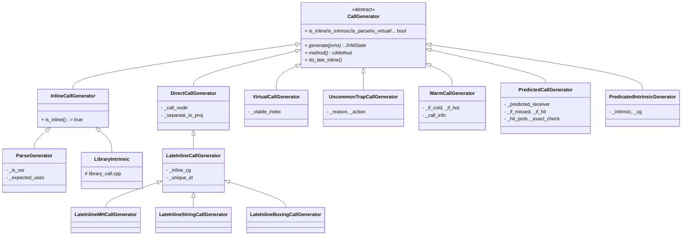
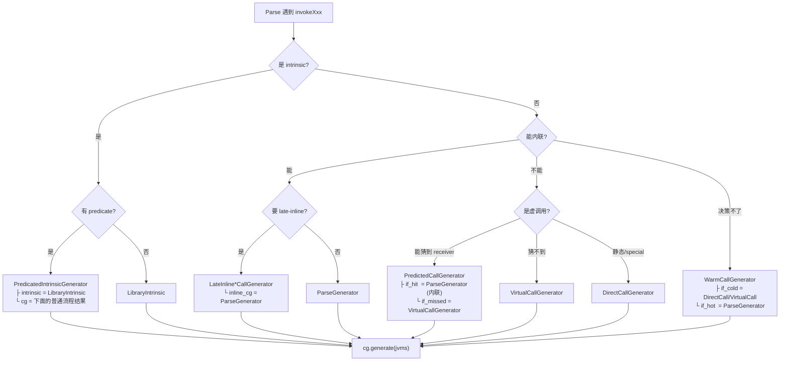

# CallGenerator 及其子类作用分析

## 一、基类 `CallGenerator` 的定位

`CallGenerator` 是 **C2 前端"调用点 IR 生成"的策略基类**（Strategy Pattern）。位置在 [callGenerator.hpp](/Users/liyang/workspace/jdk15/src/hotspot/share/opto/callGenerator.hpp) 第 38 行：

```cpp
// The subclasses of this class handle generation of ideal nodes for
// call sites and method entry points.
class CallGenerator : public ResourceObj {
```

一句话：**在 C2 解析字节码遇到 `invokeXxx` 时，Parser 不直接决定"内联还是不内联、生成 CallStatic 还是 CallDynamic"，而是先根据 profile / 内联策略挑一个合适的 `CallGenerator` 子类，然后调用它的 `generate(JVMState*)` 让子类往 Ideal Graph 里塞相应的节点（Call / 内联展开 / 类型 guard / uncommon_trap …）**。

---

## 二、`InlineCallGenerator` —— 内联族的抽象中间层

```cpp
class InlineCallGenerator : public CallGenerator {
    virtual bool is_inline() const { return true; }
};
```

它自己不做任何事，只是**给"会把 callee 代码复制到 caller graph 里"的 CG 一个统一父类**（`is_inline() == true`）。目前只有 `ParseGenerator` 直接继承它；`LibraryIntrinsic`（在 `library_call.cpp`）也继承它。

---

## 三、每个子类的作用（按功能分类）

### （1）基础生成器：一定会有节点产出

#### `ParseGenerator`（callGenerator.cpp:64）
**作用**：把 callee 的字节码**内联**到当前 caller graph——这是"真正的内联"。

- 内部直接 `new Parse(jvms, method, expected_uses)`，让 `Parse` 递归解析 callee 的字节码
- 有一个 `_is_osr` 字段：`true` 时表示这是 **OSR 编译的顶层 CG**（栈上替换，caller depth==1）
- `is_parse() == true`, `is_inline() == true`
- 通过 `CallGenerator::for_inline(m)` 或 `for_osr(m, bci)` 创建

#### `DirectCallGenerator`（callGenerator.cpp:115）
**作用**：生成一个**普通的静态/特殊/final 调用**——**不内联**，只产出 `CallStaticJavaNode`。

- 用于 `invokestatic`、`invokespecial`、以及去虚化后的 monomorphic virtual
- 内部：设置 resolve stub、必要时 null-check receiver、然后 `set_arguments_for_java_call / set_edges_for_java_call / set_results_for_java_call`
- `_separate_io_proj = true` 时会强制分离 memory/io 投影，为后续 late-inline 打基础

#### `VirtualCallGenerator`（callGenerator.cpp:177）
**作用**：生成**真正的虚调用/接口调用**——不内联，产出 `CallDynamicJavaNode`（带 IC stub、vtable_index）。

- 用于无法去虚化或没有猜准 receiver type 的 `invokevirtual / invokeinterface`
- `is_virtual() == true`
- 生成前会做 receiver null_check（除非 UseInlineCaches + implicit null-check 满足）

#### `UncommonTrapCallGenerator`（callGenerator.cpp:1183）
**作用**：**不生成任何真正的调用**，直接生成一个 `uncommon_trap` 强制回退到解释器。

- 用于编译器决定"这条路径不会走/不该在编译代码里出现"（如没有 profile 数据的分支、被完全去除的多态目标）
- `is_trap() == true`，不返回

---

### （2）"决定权 defer"型：把选择权留到后面

#### `WarmCallGenerator`（callGenerator.cpp:575）
**作用**：**延迟做内联决策**，先按 cold（不内联）方式生成 CallNode，同时把它挂到 `Compile::warm_calls` 队列上，等到 warm-call 二次决策时再看是否要 late-inline 成 hot 版本。

- 构造时传入 `if_cold`（通常是 DirectCall/VirtualCall）和 `if_hot`（通常是 ParseGenerator）
- `generate()` 里直接调 `_if_cold->generate()`，然后把生成的 CallNode 记到 `WarmCallInfo` 里
- `is_deferred() == true`
- 注意：`WarmCallInfo::make_hot()` 现在是 `Unimplemented()`，实际上 HotSpot 15 里 warm-call 路径已经**基本失活**，主流延迟内联走的是下面的 late-inline 系列

#### `LateInlineCallGenerator`（callGenerator.cpp:290，继承自 `DirectCallGenerator`）
**作用**：先按 `DirectCall` 生成一个 `CallStaticJavaNode` 占位，同时把自己登记到 `Compile::_late_inlines`，**等主 parse 阶段结束后**再回来把 CallNode 替换成真正的内联图。

- 关键：`is_late_inline() == true`，且 `do_late_inline()` 会用 `_inline_cg`（一般是 ParseGenerator）真正展开
- 好处：某些内联决策依赖 escape analysis / 类型推断结果，需要等主图先建好
- 派生出下面三个专用变体

#### `LateInlineMHCallGenerator`（callGenerator.cpp:472）
**作用**：MethodHandle 调用的延迟内联。MH linker（`linkToStatic/linkToVirtual/invokeBasic`）的目标常常是常量后才能解析出真实 callee，必须先占位再回填。

- `is_mh_late_inline() == true`
- `do_late_inline_check()` 会检查 receiver / member_name 是否已 sharpen 成常量

#### `LateInlineStringCallGenerator`（callGenerator.cpp:527）
**作用**：字符串拼接的延迟内联（`StringBuilder.append`, `toString`）。等主 parse 完成后再展开，让字符串拼接优化（`PhaseStringOpts`）有机会先重写整个 append 序列。

#### `LateInlineBoxingCallGenerator`（callGenerator.cpp:551）
**作用**：`Integer.valueOf`/`Long.valueOf` 这类**装箱**方法的延迟内联。等 EA / 逃逸分析确定 box 对象是否逃逸，再决定是否真的展开为 `new + init`（不逃逸时可完全消除）。

---

### （3）"多态守护"型：带 type check 分流

#### `PredictedCallGenerator`（callGenerator.cpp:651）
**作用**：**基于 profile 猜一个 receiver type**，然后：

```
if (receiver.klass == predicted_receiver)   // exact check
    _if_hit.generate()      // 通常是 ParseGenerator (内联)
else
    _if_missed.generate()   // 通常是 VirtualCall 或 uncommon_trap
```

产出的图有明显的 `if-else` 分叉和 Phi 合并。

- 通过 `for_predicted_call(klass, if_missed, if_hit, hit_prob)` 创建，`exact_check=true`
- **`for_guarded_call(klass, if_missed, if_hit)`** 是它的兄弟版本：`exact_check=false`（走 subtype_check），`hit_prob=PROB_ALWAYS`，用于 speculative type
- `is_virtual() == true`；`is_inline()` 取决于 `_if_hit`

`for_predicted_dynamic_call` 是它在 MethodHandle 场景下的兄弟（预测的是 MH 目标而不是 receiver klass）。

#### `PredicatedIntrinsicGenerator`（callGenerator.cpp:981）
**作用**：**带 runtime 断言的 intrinsic**。有些 intrinsic（比如 `AESCrypt`, `CipherBlockChaining`, `Cipher`, `GHASH`）只在特定条件下（CPU 支持、参数类型等）才能用；此 CG 先让 intrinsic 生成"predicate check"节点，check 通过就走 intrinsic 版本，check 失败就走普通 java 编译版本，最后 merge。

结构：
```
if (predicate(0)) do_intrinsic(0)
elif (predicate(1)) do_intrinsic(1)
...
else do_java_comp
```

- `_intrinsic` 就是真正的 `LibraryIntrinsic`
- `_cg` 是回退版本（一般是 ParseGenerator 或 DirectCall）
- 通过 `for_predicated_intrinsic(intrinsic, cg)` 创建

---

### （4）Intrinsic 相关

#### `LibraryIntrinsic`（定义在 [library_call.cpp](/Users/liyang/workspace/jdk15/src/hotspot/share/opto/library_call.cpp)）
**作用**：手写代码把 JDK 里的特殊方法（`System.arraycopy`, `Math.sqrt`, `Unsafe.compareAndSwap`, `String.equals`, ...）**直接编译成一段定制的 Ideal 节点**，跳过字节码解析。

- 继承 `InlineCallGenerator`，`is_intrinsic() == true`，`is_inline() == true`
- 通过 `CallGenerator::for_intrinsic(m)` 查表拿到（`Compile::find_intrinsic`）
- `register_intrinsic` 用于把新的 intrinsic CG 注册到全局表
- 注意它不是本文件的类，但它是最重要的 CallGenerator 子类之一

---

## 四、类层次总览



---

## 五、CG 是怎么"组合"出来的？—— 调用点决策流程

在 [doCall.cpp](/Users/liyang/workspace/jdk15/src/hotspot/share/opto/doCall.cpp) 的 `Compile::call_generator()` / `Parse::do_call()` 里，对同一个调用点会**层层套娃**地构造出一个复合 CG。典型模式：



**核心思想**：每个 CG 只负责自己那一层语义（"我先做个 type check"、"我把 callee 展开"、"我先占位后面再回来内联"），通过**组合**（`_if_hit / _if_missed / _inline_cg / _intrinsic / _cg`）构造出复杂策略。这是标准的 Strategy + Decorator + Composite 混用。

---

## 六、一句话小结

| 子类 | 关键动作 | 内联? | 用途 |
|---|---|---|---|
| `ParseGenerator` | 递归 `new Parse` 解析 callee 字节码 | ✔ | 普通内联、OSR 顶层 |
| `LibraryIntrinsic` | 手写 Ideal 节点替换整个调用 | ✔ | JDK 特殊方法（Math/Unsafe/String/AES…） |
| `DirectCallGenerator` | 生成 `CallStaticJavaNode` | ✘ | static / special / 去虚化后的 monomorphic |
| `VirtualCallGenerator` | 生成 `CallDynamicJavaNode`（带 IC） | ✘ | 真虚调用 / 接口调用 |
| `UncommonTrapCallGenerator` | 生成 uncommon_trap 回退到解释器 | ✘ | 冷分支、被剪掉的多态目标 |
| `LateInlineCallGenerator` | 先占位 CallStaticJava，parse 完再展开 | ✔（延迟） | 一般延迟内联 |
| `LateInlineMHCallGenerator` | 同上，专门给 MethodHandle | ✔（延迟） | MH 调用需先常量传播出真实 target |
| `LateInlineStringCallGenerator` | 同上，专门给字符串拼接 | ✔（延迟） | 配合 `PhaseStringOpts` |
| `LateInlineBoxingCallGenerator` | 同上，专门给 boxing | ✔（延迟） | 配合 EA 决定是否消除装箱 |
| `WarmCallGenerator` | 先按 cold 生成，等待热度评估 | ？（延迟决定） | 老的 warm-call 队列（HotSpot 15 已基本失活） |
| `PredictedCallGenerator` | type check 分流 + 内联热路径 | 部分 | monomorphic/bi-morphic 虚调用去虚化 |
| `PredicatedIntrinsicGenerator` | runtime check 分流 intrinsic vs java | 部分 | 需要 CPU/参数条件才能用的 intrinsic |

**基类 `CallGenerator` 就是 C2 处理"每一个调用点"的策略接口，子类通过组合与多态实现了 HotSpot 全部内联/去虚化/intrinsic/late-inline/uncommon-trap 的调用策略。**