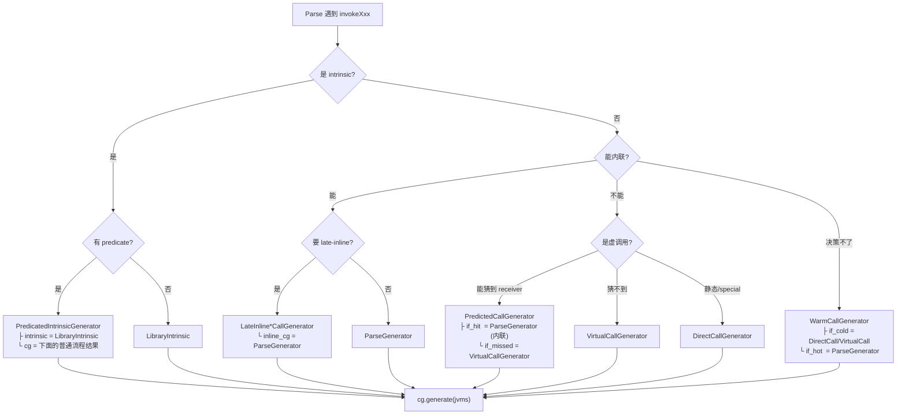
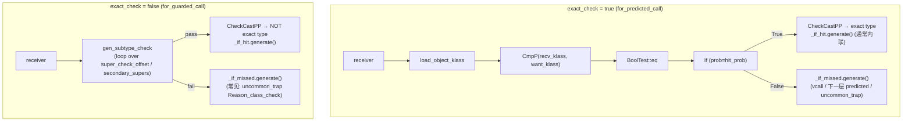

# CallGenerator 及其子类作用分析

## 一、基类 `CallGenerator` 的定位

`CallGenerator` 是 **C2 前端"调用点 IR 生成"的策略基类**（Strategy Pattern）。位置在 [callGenerator.hpp](/jdk15/src/hotspot/share/opto/callGenerator.hpp) 第 38 行：

```cpp
// The subclasses of this class handle generation of ideal nodes for
// call sites and method entry points.
class CallGenerator : public ResourceObj {
```

一句话：**在 C2 解析字节码遇到 `invokeXxx` 时，Parser 不直接决定"内联还是不内联、生成 CallStatic 还是 CallDynamic"，而是先根据 profile / 内联策略挑一个合适的 `CallGenerator` 子类，然后调用它的 `generate(JVMState*)` 让子类往 Ideal Graph 里塞相应的节点（Call / 内联展开 / 类型 guard / uncommon_trap …）**。

---

## 二、`InlineCallGenerator` —— 内联族的抽象中间层

```cpp
class InlineCallGenerator : public CallGenerator {
    virtual bool is_inline() const { return true; }
};
```

它自己不做任何事，只是**给"会把 callee 代码复制到 caller graph 里"的 CG 一个统一父类**（`is_inline() == true`）。目前只有 `ParseGenerator` 直接继承它；`LibraryIntrinsic`（在 `library_call.cpp`）也继承它。

---

## 三、每个子类的作用（按功能分类）

### （1）基础生成器：一定会有节点产出

#### `ParseGenerator`（callGenerator.cpp:64）
**作用**：把 callee 的字节码**内联**到当前 caller graph——这是"真正的内联"。

- 内部直接 `new Parse(jvms, method, expected_uses)`，让 `Parse` 递归解析 callee 的字节码
- 有一个 `_is_osr` 字段：`true` 时表示这是 **OSR 编译的顶层 CG**（栈上替换，caller depth==1）
- `is_parse() == true`, `is_inline() == true`
- 通过 `CallGenerator::for_inline(m)` 或 `for_osr(m, bci)` 创建

#### `DirectCallGenerator`（callGenerator.cpp:115）
**作用**：生成一个**普通的静态/特殊/final 调用**——**不内联**，只产出 `CallStaticJavaNode`。

- 用于 `invokestatic`、`invokespecial`、以及去虚化后的 monomorphic virtual
- 内部：设置 resolve stub、必要时 null-check receiver、然后 `set_arguments_for_java_call / set_edges_for_java_call / set_results_for_java_call`
- `_separate_io_proj = true` 时会强制分离 memory/io 投影，为后续 late-inline 打基础

#### `VirtualCallGenerator`（callGenerator.cpp:177）
**作用**：生成**真正的虚调用/接口调用**——不内联，产出 `CallDynamicJavaNode`（带 IC stub、vtable_index）。

- 用于无法去虚化或没有猜准 receiver type 的 `invokevirtual / invokeinterface`
- `is_virtual() == true`
- 生成前会做 receiver null_check（除非 UseInlineCaches + implicit null-check 满足）

#### `UncommonTrapCallGenerator`（callGenerator.cpp:1183）
**作用**：**不生成任何真正的调用**，直接生成一个 `uncommon_trap` 强制回退到解释器。

- 用于编译器决定"这条路径不会走/不该在编译代码里出现"（如没有 profile 数据的分支、被完全去除的多态目标）
- `is_trap() == true`，不返回

---

### （2）"决定权 defer"型：把选择权留到后面

#### `WarmCallGenerator`（callGenerator.cpp:575）
**作用**：**延迟做内联决策**，先按 cold（不内联）方式生成 CallNode，同时把它挂到 `Compile::warm_calls` 队列上，等到 warm-call 二次决策时再看是否要 late-inline 成 hot 版本。

- 构造时传入 `if_cold`（通常是 DirectCall/VirtualCall）和 `if_hot`（通常是 ParseGenerator）
- `generate()` 里直接调 `_if_cold->generate()`，然后把生成的 CallNode 记到 `WarmCallInfo` 里
- `is_deferred() == true`
- 注意：`WarmCallInfo::make_hot()` 现在是 `Unimplemented()`，实际上 HotSpot 15 里 warm-call 路径已经**基本失活**，主流延迟内联走的是下面的 late-inline 系列

#### `LateInlineCallGenerator`（callGenerator.cpp:290，继承自 `DirectCallGenerator`）
**作用**：先按 `DirectCall` 生成一个 `CallStaticJavaNode` 占位，同时把自己登记到 `Compile::_late_inlines`，**等主 parse 阶段结束后**再回来把 CallNode 替换成真正的内联图。

- 关键：`is_late_inline() == true`，且 `do_late_inline()` 会用 `_inline_cg`（一般是 ParseGenerator）真正展开
- 好处：某些内联决策依赖 escape analysis / 类型推断结果，需要等主图先建好
- 派生出下面三个专用变体

#### `LateInlineMHCallGenerator`（callGenerator.cpp:472）
**作用**：MethodHandle 调用的延迟内联。MH linker（`linkToStatic/linkToVirtual/invokeBasic`）的目标常常是常量后才能解析出真实 callee，必须先占位再回填。

- `is_mh_late_inline() == true`
- `do_late_inline_check()` 会检查 receiver / member_name 是否已 sharpen 成常量

#### `LateInlineStringCallGenerator`（callGenerator.cpp:527）
**作用**：字符串拼接的延迟内联（`StringBuilder.append`, `toString`）。等主 parse 完成后再展开，让字符串拼接优化（`PhaseStringOpts`）有机会先重写整个 append 序列。

#### `LateInlineBoxingCallGenerator`（callGenerator.cpp:551）
**作用**：`Integer.valueOf`/`Long.valueOf` 这类**装箱**方法的延迟内联。等 EA / 逃逸分析确定 box 对象是否逃逸，再决定是否真的展开为 `new + init`（不逃逸时可完全消除）。

---

### （3）"多态守护"型：带 type check 分流

#### `PredictedCallGenerator`（callGenerator.cpp:651）
**作用**：**基于 profile 猜一个 receiver type**，然后：

```
if (receiver.klass == predicted_receiver)   // exact check
    _if_hit.generate()      // 通常是 ParseGenerator (内联)
else
    _if_missed.generate()   // 通常是 VirtualCall 或 uncommon_trap
```

产出的图有明显的 `if-else` 分叉和 Phi 合并。

- 通过 `for_predicted_call(klass, if_missed, if_hit, hit_prob)` 创建，`exact_check=true`
- **`for_guarded_call(klass, if_missed, if_hit)`** 是它的兄弟版本：`exact_check=false`（走 subtype_check），`hit_prob=PROB_ALWAYS`，用于 speculative type
- `is_virtual() == true`；`is_inline()` 取决于 `_if_hit`

`for_predicted_dynamic_call` 是它在 MethodHandle 场景下的兄弟（预测的是 MH 目标而不是 receiver klass）。

#### `PredicatedIntrinsicGenerator`（callGenerator.cpp:981）
**作用**：**带 runtime 断言的 intrinsic**。有些 intrinsic（比如 `AESCrypt`, `CipherBlockChaining`, `Cipher`, `GHASH`）只在特定条件下（CPU 支持、参数类型等）才能用；此 CG 先让 intrinsic 生成"predicate check"节点，check 通过就走 intrinsic 版本，check 失败就走普通 java 编译版本，最后 merge。

结构：
```
if (predicate(0)) do_intrinsic(0)
elif (predicate(1)) do_intrinsic(1)
...
else do_java_comp
```

- `_intrinsic` 就是真正的 `LibraryIntrinsic`
- `_cg` 是回退版本（一般是 ParseGenerator 或 DirectCall）
- 通过 `for_predicated_intrinsic(intrinsic, cg)` 创建

---

### （4）Intrinsic 相关

#### `LibraryIntrinsic`（定义在 [library_call.cpp](/jdk15/src/hotspot/share/opto/library_call.cpp)）
**作用**：手写代码把 JDK 里的特殊方法（`System.arraycopy`, `Math.sqrt`, `Unsafe.compareAndSwap`, `String.equals`, ...）**直接编译成一段定制的 Ideal 节点**，跳过字节码解析。

- 继承 `InlineCallGenerator`，`is_intrinsic() == true`，`is_inline() == true`
- 通过 `CallGenerator::for_intrinsic(m)` 查表拿到（`Compile::find_intrinsic`）
- `register_intrinsic` 用于把新的 intrinsic CG 注册到全局表
- 注意它不是本文件的类，但它是最重要的 CallGenerator 子类之一

---

## 四、类层次总览


---

## 五、CG 是怎么"组合"出来的？—— 调用点决策流程

在 [doCall.cpp](/jdk15/src/hotspot/share/opto/doCall.cpp) 的 `Compile::call_generator()` / `Parse::do_call()` 里，对同一个调用点会**层层套娃**地构造出一个复合 CG。典型模式：



**核心思想**：每个 CG 只负责自己那一层语义（"我先做个 type check"、"我把 callee 展开"、"我先占位后面再回来内联"），通过**组合**（`_if_hit / _if_missed / _inline_cg / _intrinsic / _cg`）构造出复杂策略。这是标准的 Strategy + Decorator + Composite 混用。

---

## 六、一句话小结

| 子类 | 关键动作 | 内联? | 用途 |
|---|---|---|---|
| `ParseGenerator` | 递归 `new Parse` 解析 callee 字节码 | ✔ | 普通内联、OSR 顶层 |
| `LibraryIntrinsic` | 手写 Ideal 节点替换整个调用 | ✔ | JDK 特殊方法（Math/Unsafe/String/AES…） |
| `DirectCallGenerator` | 生成 `CallStaticJavaNode` | ✘ | static / special / 去虚化后的 monomorphic |
| `VirtualCallGenerator` | 生成 `CallDynamicJavaNode`（带 IC） | ✘ | 真虚调用 / 接口调用 |
| `UncommonTrapCallGenerator` | 生成 uncommon_trap 回退到解释器 | ✘ | 冷分支、被剪掉的多态目标 |
| `LateInlineCallGenerator` | 先占位 CallStaticJava，parse 完再展开 | ✔（延迟） | 一般延迟内联 |
| `LateInlineMHCallGenerator` | 同上，专门给 MethodHandle | ✔（延迟） | MH 调用需先常量传播出真实 target |
| `LateInlineStringCallGenerator` | 同上，专门给字符串拼接 | ✔（延迟） | 配合 `PhaseStringOpts` |
| `LateInlineBoxingCallGenerator` | 同上，专门给 boxing | ✔（延迟） | 配合 EA 决定是否消除装箱 |
| `WarmCallGenerator` | 先按 cold 生成，等待热度评估 | ？（延迟决定） | 老的 warm-call 队列（HotSpot 15 已基本失活） |
| `PredictedCallGenerator` | type check 分流 + 内联热路径 | 部分 | monomorphic/bi-morphic 虚调用去虚化 |
| `PredicatedIntrinsicGenerator` | runtime check 分流 intrinsic vs java | 部分 | 需要 CPU/参数条件才能用的 intrinsic |

**基类 `CallGenerator` 就是 C2 处理"每一个调用点"的策略接口，子类通过组合与多态实现了 HotSpot 全部内联/去虚化/intrinsic/late-inline/uncommon-trap 的调用策略。**


# `PredictedCallGenerator::_exact_check` 的语义差异

`PredictedCallGenerator` 是同一个类，`_exact_check` 是一个开关，决定它在 fast path 前面插的**类型守卫（type guard）**用什么形式生成。两条路径最终都是"guard 通过 → 走 `_if_hit`；guard 失败 → 走 `_if_missed`"，但 guard 本身、cast 后的类型信息、以及适用场景都不一样。

## 二、两个 helper 的实质区别

### 1. `_exact_check == true` → `GraphKit::type_check_receiver`
文件位置 [graphKit.cpp](/jdk15/src/hotspot/share/opto/graphKit.cpp) 第 2835 行。核心逻辑：

```cpp
Node* recv_klass = load_object_klass(receiver);       // 读 receiver 的 klass 指针
Node* want_klass = makecon(tklass);
Node* cmp = new CmpPNode(recv_klass, want_klass);     // 指针相等
Node* bol = new BoolNode(cmp, BoolTest::eq);
IfNode* iff = create_and_xform_if(control(), bol, prob, COUNT_UNKNOWN);
...
const TypeOopPtr* recv_xtype = tklass->as_instance_type();
assert(recv_xtype->klass_is_exact(), "");             // ★ exact type
Node* cast = new CheckCastPPNode(control(), receiver, recv_xtype);
```

- **guard 形式**：一条 `CmpP` + `BoolTest::eq` —— 直接**逐位比较 klass 指针**，只有精确等于 `_predicted_receiver` 才走 fast path
- **fast path 上 receiver 的类型**：`klass_is_exact() == true`，也就是 sharpen 成 **exact type**（明确不再是任何子类）
- **hit_prob**：由 caller 传入（一般来自 profile.receiver_prob(0)，或投机时的 1.0），会被下发给 IfNode，影响分支预测和后续 code layout

### 2. `_exact_check == false` → `GraphKit::subtype_check_receiver`
同文件第 2860 行：

```cpp
Node* want_klass = makecon(tklass);
Node* slow_ctl = gen_subtype_check(receiver, want_klass);      // ★ subtype check
const TypeOopPtr* recv_type = tklass->cast_to_exactness(false)
                                    ->is_klassptr()
                                    ->as_instance_type();       // ★ 非 exact
Node* cast = new CheckCastPPNode(control(), receiver, recv_type);
```

- **guard 形式**：调用 `gen_subtype_check` —— 生成的是一整套 **`instanceof` 语义**的子类型检查（含 secondary_supers、display 快路径等），命中条件是 `receiver instanceof _predicted_receiver`
- **fast path 上 receiver 的类型**：`cast_to_exactness(false)`，明确标记 **not exact**，因为通过 subtype check 只能得出"是它或它的某个子类"
- **hit_prob**：`for_guarded_call` 里恒为 `PROB_ALWAYS`（因为通常配合 CHA/uncommon_trap 使用，miss 时直接 deopt）

## 三、两个工厂对应的使用场景

在 [doCall.cpp](/jdk15/src/hotspot/share/opto/doCall.cpp) 中：

### `for_predicted_call`（`exact_check = true`）
第 283、289 行，用于**基于 receiver type profile 的多态去虚化**：

```
if (recv.klass == monomorphic_klass_from_MDO)   // 精确等
    inline hot_target
else
    virtual call  或  uncommon_trap
```

- 双态调用（bimorphic）时会嵌套两层 `for_predicted_call`，形成 `if (klass==k1) inline1; else if (klass==k2) inline2; else vcall`
- 场景：MDO 告诉我们 receiver 具体是 `HashMap` / `ArrayList` 等**具体类**，进行**逐一比对**

### `for_guarded_call`（`exact_check = false`）
第 335 行，用于 **`invokeinterface` + CHA 单实现者**的去虚化：

```cpp
// declared_interface 只有一个实现者 singleton
CallGenerator* miss_cg = for_uncommon_trap(..., Reason_class_check, Action_none);
CallGenerator* cg      = for_guarded_call(holder, miss_cg, hit_cg);
```

- 因为 verifier 不检查 interface 参数，运行时 receiver 只保证"是个 Object"，必须靠 subtype check 兜底
- 用 CHA 拿到 `cha_monomorphic_target->holder()` 作为 `_predicted_receiver`，只要 `receiver instanceof holder` 就允许调用内联的目标；不成立就 uncommon_trap 让解释器抛 `IncompatibleClassChangeError`
- 因为有 CHA 依赖保证正确性（`dependencies()->assert_unique_concrete_method(...)`），命中概率视作 `PROB_ALWAYS`

## 四、生成的 Ideal Graph 对比



## 五、几个容易忽略的细节

1. **cast 后类型精度不同的下游影响**
    - `exact=true` 拿到的 `casted_receiver` 是 exact type，后续的 `invokevirtual` 可以彻底去虚化为 static call，字段类型也能进一步 sharpen
    - `exact=false` 只能证明"至少是 X 或其子类"，后续如果 X 是抽象类/接口，还需要额外手段（比如内联时又用 CHA 依赖）才能唯一确定方法

2. **guard 代价**
    - exact check 仅一条 `cmpq + je`，代价极小
    - subtype check 走 `gen_subtype_check`，可能需要读 `_super_check_offset` 甚至遍历 `secondary_supers` 数组（对接口场景更常见），是**明显更贵**的路径。因此代码只在必须的场景才用（interface + CHA 单实现者）

3. **hit_prob 与 IfNode 的分支预测提示**
    - exact 路径把 profile 得到的真实命中率作为 prob 参数，直接影响 `IfNode` 的 `_prob` 字段，进而影响 block layout 与 loop 顶点选择
    - guarded 路径固定 `PROB_ALWAYS`，因为语义上如果 miss 就 deopt，编译器可以放心把 miss 分支放到"冷区"

4. **replace_in_map 的作用相同但影响域不同**
    - 两条路径在 fast branch 都会 `kit.replace_in_map(receiver, casted_receiver)`，让后续所有引用 `receiver` 的地方看到 sharper type
    - 但 sharpening 的强度天然由 `type_check_receiver` / `subtype_check_receiver` 里 CheckCastPP 的 `TypeOopPtr` 决定（是否 exact），进而决定后续 GVN/内联能否再进一步

## 六、一句话总结

| 维度 | `exact_check = true` (`for_predicted_call`) | `exact_check = false` (`for_guarded_call`) |
|---|---|---|
| guard 语义 | `receiver.klass == K`（**指针相等**） | `receiver instanceof K`（**子类型判断**） |
| helper | `type_check_receiver` | `subtype_check_receiver` |
| fast path receiver 类型 | **exact** instance type | **not exact** instance type |
| guard 代价 | 极小（一次 CmpP + BoolTest::eq） | 较大（可能走 secondary_supers） |
| hit_prob | 来自 caller（profile 或 1.0） | 恒为 `PROB_ALWAYS` |
| miss 常见分支 | 二态时嵌套下一层，或退化为 vcall | 通常直接 `uncommon_trap` → deopt |
| 触发场景 | receiver type profile 多态去虚化（mono/bi-morphic） | `invokeinterface` + CHA 唯一实现者的去虚化 |

所以本质上 `_exact_check` 决定了：**用"klass 精确相等"的窄守卫（用于 profile 猜类），还是用"子类型兼容"的宽守卫（用于 CHA 兜底接口调用）**。前者是**基于概率的乐观优化**，后者是**基于 CHA 依赖的确定性优化**。