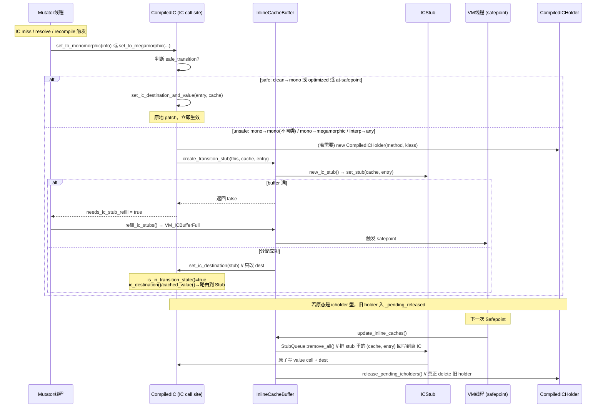

# `CompiledIC` 的状态机与三个 `set_to_*` 的实现分析

## 一、CompiledIC 是什么

`CompiledIC`（Compiled Inline Cache）**不是**一段内存里的对象——它只是一个**位于 `CompiledMethod` 内某个虚调用点上的"逻辑视图"**。

```cpp
class CompiledIC {
  NativeCallWrapper* _call;       // 包装了 native call 指令（其 destination 是"jump-to"目标）
  NativeInstruction* _value;      // 包装了 IC 的 "value cell"（mov "立即数"把 cached klass 装到寄存器）
  bool               _is_optimized;
  CompiledMethod*    _method;
};
```

一个虚调用点在机器码里长这样（`compiledIC.hpp` 顶部注释）：

```
instruction_address --> mov  <cached_value>, %rax   ; ← _value 指向的 mov（KlassPtr 或 CompiledICHolder*）
                        call <ic_destination>       ; ← _call 包装的 call（跳去 fast path / stub / resolve）
```

**"改状态"本质上就是原子改这两条指令的立即数**：`_value` 里的 cached_value 和 `_call` 的 destination。

## 二、四态状态机

头文件顶部的注释已经给出正式状态图：

```
        [1] --<--  Clean -->---  [1]
           /       (null)      \
          /                     \      /-<-\
         /          [2]          \    /     \
     Interpreted  ---------> Monomorphic     | [3]
 (CompiledICHolder*)            (Klass*)     |
         \                        /   \     /
      [4] \                      / [4] \->-/
           \->-  Megamorphic -<-/
             (CompiledICHolder*)
```

| 状态 | `ic_destination` 指向                                                    | `cached_value` 是什么                                | 判定函数 |
|---|------------------------------------------------------------------------|---------------------------------------------------|---|
| **Clean**（未 resolve） | `SharedRuntime::get_resolve_virtual_call_stub()` 等 resolve stub        | `NULL` (`non_oop_word`)                           | `is_clean()` = `dest == get_resolve_call_stub()` |
| **Monomorphic → 编译代码** | 目标 nmethod 的 `entry_point()` / `verified_entry_point()`                | Receiver `Klass*` /  `NULL`                       | `is_call_to_compiled()` = dest 落在 CodeCache 里 |
| **Monomorphic → 解释器** | c2i adapter blob 入口:  `get_c2i_unverified_entry()` / `get_c2i_entry()` | `CompiledICHolder*`(Method+Klass)  /  `Method`           | `is_call_to_interpreted()` = dest 是 adapter blob，`is_icholder_call()` |
| **Megamorphic** | vtable stub / itable stub (都来自VtableStubs)                                        | vtable：NULL；itable：`CompiledICHolder*`(Klass+Klass) | `is_megamorphic()` = `VtableStubs::entry_point(dest) != NULL` |
| **In-Transition** | 位于 `InlineCacheBuffer` 的 ICStub 里                                      | 存在 ICStub 中                                       | `is_in_transition_state()` = `InlineCacheBuffer::contains(dest)` |

注释里 `[1][2][3][4]` 分别是初次 fixup、编译目标出现、目标 nmethod 重编译、IC miss 走 megamorphic。**没有"Megamorphic → Monomorphic"的边**：一旦成为多态的，就不可逆。

另外还有一个**优化虚调用（optimized virtual call）**特殊分支(针对编译代码)：`_is_optimized=true` 时其实没有 value cell（编译期已经能静态绑定，生成的代码不含`_value`对应的move指令），退化成一个类似 `CompiledDirectStaticCall`，永远只在 Clean ↔ Monomorphic 之间切换。

## 三、"MT-safe patching" 的根本困难

改 IC 有两个地方要动：
1. `_value` 里的 cached_value（一条 `movabs` 的 64-bit 立即数）
2. `_call` 的 destination（一条 `call` 或 `jmp` 的相对/绝对目标）

**问题**：其他线程正在这条 call 指令附近执行，无法保证改 IC这个非原子过程中不会被另一个 CPU 读到不一致的组合（例如新 klass + 旧 target）。

**HotSpot 的做法**：只允许两类"安全"改动直接原地 patch，其余全部走 `ICStub`（transition stub）：
- **safe 的情况**：只需要改 dest（例如 optimized call）、或从 clean 转过去、或在 safepoint 里、或架构本身支持"safe for patching"
- **unsafe 的情况**：`InlineCacheBuffer::create_transition_stub` 分配一个 ICStub，把 IC 的 dest 改到这个 stub 上。stub 里放好新的 `(cached_value, entry)`，等下一次 safepoint 里 `update_inline_caches()` 把 ICStub 的内容"回写"到真正的 IC 里

`is_in_transition_state()` 就是判断 dest 是否落在 `InlineCacheBuffer` 内。此时 `cached_value()` / `ic_destination()` 会自动从 ICStub 里读。

## 四、`set_to_clean` 实现分析

```cpp
bool CompiledIC::set_to_clean(bool in_use) {
  address entry = _call->get_resolve_call_stub(is_optimized());
  bool safe_transition = _call->is_safe_for_patching()
                       || !in_use                                  // nmethod 尚未装配好
                       || is_optimized()                           // optimized call 只需要改 dest
                       || SafepointSynchronize::is_at_safepoint(); // 全局停顿

  if (safe_transition) {
    clear_ic_stub();                                                // 若之前正在 transition 就丢弃 stub
    if (is_optimized()) {
      set_ic_destination(entry);                                    // 只 patch dest
    } else {
      set_ic_destination_and_value(entry, (void*)NULL);             // dest + value 都清
    }
  } else {
    if (!InlineCacheBuffer::create_transition_stub(this, NULL, entry)) {
      return false;                                                 // 让上层做 IC stub refill 再重试
    }
  }
  return true;
}
```

要点：
- **回到 clean**：dest 恢复到 `SharedRuntime::get_resolve_{virtual|opt_virtual|static}_call_stub()`；`cached_value` 置 NULL(使用 non_oop_word() 作为 cache NULL 哨兵，避免和内存的NULL语义混淆)
- **判定 safe 的四种情形**任一成立就直接原地 patch，否则走 ICStub
- 关键使用场景：类卸载、nmethod 变 zombie、bytecode 修改、IC miss 时先清理再重装

从状态图看，**任何状态都能变回 Clean**（图里 clean 是所有转换的中转点）。

## 五、`set_to_monomorphic` 实现分析

它接收一个已经算好的 `CompiledICInfo`（由 `compute_monomorphic_entry` 生成），分三大分支：

### 分支 A：`info.is_optimized() && is_optimized()` —— 优化虚调用调解释器
```cpp
_call->set_to_interpreted(method, info);
```
底层其实是 `CompiledDirectStaticCall::set_to_interpreted`，只 patch call 的 dest 到 c2i entry；因为 optimized call site 没 value cell，一步搞定。

### 分支 B：非 optimized 且目标是解释器 —— 需要 CompiledICHolder
```cpp
CompiledICHolder* holder = info.claim_cached_icholder();
if (!InlineCacheBuffer::create_transition_stub(this, holder, info.entry())) {
  delete holder;
  return false;
}
```
- 此时 `info.entry() == method->get_c2i_unverified_entry()`（c2i adapter 的**未校验入口**）
- `cached_value` 必须是 `CompiledICHolder*`（含 method + expected klass），解释器 stub 才知道"来的这个 receiver 该不该走这个 Method"，进行 klass 校验
- **必须走 ICStub**：因为要同时改 dest 和 value，是 unsafe 转换

### 分支 C：目标是编译代码
```cpp
bool static_bound = info.is_optimized() || (info.cached_metadata() == NULL);
bool safe = SafepointSynchronize::is_at_safepoint()
         || (!is_in_transition_state()
             && (info.is_optimized() || static_bound || is_clean()));

if (!safe) {
  InlineCacheBuffer::create_transition_stub(this, info.cached_metadata(), info.entry());
} else {
  if (is_optimized()) {
    set_ic_destination(info.entry());                                // 只 patch dest
  } else {
    set_ic_destination_and_value(info.entry(), info.cached_metadata()); // patch dest + klass
  }
}
```
- **从 Clean → Monomorphic 是 MT-safe 的**：因为 clean 状态下先写 dest，再切 cache（klass），中间状态会导致type check失败走"IC miss 处理器 → verified entry"进行兜底。
- 已经 monomorphic 想再切一个新 klass？属于 `[3]` 边——**注释里明确说只允许改 dest 不改 klass**：因为 nmethod 被替换（重编译）时目标变了，但 receiver klass 不变；如果需要改 klass，必须先 clean
- set_destination_mt_safe 通过cache line对齐保证 dest 写入的原子性，避免半写入割裂

从 `compute_monomorphic_entry` 看，`CompiledICInfo` 提供的 3 种 `entry` 变体已经对应了这里的分支：

| `info` 设置 | 目标 | cached_value          |
|---|---|-----------------------|
| `set_compiled_entry(entry, klass, optimized)` | nmethod entry_point | Klass*（非 optimized 时） |
| `set_interpreter_entry(c2i_entry, method)` | c2i adapter | Method*(optimized 时)      |
| `set_icholder_entry(c2i_unverified, holder)` | c2i 未校验入口 | CompiledICHolder*     |

## 六、`set_to_megamorphic` 实现分析

只有一条入边 `[4]`：mono/interpreted → megamorphic。

```cpp
if (call_info->call_kind() == CallInfo::itable_call) {
  entry = VtableStubs::find_itable_stub(itable_index);
  ...
  CompiledICHolder* holder = new CompiledICHolder(method_holder, resolved_klass, /*is_method=*/false);
  holder->claim();
  if (!InlineCacheBuffer::create_transition_stub(this, holder, entry)) {
    delete holder;
    needs_ic_stub_refill = true;
    return false;
  }
} else {  // vtable_call
  entry = VtableStubs::find_vtable_stub(vtable_index);
  ...
  if (!InlineCacheBuffer::create_transition_stub(this, NULL, entry)) {
    needs_ic_stub_refill = true;
    return false;
  }
}
```

要点：
- **vtable 调用**：`entry = itable-index 对应的 vtable stub`，`cached_value = NULL`。stub 内部读 receiver→klass→vtable，最后 jmp。IC 只需要指到 stub，klass slot 不再用了
- **itable 调用**：需要在 stub 里做一个"用哪个接口"的 lookup，因此 `cached_value = CompiledICHolder(interface_holder_klass, resolved_klass, is_method=false)`——两个 klass：期望的 interface + 声明该方法的 klass。这是 `CompiledICHolder` **第二种用法**（klass+klass 对）
- **无条件走 ICStub**：因为 vtable/itable stub 的 dest 和 cached_value 都要设，且此时前一态一定不是 clean（clean 不会直接跳 megamorphic）
- `needs_ic_stub_refill=true` 用来告诉上层 IC buffer 满了，需要跑一次 safepoint 清空 buffer 再重试
- **不可逆**：一旦 megamorphic，就永久保留，不会回到 mono；见状态图里没有 megamorphic→mono 的边

## 七、`CompiledICHolder` —— 承载"额外"元数据的辅助 C-heap 对象

它的作用注释在 `compiledICHolder.hpp` 顶端就说明了：

> A `CompiledICHolder*` is a helper object for the inline cache implementation. It holds:
>  (1) (method+klass pair) when converting from compiled to an interpreted call
>  (2) (klass+klass pair) when calling itable stub from megamorphic compiled call

之所以需要它，是因为 IC 里只有**一个** cached_value 槽，要塞两条信息就得再打包：

| 场景 | `_holder_metadata` | `_holder_klass` | `is_method` |
|---|---|---|---|
| Monomorphic → 解释器 | callee `Method*` | 预期 receiver `Klass*` | true |
| Megamorphic itable | 声明方法的 `Klass*`（interface） | resolved receiver `Klass*` | false |

关键设计：
- **CHeap 对象**（`CHeapObj<mtCompiler>`），因为它必须比某个 nmethod 活得久，也不能被 GC 直接管
- **只在 safepoint 里删**：因为其他线程可能正拿着它跑。这就是 `queue_for_release` + `release_pending_icholders` 的存在意义
- `is_loader_alive()`：类卸载时用来判断 holder 引用的类是否还活着，不活了就在 nmethod 清理时把 IC 清掉
- `claim()`：把它从 "_live_not_claimed_count" 移到 "已装载" 计数中；未装载的 holder 若上层没用还会被自动 delete（见 `CompiledICInfo::~CompiledICInfo`）

**"何时会 queue_for_release"？** 看 `internal_set_ic_destination`：

```cpp
if (is_icholder_entry(_call->destination())) {
  // 前一态 dest 是 icholder 型，说明原来存的 cached_value 就是一个 CompiledICHolder*
  InlineCacheBuffer::queue_for_release((CompiledICHolder*)get_data());
}
```
每当把一个"含 holder"的 IC 状态改到别的（不管是新 holder 还是 klass 或 clean），旧 holder 就入队等 safepoint 删除。

## 八、`InlineCacheBuffer` —— 解决"MT-unsafe 转换"的存放地

它是一个进程级单例，本质是一个 `StubQueue`：

```cpp
class InlineCacheBuffer : public AllStatic {
  static StubQueue* _buffer;                     // 存放 ICStub
  static CompiledICHolder* _pending_released;    // 等待 safepoint 里 delete 的 holder 链表
  static int _pending_count;
};
```

### ICStub 长啥样

`icBuffer.hpp` 46-49 行注释：

```
instruction_address --> 01 set xxx_oop, Ginline_cache_klass
                        23 jump_to Gtemp, yyyy
                        4  nop
```

每个 ICStub 是一小段"迷你 IC 代码"：**先 mov 一个 cached_value 到寄存器，再 jmp 到真正 entry**。它和 IC 原生代码的结构一模一样，只是位置在别处（`_buffer` 中）。

### 关键流程

#### 1. `create_transition_stub(ic, cached_value, entry)`
```cpp
ICStub* ic_stub = new_ic_stub();                        // 从 StubQueue 划一块
if (ic_stub == NULL) return false;                      // buffer 满了，返回 false 让上层 refill
if (ic->is_in_transition_state()) {
  ICStub* old_stub = ICStub_from_destination_address(ic->stub_address());
  old_stub->clear();                                    // 已经有旧 stub 就丢弃
}
ic_stub->set_stub(ic, cached_value, entry);             // 把 (cache, entry) 写到 stub 里
ic->set_ic_destination(ic_stub);                        // 把 IC 的 dest 指到 stub（原子改 dest）
```
**只改了 IC 的 dest 一处（原子），未动 value cell**。stub 里保存的才是"未来"的 cache 值。此后所有对 IC 的读，都通过 `is_in_transition_state()` 路由到 stub 上，看到的仍然是新值——从外部看起来 IC 已经切完了，但底层 value cell 还是旧的。

#### 2. `update_inline_caches()`
```cpp
void InlineCacheBuffer::update_inline_caches() {
  if (buffer()->number_of_stubs() > 0) {
    buffer()->remove_all();                             // 逐个 finalize，把 stub 的 (cache, entry) 真正写回 IC
  }
  release_pending_icholders();                          // 顺便删掉挂起的 holder
}
```
这个函数只在 **safepoint 里**调用（VM 线程执行）。此时所有 Java 线程都停了，可以放心地把 stub 的 `cached_value` 拷回真正的 IC value cell、并把 dest 从 stub 改成 stub 里存的最终 entry——两处一起改，不再有 race。

#### 3. `refill_ic_stubs()`
`create_transition_stub` 返回 false 时（stub buffer 满），上层调 `refill_ic_stubs()`，它触发一次 `VM_ICBufferFull` 安全点，在 safepoint 里 `remove_all()` 清空 buffer，然后调用方重试 `set_to_*`。

`ICRefillVerifier` 是一个调试 RAII，用来 assert "调用方看到 `needs_ic_stub_refill=true` 后必须真的 refill"。

#### 4. `release_pending_icholders()`
只在 safepoint 里跑，把 `_pending_released` 单链表遍历一遍，`delete holder`。**只有到这一步 holder 的内存才真正被回收**。

## 九、三者协作的完整时序图



## 十、几个容易混淆的点

1. **`is_optimized` 的 IC 没有 value cell**——它其实退化成 `CompiledDirectStaticCall`，`set_to_clean/monomorphic` 里的很多 optimized 分支只 patch dest。真正意义上的 IC 状态机（clean↔mono↔megamorphic）只对**非 optimized 虚调用**成立。

2. **"transition state" 不是状态图里的一个态**，它是"unsafe 转换的中间过渡"，任何 mono/megamorphic 转换都可能短暂经过它，直到 safepoint 回写。

3. **`CompiledICHolder` 的两种用法完全不同**——一是"mono→解释器"（method+klass 用于 unverified entry 里做 klass 校验），二是"megamorphic itable"（interface klass+receiver klass 用于 itable lookup）。同一个类塞了两种语义，靠 `is_method` bool 区分。

4. **状态判定不能直接看 `_call->destination()`**，因为可能在 transition。所有 `is_clean()/is_call_to_compiled()/is_megamorphic()` 都通过 `ic_destination()`（会自动穿透到 stub 里）读。

5. **`set_to_clean` 是唯一"任何态都能到达"的目标**——nmethod 卸载时、类卸载时、bytecode redefine 时全走它；随后再触发一次 miss 就重新 resolve 成 mono。这也是状态图里 clean 是中心枢纽的原因。

## 十一、一句话总结

| 组件 | 角色 |
|---|---|
| `CompiledIC` | 位于 nmethod 内某虚调用点的**逻辑视图**，`_value + _call` 就是那两条待 patch 的机器指令 |
| `set_to_clean` | 把 dest 恢复成 resolve stub、cache 清零；MT-safe 时原地 patch，否则走 ICStub |
| `set_to_monomorphic` | 装 `(entry, cached_value)`；从 clean 或 optimized 或 safepoint 出发时原地 patch，否则走 ICStub |
| `set_to_megamorphic` | 装 vtable/itable stub 入口；itable 场景 cache=`CompiledICHolder(klass, klass)`；**必走 ICStub** |
| `CompiledICHolder` | 当 cache 需要"塞两条信息"（method+klass 或 klass+klass）时的 C-heap 打包对象，safepoint 里延迟回收 |
| `InlineCacheBuffer` | 存放"过渡态"ICStub 的 StubQueue + 待释放 holder 的 pending 链；在 safepoint 里 `update_inline_caches()` 把 stub 写回 IC、`release_pending_icholders()` 删除 holder |

**核心逻辑**：所有 unsafe 的多字段 patch 都被"外包"给 `InlineCacheBuffer` 里的 ICStub，用一次原子的 dest 改写把逻辑上的新状态"发布出去"，实际的机器码同步到下次 safepoint。`CompiledICHolder` 是当 cached_value 需要复合信息时的容器，同样受 safepoint 保护延迟回收——这就是 HotSpot 在不停顿 Java 线程的前提下安全演化 IC 状态的关键机制。