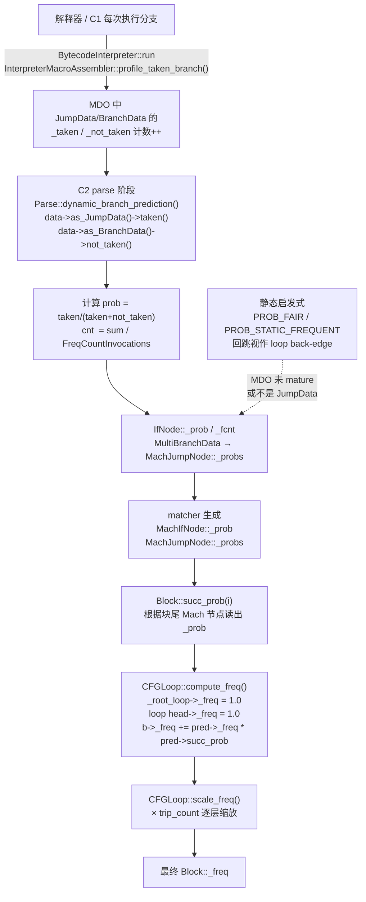

## 结论先说

**`Block::_freq` 的数据来源和 `JumpData` 有关系，但不是"直接"由 `JumpData` 赋值的**——中间隔了两层：

```
MDO(JumpData/BranchData)  →  MachIfNode::_prob (每条 If 上的静态字段)
                          →  Block::succ_prob(i)
                          →  CFGLoop::compute_freq() / scale_freq()  ← 真正给 _freq 赋值的地方
                          →  Block::_freq
```

也就是说 `JumpData` 只是**分支概率 `_prob`** 的主要来源之一，`_prob` 再经过 CFG 层的循环树遍历和累加/缩放，最终"落"到每个 block 的 `_freq` 字段上。下面拆开讲。

## 一、`_freq` 字段本身：只有 3 类写入者

看 [block.hpp:95](/jdk15/src/hotspot/share/opto/block.hpp) 定义：

```cpp
double _freq;   // Execution frequency (estimate)
```

在 `CFGElement()` 里初始化为 `0.0`。而搜索结果显示，**运行时给 `_freq` 赋值/累加**的所有地方只有以下几处，全部集中在 [gcm.cpp](/jdk15/src/hotspot/share/opto/gcm.cpp) 和 [block.cpp](/jdk15/src/hotspot/share/opto/block.cpp)：

| 位置 | 写法 | 作用 |
|-----|------|------|
| `gcm.cpp:1599` | `_root_loop->_freq = 1.0;` | 方法入口环频率归一为 1 |
| `gcm.cpp:1813` | `hd->_freq = 1.0;` | 循环 head 频率归一为 1（相对单次进入 loop） |
| `gcm.cpp:2094` | `b->_freq += freq;` | `update_succ_freq` 中把前驱按 succ_prob 传播来的份额累加到后继 |
| `gcm.cpp:2103` | `ch->_freq += freq;` | 累加到嵌套子循环 |
| `gcm.cpp:2127~2134` | `_freq = loop_freq; s->_freq = block_freq;` | `scale_freq()` 用 trip_count 递归缩放 |
| `gcm.cpp:1617` | `uct->_freq = PROB_MIN;` | 通往 uncommon trap 的 block 强制拉到最小 |
| `block.cpp:540` | `block->_freq = freq;` | trace 布局后合并 block 时 `freq = in->_freq * in->succ_prob(succ_no);` |

**核心逻辑就一句**：`succ->_freq += pred->_freq * pred->succ_prob(succ_index)`。所以理解 `_freq` 的来源，等价于理解 **`succ_prob(i)`** 从哪儿来。

## 二、`succ_prob(i)` 的来源：这里才真正接触 `JumpData`

看 [gcm.cpp:1874~1948 `Block::succ_prob`](/jdk15/src/hotspot/share/opto/gcm.cpp)，它按块尾节点的 op 做 switch：

| 块尾节点 Op | 概率来源 | 与 JumpData 关系 |
|-------------|---------|-----------------|
| `Op_If` / `Op_CountedLoopEnd` | `n->as_MachIf()->_prob`（IfTrue 走 prob，IfFalse 走 1-prob） | ★ **就是 JumpData/BranchData 计算出的** |
| `Op_Jump`（tableswitch/lookupswitch） | `n->as_MachJump()->_probs[JumpProj->_con]` | ★ **同样来自 MDO** |
| `Op_Goto` / `Op_Root` | 恒为 1.0 | 无关 |
| `Op_Catch` | 硬编码：fall-through 大概率，其他小概率 | 无关 |
| `Op_NeverBranch` | 0.0 | 无关 |
| `Op_TailCall / Return / Halt / Rethrow` | 0.0（不往下传） | 无关 |
| `MachNullCheck` | 由后继 `_freq` 反推（因为 If 已被 lcm 干掉了） | 间接（后继 freq 早已带上 MDO 影响） |

所以真正把 MDO 计数带进来的是 **`MachIfNode::_prob` 和 `MachJumpNode::_probs`**。

## 三、`MachIfNode::_prob` / `MachJumpNode::_probs` 由 parser 阶段计算，读的正是 `JumpData`

看 [parse2.cpp `Parse::dynamic_branch_prediction`](/jdk15/src/hotspot/share/opto/parse2.cpp)（第 1270 行开始）：

```cpp
ciMethodData* methodData = method()->method_data();
if (!methodData->is_mature())  return PROB_UNKNOWN;
ciProfileData* data = methodData->bci_to_data(bci());
if (data == NULL) return PROB_UNKNOWN;
if (!data->is_JumpData())  return PROB_UNKNOWN;   // ← ★ 必须是 JumpData

// get taken and not taken values
taken = data->as_JumpData()->taken();             // ← ★ JumpData::taken
not_taken = 0;
if (data->is_BranchData()) {
    not_taken = data->as_BranchData()->not_taken(); // ← ★ BranchData::not_taken
}
...
prob = (float)taken / (float)(taken + not_taken);  // ← 生成分支概率
...
cnt = sum / FreqCountInvocations;                  // ← 生成块相对频率
```

- `dynamic_branch_prediction()` 拿到 `prob` 和 `cnt` 后回填给 `IfNode` 的 `_prob` 和 `_fcnt`；
- 若 MDO 未 mature 或没有 JumpData，退回 `Parse::branch_prediction` 的静态启发式（`PROB_FAIR / PROB_STATIC_FREQUENT` 等）；
- `IfNode` 被 matcher 转成 `MachIfNode` 时把 `_prob` 复制过去；
- Tableswitch/Lookupswitch 走 `Parse::jump_switch_ranges()`，同样读 `MultiBranchData` 生成 `MachJumpNode::_probs`。

`ciMethodData::bci_to_data()` 里的 `JumpData` 就是 [methodData.hpp](/jdk15/src/hotspot/share/oops/methodData.hpp) 里那个 ProfileData 的子类，`taken()` 是解释器/C1 运行时打进 MDO 的分支计数。

## 四、完整数据流（一图流）



## 五、几个额外要澄清的细节

1. **`_freq` 只在 C2 GCM (Global Code Motion) 阶段之后才有意义**。它是**全局 CFG 层**的一次静态频率估计，只在编译期做寄存器分配、代码布局、分裂决策时使用（`ifg.cpp`、`chaitin.cpp`、`reg_split.cpp`、`coalesce.cpp` 都在读），**不是运行时更新的计数**。运行时更新的计数在 MDO 里。

2. **`JumpData` 只影响 If/Jump 类块尾的概率**。对 Goto/Catch/Root/TailCall/Return 这些 op，`succ_prob` 走的是**硬编码**分支，跟 JumpData 无关。

3. **循环 head 是 `_freq = 1.0` 归一起点**（`gcm.cpp:1813`），随后 `scale_freq()` 乘以 `trip_count()`；而 `trip_count` 又受 exit 概率影响，exit 概率还是从 succ_prob 累加来的——所以 JumpData 的影响会**间接放大成循环 trip count**，这也是热点循环体 `_freq` 数值巨大的根源。

4. **回退路径**：当 MDO 未 mature 或对应 bci 没有 JumpData 时，会走 `branch_prediction` 的静态启发式（`PROB_STATIC_FREQUENT` 对回跳、`PROB_FAIR` 对等值判断等等）。也就是说 **`_freq` 也可能完全不依赖 JumpData**，只是在有 profile 的热路径上，JumpData 是最主要的数据源。

## 一句话总结
succ block的freq是由其(多个)pred block的freq累加决定的，与pred block的freq值差不多的succ block的taken率更高(注意循环的head block的freq为1，由此推导出循环中其他block的freq)