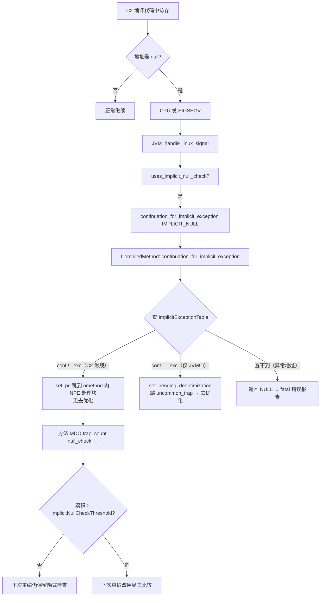
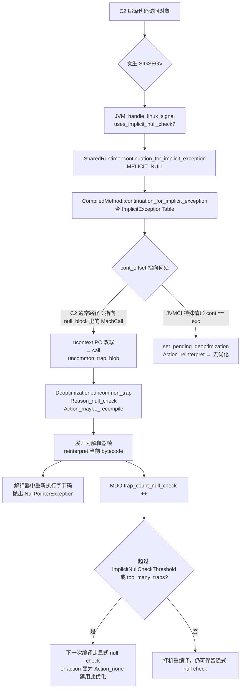

## 隐式空指针检查触发 SIGSEGV 后，C2 编译的代码会退优化吗？

## 结论

**不会 "直接" 退优化（deoptimize），正常情况下只是被修复性地"跳转到显式异常处理分支"，但 C2 会记录这次 trap，累积到阈值后的新一轮编译才会改用"显式空检查"。（JVMCI 场景下才会真正走 uncommon trap 去优化。）**
**注意  ImplicitExceptionTable 映射的地址就是去调用 uncommon trap的，但是action是`Action_maybe_recompile`，不会立即退优化!!!**

下面按调用链逐层说明。

### 1. 信号进入 JVM：`JVM_handle_linux_signal`

在 [os_linux_x86.cpp](/Users/liyang/workspace/jdk15/src/hotspot/os_cpu/linux_x86/os_linux_x86.cpp) 中，当线程状态为 `_thread_in_Java` 且命中隐式空指针地址判定时：

```cpp
} else if (sig == SIGSEGV &&
           MacroAssembler::uses_implicit_null_check(info->si_addr)) {
    // Determination of interpreter/vtable stub/compiled code null exception
    stub = SharedRuntime::continuation_for_implicit_exception(
               thread, pc, SharedRuntime::IMPLICIT_NULL);
}
```

信号处理器不会抛异常，而是向下问 runtime "这个故障点该跳到哪里继续执行"，拿到 `stub` 地址后用 `os::Linux::ucontext_set_pc(uc, stub)` 改写 ucontext 的 PC，然后从信号处理返回——CPU 就像普通的条件跳转一样"落到"异常派发代码里继续跑。这里**没有任何 deoptimize 动作**。

### 2. 计算续跳地址：`SharedRuntime::continuation_for_implicit_exception`

在 [sharedRuntime.cpp](/Users/liyang/workspace/jdk15/src/hotspot/share/runtime/sharedRuntime.cpp) 中，`IMPLICIT_NULL` 分支核心是：

```cpp
#ifndef PRODUCT
_implicit_null_throws++;
#endif
target_pc = cm->continuation_for_implicit_null_exception(pc);
```

### 3. nmethod 内部查表：`CompiledMethod::continuation_for_implicit_exception`

在 [compiledMethod.cpp](/Users/liyang/workspace/jdk15/src/hotspot/share/code/compiledMethod.cpp) 第 710 行：

```cpp
int exception_offset = pc - code_begin();
int cont_offset = ImplicitExceptionTable(this).continuation_offset( exception_offset );
...
if (cont_offset == exception_offset) {
#if INCLUDE_JVMCI
    Deoptimization::DeoptReason deopt_reason = for_div0_check ? ... : Deoptimization::Reason_null_check;
    JavaThread *thread = JavaThread::current();
    thread->set_jvmci_implicit_exception_pc(pc);
    thread->set_pending_deoptimization(Deoptimization::make_trap_request(deopt_reason,
                                                                         Deoptimization::Action_reinterpret));
    return (SharedRuntime::deopt_blob()->implicit_exception_uncommon_trap());
#else
    ShouldNotReachHere();
#endif
}
return code_begin() + cont_offset;
```

C2 在编译时给每个可能隐式 NPE 的 pc 预先在 `ImplicitExceptionTable` 里填好 "出错就跳到的续点（continuation pc）"。这里有三种走法：

| 情况 | 行为 | 是否退优化 |
| --- | --- | --- |
| `cont_offset != 0 && cont_offset != exception_offset`（C2 常规路径） | 返回 `code_begin()+cont_offset`，跳到该方法内事先编译好的 NPE 分发代码，通常是去构造 `NullPointerException` 并走异常表 | **否**，就是普通的正常执行路径切换 |
| `cont_offset == 0`（表里没登记） | 返回 NULL，让信号处理继续走 fatal 错误报告 | 不适用（JVM 崩溃） |
| `cont_offset == exception_offset` | 仅 **JVMCI**（如 Graal）才会触发：设置 pending deoptimization（`Reason_null_check, Action_reinterpret`），返回 `deopt_blob()->implicit_exception_uncommon_trap()` | **是**，只有 JVMCI 编译的代码才会 |

也就是说在**传统 C2** 下，触发一次隐式 NPE 不会退优化，只是跳到 C2 自己预先埋好的异常构造/分发代码继续运行（所以它比 C1/解释器加 `if (x==null) throw NPE;` 省去了一次显式比较）。

### 4. 但会影响"下一次编译"——阈值后转为显式检查

C2 在解析阶段会查 MDO 的 `trap_count(Reason_null_check)`，见 [graphKit.cpp](/Users/liyang/workspace/jdk15/src/hotspot/share/opto/graphKit.cpp):

```cpp
} else if (!assert_null &&
           (ImplicitNullCheckThreshold > 0) &&
           method() != NULL &&
           (method()->method_data()->trap_count(reason)
            >= (uint)ImplicitNullCheckThreshold)) {
    ok_prob =  PROB_LIKELY_MAG(3);   // 降低为显式检查
}
```

`ImplicitNullCheckThreshold` 默认是 3（见 [c2_globals.hpp](/Users/liyang/workspace/jdk15/src/hotspot/share/opto/c2_globals.hpp) 第 402 行）。同样在 [callGenerator.cpp](/Users/liyang/workspace/jdk15/src/hotspot/share/opto/callGenerator.cpp) 第 224 行也有此阈值判定。

含义：当同一方法的 MDO 累积到 3 次 null_check trap 后，C2 下一次编译这个方法时就不再把这个点当作"大概率非空"来生成隐式检查，而是插入普通的显式 `cmp/jne`。这中间通常伴随着一次常规的去优化-再编译循环（null_check trap 会让方法进入不稳定的 profile，并在阈值到达后被 uncommon_trap/reprofile 触发重编）。

### 一个简明的流程图



### 一句话总结

- **传统 C2**：一次隐式 NPE 的 SIGSEGV 不退优化，只是走 `ImplicitExceptionTable` 映射到方法内预先生成的 NPE 处理路径继续跑；但会在 MethodData 里累计 `null_check` trap 次数，超过 `ImplicitNullCheckThreshold`（默认 3）后，**下一次编译**会改成显式空检查（这期间通常伴随一次正常的去优化-重编译，而不是这次 SEGV 本身）。
- **JVMCI 编译**：当 `cont_offset == exception_offset` 时，会设置 `Reason_null_check + Action_reinterpret` 的 pending deoptimization，跳到 `implicit_exception_uncommon_trap`，此时**就是真正的去优化**。

----

## 请结合implicit_null_check函数的实现进行分析

## 结论（修正之前的回答）

**是的，"ImplicitExceptionTable 映射到的 NPE 处理路径"本质上就是去调用 `uncommon_trap`，所以绝大多数情况下**是会去优化的**。我在上一轮回答里"不会退优化"的表述不准确，下面用代码证据一步步修正。**

### 1. `implicit_null_check` 是硬性要求 null 分支里必须存在 uncommon_trap

在 [lcm.cpp](/Users/liyang/workspace/jdk15/src/hotspot/share/opto/lcm.cpp) 第 85 行 `PhaseCFG::implicit_null_check` 里有一段注释 + 代码非常明确地写着：

```cpp
// Search the exception block for an uncommon trap.
// (See Parse::do_if and Parse::do_ifnull for the reason
// we need an uncommon trap.  Briefly, we need a way to
// detect failure of this optimization, as in 6366351.)
{
  bool found_trap = false;
  for (uint i1 = 0; i1 < null_block->number_of_nodes(); i1++) {
    Node* nn = null_block->get_node(i1);
    if (nn->is_MachCall() &&
        nn->as_MachCall()->entry_point() == SharedRuntime::uncommon_trap_blob()->entry_point()) {
      ...
      Deoptimization::DeoptAction action = Deoptimization::trap_request_action(tr_con);
      ...
      if (is_set_nth_bit(allowed_reasons, (int) reason)
          && action != Deoptimization::Action_none) {
        // This uncommon trap is sure to recompile, eventually.
        // When that happens, C->too_many_traps will prevent
        // this transformation from happening again.
        found_trap = true;
      }
      ...
    }
  }
  if (!found_trap) {
    // We did not find an uncommon trap.
    return;
  }
}
```

关键几点：

1. **null 分支里必须能找到一个 `uncommon_trap_blob` 的 MachCall**，找不到就直接 `return`，不做隐式 null check 优化。
2. **这个 uncommon_trap 的 action 必须 `!= Action_none`**，否则也不算数（`Action_none` 只让解释器跑一次，不会重编译，不能体现"优化失败"的信号）。
3. 注释里直白写着 *"This uncommon trap is sure to recompile, eventually"*——所以触发一次后**最终是会导致重编译（去优化 + 重新编译）的**。
4. 只有在 `too_many_traps`（通过 MDO `trap_count` 判定）时，后续再优化才会被禁止——也就是我前一轮答案里提到的 `ImplicitNullCheckThreshold` 机制。

### 2. null 分支里的 uncommon_trap 的 action 到底是什么？

上游生成方在 [graphKit.cpp](/Users/liyang/workspace/jdk15/src/hotspot/share/opto/graphKit.cpp) 的 `null_check_common` 里，走 `builtin_throw(reason)`（第 1353 行附近）。而 `builtin_throw` 的最后选择 action 的逻辑（第 624 行附近）是：

```cpp
Deoptimization::DeoptAction action = Deoptimization::Action_maybe_recompile;
if (treat_throw_as_hot
    && (method()->method_data()->trap_recompiled_at(bci(), m)
        || C->too_many_traps(reason))) {
  // We cannot afford to take more traps here.  Suffer in the interpreter.
  ...
  action = Deoptimization::Action_none;
}

uncommon_trap(reason, action, (ciKlass*)NULL, (char*)NULL, must_throw);
```

结合 [deoptimization.hpp](/Users/liyang/workspace/jdk15/src/hotspot/share/runtime/deoptimization.hpp) 的 `DeoptAction` 枚举：

```cpp
enum DeoptAction {
  Action_none,                  // just interpret, do not invalidate nmethod
  Action_maybe_recompile,       // recompile the nmethod; need not invalidate
  Action_reinterpret,           // invalidate the nmethod, reset IC, maybe recompile
  Action_make_not_entrant,      // invalidate the nmethod, recompile (probably)
  Action_make_not_compilable,   // invalidate the nmethod and do not compile
  Action_LIMIT
};
```

所以分两种情形：

| 情况 | action | 语义 |
| --- | --- | --- |
| 首次/偶发 implicit NPE（default 路径） | `Action_maybe_recompile` | 本次去优化到解释器，**并触发将来重编译**；但 nmethod 不立即失效 |
| 已经 `too_many_traps` 或该 bci 之前被重编译过 | `Action_none` | 此时 `implicit_null_check` 会因为 `action == Action_none` **直接放弃隐式 null check 优化**（见上面条件 `action != Action_none`），所以 C2 编出的代码里根本不会再有隐式检查，走的是显式 `cmp/jne` + `builtin_throw` |

换句话说：**只要一个点真的走到了"隐式 null check"这种优化，它的 null 分支就是一个 `Action_maybe_recompile`（或 `Action_make_not_entrant`/`Action_reinterpret`）的 uncommon_trap。**

### 3. 回到运行时：SIGSEGV → ImplicitExceptionTable → continuation_pc → uncommon_trap 调用点

因此，把 [compiledMethod.cpp](/Users/liyang/workspace/jdk15/src/hotspot/share/code/compiledMethod.cpp) 里 `continuation_for_implicit_exception` 返回的 `code_begin() + cont_offset` 和编译期这段逻辑对起来就能看出：

- `ImplicitExceptionTable` 登记的 `cont_offset` 指向的就是 **null_block 中那个 uncommon_trap 调用站点（MachCall 的 pc）**。
- 所以信号处理把 ucontext 的 PC 改写到 `cont_offset` 后，CPU 一回来执行的就是一个 **进入 uncommon_trap_blob 的 call**。
- uncommon_trap_blob 会进 `Deoptimization::uncommon_trap` → 按 `(Reason_null_check, Action_maybe_recompile)` **把这帧 nmethod 的栈帧改成解释器帧、rollback 到当前 bytecode、在解释器里重新执行并真正抛出 NullPointerException**，并把 trap 计入 MDO。这就是标准的 C2 去优化流程（unpack_uncommon_trap / reinterpret 当前 bytecode）。

所以——**去优化实实在在发生了，它不是 JVMCI 独有的路径，而是 C2 对 implicit null check 的通用兜底方式**。

### 4. 修正上一轮回答里的错误

上一轮我说"只是跳到 nmethod 内 NPE 处理块、无去优化"是**不对的**。正确描述应该是：

- nmethod 内那个"NPE 处理块"**本身就是一个 `uncommon_trap` 调用站点**，执行它就等于去优化。
- 真正不会去优化的 **只有 JVMCI 的特殊分支**里，`cont_offset == exception_offset` 时直接 `set_pending_deoptimization(Action_reinterpret)` 通过 `implicit_exception_uncommon_trap` 走；而传统 C2 的路径是"跳到编译代码中的 uncommon_trap call"，两者殊途同归，都会 deopt + reinterpret，只是触发形式不同。
- 真正"跳完不做去优化"的场景只存在于 C1（C1 不一定生成 uncommon_trap，它的 null_check stub 会直接抛 NPE 并依赖异常表回到方法中；C1 的实现与这里无关）。

### 5. 用一张更准确的流程图重画



### 一句话总结（修正版）

1. `PhaseCFG::implicit_null_check` 做这项优化的**前置硬约束**就是：null 分支里必须有一个 `Action != Action_none` 的 `uncommon_trap` 调用。
2. 因此 `ImplicitExceptionTable` 的 `cont_offset` 指向的"方法内 NPE 处理路径"**就是一个 uncommon_trap call**，触发后会走 `Deoptimization::uncommon_trap`，action 默认是 `Action_maybe_recompile`（在被判定为"trap 过多/已重编过"时上游直接把 action 改为 `Action_none`，同时 lcm.cpp 这里就不再生成隐式检查了）。
3. 所以**传统 C2 的隐式空指针检查触发 SIGSEGV 后，是会退优化的**——在运行时层面通过跳到编译代码中内嵌的 uncommon_trap 调用完成 deopt + reinterpret，并同时把 trap 计入 MDO 影响下一次编译。