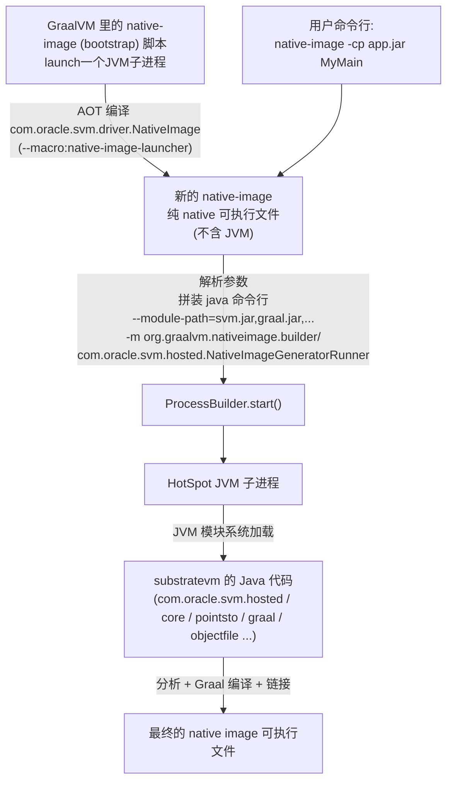
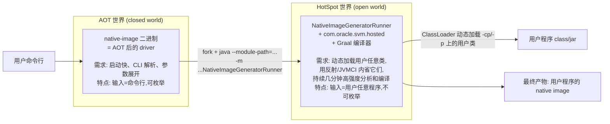
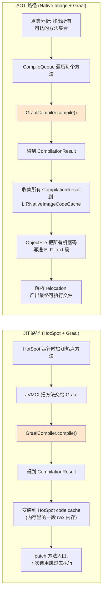

##  native-image的构建



native-image脚本启动jvm的命令:
```bash
exec "$GRAALVM/bin/java" \
-XX:MaxHeapSize=... -XX:+EnableJVMCI -XX:-UseJVMCICompiler \
-Dorg.graalvm.launcher.shell=true \
-Dorg.graalvm.launcher.executablename=$0 \
--module-path "$GRAALVM/lib/svm/bin/../../graalvm/svm-driver.jar:...其他 jar..." \
--module org.graalvm.nativeimage.driver/com.oracle.svm.driver.NativeImage \
"$@"
```

**所以无论是用native-image脚本编译native-image可执行文件还是使用native-image可执行文件构建native镜像，都使用了Graal 编译器**

---

## 1. 为什么要把 driver 单独 AOT 成 native-image

driver（`com.oracle.svm.driver.NativeImage`）承担的活其实非常"CLI 前端"：

- 解析几百个命令行选项（`--macro:xxx`、`-H:...`、`-J-...`、`-cp`、`-p`、`@argfile`、bundle 等）
- 展开各种 macro（比如 `--macro:native-image-launcher` 展开成一堆真实参数）
- 收集环境（`JAVA_HOME`、`GRAALVM_HOME`、Windows 上还要去 setup VS 环境变量等）
- 拼装一个巨长的 `java --module-path=... -m ...NativeImageGeneratorRunner ...` 命令
- fork 子进程并转发 IO、等退出码

这些活的特点是：**短命、启动敏感、逻辑复杂但不吃 CPU**。这正好命中 AOT 的甜区。

把它做成原生二进制的收益：

| 维度 | shell + java 版 driver | AOT 版 native-image |
|---|---|---|
| 启动时间 | 每次都要冷启一次 HotSpot（几百 ms 起步）只为解析参数 | 几毫秒进入 main |
| 平台一致性 | 要维护 `.sh` 和 `.cmd` 两套脚本，Windows 上处理引号/argfile 各种坑 | 一份 Java 代码，AOT 到各平台产物 |
| 用户体验 | `native-image --help` 都要等 JVM 冷启 | 秒回 |
| 依赖 | 依赖脚本能力和外部 java 可执行文件位置 | 自包含二进制 |
| bundle / 容器场景 | 脚本里写复杂逻辑非常痛苦 | 直接在 Java 里写，参见 [BundleSupport.java](/Users/liyang/IdeaProjects/graal/substratevm/src/com.oracle.svm.driver/src/com/oracle/svm/driver/BundleSupport.java) |

而且 driver 的代码量并不小（[NativeImage.java](/Users/liyang/IdeaProjects/graal/substratevm/src/com.oracle.svm.driver/src/com/oracle/svm/driver/NativeImage.java) 就有 2600 多行），用 shell 写迟早会失控。用 Java 写 + AOT，等于 **"用 Java 的开发体验，拿到 native 的启动体验"**——这正是 GraalVM Native Image 卖给用户的价值主张，它自己当然要吃自己的狗粮（dogfooding）。

所以 driver 做成 AOT 是**完全合理**的。真正的疑问是下一步：**为什么 builder 不一起 AOT？**

---

## 2. 为什么 builder（`NativeImageGeneratorRunner`）不一起 AOT

这才是这个设计"看起来奇怪"的关键。核心原因不是一个，而是好几个叠加起来的，按重要性排：

### 2.1 【最根本】builder 需要一个"完整的 JDK"来当分析原料
[查找文件]
看到关键点了：`installNativeImageClassLoader`、`NativeImageSystemClassLoader`、`ImageClassLoader`、`ModuleFinder.of(...)`、`ClassLoader.getSystemClassLoader()`……

这段代码是 builder 干的第一件事：**动态构造一个类加载器，把用户传进来的 `-cp` / `-p` 上所有 class 和 module 加载进当前 JVM 里**，然后靠**反射（`java.lang.reflect`）+ 模块系统 API + `MethodHandles.Lookup`** 去分析这些用户类的字段、方法、注解、静态初始化状态……

这就要命了：

- **builder 处理的输入，只有在运行时才知道**。用户可能给它 `Spring Boot 应用 + 500 个第三方 jar + 自己 500 个 class`，builder 必须能把这些东西加载进来当作"活的类"去内省。
- 而 native image 的核心前提是 **"closed-world 假设 + AOT 时确定所有类"**——如果你把 builder 自己 AOT 掉，AOT 时你根本不知道未来的用户会往这个 builder 里塞什么类，builder 里的分析代码就没法工作了。

换句话说，**builder 天然依赖的是"JVM 的开放世界 + 动态类加载 + 完整反射"这套能力**，而这正是 native image 有意放弃的能力。你要让一个"放弃了动态加载"的运行时去实现"动态加载别人的字节码来分析"——是自我矛盾的。

### 2.2 builder 内部大量使用 JVMCI / Graal / 反射的 host 侧能力

builder 里的 Graal 编译器需要：

- 通过 **JVMCI** 拿到 host JVM 的 `ResolvedJavaType`、`ResolvedJavaMethod`（分析用户的字节码需要）
- 通过反射读用户类的注解、静态字段、构造器
- 通过 `Unsafe` / `MethodHandles.Lookup.IMPL_LOOKUP` 拿到私有字段偏移量、模拟用户对象在 image heap 里的布局
- 用 `ServiceLoader` 加载 Feature、Substitution、Option 等扩展点

这些东西在 HotSpot 上是"官方 API"，在 SubstrateVM（native image 的运行时）上要么受限、要么行为不完全一样。让 builder 跑在 HotSpot 上，等于**免费得到一个完整的、稳定的 Java 反射/模块/JVMCI 环境**，成本是零。要在 SubstrateVM 上复刻一份，工程代价巨大。

### 2.3 image build 内存和 CPU 峰值巨大，JIT 更划算

builder 是**长命且吃 CPU/内存**的进程：

- 大一点的应用，image build 常见峰值 4~16 GB 内存，几分钟到几十分钟。
- 分析阶段有大量热点方法被反复调用（点集分析是不动点迭代）。

对这种负载，**HotSpot 的 C2 JIT 在跑几分钟后编出来的代码，质量和吞吐比 AOT 的还高**（因为它有 profile-guided 优化）。AOT 反而没什么优势，甚至可能更慢。

AOT 的甜头是"启动快"，但 builder 一次运行几分钟，启动那 200ms 完全不重要。

### 2.4 builder 依赖 host JDK 的实现细节，AOT 后耦合会失控

builder 里有大量代码在做类似"读取 host JDK 内部字段用于把它们镜像到 image heap"的操作，例如处理 `java.lang.String`、`java.util.HashMap`、`java.lang.invoke.MethodHandle` 这类核心类。这些逻辑天生**跟"我现在跑在的这个 JDK 版本"强耦合**。

- 如果 builder 跑在 HotSpot 上：用户升级 JDK21 → JDK25，builder 也随之看到新的 JDK 内部结构，Substitution/Feature 跟着适配即可。
- 如果把 builder AOT 掉：那份 AOT 二进制内嵌的是"编译它时那个 JDK"的镜像，用户换 JDK 后马上出现"AOT 里的 JDK 版本 ≠ 用户实际用的 JDK 版本"的错位问题。要么每个 JDK 版本发一份 builder AOT，要么想办法在 AOT builder 里"动态适配 host JDK"——两个都是灾难。

### 2.5 隔离性：builder 和用户代码同居一个 JVM 但不能污染彼此

builder 需要加载**用户的类**到"用于分析"的类加载器里；同时 builder 自己也是一堆 Java 类跑在同一个 JVM。为了不让用户类"看见" builder 的实现类，就需要精心设计的 **`NativeImageSystemClassLoader` + 独立 `ClassLoader` 层次结构**（代码里就看到了：`NativeImageClassLoaderSupport`、`NativeImageSystemClassLoader.singleton()`、`setNativeImageClassLoader(...)`）。

这套隔离在**跑在 HotSpot 上**是天然的、标准 Java 类加载器语义。要在 AOT 后的 SubstrateVM 里模拟出等价语义，非常别扭——因为 SubstrateVM 的 ClassLoader 是被极大简化过的（closed-world 假设下不需要真正的动态加载）。

---

## 3. 一句话总结这个设计

> **AOT 拿来做"启动敏感、逻辑固定"的部分（driver）；HotSpot 拿来做"需要开放世界、动态类加载、完整反射、长时间高负载"的部分（builder）。这是把两种运行时各自的长处用在了最合适的地方，而不是一个偷懒的妥协。**

再画一下角色分工，可能更直观：



___

## Graal编译器作为 JIT 和 AOT 的差异，全部集中在"两头"



**橙色的两个方块是完全同一份代码**。剩下的部分，是 HotSpot 和 SVM 各自的"编译器 driver"，负责回答两个问题：

1. **该编译什么？** JIT 靠 profile，AOT 靠点集分析。
2. **编译结果放哪儿？** JIT 放内存 code cache，AOT 放 ELF `.text` 段。