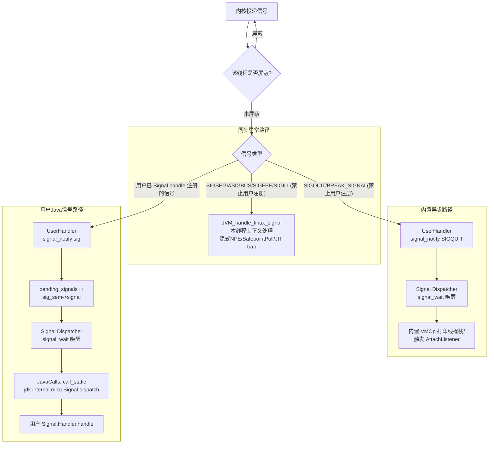

## JavaThread 的信号处理机制全景分析

### 三、整体信号路径示意

---

### 四、要点总结

1. **JavaThread 屏蔽哪些信号**
    - 强制屏蔽：`BREAK_SIGNAL`(SIGQUIT) — 只让 VMThread 接收。
    - 默认通过线程继承屏蔽：所有用户自定义异步信号（如 SIGUSR1 等）。这样保证它们只能被进程级 `sigaction` 注册的 `UserHandler` 在某个未屏蔽线程上接住，而**不会随机中断 Java 业务线程**。
    - 强制解除屏蔽：`SIGSEGV/SIGBUS/SIGFPE/SIGILL`（同步异常必须本线程处理）、`SR_signum`(SIGUSR2，VM 内部 suspend/resume)、Shutdown 信号。

2. **VMThread 的特殊性**：唯一解除 SIGQUIT 屏蔽的线程，所以 SIGQUIT 总能被它接走（`UserHandler` 的运行上下文之一），随后通过 `signal_notify` 唤醒 `Signal Dispatcher` 处理"打印线程栈"等动作。

3. **用户级信号到 Java 层的链路**：
    - 用户 `Signal.handle(sig, handler)` ⇒ JNI ⇒ `JVM_RegisterSignal` ⇒ `os::signal` ⇒ `sigaction(sig, UserHandler)`。
    - 信号到达 ⇒ `UserHandler` 在 async-signal-safe 上下文里只做 `pending_signals[sig]++` 和 `sem->signal()`。
    - "Signal Dispatcher" JavaThread 在 `signal_wait()` 上阻塞，被唤醒后 `JavaCalls::call_static` 调用 `jdk.internal.misc.Signal.dispatch(int)` 进入 Java 层完成真正派发。

4. **被 JVM 占用、禁止用户注册的信号**：
    - 始终禁止：`SIGFPE / SIGILL / SIGSEGV`（macOS 下还有 `SIGBUS`），`BREAK_SIGNAL`(SIGQUIT)。
    - 在 `-Xrs (ReduceSignalUsage)` 下：`SHUTDOWN1/2/3_SIGNAL` 也禁止；并且不会创建 Signal Dispatcher（`if (!ReduceSignalUsage)` 分支保护），SIGQUIT 也不再装内置 handler——这是为了让把 JVM 嵌入到自己进程的程序自己掌管信号。

5. **设计哲学**：
    - "同步异常 → 本线程立刻处理；异步信号 → 半异步队列化 → 专用 JavaThread 串行派发到 Java 层"，从而避免 async-signal-safe 限制下在任意线程上跑复杂的 Java 代码，也避免业务线程被异步信号随机打断。