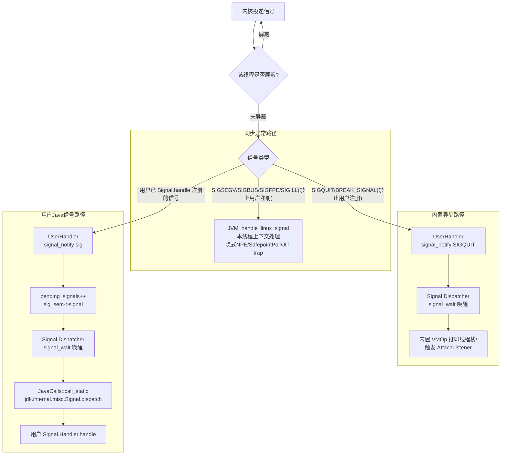

```mermaid
flowchart TB
A[内核投递信号] --> B{该线程是否屏蔽?}
B -- 屏蔽 --> A
B -- 未屏蔽 --> C{信号类型}

    subgraph 同步异常路径
      C -- SIGSEGV/SIGBUS/SIGFPE/SIGILL(禁止用户注册) --> D[JVM_handle_linux_signal<br/>本线程上下文处理<br/>隐式NPE/SafepointPoll/JIT trap]
    end

    subgraph 内置异步路径
      C -- SIGQUIT/BREAK_SIGNAL(禁止用户注册) --> E[UserHandler<br/>signal_notify SIGQUIT]
      E --> F[Signal Dispatcher<br/>signal_wait 唤醒]
      F --> G[内置:VMOp 打印线程栈/<br/>触发 AttachListener]
    end

    subgraph 用户Java信号路径
      C -- 用户已 Signal.handle 注册的信号 --> H[UserHandler<br/>signal_notify sig]
      H --> I[pending_signals++<br/>sig_sem->signal]
      I --> J[Signal Dispatcher<br/>signal_wait 唤醒]
      J --> K[JavaCalls::call_static<br/>jdk.internal.misc.Signal.dispatch]
      K --> L[用户 Signal.Handler.handle]
    end
```
