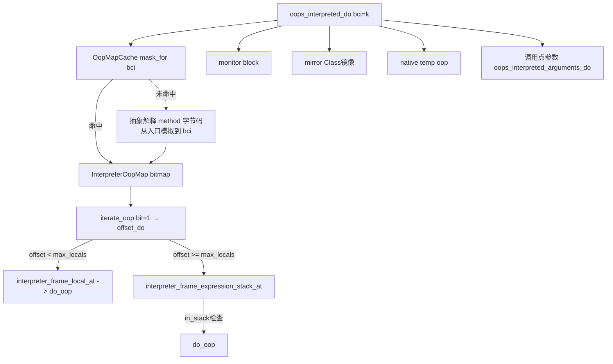
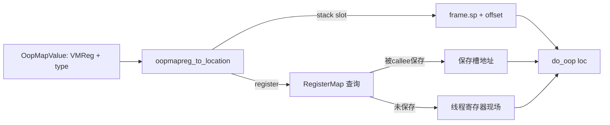
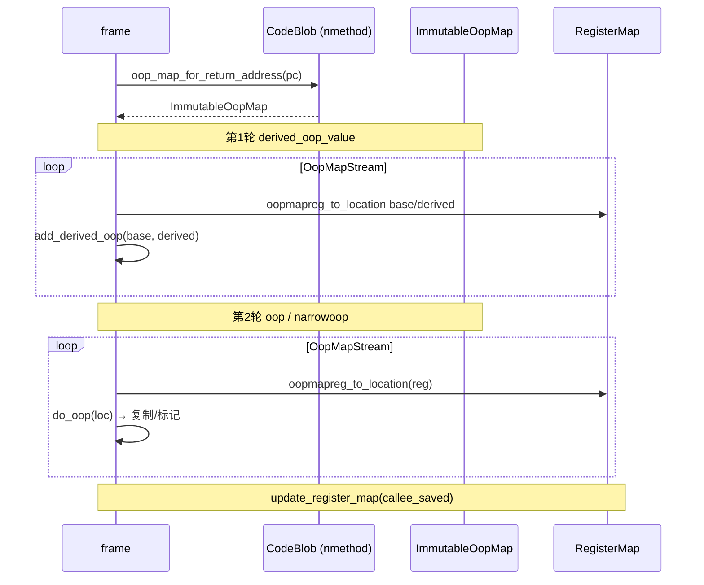
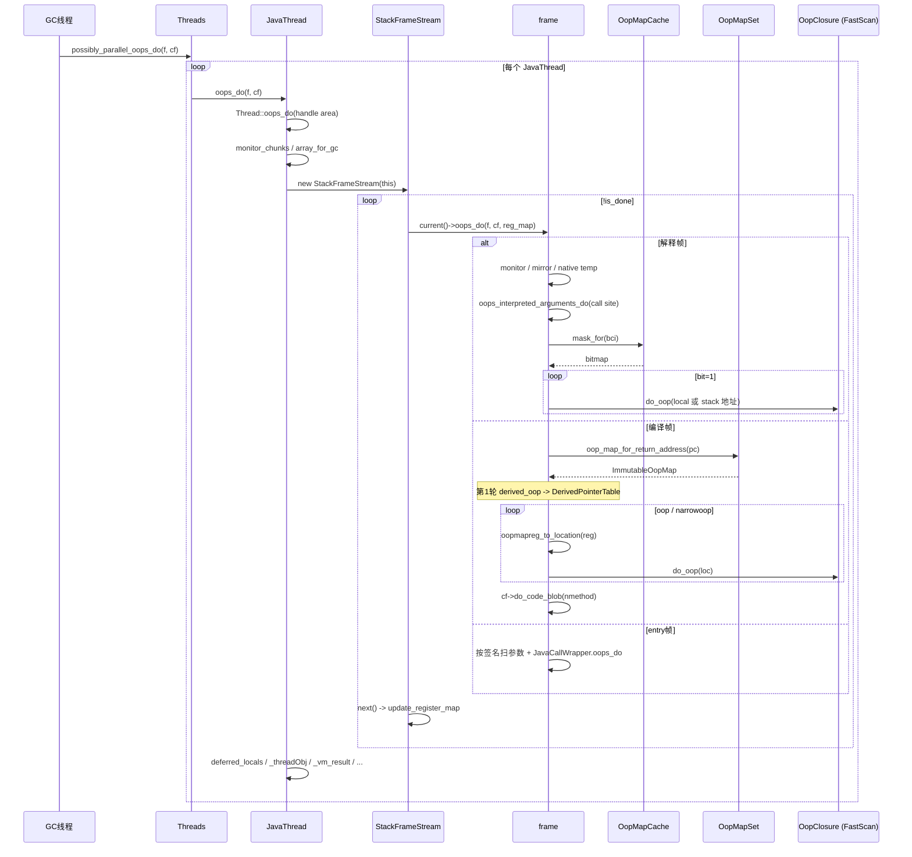

# 栈帧中局部变量与操作数栈的 GC Root 扫描逻辑

## 一、核心难题：栈是"非类型化"的内存

Java 栈每个 slot（解释器中是 `intptr_t` 字宽，编译器中是寄存器 + 栈位置）在不同时刻可能装着：

| 内容 | 是否需要被 GC 看见 |
|-----|------------------|
| 对象引用 oop | ✅ 必须 |
| int/long/float/double 等基本类型 | ❌ 不能当 oop 处理（否则乱写指针就是灾难） |
| 返回地址 / 帧指针 | ❌ |
| derived oop（指向对象内部偏移） | ✅ 但需特殊处理 |
| 中间计算值 | 视情况 |

**HotSpot 的解法**：编译期 / 解释期为每段代码生成一份 **OopMap**（Oop-Map），告诉 GC：
> 在某个 PC 处暂停时，哪些 slot / 哪些寄存器装着 oop。

GC 只扫 OopMap 标记为 oop 的位置，从根本上保证精确性。这就是 HotSpot 的**精确式 GC（Exact GC / Precise GC）**。

---

## 二、整体调用链

```
GenCollectedHeap::process_roots
  └─ Threads::possibly_parallel_oops_do                  // thread.cpp:4648
       └─ JavaThread::oops_do (每个 Java 线程)            // thread.cpp:2951
            ├─ Thread::oops_do (handle area / active_handles 等)
            ├─ _array_for_gc / monitor_chunks
            ├─ ★ for (StackFrameStream fst; ...) {
            │      fst.current()->oops_do(f, cf, regmap)  // ← 逐帧扫描
            │  }
            ├─ deferred_locals (JVMTI set_locals)
            ├─ _threadObj / _vm_result / _exception_oop / _pending_async_exception
            └─ jvmti_thread_state->oops_do

frame::oops_do_internal                                    // frame.cpp:1040
  ├─ is_interpreted_frame() → oops_interpreted_do          // 解释帧
  ├─ is_entry_frame()       → oops_entry_do                // 入口帧（C→Java 边界）
  └─ CodeCache::contains(pc)→ oops_code_blob_do            // 编译帧（JIT）
                                  └─ OopMapSet::oops_do
```

---

## 三、`JavaThread::oops_do`：线程级编排

[thread.cpp:2951](/Users/liyang/workspace/jdk15/src/hotspot/share/runtime/thread.cpp)

```cpp
void JavaThread::oops_do(OopClosure* f, CodeBlobClosure* cf) {
  Thread::oops_do(f, cf);                       // ① handle area 等线程通用根

  if (has_last_Java_frame()) {
    // ② JNI 局部句柄、线程内的 GrowableArray<oop>
    if (_array_for_gc != NULL) { ... }

    // ③ 重量级监视器
    for (MonitorChunk* chunk = monitor_chunks(); ...) chunk->oops_do(f);

    // ★ ④ 逐帧扫描整个 Java 调用栈
    for (StackFrameStream fst(this); !fst.is_done(); fst.next()) {
      fst.current()->oops_do(f, cf, fst.register_map());
    }
  }

  // ⑤ JVMTI deferred local 写入（debugger SetLocalObject 的延迟生效）
  GrowableArray<jvmtiDeferredLocalVariableSet*>* list = deferred_locals();
  if (list != NULL) for (...) list->at(i)->oops_do(f);

  // ⑥ JavaThread 自身字段
  f->do_oop((oop*) &_threadObj);
  f->do_oop((oop*) &_vm_result);
  f->do_oop((oop*) &_exception_oop);
  f->do_oop((oop*) &_pending_async_exception);

  if (jvmti_thread_state() != NULL) jvmti_thread_state()->oops_do(f, cf);
}
```

### 关键点：`StackFrameStream` 自栈顶向栈底逐帧迭代

它内部维护一个 `RegisterMap`，每跨过一帧，就根据 caller 的 OopMap 还原 callee-saved 寄存器在栈中的保存位置（`OopMapSet::update_register_map`），保证后续帧能正确解析寄存器中的 oop。

---

## 四、`frame::oops_do_internal`：分派三种帧类型

[frame.cpp:1040](/Users/liyang/workspace/jdk15/src/hotspot/share/runtime/frame.cpp)

```cpp
void frame::oops_do_internal(OopClosure* f, CodeBlobClosure* cf,
                             RegisterMap* map, bool use_interpreter_oop_map_cache) {
  if (is_interpreted_frame()) {
    oops_interpreted_do(f, map, use_interpreter_oop_map_cache);
  } else if (is_entry_frame()) {
    oops_entry_do(f, map);
  } else if (CodeCache::contains(pc())) {
    oops_code_blob_do(f, cf, map);
  } else {
    ShouldNotReachHere();
  }
}
```

下面分别详解。

---

## 五、★ 解释帧（Interpreted Frame）扫描

### 1. 解释栈帧布局

```
高地址 ┌───────────────────────────────┐
       │   parameter / locals[0..N]    │  ← interpreter_frame_local_at(i)
       ├───────────────────────────────┤
       │   monitor block (锁)          │  ← interpreter_frame_monitor_*
       ├───────────────────────────────┤
       │   Method*      （持有方法）   │
       │   mirror       （Class oop）  │  ★ 显式作为 GC root
       │   bcp / mdx / locals / ...    │
       │   sender_sp / saved_fp        │
       ├───────────────────────────────┤
       │   expression stack[0..M]      │  ← interpreter_frame_expression_stack_at(i)
低地址 └───────────────────────────────┘  ← TOS = interpreter_frame_tos_address
```

### 2. `oops_interpreted_do` 完整逻辑

[frame.cpp:814](/Users/liyang/workspace/jdk15/src/hotspot/share/runtime/frame.cpp)

```cpp
void frame::oops_interpreted_do(OopClosure* f, const RegisterMap* map,
                                bool query_oop_map_cache) {
  methodHandle m (thread, interpreter_frame_method());
  jint bci = interpreter_frame_bci();

  // (a) 监视器 BasicObjectLock 中的对象引用
  for (BasicObjectLock* current = interpreter_frame_monitor_end();
       current < interpreter_frame_monitor_begin();
       current = next_monitor_in_interpreter_frame(current)) {
      current->oops_do(f);
  }

  // (b) native 方法的 receiver/return 临时槽
  if (m->is_native()) f->do_oop(interpreter_frame_temp_oop_addr());

  // (c) ★ Class mirror 必须作为根（防止 Method* 持有的 Klass 被卸载）
  f->do_oop(interpreter_frame_mirror_addr());

  int max_locals = m->is_native() ? m->size_of_parameters() : m->max_locals();

  // (d) 调用点上：对被调用方法的入参进行参数 oop 扫描
  if (!m->is_native()) {
    Bytecode_invoke call = Bytecode_invoke_check(m, bci);
    if (call.is_valid()) {
      if (map->include_argument_oops() &&
          interpreter_frame_expression_stack_size() > 0) {
        oops_interpreted_arguments_do(call.signature(), call.has_receiver(), f);
      }
    }
  }

  // (e) ★★★ 局部变量 + 操作数栈 = 由 OopMap 精确驱动
  InterpreterFrameClosure blk(this, max_locals, m->max_stack(), f);
  InterpreterOopMap mask;
  if (query_oop_map_cache) m->mask_for(bci, &mask);
  else                     OopMapCache::compute_one_oop_map(m, bci, &mask);
  mask.iterate_oop(&blk);
}
```

### 3. 解释器 OopMap：从字节码抽象解释而来

每个方法在 GC 时需要：**"在 BCI=k 处，locals[0..N] 与 stack[0..M] 中哪些 slot 是 oop？"**

HotSpot 的做法是**抽象解释字节码**，从方法入口模拟到 BCI=k，记录每条指令对 locals / 操作数栈的影响（push oop / pop oop / load / store / new / invoke 等），最终得到一个 bitmap：

```
bit = 1 表示该 slot 是 oop
bit = 0 表示该 slot 是基本类型/不存活/中间值

[ locals(max_locals) | expression_stack(max_stack) ]
   ↑                                          ↑
   bit 0                                   bit (max_locals + max_stack - 1)
```

为加速，HotSpot 维护 `OopMapCache`（每个方法 N 个槽位），命中时直接返回；未命中则按 BCI 重新计算。

### 4. `InterpreterOopMap::iterate_oop`：bit 驱动扫描

[oopMapCache.cpp:203](/Users/liyang/workspace/jdk15/src/hotspot/share/interpreter/oopMapCache.cpp)

```cpp
void InterpreterOopMap::iterate_oop(OffsetClosure* oop_closure) const {
  int n = number_of_entries();
  for (int i = 0; i < n; i++) {
    if (is_oop(i)) oop_closure->offset_do(i);  // 只对 bit=1 的 slot 回调
  }
}
```

### 5. `InterpreterFrameClosure::offset_do`：把 bit 偏移翻译为栈地址

[frame.cpp:691](/Users/liyang/workspace/jdk15/src/hotspot/share/runtime/frame.cpp)

```cpp
void offset_do(int offset) {
  oop* addr;
  if (offset < _max_locals) {
    // 局部变量区
    addr = (oop*) _fr->interpreter_frame_local_at(offset);
    _f->do_oop(addr);
  } else {
    // 操作数栈
    addr = (oop*) _fr->interpreter_frame_expression_stack_at(offset - _max_locals);

    // 异常时 esp 会被重置；只在 addr 仍处于活跃栈范围时调用
    bool in_stack = (frame::interpreter_frame_expression_stack_direction() > 0)
                    ? (intptr_t*)addr <= _fr->interpreter_frame_tos_address()
                    : (intptr_t*)addr >= _fr->interpreter_frame_tos_address();
    if (in_stack) _f->do_oop(addr);
  }
}
```

> 注意 `if (in_stack)`：异常抛出时操作数栈会被截断，bitmap 中位于 esp 之外的 oop slot **必须忽略**（其内容已无意义）。

### 6. 解释帧扫描可视化



---

## 六、★ 编译帧（Compiled / nmethod Frame）扫描

JIT 编译后，局部变量和操作数栈被分配到 **寄存器** 或 **栈 slot**，且经过寄存器分配、SSA 优化后，原始的"局部变量表/操作数栈"概念已不存在。所以编译器在每个 **safepoint**（method-entry、循环回边、call-site、return）处，**生成对应的 OopMap**，记录此 PC 处所有寄存器和栈 slot 的 oop 状态。

### 1. `oops_code_blob_do` 入口

[frame.cpp:899](/Users/liyang/workspace/jdk15/src/hotspot/share/runtime/frame.cpp)

```cpp
void frame::oops_code_blob_do(OopClosure* f, CodeBlobClosure* cf,
                              const RegisterMap* reg_map) {
  if (_cb->oop_maps() != NULL) {
    OopMapSet::oops_do(this, reg_map, f);                    // ★ 核心
    if (reg_map->include_argument_oops()) {
      _cb->preserve_callee_argument_oops(*this, reg_map, f); // c2i 边界保护参数
    }
  }
  if (cf != NULL) cf->do_code_blob(_cb);                     // 标记 nmethod 自身
}
```

### 2. 选取本帧 PC 的 OopMap

每个 nmethod 内部有 `OopMapSet`，按 safepoint PC 索引到 `ImmutableOopMap`：

```cpp
const ImmutableOopMap* map = cb->oop_map_for_return_address(fr->pc());
```

返回的 OopMap 是一组 `(VMReg, oop_type)` 二元组，oop_type 取值：

| 类型 | 含义 |
|------|------|
| `oop_value` | 普通对象指针 |
| `narrowoop_value` | 压缩指针（CompressedOops） |
| `derived_oop_value` | 派生指针：指向对象内部某偏移（base + offset） |
| `callee_saved_value` | 被本帧保存的 caller 寄存器 |

### 3. `OopMapSet::all_do`：两轮扫描

[oopMap.cpp:236](/Users/liyang/workspace/jdk15/src/hotspot/share/compiler/oopMap.cpp)

#### 第 1 轮：处理 derived pointer（派生指针）

派生指针指向对象内部（典型例子：`oop + offset` 用作循环游标）。如果 GC 移动了 base oop，派生指针也必须被相应调整。

```cpp
for (OopMapStream oms(map); !oms.is_done(); oms.next()) {
  if (omv.type() != OopMapValue::derived_oop_value) continue;
  oop* derived_loc = fr->oopmapreg_to_location(omv.reg(),         reg_map);
  oop* base_loc    = fr->oopmapreg_to_location(omv.content_reg(), reg_map);
  if (base_loc != NULL && *base_loc != NULL && !CompressedOops::is_base(*base_loc)) {
    derived_oop_fn(base_loc, derived_loc);   // 通常 add_derived_oop：登记到 DerivedPointerTable
  }
}
```

为什么要先处理 derived？因为后面会移动 base，**必须在移动前把"derived 与 base 的偏移差"记录下来**，等移动后再用 `DerivedPointerTable::update_pointers()` 修正。

#### 第 2 轮：处理普通 oop / narrow oop

```cpp
for (OopMapStream oms(map); !oms.is_done(); oms.next()) {
  oop* loc = fr->oopmapreg_to_location(omv.reg(), reg_map);
  if (omv.type() == OopMapValue::oop_value) {
    oop val = *loc;
    if (val == NULL || CompressedOops::is_base(val)) continue;
    oop_fn->do_oop(loc);           // ← 真正回调
  } else if (omv.type() == OopMapValue::narrowoop_value) {
    narrowOop *nl = (narrowOop*)loc;
    // 大端 + 寄存器：低 32 位偏移修正
    oop_fn->do_oop(nl);
  }
}
```

### 4. `oopmapreg_to_location`：把 VMReg 解析成内存地址

VMReg 是抽象寄存器号；`oopmapreg_to_location` 根据它判断：
- 如果是栈位置 → 返回 `frame.sp() + offset`
- 如果是寄存器 → 查 `RegisterMap`，看该寄存器是否被 callee 保存过；若被保存则返回保存槽的地址，否则返回当前线程上下文中该寄存器的位置



### 5. RegisterMap 的累积更新

`StackFrameStream::next()` 每跨一帧，会调用 `OopMapSet::update_register_map`，把当前帧 OopMap 中标记为 `callee_saved_value` 的项写入 `RegisterMap`。这样下一帧（更老的帧）扫描时，就能知道：
- 我（caller）原本保存在 RBX 寄存器里的 oop，被被调用者保存到了它的栈帧某个槽里 —— 现在我就该去那个槽里读它。

这是"逐帧扫描"得以正确处理寄存器中 oop 的关键。

### 6. 编译帧扫描可视化



---

## 七、入口帧（Entry Frame）扫描

C 代码调用 Java（`JavaCalls::call`、JNI `CallXxx`）时会建立一个特殊的 **entry frame**，其中保存了 `JavaCallWrapper`（含 JNI handle block）和实参。这些实参在 Java 视角里就是 stack/locals 的来源。

[frame.cpp:1026](/Users/liyang/workspace/jdk15/src/hotspot/share/runtime/frame.cpp)

```cpp
void frame::oops_entry_do(OopClosure* f, const RegisterMap* map) {
  if (map->include_argument_oops()) {
    methodHandle m (thread, entry_frame_call_wrapper()->callee_method());
    EntryFrameOopFinder finder(this, m->signature(), m->is_static());
    finder.arguments_do(f);                        // 按签名扫描参数中的 oop
  }
  entry_frame_call_wrapper()->oops_do(f);          // JNI handle block
}
```

`EntryFrameOopFinder` 是一个 `SignatureIterator`：按方法签名 `(Ljava/lang/String;I)V` 顺序遍历参数类型，遇到 `is_reference_type` 就把对应栈位置当作 oop 上报。

---

## 八、调用点参数的特殊处理：`oops_interpreted_arguments_do` 与 `preserve_callee_argument_oops`

跨帧调用瞬间存在一个微妙问题：**调用方把参数压栈/放寄存器后**，**被调用方还没建立帧**，此时操作数栈顶的 oop 既不在 caller OopMap 里（已 pop 到调用现场），也不在 callee 帧里（还没建好）。

HotSpot 的解法：在 caller 的 invoke bytecode 处，由 `oops_interpreted_arguments_do` 按 callee 签名补扫操作数栈顶的实参。编译器 c2i/i2c 适配桩则用 `preserve_callee_argument_oops`。

```cpp
// frame.cpp:761
void oops_interpreted_arguments_do(Symbol* signature, bool has_receiver, OopClosure* f) {
  InterpretedArgumentOopFinder finder(signature, has_receiver, this, f);
  finder.oops_do();
}
```

---

## 九、监视器（synchronized 锁）的扫描

`synchronized` 块在解释器中通过 **BasicObjectLock**（包含 `oop _obj` + `BasicLock _lock`）记录在栈帧的监视器区域。`oops_interpreted_do` 第一步就遍历它们：

```cpp
for (BasicObjectLock* current = interpreter_frame_monitor_end();
     current < interpreter_frame_monitor_begin();
     current = next_monitor_in_interpreter_frame(current)) {
  current->oops_do(f);                    // 仅扫描 obj 字段
}
```

编译代码中的 `synchronized` 块的 BasicLock 信息通过 OopMap 标记。

---

## 十、整体扫描时序图（端到端）



---

## 十一、关键要点速查

| 维度 | 解释帧 | 编译帧 |
|------|--------|--------|
| 局部变量 | `interpreter_frame_local_at(i)` | OopMap → `oopmapreg_to_location(VMReg)` |
| 操作数栈 | `interpreter_frame_expression_stack_at(i)` | 同上（已被寄存器分配/栈 slot 化） |
| 哪些是 oop | 按 BCI 查 OopMap **bitmap**（`InterpreterOopMap`） | 按 PC 查 OopMap **stream**（`ImmutableOopMap`） |
| OopMap 来源 | `OopMapCache` 抽象解释字节码生成 | JIT 编译时在每个 safepoint 生成 |
| 监视器 | `BasicObjectLock` 链表遍历 | OopMap 携带的特殊条目 |
| Class 镜像 | 显式 `interpreter_frame_mirror_addr` | 通过 `cf->do_code_blob` 标记 nmethod，间接保活 |
| 调用点参数 | `oops_interpreted_arguments_do`（按签名补扫） | `preserve_callee_argument_oops`（c2i 适配桩） |
| 派生指针 | 解释器中无 | 第 1 轮先处理，登记 `DerivedPointerTable` |
| 寄存器中的 oop | 解释器无（使用栈） | `RegisterMap` 累积 callee-saved，逐帧还原 |
| 异常时 esp 被截断 | `in_stack` 检查 | OopMap 不含 esp 之外的 slot |

---

## 十二、设计哲学总结

1. **精确性来自编译期 / 解释期的元信息（OopMap）**：GC 不"猜"，而是按预先生成的位图/流精确定位 oop。这就是 HotSpot 称为 *Exact / Precise GC* 的原因（对比保守式 GC 如早期 Boehm GC 会扫描整个栈把任何"看起来像指针"的字当 oop）。

2. **解释器与编译器各有 OopMap 实现**：解释器走 `OopMapCache` + 字节码抽象解释（粒度=BCI）；编译器在 safepoint 处由 JIT 生成（粒度=PC）。

3. **"寄存器 + 栈"统一为 VMReg 抽象**：编译帧通过 `RegisterMap` 把寄存器槽和栈槽统一成内存地址。

4. **逐帧扫描自栈顶向栈底**：每跨一帧更新 RegisterMap，使老帧的寄存器 oop 也能被定位。

5. **派生指针两轮扫描**：先记录"base→derived 偏移"，再处理 base，最后修正 derived，避免移动后偏移失效。

6. **调用点边界 + entry frame 边界**：通过特殊处理保证跨帧切换瞬间的 oop 不丢失。

正是这套机制，让 HotSpot 在 STW 期间能在毫秒内精确扫描出每个 Java 线程栈上的所有 oop，作为 GC Root 的"重头戏"。