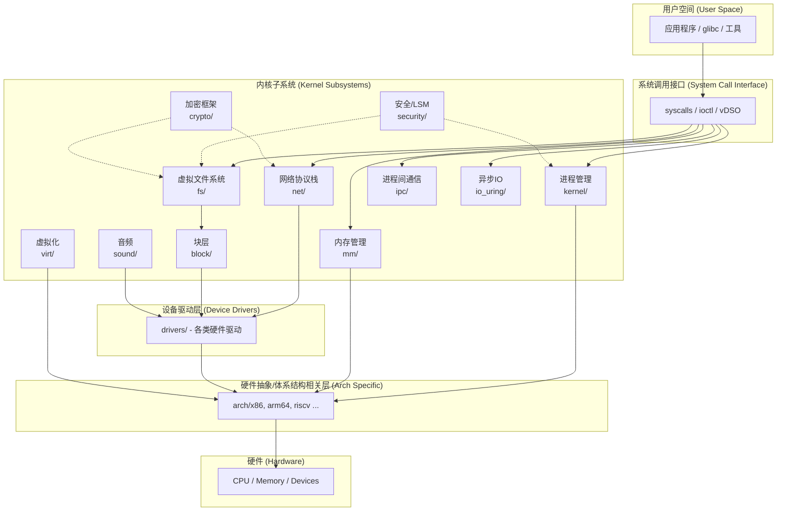

# Linux 内核源码 — 架构分析与目录结构说明

## 二、整体架构分层

Linux 内核采用**宏内核（Monolithic Kernel）+ 模块化（LKM）**架构，典型的分层视图如下：

---

## 三、顶层目录结构说明

### 1. 核心子系统目录（运行时内核功能）

| 目录 | 职责说明 |
|------|----------|
| [kernel/](/linux/kernel) | **内核核心**：调度器、进程/线程管理、信号、定时器、cgroup、futex、tracing、locking、time 等基础设施 |
| [mm/](/linux/mm) | **内存管理**：物理/虚拟页面分配（buddy、slab/slub）、VMA、page cache、swap、OOM、NUMA、memcg |
| [fs/](/linux/fs) | **文件系统**：VFS 层 + 各具体文件系统（ext4、xfs、btrfs、f2fs、proc、sysfs、tmpfs、overlayfs 等） |
| [net/](/linux/net) | **网络协议栈**：socket、IPv4/IPv6、TCP/UDP、netfilter、bridge、wireless、bluetooth、xdp/eBPF 网络 |
| [ipc/](/linux/ipc) | **进程间通信**：System V IPC（消息队列、信号量、共享内存）、POSIX MQ |
| [block/](/linux/block) | **块设备层**：通用块层、bio、I/O 调度器（BFQ、mq-deadline、kyber）、blk-cgroup、加密 |
| [io_uring/](/linux/io_uring) | **高性能异步 I/O**：io_uring 框架，新一代用户态/内核态共享环形队列 |
| [security/](/linux/security) | **安全子系统**：LSM 框架及实现（SELinux、AppArmor、Smack、Yama、Landlock、IMA、TOMOYO） |
| [crypto/](/linux/crypto) | **内核加密框架**：对称/非对称算法、哈希、AEAD、压缩；为 dm-crypt、IPsec、fscrypt 提供算法 |
| [sound/](/linux/sound) | **音频子系统**：ALSA、OSS 兼容、SoC 音频（ASoC） |
| [virt/](/linux/virt) | **虚拟化通用代码**：KVM 中与架构无关的部分（架构相关在 `arch/*/kvm/`） |
| [certs/](/linux/certs) | **证书与签名**：模块签名密钥、系统密钥环 |

### 2. 体系结构相关

| 目录 | 说明 |
|------|------|
| [arch/](/linux/arch) | **CPU 架构相关代码**：每个子目录对应一种架构，如 `x86/`、`arm64/`、`riscv/`、`powerpc/`、`s390/`、`loongarch/`、`mips/`、`um/`（用户态 Linux）等。每个架构内含：`boot/`、`kernel/`、`mm/`、`include/`、`kvm/`、`crypto/`、`configs/` |

### 3. 设备驱动

| 目录 | 说明 |
|------|------|
| [drivers/](/linux/drivers) | **所有设备驱动**：占内核代码量绝大部分。包含 PCI、USB、网卡（net/）、GPU（gpu/）、存储（scsi/、nvme/、ata/）、字符设备、I2C/SPI、IIO、媒体、虚拟化驱动等 |

### 4. 公共代码与库

| 目录 | 说明 |
|------|------|
| [include/](/linux/include) | **全局头文件**：`linux/`（内核内部 API）、`uapi/`（用户空间 ABI）、`asm-generic/`、`net/`、`sound/`、`drm/` 等 |
| [lib/](/linux/lib) | **内核通用库**：数据结构（rbtree、xarray、idr）、字符串、CRC、压缩、debug 工具（KASAN/UBSAN 辅助） |
| [init/](/linux/init) | **内核启动初始化**：`main.c` 中的 `start_kernel()`、initcall、initramfs 处理 |
| [usr/](/linux/usr) | 把 initramfs 打包到内核镜像的辅助代码 |
| [rust/](/linux/rust) | **Rust for Linux**：内核 Rust 抽象层、`kernel` crate、绑定生成 |

### 5. 工具与构建

| 目录 | 说明 |
|------|------|
| [scripts/](/linux/scripts) | **构建脚本与工具**：Kconfig 解析、模块签名、checkpatch、coccinelle、dtc、gdb 辅助 |
| [tools/](/linux/tools) | **用户态工具**：`perf`、`bpf/`（libbpf、bpftool）、`testing/selftests`、`virtio/`、`power/` 等 |
| [samples/](/linux/samples) | **示例代码**：BPF 示例、内核模块示例、tracing 示例、Rust 示例 |
| [Documentation/](/linux/Documentation) | **官方文档**（reST/Sphinx）：admin-guide、core-api、driver-api、process、各子系统专题 |

## 四、关键架构特征

### 1. 宏内核 + 可加载模块（LKM）
- 调度、内存、文件系统、网络等都运行在同一个内核地址空间。
- 通过 `CONFIG_MODULES`，驱动和子系统可编译为 `.ko` 模块在运行时插入/卸载（`insmod/rmmod`）。

### 2. 配置驱动（Kconfig）
- 整棵树的功能由 `Kconfig` 文件描述，通过 `make menuconfig` 生成 `.config`，再由 Kbuild 选择性编译。
- 所有子目录都有自己的 `Kconfig` 和 `Makefile`，呈递归式组织。

### 3. 抽象与移植性
- **架构无关代码**集中在顶层（`kernel/`、`mm/`、`fs/`...），通过 `include/asm-generic/` 提供默认实现。
- **架构相关代码**全部隔离在 `arch/<arch>/`，通过 `arch/<arch>/include/asm/` 覆盖通用定义。
- **设备无关层 vs 设备相关层**：典型如 VFS（fs/）↔ 具体 FS、块层（block/）↔ 块驱动、网络栈（net/）↔ 网卡驱动。

### 4. 子系统横切机制
- **LSM 钩子**：`security/` 在关键路径（exec、open、socket）插桩。
- **cgroup / namespace**：`kernel/cgroup`、`kernel/nsproxy.c`，被 `mm/`、`net/`、`block/`、`fs/` 共同使用。
- **eBPF**：`kernel/bpf/`、`net/`、`drivers/` 之间贯穿，提供可编程数据/控制路径。
- **tracing/perf**：`kernel/trace/`、`tools/perf/`，与 `arch/` 的 PMU 协作。

---

## 五、典型代码导航建议

| 想了解什么 | 入口位置 |
|---|---|
| 内核启动流程 | `init/main.c` 中的 `start_kernel()` |
| 进程调度 | `kernel/sched/core.c`、`kernel/sched/fair.c` |
| 系统调用表 | `arch/x86/entry/syscalls/syscall_64.tbl`（x86_64） |
| 页表/缺页 | `mm/memory.c`、`arch/<arch>/mm/fault.c` |
| VFS 入口 | `fs/namei.c`、`fs/open.c`、`fs/read_write.c` |
| TCP 实现 | `net/ipv4/tcp_*.c` |
| 块层提交 IO | `block/blk-mq.c`、`block/blk-core.c` |
| KVM | `virt/kvm/`、`arch/x86/kvm/`、`arch/arm64/kvm/` |
| Rust 抽象 | `rust/kernel/` |
| 构建机制 | `scripts/Makefile.*`、`Documentation/kbuild/` |