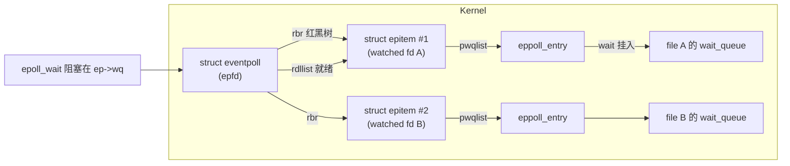
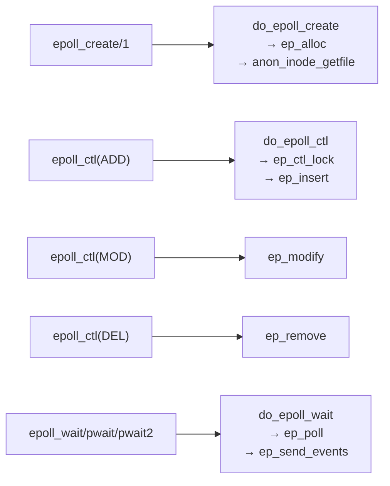
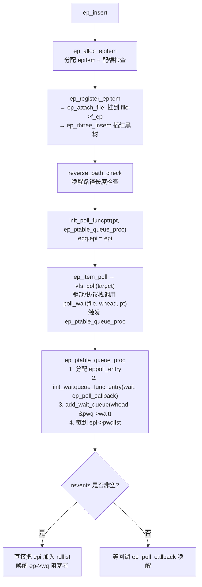
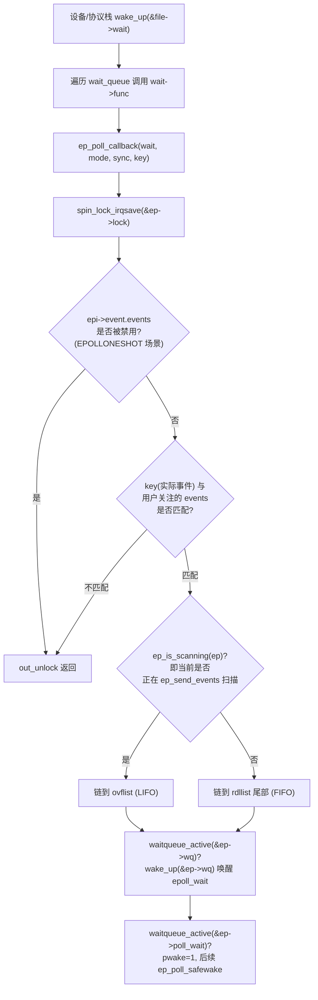
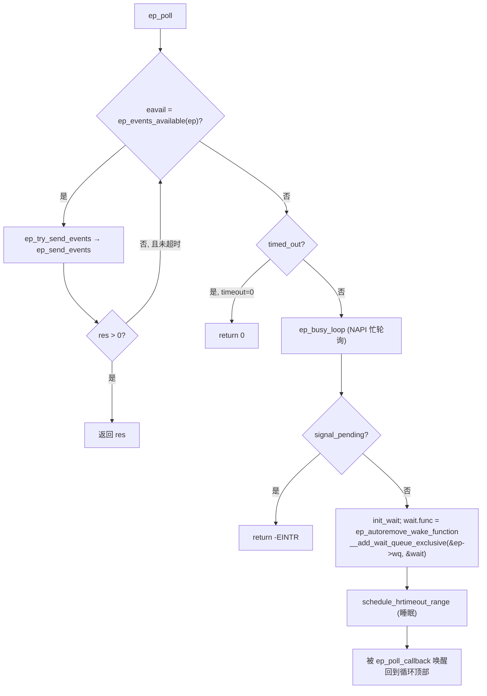
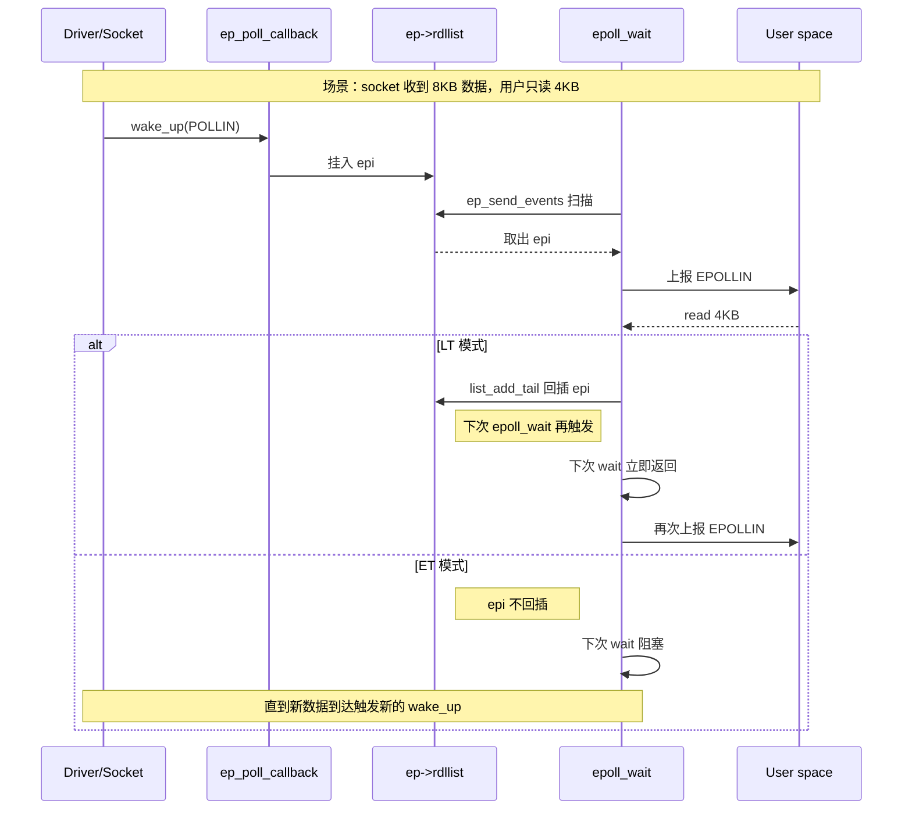

[任务规划完成]
我来深入分析 epoll 的实现细节，特别是边缘触发（ET）和水平触发（LT）的机制。首先读取核心文件。
[读取文件]
文件已完整读取。下面我基于源码给出 epoll 实现细节 + ET/LT 的完整分析。

---

# epoll 实现细节全景分析

## 一、核心数据结构

### 1.1 `struct eventpoll` — epoll 实例本体

存储于 epoll fd 的 `file->private_data`，见 [fs/eventpoll.c:236-289](/linux/fs/eventpoll.c)：

| 字段 | 用途 | 保护锁 |
|---|---|---|
| `mtx` | 睡眠互斥锁，串行化大部分操作 | 自身 |
| `wq` | `epoll_wait()` 阻塞等待队列 | `ep->lock` |
| `poll_wait` | 被其他 epoll 监听时用的等待队列（嵌套 epoll） | 内部 spinlock |
| `rdllist` | **就绪链表**（FIFO 双向链表） | `ep->lock` (IRQ-safe) |
| `ovflist` | **溢出链表**（LIFO 单向链表），扫描期间接收新就绪事件 | `ep->lock` |
| `lock` | IRQ 安全自旋锁，用于 `ep_poll_callback` 硬中断上下文 | — |
| `rbr` | **红黑树**根，键是 `<file*, fd>`，索引所有 `epitem` | `ep->mtx` |
| `refcount` | 引用计数 | 原子 |

### 1.2 `struct epitem` — 每个被监听的 fd 对应一个

见 [fs/eventpoll.c:203-234](/linux/fs/eventpoll.c)：

```
rbn           - 红黑树节点（在 ep->rbr 中）
rdllink       - 挂到 ep->rdllist 的链表节点
ovflist_next  - 挂到 ep->ovflist 的链表节点
ffd           - {file*, fd}，红黑树 key
pwqlist       - 一个 fd 可能挂多个 wait queue（如 socket 有 in/out），链表
ep            - 反指 owning eventpoll
fllink        - 挂到 file->f_ep 的节点（一个 file 可被多个 epoll 监听）
event         - 用户注册的 epoll_event（含 EPOLLET/EPOLLONESHOT 等）
```

### 1.3 `struct eppoll_entry` — 挂到被监听文件等待队列的"钩子"

见 [fs/eventpoll.c:190-201](/linux/fs/eventpoll.c)：

```
wait   - 挂到 target 文件 wait_queue 的节点，回调函数是 ep_poll_callback
whead  - 反指 wait_queue_head
base   - 反指 epitem
next   - 链在 epi->pwqlist
```

### 1.4 三者关系图



---

## 二、五大系统调用的实现链路



### 2.1 `epoll_ctl(EPOLL_CTL_ADD)` — `ep_insert`

见 [fs/eventpoll.c:1682-1755](/linux/fs/eventpoll.c)：



关键：`ep_ptable_queue_proc` 是这套机制的"注入点"，它把 `ep_poll_callback` 塞进 target 文件的 wait_queue，从此该 fd 一有事件，callback 就被 `wake_up()` 触发。

### 2.2 `ep_poll_callback` — 事件汇聚点

见 [fs/eventpoll.c:1372-1462](/linux/fs/eventpoll.c)。这是**中断/软中断上下文**执行的核心：



关键点：
- 处理 **`EPOLLEXCLUSIVE`**（第 1416-1432 行）：多线程共享 epoll 场景避免"惊群"，只唤醒一个 waiter。
- 处理 **POLLFREE**（第 1461-1471 行）：wait queue 被销毁时的 acquire/release 握手。

### 2.3 `epoll_wait` → `ep_poll` → `ep_send_events`

见 [fs/eventpoll.c:2013-2114](/linux/fs/eventpoll.c)：



`ep_send_events` 是**真正搬运事件到用户态**的地方（[fs/eventpoll.c:1902-1948](/linux/fs/eventpoll.c)），也是 **ET/LT 差异的分水岭**——见第三节。

---

## 三、就绪链表状态机 —— 理解 ET/LT 的关键

epoll 内部维护**两条**"就绪信息"链表，靠 `ep->ovflist` 的三态实现同步：

| `ep->ovflist` 值 | 含义 | `ep_poll_callback` 何去何从 |
|---|---|---|
| `EP_UNACTIVE_PTR` (-1) | **未扫描** | 直接追加到 `rdllist` |
| `NULL` | **扫描中，尚无溢出** | 首个新事件链到 `ovflist` |
| pointer to epi | **扫描中，已有溢出** | LIFO 前插到 `ovflist` |

### 3.1 扫描进入 `ep_start_scan`

见 [fs/eventpoll.c:855-874](/linux/fs/eventpoll.c)：

```c
spin_lock_irq(&ep->lock);
list_splice_init(&ep->rdllist, scan_batch);  // 把 rdllist 整体搬到本地栈
ep_enter_scan(ep);                            // ovflist: EP_UNACTIVE_PTR → NULL
spin_unlock_irq(&ep->lock);
```

从此，扫描期间 `ep_poll_callback` 新触发的事件都**转道** `ovflist`，不干扰当前扫描。

### 3.2 扫描退出 `ep_done_scan`

见 [fs/eventpoll.c:876-914](/linux/fs/eventpoll.c)：

```c
// 1) 把扫描期间 ovflist 收集到的新事件搬回 rdllist（LIFO→FIFO 头插反转顺序）
for (nepi = READ_ONCE(ep->ovflist); (epi = nepi) != NULL; ) {
    nepi = epi->ovflist_next;
    epi_clear_ovflist(epi);
    if (!ep_is_linked(epi))
        list_add(&epi->rdllink, &ep->rdllist);
}
ep_exit_scan(ep);          // ovflist: NULL → EP_UNACTIVE_PTR
list_splice(scan_batch, &ep->rdllist);  // 本次未消费/LT 回插的项拼回 rdllist
```

---

## 四、ET vs LT 精髓 —— `ep_deliver_event` 一处代码

> **整个 epoll 里 ET/LT 的行为差异只体现在一处代码：`ep_deliver_event` 结尾**。

见 [fs/eventpoll.c:1857-1900](/linux/fs/eventpoll.c)：

```c
static int ep_deliver_event(struct eventpoll *ep, struct epitem *epi,
                            poll_table *pt,
                            struct epoll_event __user **uevents,
                            struct list_head *scan_batch)
{
    __poll_t revents;
    ...
    list_del_init(&epi->rdllink);           // ① 先把 epi 从就绪链表摘下

    revents = ep_item_poll(epi, pt, 1);     // ② 重新 poll 一次，取最新事件
    if (!revents)
        return 0;                           // 没事件（虚假唤醒）→ 直接丢弃，不回插

    next = epoll_put_uevent(revents, ..., *uevents);  // ③ 拷贝到用户态
    if (!next) { ... return -EFAULT; }
    *uevents = next;

    if (epi->event.events & EPOLLONESHOT) {
        epi->event.events &= EP_PRIVATE_BITS;  // ④a ONESHOT: 清空监听位，静默
    } else if (!(epi->event.events & EPOLLET)) {
        /* ④b LT：重新挂回 rdllist —— 关键！ */
        list_add_tail(&epi->rdllink, &ep->rdllist);
        ep_pm_stay_awake(epi);
    }
    /* ④c ET：什么都不做，epi 已从 rdllist 摘除，除非再次触发 callback，否则消失 */
    return 1;
}
```

### 4.1 ET (Edge Triggered) 行为

```
边缘触发 = 只在"状态发生变化"时上报一次
```

**内部机制**：
1. `ep_poll_callback` 被驱动/协议栈的 `wake_up()` 触发 → `epi` 入 `rdllist`
2. `epoll_wait` 消费一次 → `epi` 从 `rdllist` **摘除且不再回插**
3. 从此该 `epi` **必须等下一次新的 `wake_up()`**（新数据到达、新可写空间出现等）才会再次进入 `rdllist`
4. 如果应用没一次性把数据读完，剩余数据**不会**再触发通知，除非有新数据到达

**代码路径**：`ep_deliver_event` 走到 `else if (!(epi->event.events & EPOLLET))` **为 false**，跳过 `list_add_tail`。

### 4.2 LT (Level Triggered) 行为 — 默认

```
水平触发 = 只要"状态就绪"，每次 epoll_wait 都上报
```

**内部机制**：
1. `ep_poll_callback` 触发 → `epi` 入 `rdllist`
2. `epoll_wait` 消费一次 → `epi` 从 `rdllist` 摘除
3. `ep_deliver_event` 结尾 **无条件把 `epi` 再次挂回 `rdllist`**
4. 下一次 `epoll_wait` 又会遍历到它，`ep_item_poll` 再次 `vfs_poll()`：
    - 如果**还有数据/还可写** → `revents` 非零 → 再次上报
    - 如果数据已被读完 → `revents == 0` → 走 `if (!revents) return 0;` 分支，从 `rdllist` 移除，不上报

**这就是 LT 的"再检查"机制**：LT 并非"永久保持就绪"，而是每次 `epoll_wait` 都**主动重 poll 一遍**验证，通过则回插，不通过则悄悄摘除。

### 4.3 一图对比



### 4.4 ET 场景下未读完数据不会丢的原因

初学者常有误解："ET 只通知一次，剩余数据不通知就丢了"。**其实数据一直在内核缓冲区里**。 ET 只是**通知一次**，只要有新数据到达就会**再次触发 callback**（因为 socket 层的 `sk->sk_data_ready` 会重新 `wake_up`）。

但如果**对端一直不发新数据**，且应用没读完，`epoll_wait` 就会永远阻塞——这就是**ET 编程必须循环 read 到 EAGAIN**的根本原因。

### 4.5 `EPOLLONESHOT` 的位置

在 ET/LT 判断之**前**（[fs/eventpoll.c:1890](/linux/fs/eventpoll.c)）：

```c
if (epi->event.events & EPOLLONESHOT) {
    epi->event.events &= EP_PRIVATE_BITS;  // 保留 ET/ONESHOT/WAKEUP/EXCLUSIVE, 清除 IN/OUT/ERR/HUP
}
```

清零监听位后，`ep_poll_callback` 里的这一行判断（[fs/eventpoll.c:1387-1388](/linux/fs/eventpoll.c)）：

```c
if (!(epi->event.events & ~EP_PRIVATE_BITS))
    goto out_unlock;
```

会让后续所有 wake_up 都在 callback 里被丢弃，**直到用户显式 `EPOLL_CTL_MOD` 重新装载事件位**。这实现了"一次触发即静默"。

---

## 五、`ep_poll_callback` 里的一个隐蔽 ET 优化

看第 1404-1409 行：

```c
if (pollflags && !(pollflags & epi->event.events))
    goto out_unlock;
```

`pollflags`（来自 wake_up 的 `key`）是**本次唤醒携带的事件位**。如果这次唤醒的事件类型与用户关注的不匹配（例如用户只关心 EPOLLIN，但本次是 EPOLLOUT wake_up），**根本不入 rdllist**。这对 ET 尤其关键：ET 依赖"每次真事件才触发"，避免虚假入列。

而 `ep_deliver_event` 里再次调用 `ep_item_poll()` 做**二次校验**（第 1826 行）— 这层"入列时 + 出列前"双重过滤，是 epoll 相较 select/poll 显著更高效的原因之一。

---

## 六、`EPOLLEXCLUSIVE` — 多线程惊群解决方案

### 6.1 注册端 `ep_ptable_queue_proc`

见 [fs/eventpoll.c:1489-1492](/linux/fs/eventpoll.c)：

```c
if (epi->event.events & EPOLLEXCLUSIVE)
    add_wait_queue_exclusive(whead, &pwq->wait);  // 挂到队列尾部，标记 EXCLUSIVE
else
    add_wait_queue(whead, &pwq->wait);            // 挂到队列头部
```

### 6.2 唤醒端

`wake_up()` 遍历 wait_queue 时遇到 `EXCLUSIVE` 项**只唤醒一个**就停止。这样多个进程/线程各自 epoll 同一个 fd 时，一个连接到来只唤醒一个 epoll，避免全部惊醒。典型场景：**Nginx worker 共享 listen socket**。

### 6.3 `EPOLLEXCLUSIVE` 的严格限制

见 `do_epoll_ctl_file` 第 2436-2443 行：

```c
if (ep_op_has_event(op) && (epds->events & EPOLLEXCLUSIVE)) {
    if (op == EPOLL_CTL_MOD)
        return -EINVAL;                       // MOD 禁止改动
    if (op == EPOLL_CTL_ADD && (is_file_epoll(tf->file) ||
            (epds->events & ~EPOLLEXCLUSIVE_OK_BITS)))
        return -EINVAL;                       // 嵌套 epoll 禁用，事件位受限
}
```

---

## 七、嵌套 epoll 与环路检测

epoll 支持"epoll 监听 epoll"，形成图结构：

- **循环禁止**：`ep_loop_check` 从新 target 向下 DFS 走 EP_MAX_NESTS=4 层，若碰到 `inserting_into` 就形成环 → 拒绝
- **路径长度上限**：`path_limits[5] = {1000, 500, 100, 50, 10}` — 阻止唤醒风暴
- **全局锁 `epnested_mutex`**：环检查期间锁定，防止两个并发 ADD 各自看不到对方新建的环
- **深度限制 `EP_MAX_NESTS=4`**：唤醒链最长 4 层，防止 `ep_poll_safewake` 递归爆栈

---

## 八、锁层次总览

```
epnested_mutex   (全局，仅 CTL_ADD 环/路径检查)
    │
    └─▶ ep->mtx   (per-eventpoll，睡眠锁，串行化 ctl/wait 主循环)
            │
            └─▶ ep->lock (per-eventpoll，IRQ-safe spinlock，rdllist/ovflist/wq)

file->f_lock  (per-file，保护 f_ep hlist，嵌套在 ep->mtx 内、ep->lock 外)
```

为什么 `ep->lock` 是 spinlock？—— 因为 `ep_poll_callback` 可能在**硬中断**上下文运行（比如网卡 RX 软中断链上的 wake_up 到 socket wait_queue），不能睡眠。
为什么 `ep->mtx` 是 mutex？—— 因为 `ep_send_events` 里要 `copy_to_user`，可能因缺页而睡眠。

---

## 九、性能关键要点

| 优化点 | 位置 | 说明 |
|---|---|---|
| **红黑树管理 fd** | `ep->rbr` | `EPOLL_CTL_*` 操作 O(log N)，vs select/poll 的 O(N) 拷贝 |
| **就绪链表 O(1)** | `rdllist` | `epoll_wait` 只遍历就绪项，与总监听数无关 |
| **回调驱动** | `ep_poll_callback` | 事件由底层驱动主动 push，无需内核逐个轮询 |
| **ovflist 双链** | 状态机 | 扫描时无需持锁，回调仍能记录新事件 |
| **`autoremove_wake_function`** | ep_poll:2007 | 唤醒后自动从 `ep->wq` 摘除，避免多 waiter 时下次唤醒抢锁 |
| **NAPI busy poll** | `ep_busy_loop` | 网络高吞吐场景绕过中断路径，直接轮询 |
| **`EPOLLEXCLUSIVE`** | 见第六节 | 消灭多线程/多进程惊群 |
| **二次 `ep_item_poll`** | ep_deliver_event | 过滤虚假唤醒，LT 场景低成本重检 |

---

## 十、总结一句话

> **epoll = "红黑树管注册 + wait_queue 回调把就绪事件 push 到 rdllist + epoll_wait 从 rdllist 收割"**。
> **LT 与 ET 的唯一差异**是在 `ep_deliver_event` 结尾：LT 把消费过的 `epi` **回插** `rdllist` 让下次 `epoll_wait` 用 `ep_item_poll` 再确认，ET 则**不回插**，交回给底层驱动的下一次 `wake_up` 来触发。