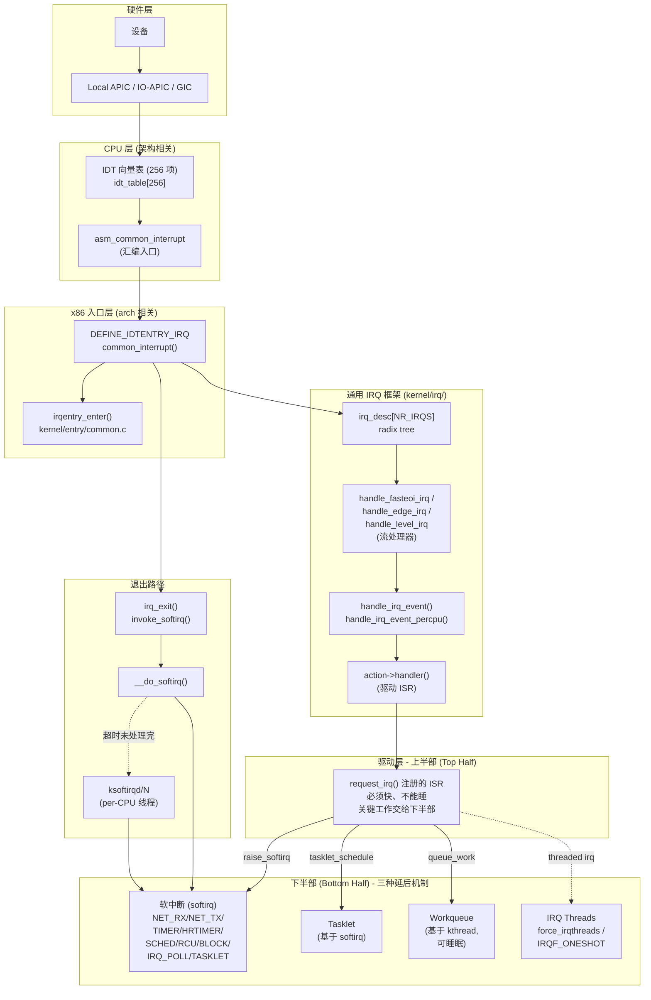
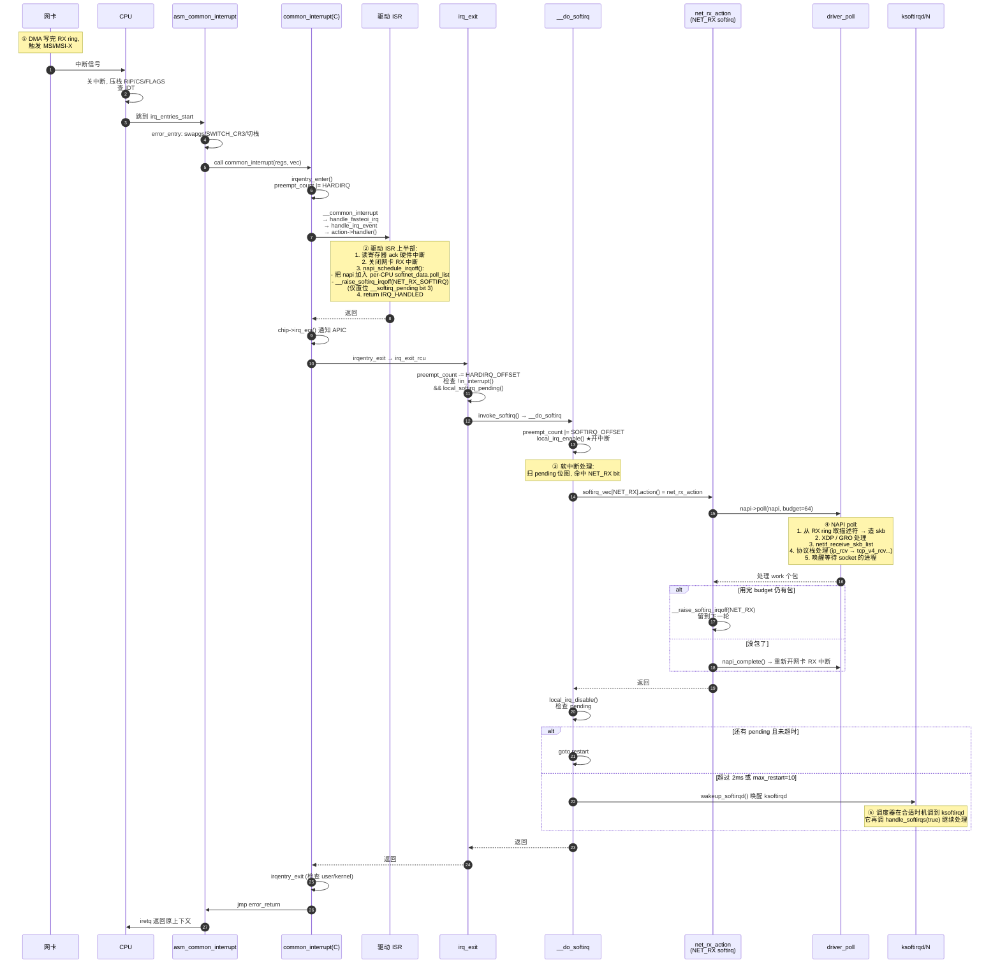

[任务规划完成]
我来深入分析 Linux 内核的中断处理流程，从硬件中断到软中断的完整路径。
[查找目录]
[查找文件]
[读取文件]
[查找文件]
[读取文件]
[读取文件]
[读取文件]
[读取文件]
[读取文件]
[读取文件]
[查找文件]
[读取文件]
[查找文件]
[读取文件]
[查找文件]
[读取文件]
[查找文件]
[读取文件]
[读取文件]
信息已经足够。下面给出完整深度分析。

---

# Linux 内核中断处理深度分析：从硬中断到软中断全流程

> 基于当前仓库 `v7.1`，以 x86_64 为主线分析，arm64 类似（差异点会提到）。

## 一、整体分层架构

Linux 把中断处理拆成 **5 层 + 2 半部** 的设计，每一层关注点不同：



---

## 二、上半部：硬中断完整路径（x86_64）

### 2.1 起点：硬件投递中断

设备 → IO-APIC（或 MSI/MSI-X 直接 DMA 写）→ Local APIC（CPU 内）→ CPU 检测到中断在 IDT 中查向量号 N 对应的处理函数地址。

每个 CPU 一个 256 项的 **IDT**：
- 0~31：CPU 异常（#DE, #PF, #GP, #DF...）
- 32~127：外部设备中断（FIRST_EXTERNAL_VECTOR=0x20）
- 0x80：32 位系统调用兼容
- 高位：APIC 系统向量（IPI、本地 timer、Spurious、Error...）

### 2.2 汇编入口：`irq_entries_start`

[arch/x86/include/asm/idtentry.h](/Users/liyang/IdeaProjects/linux/arch/x86/include/asm/idtentry.h) 第 504 行起，生成一张 stub 表，每项 16/32 字节，仅 3 条指令：

```asm
SYM_CODE_START(irq_entries_start)
    vector=FIRST_EXTERNAL_VECTOR
    .rept NR_EXTERNAL_VECTORS
0:
    ENDBR
    .byte   0x6a, vector        ; pushq $vector  (作为 "error_code")
    jmp     asm_common_interrupt
    .fill 0b + IDT_ALIGN - ., 1, 0xcc
    vector = vector+1
    .endr
SYM_CODE_END(irq_entries_start)
```

把"向量号"伪装成"error code"压栈，所有外部中断共用同一个 `asm_common_interrupt`。

### 2.3 通用入口宏 `idtentry` + `idtentry_body`

[arch/x86/entry/entry_64.S](/Users/liyang/IdeaProjects/linux/arch/x86/entry/entry_64.S) 第 289 / 329 行：

```asm
.macro idtentry_body cfunc has_error_code:req
    ALTERNATIVE "call error_entry; movq %rax, %rsp", \
                "call xen_error_entry", X86_FEATURE_XENPV
    ENCODE_FRAME_POINTER
    UNWIND_HINT_REGS

    movq    %rsp, %rdi                  ; arg1: pt_regs *
    .if \has_error_code == 1
        movq    ORIG_RAX(%rsp), %rsi    ; arg2: error code (=vector)
        movq    $-1, ORIG_RAX(%rsp)
    .endif

    call    \cfunc                      ; ★ 跳到 C 入口
    jmp     error_return
.endm
```

`error_entry` 是关键安全/切换函数：
- **swapgs**（如果来自用户态）
- **SWITCH_TO_KERNEL_CR3**（KPTI 页表切换）
- 切到 IRQ 栈或当前任务的内核栈
- IBRS、UNTRAIN_RET（Spectre 缓解）
- 构造完整 `pt_regs` 结构

### 2.4 C 入口宏 `DEFINE_IDTENTRY_IRQ`

[arch/x86/include/asm/idtentry.h](/Users/liyang/IdeaProjects/linux/arch/x86/include/asm/idtentry.h) 第 206 行展开后，`common_interrupt` 是：

```c
__visible noinstr void common_interrupt(struct pt_regs *regs,
                                        unsigned long error_code)
{
    irqentry_state_t state = irqentry_enter(regs);  // ① 进入框架
    u32 vector = (u32)(u8)error_code;
    
    kvm_set_cpu_l1tf_flush_l1d();
    instrumentation_begin();
    run_irq_on_irqstack_cond(__common_interrupt, regs, vector);  // ② 切 IRQ 栈
    instrumentation_end();
    irqentry_exit(regs, state);                      // ④ 退出框架
}

static noinline void __common_interrupt(struct pt_regs *regs, u32 vector)
{
    /* ③ 真正分发到 irq_desc */
}
```

### 2.5 `irqentry_enter` —— 通用入口框架

进入内核态前要做：
- `enter_from_user_mode()`：如果来自用户态，做 RCU EQS 退出、context tracking
- 维护 `preempt_count` 的 hardirq 位
- 记录硬中断状态（lockdep）
- 切换页表（如果需要）

### 2.6 `__common_interrupt` 与 vector→irq_desc 映射

[arch/x86/kernel/irq.c](/Users/liyang/IdeaProjects/linux/arch/x86/kernel/irq.c) 第 273 行：

```c
DEFINE_IDTENTRY_IRQ(common_interrupt)
{
    struct pt_regs *old_regs = set_irq_regs(regs);

    RCU_LOCKDEP_WARN(!rcu_is_watching(), "IRQ failed to wake up RCU");

    if (unlikely(!call_irq_handler(vector, regs)))
        apic_eoi();

    set_irq_regs(old_regs);
}

static __always_inline bool call_irq_handler(int vector, struct pt_regs *regs)
{
    /* per-CPU 的 vector_irq[256] 把向量号映射到 irq_desc */
    struct irq_desc *desc = __this_cpu_read(vector_irq[vector]);

    if (likely(!IS_ERR_OR_NULL(desc))) {
        handle_irq(desc, regs);           // ★ 转入通用 IRQ 子系统
        return true;
    }
    /* slow path: 处理 free_irq/request_irq 竞态 */
    ...
}

static __always_inline void handle_irq(struct irq_desc *desc, struct pt_regs *regs)
{
    if (IS_ENABLED(CONFIG_X86_64))
        generic_handle_irq_desc(desc);     // ★ 调 desc->handle_irq()
    else
        __handle_irq(desc, regs);
}
```

**关键映射关系**：
```
硬件向量号 vector (32~255)
       ↓ (per-CPU vector_irq[])
struct irq_desc  (Linux IRQ 号)
       ↓ (desc->handle_irq)
流处理器: handle_fasteoi_irq / handle_edge_irq / handle_level_irq / handle_simple_irq ...
       ↓
desc->action 链表（一个或多个 driver ISR）
```

### 2.7 通用 IRQ 子系统：`irq_desc` 与 `irq_chip`

[kernel/irq/](/Users/liyang/IdeaProjects/linux/kernel/irq) 实现硬件无关的中断框架。核心数据结构：

```c
struct irq_desc {
    struct irq_common_data  irq_common_data;
    struct irq_data         irq_data;
    irq_flow_handler_t      handle_irq;     // ★ 流处理函数
    struct irqaction       *action;          // ★ 驱动 handler 链
    unsigned int            status_use_accessors;
    unsigned int            istate;
    unsigned int            depth;
    unsigned int            wake_depth;
    raw_spinlock_t          lock;
    ...
};

struct irq_chip {
    const char *name;
    void (*irq_ack)(struct irq_data *);
    void (*irq_mask)(struct irq_data *);
    void (*irq_unmask)(struct irq_data *);
    void (*irq_eoi)(struct irq_data *);
    int  (*irq_set_affinity)(struct irq_data *, ...);
    ...
};

struct irqaction {
    irq_handler_t           handler;         // 驱动注册的 ISR
    void                   *dev_id;
    struct irqaction       *next;
    irq_handler_t           thread_fn;       // 线程化 ISR 的下半部
    struct task_struct     *thread;
    unsigned int            flags;           // IRQF_SHARED / ONESHOT / TRIGGER_*
    ...
};
```

### 2.8 流处理器：`handle_fasteoi_irq`（典型 MSI/APIC 路径）

[kernel/irq/chip.c](/Users/liyang/IdeaProjects/linux/kernel/irq/chip.c) 第 740 行：

```c
void handle_fasteoi_irq(struct irq_desc *desc)
{
    struct irq_chip *chip = desc->irq_data.chip;

    guard(raw_spinlock)(&desc->lock);

    if (!irq_can_handle_pm(desc)) { ...; cond_eoi_irq(...); return; }
    if (!irq_can_handle_actions(desc)) { mask_irq(desc); cond_eoi_irq(...); return; }

    kstat_incr_irqs_this_cpu(desc);
    if (desc->istate & IRQS_ONESHOT)
        mask_irq(desc);                  // ONESHOT: 屏蔽直到线程处理完

    handle_irq_event(desc);              // ★ 调驱动 ISR

    cond_unmask_eoi_irq(desc, chip);     // ★ chip->irq_eoi() 通知硬件
}
```

三种主流流处理器：
- `handle_edge_irq`：边沿触发（GPIO、传统 PIC 一些线）
- `handle_level_irq`：电平触发（共享 IRQ 用，处理时需 mask）
- `handle_fasteoi_irq`：APIC/GIC 等"自动 ack"的现代控制器

### 2.9 调用驱动 ISR：`handle_irq_event`

[kernel/irq/handle.c](/Users/liyang/IdeaProjects/linux/kernel/irq/handle.c)：

```c
irqreturn_t __handle_irq_event_percpu(struct irq_desc *desc)
{
    irqreturn_t retval = IRQ_NONE;
    
    for_each_action_of_desc(desc, action) {
        trace_irq_handler_entry(irq, action);
        res = action->handler(irq, action->dev_id);   // ★ 驱动 ISR
        trace_irq_handler_exit(irq, action, res);
        
        switch (res) {
        case IRQ_WAKE_THREAD:
            __irq_wake_thread(desc, action);          // ★ 唤醒 IRQ 线程
            break;
        }
        retval |= res;
    }
    return retval;
}
```

**驱动 ISR 必须遵守的铁律**：
1. **快**：通常只做 ack 硬件、读硬件状态、把数据塞到 ring/skb、调度下半部
2. **不能睡眠**：因为运行在原子上下文（`preempt_count` 的 hardirq 位置位）
3. **不能调用可能引发调度的函数**：mutex、down、wait_event...
4. **耗时工作必须延后**到下半部

### 2.10 上半部完整时序

```mermaid
sequenceDiagram
    autonumber
    participant HW as 设备/APIC
    participant CPU as CPU
    participant IDT as IDT 项
    participant ASM as asm_common_interrupt
    participant ENTRY as common_interrupt(C)
    participant FRAME as irqentry_enter
    participant DESC as call_irq_handler<br/>vector_irq[]
    participant FLOW as handle_fasteoi_irq
    participant ACT as action->handler<br/>(驱动 ISR)
    
    HW->>CPU: 触发中断 vector=N
    CPU->>CPU: 自动压栈 SS/RSP/FLAGS/CS/RIP<br/>(可能压 error_code)<br/>关中断 (IF=0)
    CPU->>IDT: 查 idt_table[N]
    IDT->>ASM: 跳转到 irq_entries_start + N*16
    ASM->>ASM: pushq $vector; jmp asm_common_interrupt
    ASM->>ASM: error_entry:<br/>swapgs / SWITCH_TO_KERNEL_CR3<br/>切 IRQ 栈/任务栈<br/>IBRS_ENTER / UNTRAIN_RET<br/>构造 pt_regs
    ASM->>ENTRY: call common_interrupt(regs, vec)
    ENTRY->>FRAME: irqentry_enter(regs)<br/>preempt_count+=HARDIRQ_OFFSET<br/>RCU 退 EQS, lockdep
    ENTRY->>DESC: __common_interrupt(regs, vec)<br/>查 this_cpu(vector_irq[vec])
    DESC->>FLOW: desc->handle_irq(desc)
    FLOW->>FLOW: spin_lock(&desc->lock)<br/>kstat++ / ONESHOT?mask
    FLOW->>ACT: handle_irq_event → handler(irq, dev_id)
    Note over ACT: 驱动 ISR:<br/>1. ack 硬件<br/>2. 取数据/状态<br/>3. raise_softirq / tasklet_schedule<br/>4. return IRQ_HANDLED / IRQ_WAKE_THREAD
    ACT-->>FLOW: 返回
    FLOW->>FLOW: chip->irq_eoi(): 通知 APIC EOI<br/>spin_unlock
    FLOW-->>ENTRY: 返回
    ENTRY->>ENTRY: irqentry_exit(regs, state)
    Note over ENTRY: irqentry_exit 会:<br/>preempt_count -= HARDIRQ_OFFSET<br/>★调用 irq_exit_rcu → invoke_softirq★<br/>如果是用户态返回还要 check signal/resched
    ENTRY->>ASM: jmp error_return
    ASM->>CPU: 恢复寄存器, iretq / sysretq
    CPU->>HW: 中断返回
```

---

## 三、上半部→下半部分水岭：`irq_exit` 与 `invoke_softirq`

### 3.1 `irq_exit_rcu()`

[kernel/softirq.c](/Users/liyang/IdeaProjects/linux/kernel/softirq.c) 第 730 行附近：

```c
static inline void __irq_exit_rcu(void)
{
#ifndef __ARCH_IRQ_EXIT_IRQS_DISABLED
    local_irq_disable();
#else
    lockdep_assert_irqs_disabled();
#endif
    account_hardirq_exit(current);
    preempt_count_sub(HARDIRQ_OFFSET);              // ★ 退出 hardirq 计数

    if (!in_interrupt() && local_softirq_pending()) {
        hrtimer_rearm_deferred();
        invoke_softirq();                            // ★ 关键分水岭
    }

    if (IS_ENABLED(CONFIG_IRQ_FORCED_THREADING) && force_irqthreads() &&
        local_timers_pending_force_th() && !(in_nmi() | in_hardirq()))
        wake_timersd();
}
```

**两个判断条件**缺一不可：
- `!in_interrupt()`：当前不在中断嵌套中（嵌套中断时，最外层退出才处理）
- `local_softirq_pending()`：当前 CPU 上有 pending 的软中断位

注意 `preempt_count_sub(HARDIRQ_OFFSET)` 之后，`in_hardirq()` 已经为 false，但 `in_softirq()` 和 `in_serving_softirq()` 都还是 false，所以 `in_interrupt()` 也是 false（如果没有 NMI/嵌套）。

### 3.2 `invoke_softirq()` —— 决定就地处理还是丢给 ksoftirqd

[kernel/softirq.c](/Users/liyang/IdeaProjects/linux/kernel/softirq.c) 第 488 行：

```c
static inline void invoke_softirq(void)
{
    if (!force_irqthreads() || !__this_cpu_read(ksoftirqd)) {
#ifdef CONFIG_HAVE_IRQ_EXIT_ON_IRQ_STACK
        /*
         * 当前已经在 IRQ 栈上（深度浅），可以就地跑 __do_softirq
         */
        __do_softirq();
#else
        /*
         * 当前在 task 栈上（可能很深），需切到独立的软中断栈
         */
        do_softirq_own_stack();
#endif
    } else {
        wakeup_softirqd();          // 强制线程化模式：唤 ksoftirqd
    }
}
```

---

## 四、下半部：软中断（softirq）

### 4.1 10 种软中断类型

[kernel/softirq.c](/Users/liyang/IdeaProjects/linux/kernel/softirq.c) 第 67 行：

```c
const char * const softirq_to_name[NR_SOFTIRQS] = {
    "HI",        // 0 - 高优先级 tasklet
    "TIMER",     // 1 - 定时器 (timer_wheel)
    "NET_TX",    // 2 - 网络发送完成
    "NET_RX",    // 3 - 网络接收 (NAPI)
    "BLOCK",     // 4 - 块设备 I/O 完成
    "IRQ_POLL",  // 5 - 块/网络的轮询模式
    "TASKLET",   // 6 - 普通 tasklet
    "SCHED",     // 7 - 调度器 (周期均衡)
    "HRTIMER",   // 8 - 高分辨率定时器
    "RCU"        // 9 - RCU 回调
};
```

**优先级**：编号越小优先级越高（每次 `__do_softirq` 都从 bit 0 扫起）。

### 4.2 数据结构

```c
struct softirq_action {
    void (*action)(void);   // 处理函数
};

static struct softirq_action softirq_vec[NR_SOFTIRQS] __cacheline_aligned_in_smp;

DEFINE_PER_CPU_ALIGNED(struct irq_cpustat_t, irq_stat);
/* 其中含 __softirq_pending：每 CPU 的 pending 位图 */

DEFINE_PER_CPU(struct task_struct *, ksoftirqd);   // 每 CPU 一个守护线程
```

### 4.3 触发：`raise_softirq` 与 `__raise_softirq_irqoff`

[kernel/softirq.c](/Users/liyang/IdeaProjects/linux/kernel/softirq.c) 第 790 / 799 行：

```c
void __raise_softirq_irqoff(unsigned int nr)
{
    lockdep_assert_irqs_disabled();
    trace_softirq_raise(nr);
    or_softirq_pending(1UL << nr);    // ★ 仅置 per-CPU 位图
}

inline void raise_softirq_irqoff(unsigned int nr)
{
    __raise_softirq_irqoff(nr);

    /*
     * 如果在中断上下文（包括硬中断 ISR 中），
     * irq_exit 回来时会处理。否则需要唤醒 ksoftirqd。
     */
    if (!in_interrupt() && should_wake_ksoftirqd())
        wakeup_softirqd();
}

void raise_softirq(unsigned int nr)
{
    unsigned long flags;
    local_irq_save(flags);
    raise_softirq_irqoff(nr);
    local_irq_restore(flags);
}
```

**注意**：触发只是置位，不立刻执行。这是软中断"延迟"的核心。

### 4.4 处理：`__do_softirq` / `handle_softirqs`

[kernel/softirq.c](/Users/liyang/IdeaProjects/linux/kernel/softirq.c) 第 580 行起：

```c
#define MAX_SOFTIRQ_TIME    msecs_to_jiffies(2)    // 最多跑 2ms
#define MAX_SOFTIRQ_RESTART 10                     // 最多重启 10 次

static void handle_softirqs(bool ksirqd)
{
    unsigned long end = jiffies + MAX_SOFTIRQ_TIME;
    int max_restart = MAX_SOFTIRQ_RESTART;
    __u32 pending;
    int softirq_bit;

    current->flags &= ~PF_MEMALLOC;     // 清掉 PF_MEMALLOC 防止误用紧急保留内存
    pending = local_softirq_pending();
    softirq_handle_begin();              // preempt_count += SOFTIRQ_OFFSET
    account_softirq_enter(current);

restart:
    set_softirq_pending(0);              // 清 pending 位图
    local_irq_enable();                  // ★ 开中断！允许新硬中断打断

    h = softirq_vec;
    while ((softirq_bit = ffs(pending))) {
        /* 从 bit 0 开始扫，按优先级处理 */
        h += softirq_bit - 1;
        vec_nr = h - softirq_vec;
        
        kstat_incr_softirqs_this_cpu(vec_nr);
        trace_softirq_entry(vec_nr);
        h->action();                     // ★ 执行处理函数
        trace_softirq_exit(vec_nr);
        
        h++;
        pending >>= softirq_bit;
    }

    if (!IS_ENABLED(CONFIG_PREEMPT_RT) && ksirqd)
        rcu_softirq_qs();

    local_irq_disable();                 // ★ 关中断

    pending = local_softirq_pending();
    if (pending) {
        /* 还有新的 softirq 被 raise，重启循环 */
        if (time_before(jiffies, end) && !need_resched() &&
            --max_restart)
            goto restart;
        
        /* 但有限制：超过 2ms / 需要调度 / 重启 10 次 → 丢给 ksoftirqd */
        wakeup_softirqd();
    }

    account_softirq_exit(current);
    softirq_handle_end();                // preempt_count -= SOFTIRQ_OFFSET
}

asmlinkage __visible void __softirq_entry __do_softirq(void)
{
    handle_softirqs(false);
}
```

**核心特性**：
1. **开中断处理**：进入 `__do_softirq` 后立刻开硬中断（`local_irq_enable`），允许更高优先级的硬中断打断。这是软中断 vs 硬中断的核心区别。
2. **不可重入**：通过 `preempt_count` 的 `SOFTIRQ_OFFSET` 位防止同 CPU 上嵌套（`in_serving_softirq()`）。但**不同 CPU 上可以并发执行同一个 softirq**！
3. **时间限制**：累计跑 2ms 或重启 10 次，强制让位给调度器，避免饿死用户进程。
4. **分水岭策略**：超时未处理完则**唤醒 ksoftirqd**，让调度器决定何时继续。

### 4.5 软中断的执行点（4 个）

| # | 触发点 | 调用栈 |
|---|---|---|
| 1 | **硬中断退出**（最主要） | `irq_exit()` → `invoke_softirq()` → `__do_softirq()` |
| 2 | **`local_bh_enable()`** | 显式开 BH 时（驱动/网络代码） → `do_softirq()` |
| 3 | **ksoftirqd 守护线程** | 上面两条路径都跑超时后，让 ksoftirqd 在调度器分时片中跑 |
| 4 | **`spin_unlock_bh` 等带 _bh 后缀的同步原语** | 内部隐式调 `local_bh_enable` |

### 4.6 ksoftirqd 守护线程

[kernel/softirq.c](/Users/liyang/IdeaProjects/linux/kernel/softirq.c) 第 1063 / 1115 行：

```c
static int ksoftirqd_should_run(unsigned int cpu)
{
    return local_softirq_pending();
}

static void run_ksoftirqd(unsigned int cpu)
{
    ksoftirqd_run_begin();
    if (local_softirq_pending()) {
        handle_softirqs(true);
        ksoftirqd_run_end();
        cond_resched();
        return;
    }
    ksoftirqd_run_end();
}

static struct smp_hotplug_thread softirq_threads = {
    .store              = &ksoftirqd,
    .thread_should_run  = ksoftirqd_should_run,
    .thread_fn          = run_ksoftirqd,
    .thread_comm        = "ksoftirqd/%u",
};

static __init int spawn_ksoftirqd(void)
{
    cpuhp_setup_state_nocalls(CPUHP_SOFTIRQ_DEAD, "softirq:dead", NULL,
                              takeover_tasklets);
    BUG_ON(smpboot_register_percpu_thread(&softirq_threads));
    ...
}
early_initcall(spawn_ksoftirqd);
```

- 每个 CPU 一个 `ksoftirqd/N` 线程（普通 `SCHED_NORMAL` 任务，nice=0）
- 平时睡眠，被 `wakeup_softirqd()` 唤醒
- 唤醒后跑完所有 pending softirq 再睡

**ps 看到 ksoftirqd 占 CPU 高 → 通常是网络包过载（NET_RX softirq 不断被 raise）**。

---

## 五、关键路径：硬→软完整时序图

以网卡收包为例：



---

## 六、嵌套与并发模型

### 6.1 三层 preempt_count

```c
#define PREEMPT_BITS    8
#define SOFTIRQ_BITS    8
#define HARDIRQ_BITS    4
#define NMI_BITS        4

PREEMPT_MASK    : 0x000000ff  preempt_disable 计数
SOFTIRQ_MASK    : 0x0000ff00  softirq 计数 (含 BH disable)
HARDIRQ_MASK    : 0x000f0000  hardirq 计数 (嵌套深度)
NMI_MASK        : 0x00f00000  NMI 计数
```

判断函数：
- `in_hardirq()`：在硬中断 ISR 上下文
- `in_serving_softirq()`：正在跑软中断
- `in_softirq()`：在软中断中**或** BH 被禁
- `in_interrupt()`：硬中断 / 软中断 / NMI / 任一

### 6.2 嵌套规则

| 场景 | 是否允许 |
|---|---|
| 硬中断 A 中嵌套硬中断 B（不同 vector） | ✅ 但 Linux 默认进入 ISR 时**关本地中断**，所以本 CPU 上不会嵌套；除非驱动显式开（罕见） |
| 硬中断中嵌套软中断 | ❌ `__do_softirq` 检查 `in_interrupt()`，硬中断中不跑 |
| 软中断 A 中嵌套软中断 B（同 CPU） | ❌ `__do_softirq` 内 `preempt_count` 已设置 SOFTIRQ 位 |
| **不同 CPU 上并发同一个软中断（如两个 CPU 同时跑 NET_RX）** | ✅ 软中断是 per-CPU 并发的，处理函数自己负责加锁 |
| 软中断中可被硬中断打断 | ✅ `__do_softirq` 开中断，新硬中断到来时打断；但新硬中断退出时 `in_interrupt()` 为真，不会重入 softirq |
| 软中断中调度 | ❌ `in_softirq()` 为真，`schedule()` 会 BUG |

### 6.3 BH 关闭区间

驱动/网络代码用 `local_bh_disable()` / `local_bh_enable()` 来串行化与软中断的访问：

```c
local_bh_disable();    // preempt_count += SOFTIRQ_DISABLE_OFFSET (2*SOFTIRQ_OFFSET)
// 临界区：软中断不会在此 CPU 上跑
local_bh_enable();     // 减回去；如果有 pending 软中断 → 立即 do_softirq()
```

注意 `SOFTIRQ_DISABLE_OFFSET = 2 * SOFTIRQ_OFFSET`，比"正在跑软中断"多置一位，用于区分这两种状态：
- `in_serving_softirq()`：检查最低 SOFTIRQ 位（=1）
- `in_softirq()`：检查整个 SOFTIRQ_MASK 是否非零（包括 BH 关闭和正在跑）

---

## 七、Tasklet / Workqueue / IRQ Thread —— 其他下半部机制

| 机制 | 上下文 | 可睡眠 | 多 CPU 并行 | 适用场景 |
|---|---|---|---|---|
| **softirq** | 软中断 | ❌ | ✅（不同 CPU 同种 softirq 并行） | 高性能 RX/TX、定时器 |
| **tasklet** | 软中断（基于 TASKLET_SOFTIRQ） | ❌ | ❌（同一 tasklet 在某一时刻只在一个 CPU 上跑） | 简单驱动延后处理（已被劝退） |
| **workqueue** | 内核线程（`kworker/N:M`） | ✅ | ✅ | 需睡眠的处理：执行 I/O、等锁、长时间任务 |
| **threaded IRQ** | 独立内核线程（`irq/NN-XXX`） | ✅ | — | 实时性敏感、需要可调度优先级、PREEMPT_RT |

### 7.1 Tasklet
基于 `TASKLET_SOFTIRQ`（普通）/ `HI_SOFTIRQ`（高优先级）。
- `tasklet_schedule()` 把 tasklet 加到 per-CPU 链表，并 `raise_softirq_irqoff(TASKLET_SOFTIRQ)`
- 处理函数 `tasklet_action` 由 `__do_softirq` 调用
- **特性**：同一 tasklet 实例同一时刻只会在一个 CPU 上运行（用 `TASKLET_STATE_RUN` 位锁）
- 内核社区在**主推弃用 tasklet**，建议迁移到 workqueue 或 BH workqueue

### 7.2 Workqueue
- `queue_work()` / `INIT_WORK()` / `schedule_work()`
- 由 `kworker/N:M` 内核线程执行（普通调度），**可睡眠**
- 现代 CMWQ（Concurrency-Managed Workqueue）：池化、自适应、节能
- 类型：`system_wq`（默认）、`system_long_wq`、`system_freezable_wq`、`unbound`（不绑 CPU）

### 7.3 Threaded IRQ
通过 `request_threaded_irq(irq, primary_handler, thread_fn, ...)` 注册。
- primary_handler 返回 `IRQ_WAKE_THREAD` → 唤醒 `irq/NN-XXX` 线程跑 `thread_fn`
- 线程可睡眠、有优先级（PREEMPT_RT 默认 FIFO/50）
- 提供延迟保证：可被高优先级任务抢占
- `IRQF_ONESHOT`：mask 中断直到线程跑完，避免重入

---

## 八、特殊路径

### 8.1 NMI（不可屏蔽中断）
- 走 `DEFINE_IDTENTRY_RAW(exc_nmi)`（[arch/x86/kernel/nmi.c](/Users/liyang/IdeaProjects/linux/arch/x86/kernel/nmi.c)）
- **不走** `irq_exit` / softirq 路径
- 严格 noinstr，使用专门的 IST 栈防止嵌套破坏
- 用于：硬件错误、watchdog、perf 采样、kgdb panic

### 8.2 IPI（处理器间中断）
- 系统向量 (SYSVEC)：`sysvec_reschedule_ipi`、`sysvec_call_function`、`sysvec_call_function_single`、`sysvec_irq_work`...
- 用 `DEFINE_IDTENTRY_SYSVEC` 宏，走简化路径（直接进 C 入口，不查 vector_irq）
- 典型：`smp_send_reschedule(cpu)` → `RESCHEDULE_VECTOR`

### 8.3 FRED（Flexible Return and Event Delivery，Intel 新机制）
- [arch/x86/entry/entry_64_fred.S](/Users/liyang/IdeaProjects/linux/arch/x86/entry/entry_64_fred.S)
- 统一 syscall、异常、中断的入口逻辑
- 摆脱 IDT，CPU 自动选择正确的栈和上下文

### 8.4 PREEMPT_RT（实时内核）
- 几乎所有 softirq 都强制在 ksoftirqd（高优先级 FIFO）线程中执行
- 所有 IRQ 默认线程化（`force_irqthreads`）
- 自旋锁变成 rt_mutex（可睡眠）
- `local_bh_disable` 用 per-CPU 本地锁实现，可被抢占

---

## 九、性能与可观测

### 9.1 关键统计接口

| 接口 | 内容 |
|---|---|
| `/proc/interrupts` | 每个 IRQ 在每个 CPU 上的计数 |
| `/proc/softirqs` | 每个 softirq 在每个 CPU 上的计数 |
| `/proc/stat` | 总 IRQ、softirq 时间 |
| `top` / `mpstat -P ALL` | `%si`（softirq）、`%hi`（hardirq）时间比例 |
| `cat /proc/N/stack`（ksoftirqd） | 查当前是哪个 softirq 卡住 |

### 9.2 关键 tracepoint

```
irq:irq_handler_entry       irq:irq_handler_exit
irq:softirq_raise           irq:softirq_entry           irq:softirq_exit
napi:napi_poll
sched:sched_wakeup          (ksoftirqd 唤醒)
```

```bash
# 观察 NET_RX softirq 处理延迟
perf trace -e irq:softirq_entry,irq:softirq_exit --filter 'vec==3'

# bpftrace 看 ksoftirqd 调度延迟
bpftrace -e 'tracepoint:sched:sched_wakeup /comm=="ksoftirqd"/ { @cnt[cpu]++; }'
```

### 9.3 常见问题与定位

| 现象 | 原因 | 解决 |
|---|---|---|
| `ksoftirqd/N` 持续高 CPU | softirq raise 速率 > 处理速率（网络风暴常见） | 开启 RPS/RFS/RSS 分散；调 budget；检查中断亲和性 |
| `%si` 偏高某 CPU | 中断只投递到一个 CPU | `echo MASK > /proc/irq/N/smp_affinity` 或装 irqbalance |
| 触发 `NOHZ: local_softirq_pending` 警告 | 在 idle/nohz 状态有 pending softirq 未处理 | 通常是软中断在不该 raise 的地方被 raise |
| RT 任务被 softirq 阻塞 | softirq 跑在硬中断退出时，抢了 RT 任务 | 用 PREEMPT_RT / force_irqthreads |

### 9.4 调优参数

- `/proc/sys/net/core/netdev_budget`：NAPI poll budget（默认 300）
- `/proc/sys/net/core/netdev_budget_usecs`：NAPI 最大耗时（默认 2000us）
- `/sys/class/net/<dev>/queues/rx-N/rps_cpus`：RPS 分散到的 CPU 掩码
- `irqbalance` 或手动设 `/proc/irq/N/smp_affinity`

---

## 十、设计要点总结

1. **三层解耦**：架构相关汇编入口 ↔ 通用入口框架 ↔ 通用 IRQ 子系统（chip + flow + action）。新增 chip 只实现 `irq_chip`，新增驱动只 `request_irq`。
2. **快慢分离**：硬中断尽量短（关中断中执行），耗时活儿丢给软中断/线程化，保证整体响应度。
3. **per-CPU 化**：`vector_irq`、`__softirq_pending`、`ksoftirqd`、softnet_data 全 per-CPU，避免锁竞争。
4. **公平与饥饿权衡**：`__do_softirq` 的 `MAX_SOFTIRQ_TIME=2ms` + `MAX_SOFTIRQ_RESTART=10` + 转交 ksoftirqd 是经典权衡，既保证软中断及时性又不饿死进程。
5. **可重入但不深嵌套**：软中断处理时开硬中断（允许新硬中断），但 `in_interrupt()` 防止 softirq 自身嵌套；不同 CPU 上同一 softirq 可并行（处理函数自加锁）。
6. **可演进**：从最早的 BH → softirq → tasklet → workqueue → threaded IRQ → PREEMPT_RT 全线程化 → FRED 统一入口，体现内核渐进式重构能力。
7. **三种延后机制各司其职**：softirq（极致性能、不可睡）、tasklet（兼容遗产、不推荐新增）、workqueue（可睡眠、通用）；现代驱动 90% 用 workqueue 或 threaded IRQ。
8. **可观测优先**：tracepoint、kstat、/proc/softirqs 等接口让线上排查软中断卡顿 / ksoftirqd 高 CPU 等问题成为日常运维。

---

如需进一步深入某一具体方向，可以聚焦：

- **`error_entry` 与栈切换 / KPTI 细节**
- **`irq_desc` 与 `irq_chip` 注册/分配/亲和性变更**
- **MSI/MSI-X 与 IRQ domain 体系（irqdomain.c）**
- **GIC（arm64）与 GICv3 ITS 的 IRQ 路径**
- **NAPI 与 GRO 在 NET_RX softirq 内的细节**
- **`workqueue.c`（240KB）的 CMWQ 并发管理算法**
- **PREEMPT_RT 下软中断线程化的具体改动**
- **threaded IRQ 的唤醒/再屏蔽时序与 `IRQF_ONESHOT` 语义**
- **RCU softirq 路径与 RCU GP 的协作**

告诉我具体方向，我可以基于源码继续展开。