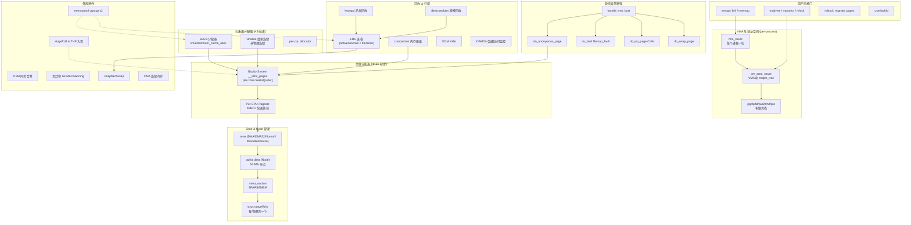
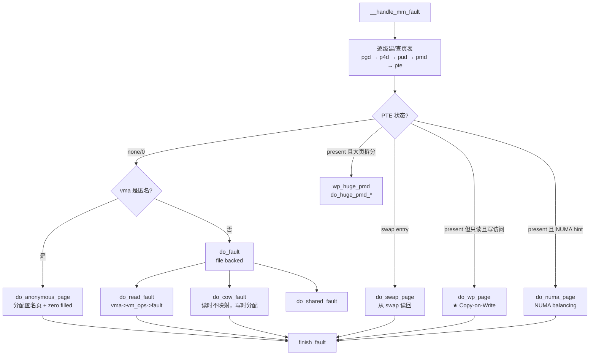
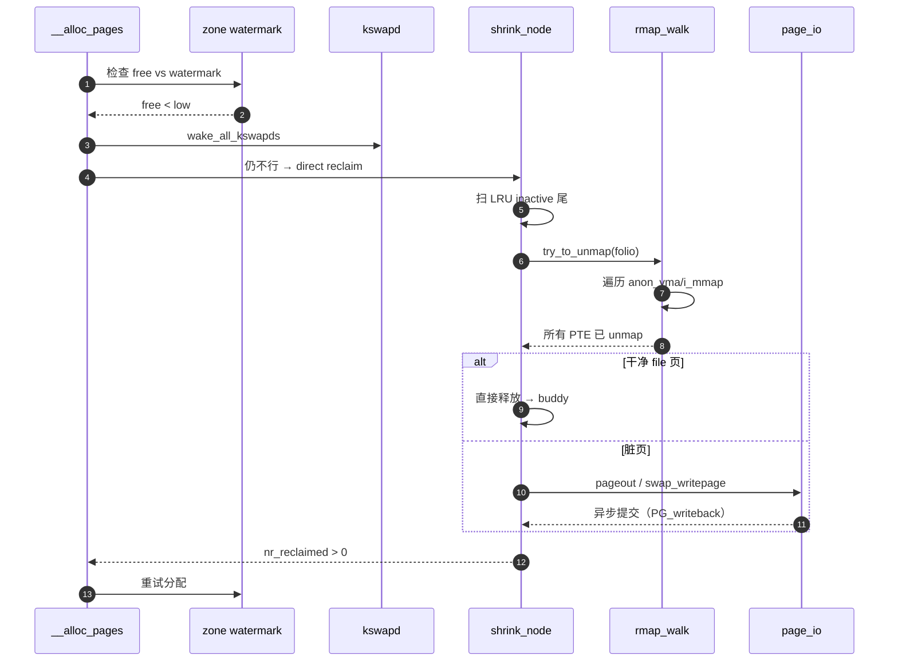

# Linux 内核内存管理（MM）深度分析

> 基于当前仓库 `v7.1`（代号 *Baby Opossum Posse*）。代码集中于 [mm/](/linux/mm)，是内核中文件数量与代码量最大的子系统之一。

## 一、整体架构总览

Linux MM 是一个**多层级、可堆叠**的子系统，从硬件 MMU 抽象层开始，向上层层封装出物理页分配器、虚拟内存映射、对象级分配器、文件页缓存、回收/迁移、cgroup 计费等模块。



**核心层级**（自底向上）：

1. **物理页层**：`struct page/folio` 描述每个物理页。
2. **Buddy 分配器**：以 2^order 个连续物理页为粒度。
3. **SLUB / vmalloc / per-cpu**：在 buddy 之上构建对象级、虚拟连续、per-CPU 分配器。
4. **VMA + 页表**：每进程的虚拟地址空间映射。
5. **缺页异常 + 回收**：按需建立映射 + 内存紧张时回收。
6. **可观测/可控**：cgroup、PSI、DAMON、memory.stat。

---

## 二、目录结构：核心文件与职责

### 2.1 物理页/分配器层

| 文件 | 大小 | 职责 |
|---|---|---|
| [page_alloc.c](/linux/mm/page_alloc.c) | 217 KB | **Buddy 分配器**：`__alloc_pages_noprof()`、`free_pages()`、PCP、watermark、reserve |
| [slub.c](/linux/mm/slub.c) | 246 KB | **SLUB 对象分配器**：`kmalloc`、`kmem_cache_*`、per-cpu freelist |
| [slab_common.c](/linux/mm/slab_common.c) | 59 KB | **slab 通用层**：`kmem_cache_create`、kmalloc 大小桶 |
| [vmalloc.c](/linux/mm/vmalloc.c) | 141 KB | **vmalloc**：虚拟连续/物理离散映射、ioremap |
| [percpu.c](/linux/mm/percpu.c) | 100 KB | **per-CPU 分配器**：`alloc_percpu`、chunk 管理 |
| [memblock.c](/linux/mm/memblock.c) | 79 KB | **早期引导期分配器**：buddy 启动前用 |
| [mempool.c](/linux/mm/mempool.c) | 22 KB | mempool（保证分配成功，I/O 路径用） |
| [dmapool.c](/linux/mm/dmapool.c) | 13 KB | DMA 一致性池 |
| [page_frag_cache.c](/linux/mm/page_frag_cache.c) | 4.8 KB | 网络栈 skb 用的页片段缓存 |
| [cma.c](/linux/mm/cma.c) | 29 KB | **CMA**：连续内存分配（DMA、相机、HW codec） |

### 2.2 虚拟内存与映射层

| 文件 | 大小 | 职责 |
|---|---|---|
| [memory.c](/linux/mm/memory.c) | 213 KB | **缺页异常核心**：`handle_mm_fault`、CoW、PTE 操作 |
| [mmap.c](/linux/mm/mmap.c) | 50 KB | **mmap/munmap**、`do_mmap()`、地址空间布局 |
| [vma.c](/linux/mm/vma.c) | 91 KB | VMA 操作（vma_merge/split/insert，maple tree） |
| [mremap.c](/linux/mm/mremap.c) | 56 KB | `mremap()` 系统调用 |
| [mprotect.c](/linux/mm/mprotect.c) | 28 KB | `mprotect()` 改保护属性 |
| [mlock.c](/linux/mm/mlock.c) | 21 KB | `mlock/munlock` 钉住物理页 |
| [madvise.c](/linux/mm/madvise.c) | 59 KB | `madvise()`：DONTNEED/PAGEOUT/HUGEPAGE 等 |
| [mseal.c](/linux/mm/mseal.c) | 5 KB | **mseal**：禁止对 VMA 再修改（v6.10+ 安全特性） |
| [gup.c](/linux/mm/gup.c) | 101 KB | `get_user_pages()`：内核访问用户页 |
| [pagewalk.c](/linux/mm/pagewalk.c) | 28 KB | 通用页表遍历框架 |
| [pgtable-generic.c](/linux/mm/pgtable-generic.c) | 13 KB | 架构无关页表辅助 |
| [mmu_gather.c](/linux/mm/mmu_gather.c) | 15 KB | TLB shootdown 批量化 |
| [mmu_notifier.c](/linux/mm/mmu_notifier.c) | 35 KB | KVM/IOMMU 等观察者通知机制 |
| [userfaultfd.c](/linux/mm/userfaultfd.c) | 61 KB | userfaultfd（用户态缺页处理，CRIU/QEMU 用） |
| [rmap.c](/linux/mm/rmap.c) | 92 KB | **反向映射**：从 page → 所有引用它的 PTE |

### 2.3 文件页缓存与 I/O

| 文件 | 大小 | 职责 |
|---|---|---|
| [filemap.c](/linux/mm/filemap.c) | 135 KB | **页缓存**：`filemap_fault`、`generic_file_read_iter` |
| [readahead.c](/linux/mm/readahead.c) | 27 KB | 预读机制 |
| [page-writeback.c](/linux/mm/page-writeback.c) | 93 KB | 脏页回写（dirty_ratio、writeback throttling） |
| [truncate.c](/linux/mm/truncate.c) | 27 KB | 文件截断、invalidate |
| [shmem.c](/linux/mm/shmem.c) | 158 KB | **tmpfs/shmem** 实现（System V SHM、memfd 也走这） |
| [memfd.c](/linux/mm/memfd.c) | 13 KB | memfd_create + sealing |
| [secretmem.c](/linux/mm/secretmem.c) | 6 KB | `memfd_secret()`（直接映射页表都没有的私密内存） |
| [fadvise.c](/linux/mm/fadvise.c) | 5.5 KB | `posix_fadvise` |
| [mincore.c](/linux/mm/mincore.c) | 8.5 KB | `mincore()` 查询 |

### 2.4 回收、迁移、压缩

| 文件 | 大小 | 职责 |
|---|---|---|
| `vmscan.c` | (见下) | LRU 扫描与回收（**新版 v7.1 中已被拆分/重构**） |
| [swap.c](/linux/mm/swap.c) | 31 KB | LRU 操作（folio_add_lru、`mark_page_accessed`） |
| [swapfile.c](/linux/mm/swapfile.c) | 100 KB | swap 设备/文件管理、swap 槽分配 |
| [swap_state.c](/linux/mm/swap_state.c) | 28 KB | swap cache（兼作页缓存） |
| [swap_table.h](/linux/mm/swap_table.h) | 7.3 KB | swap 表（v7.1 新结构） |
| [page_io.c](/linux/mm/page_io.c) | 17 KB | swap I/O 提交 |
| [migrate.c](/linux/mm/migrate.c) | 75 KB | **页迁移**（NUMA、内存热插拔、CMA） |
| [migrate_device.c](/linux/mm/migrate_device.c) | 40 KB | 设备私有内存迁移（HMM/GPU） |
| [compaction.c](/linux/mm/compaction.c) | 93 KB | **内存碎片整理** |
| [oom_kill.c](/linux/mm/oom_kill.c) | 33 KB | OOM Killer + memory.oom.group |
| [shrinker.c](/linux/mm/shrinker.c) | 22 KB | 通用 shrinker 框架（dcache/inode/slab） |
| [list_lru.c](/linux/mm/list_lru.c) | 14 KB | per-NUMA + per-memcg LRU 链表 |

### 2.5 大页与 NUMA

| 文件 | 大小 | 职责 |
|---|---|---|
| [hugetlb.c](/linux/mm/hugetlb.c) | 205 KB | HugeTLB（显式大页 2MB/1GB） |
| [hugetlb_vmemmap.c](/linux/mm/hugetlb_vmemmap.c) | 25 KB | HugeTLB vmemmap 折叠（节省 struct page 元数据） |
| [huge_memory.c](/linux/mm/huge_memory.c) | 140 KB | **THP**（透明大页） |
| [khugepaged.c](/linux/mm/khugepaged.c) | 75 KB | THP 后台合并守护线程 |
| [mempolicy.c](/linux/mm/mempolicy.c) | 100 KB | NUMA 内存策略（mbind、set_mempolicy） |
| [memory-tiers.c](/linux/mm/memory-tiers.c) | 27 KB | **内存分层**（DRAM + CXL/PMEM 异构） |
| [numa.c](/linux/mm/numa.c) | 1.5 KB | NUMA 通用入口 |
| [numa_emulation.c](/linux/mm/numa_emulation.c) | 16 KB | `numa=fake=` 模拟 |

### 2.6 cgroup、安全、检测、特性

| 文件 | 大小 | 职责 |
|---|---|---|
| [memcontrol.c](/linux/mm/memcontrol.c) | 154 KB | **memcg v2** |
| [memcontrol-v1.c](/linux/mm/memcontrol-v1.c) | 56 KB | memcg v1 兼容 |
| [bpf_memcontrol.c](/linux/mm/bpf_memcontrol.c) | 5.1 KB | BPF 钩子 |
| [page_counter.c](/linux/mm/page_counter.c) | 14 KB | cgroup 计数器原语 |
| [usercopy.c](/linux/mm/usercopy.c) | 8.4 KB | `copy_{from,to}_user` 边界检查 (USERCOPY hardening) |
| [memory-failure.c](/linux/mm/memory-failure.c) | 79 KB | **硬件内存错误**（MCE）回收 |
| [memory_hotplug.c](/linux/mm/memory_hotplug.c) | 67 KB | 内存热插拔 |
| [ksm.c](/linux/mm/ksm.c) | 109 KB | **KSM**：相同页合并（KVM 用） |
| [damon/](/linux/mm/damon) | — | **DAMON**：数据访问监控（页热度采样） |
| [kasan/](/linux/mm/kasan) | — | **KASAN**：内核地址消毒 |
| [kfence/](/linux/mm/kfence) | — | **KFENCE**：低开销 use-after-free 检测 |
| [kmsan/](/linux/mm/kmsan) | — | **KMSAN**：未初始化内存检测 |
| [kmemleak.c](/linux/mm/kmemleak.c) | 66 KB | 内存泄露检测 |
| [page_owner.c](/linux/mm/page_owner.c) | 25 KB | 页分配栈追踪 |
| [page_table_check.c](/linux/mm/page_table_check.c) | 7 KB | 页表交叉引用检查 |

### 2.7 启动与初始化

| 文件 | 职责 |
|---|---|
| [mm_init.c](/linux/mm/mm_init.c) | 启动期 mm 初始化（zone/section/freelist 建立） |
| [init-mm.c](/linux/mm/init-mm.c) | `init_mm`（内核全局 mm_struct） |
| [sparse.c](/linux/mm/sparse.c) / [sparse-vmemmap.c](/linux/mm/sparse-vmemmap.c) | SPARSEMEM 模型 |

---

## 三、核心数据结构

### 3.1 物理页：`struct page` 与 `struct folio`

[include/linux/mm_types.h](/linux/include/linux/mm_types.h) 第 80 行：

```c
struct page {
    unsigned long flags;           /* PG_locked、PG_dirty、PG_lru、zone/node id... */
    union {
        struct {                   /* 页缓存/匿名页 */
            union {
                struct list_head lru;
                struct {           /* SLUB 时用 */
                    void *__filler;
                    unsigned int mlock_count;
                };
            };
            struct address_space *mapping;
            pgoff_t index;
            unsigned long private;
        };
        struct {                   /* compound tail */
            unsigned long compound_head;
        };
        struct {                   /* SLAB/SLUB */
            struct slab *slab_cache;
            void *freelist;
            ...
        };
        struct {                   /* page table page */
            unsigned long pp_magic;
            struct mm_struct *pt_mm;
            ...
        };
        struct {                   /* device private (HMM) */
            struct dev_pagemap *pgmap;
            ...
        };
    };

    union {
        atomic_t _mapcount;         /* 反向映射计数 */
        unsigned int page_type;     /* SLAB、PageTable、Buddy 等 */
    };
    atomic_t _refcount;             /* 引用计数 */
#ifdef CONFIG_MEMCG
    unsigned long memcg_data;       /* memcg 信息 */
#endif
};
```

每物理页 4KB → 一个 `struct page`，约 64 字节，**元数据开销 ≈ 1.6%**。

#### Folio 抽象（v5.16+ 重大重构）

```c
struct folio {
    /* private: */
    union {
        struct {
            unsigned long flags;
            union {
                struct list_head lru;
                struct {
                    void *__filler;
                    unsigned int mlock_count;
                };
            };
            struct address_space *mapping;
            pgoff_t index;
            ...
            atomic_t _mapcount;
            atomic_t _refcount;
            ...
        };
        struct page page;        /* layout 与 page 第一页对齐 */
    };
};
```

**Folio 设计动机**：
- 把"一组连续 compound page"作为头等公民，让代码区分"操作整组页"和"操作单个 4KB 页"
- 解决 THP/large folio 中 `struct page` 头页/尾页字段含义混乱的问题
- 大量旧 API（`page_*`）正逐步迁移到 `folio_*`

### 3.2 内存域层级：Node → Zone → Section

```
NUMA Node  (struct pglist_data, contig_page_data 或 node_data[])
   ├── Zone  (struct zone)
   │     ZONE_DMA       (< 16MB, ISA 设备)
   │     ZONE_DMA32     (< 4GB, 32 位 DMA)
   │     ZONE_NORMAL    (常规)
   │     ZONE_HIGHMEM   (32位才有)
   │     ZONE_MOVABLE   (可迁移，热插拔/CMA 友好)
   │     ZONE_DEVICE    (持久内存/HMM)
   │
   └── 每 Zone 包含：
         free_area[MAX_ORDER]   ★ Buddy 分配器的 freelist
         lowmem_reserve[]       低内存保留
         per_cpu_pageset        ★ PCP 缓存
         vm_stat[]              统计
         watermark[]            ★ MIN/LOW/HIGH/PROMO 水位
         pageblock_flags        每 pageblock 的 migratetype
```

**migratetype**（迁移类型）：每 `pageblock`（默认 2MB）打一个标签，避免不可迁移页和可迁移页混在同 pageblock 中加剧碎片：
- `MIGRATE_UNMOVABLE`：内核 slab、内核栈
- `MIGRATE_MOVABLE`：用户匿名/文件页
- `MIGRATE_RECLAIMABLE`：dentry/inode 这类可回收
- `MIGRATE_CMA`、`MIGRATE_ISOLATE`、`MIGRATE_HIGHATOMIC`

### 3.3 进程地址空间：`mm_struct` 与 `vm_area_struct`

```c
struct mm_struct {
    struct {
        struct maple_tree mm_mt;   /* ★ VMA 容器（5.17+ 用 maple tree 取代 rbtree+链表）*/
        unsigned long mmap_base;
        unsigned long task_size;
        pgd_t *pgd;                /* 页全局目录 */
        atomic_t mm_users;
        atomic_t mm_count;
        struct mmap_lock mmap_lock; /* 读写信号量 */
        struct rw_semaphore mmap_sem;
        unsigned long start_code, end_code, start_data, end_data;
        unsigned long start_brk, brk, start_stack;
        unsigned long arg_start, arg_end, env_start, env_end;
        struct mm_rss_stat rss_stat;
        struct mm_cid __percpu *pcpu_cid;
        ...
    };
};

struct vm_area_struct {
    unsigned long vm_start;        /* VMA 起始虚拟地址 */
    unsigned long vm_end;          /* VMA 结束 */
    struct mm_struct *vm_mm;
    pgprot_t vm_page_prot;
    unsigned long vm_flags;        /* VM_READ/WRITE/EXEC/SHARED... */
    struct file *vm_file;          /* 映射的文件 */
    unsigned long vm_pgoff;        /* 文件偏移 */
    void *vm_private_data;
    const struct vm_operations_struct *vm_ops;  /* fault/open/close 回调 */
    /* anon_vma + rmap 反向映射相关 */
    struct anon_vma *anon_vma;
    struct list_head anon_vma_chain;
};
```

**Maple Tree**（v5.17+）：取代了 v5.16 之前的 "rbtree + 双向链表" 双结构。Maple Tree 是一种 **B-tree 变体**，节点更紧凑、缓存友好，支持 RCU 并发遍历。VMA 查找复杂度仍 O(log n)，但常数小很多。

---

## 四、Buddy 分配器（物理页分配核心）

### 4.1 入口：`__alloc_pages_noprof()`

[mm/page_alloc.c](/linux/mm/page_alloc.c) 第 5250 行：

```c
struct page *__alloc_pages_noprof(gfp_t gfp, unsigned int order,
                                   int preferred_nid,
                                   nodemask_t *nodemask)
{
    /* 1. 解析 GFP flags 决定能用哪些 zone、是否能 sleep、是否可回收 */
    struct alloc_context ac = { ... };

    /* 2. 快路径：仅扫各 zone 的 freelist + PCP */
    page = get_page_from_freelist(alloc_gfp, order, ALLOC_WMARK_LOW|..., &ac);
    if (likely(page))
        goto out;

    /* 3. 慢路径：唤醒 kswapd / 直接回收 / 直接压缩 / 重试 / OOM */
    page = __alloc_pages_slowpath(alloc_gfp, order, &ac);
out:
    return page;
}
```

### 4.2 GFP flags 语义

| 类别 | flag | 含义 |
|---|---|---|
| 内存域 | `__GFP_DMA`、`__GFP_DMA32`、`__GFP_HIGHMEM`、`__GFP_MOVABLE` | 限制 zone |
| 节点 | `__GFP_THISNODE` | 仅本 NUMA 节点 |
| 回收 | `__GFP_RECLAIM`、`__GFP_DIRECT_RECLAIM`、`__GFP_KSWAPD_RECLAIM` | 是否触发回收 |
| 阻塞 | `__GFP_IO`、`__GFP_FS` | 是否能做 I/O / 进入 FS |
| 紧急 | `__GFP_HIGH`、`__GFP_ATOMIC` | 中断/原子上下文 |
| 失败行为 | `__GFP_NORETRY`、`__GFP_NOFAIL`、`__GFP_RETRY_MAYFAIL` | 重试策略 |
| 清零 | `__GFP_ZERO` | 返回前清零 |
| 计费 | `__GFP_ACCOUNT` | 计入 memcg |

常用组合宏：
- `GFP_KERNEL` = 进程上下文，可睡眠回收（最常用）
- `GFP_ATOMIC` = 中断/锁内，不睡眠
- `GFP_USER` / `GFP_HIGHUSER` / `GFP_HIGHUSER_MOVABLE` = 用户页
- `GFP_NOFS` / `GFP_NOIO` = FS/I/O 路径中避免重入

### 4.3 Buddy 算法

每个 zone 维护 `free_area[MAX_ORDER+1]`，`free_area[order]` 是一组按 migratetype 分类的 freelist，每个块大小 = 2^order × 4KB（典型 MAX_ORDER=10，最大 4MB）。

**分配**：从请求 order 开始找；若空，则向更高 order 找，**对半切分**直到目标 order，剩余的一半挂回低 order freelist。

**释放**：检查 buddy（地址相反一位）是否也空闲，若是则**合并**为更高 order 块。

```
请求 order=2 (16KB)， free_area[2] 空，free_area[3] 有：
   [16KB | 16KB]  → 切一半，返回左半，右半挂入 free_area[2]
释放 16KB（在 order=2 分配的）：
   找 buddy（异或 2^14 的页号），若空，合并 → order=3 块挂入
```

### 4.4 Per-CPU Pageset（PCP）—— 快速路径

每个 CPU 在每 zone 上有一组 freelist（`per_cpu_pageset`），缓存少量 order ≤ `pcp_high` 的页。`order=0` 分配 99% 走这里：
- **无锁** / **低争用**（仅本地 CPU 访问）
- 缓存了多个 migratetype 的页
- 当 PCP 高于 `pcp_high` 水位 → 批量返还到 buddy

### 4.5 Watermark 与 reclaim 触发

每 zone 有三档水位：`min < low < high`：
- `free > high`：放心分配
- `low < free < high`：分配仍成功，**唤醒 kswapd**
- `min < free < low`：进程进入 **direct reclaim**
- `free < min`：仅 `__GFP_HIGH` 紧急分配能拿

`watermark_boost`（v5.0+）：分配遇到 fragmenting 类型时，临时上抬水位，提早回收以保留连续大块。

### 4.6 zone fallback 与 NUMA distance

分配失败时按 zonelist 顺序 fallback：本节点 ZONE_NORMAL → 其他节点 ZONE_NORMAL → ...，由 `build_zonelists()` 在启动时按 NUMA 距离构造。

---

## 五、SLUB 对象分配器

### 5.1 SLUB 三层结构

```
kmem_cache (kmalloc-8/16/32/64/...)
   ├── per-CPU partial slabs:  cpu_slab->freelist     (无锁快路径)
   ├── per-NODE partial slabs: node->partial          (中速路径)
   └── 从 buddy 申请新 slab page                         (慢路径)
```

每个 slab 是若干连续物理页（compound page），切成等大对象：
```
[obj0][obj1][obj2]...  freelist 把空闲对象单链起来
```

### 5.2 kmalloc 路径

[mm/slub.c](/linux/mm/slub.c) 第 5338 行：`__kmalloc_node_noprof()` →
1. 用 `size` 选 `kmalloc_caches[type][index]` 对应的 `kmem_cache`
2. 走 `slab_alloc_node()` →
   - 快路径：`this_cpu_cmpxchg_double(c->freelist, c->tid, ...)` 从 cpu_slab 拿
   - 中路径：从 partial 链表取 slab
   - 慢路径：`new_slab()` → `alloc_pages` 申请新 slab

### 5.3 SLUB 特性
- **kmem_cache_alloc** 自定义构造的对象（如 inode_cache、task_struct）
- **SLAB merging**：相同大小/属性的 cache 合并以提高复用
- **kasan/kfence 钩子**：检测 use-after-free、out-of-bounds
- **CONFIG_RANDOM_KMALLOC_CACHES**：把 kmalloc-N 拆成多个，按调用站点随机分配，缓解 heap spray
- **SLUB_TINY**：嵌入式精简版

> 注：v6.4 起，**SLAB 分配器已被移除**，仅保留 SLUB。SLOB 此前已删除。

---

## 六、vmalloc：虚拟连续/物理离散

[mm/vmalloc.c](/linux/mm/vmalloc.c)：当需要一大块连续虚拟内存（如内核模块、`module_alloc`、`alloc_large_system_hash`、栈），但物理上不需要连续：

```c
void *vmalloc(unsigned long size);     // 在 VMALLOC_START~VMALLOC_END 区域映射
void *vmap(struct page **pages, ...);  // 把已有页映射进 vmalloc 区
void *ioremap(phys_addr_t, size_t);    // 映射 MMIO
```

**实现要点**：
- 用 **vmap_area** 红黑树管理 vmalloc 地址区间
- 申请 N 页 + 在 PGD/PUD/PMD/PTE 中**逐级填充**
- 引入 **vmap_block / lazy free** 机制，批量延迟释放（`vmap_purge_lock`）
- 支持 huge mapping（PMD 级别 2MB）减少页表开销

---

## 七、虚拟内存管理：mmap & VMA

### 7.1 用户地址空间布局（x86_64 举例）

```
0xFFFFFFFFFFFFFFFF  +-------------------+
                    |   内核空间        |  (TASK_SIZE_MAX 之上)
0x00007FFFFFFFFFFF  +-------------------+
                    |   用户栈 (向下)   |  RLIMIT_STACK
                    |   ...             |
                    |   mmap 区 (向下)  |  动态库 / 匿名 mmap
                    |   ...             |
                    |   堆 brk (向上)   |
                    |   .bss / .data    |
                    |   .rodata / .text |
0x0000000000400000  +-------------------+
                    |   不可访问        |
0x0000000000000000  +-------------------+
```

`mmap_base` 由 ASLR 随机化（`arch_pick_mmap_layout`）。

### 7.2 mmap 路径

```
sys_mmap → ksys_mmap_pgoff → vm_mmap_pgoff → do_mmap → mmap_region
                                                           ↓
                                                   vma_alloc / vma_merge
                                                           ↓
                                                   vma_link 插入 maple_tree
                                                           ↓
                                                   返回虚拟地址（不立即建页表！）
```

mmap **不立即分配物理页**，而是建立 VMA。访问到才触发缺页异常按需分配。

### 7.3 VMA 关键操作（[mm/vma.c](/linux/mm/vma.c)）

- `vma_merge`：相邻同属性 VMA 合并
- `vma_split`：拆分 VMA（munmap 中段、mprotect 改部分等）
- `vma_iter_*`：基于 maple_tree 的迭代器
- `find_vma`：O(log n) 查询包含某地址的 VMA

---

## 八、缺页异常（Page Fault）—— 内存管理灵魂

### 8.1 入口：`handle_mm_fault()`

[mm/memory.c](/linux/mm/memory.c) 第 6699 行：

```c
vm_fault_t handle_mm_fault(struct vm_area_struct *vma, unsigned long address,
                           unsigned int flags, struct pt_regs *regs)
{
    /* 1. flag 校验 */
    ret = sanitize_fault_flags(vma, &flags);

    /* 2. 架构权限检查（如 PKU、SMAP） */
    if (!arch_vma_access_permitted(vma, ...)) {
        return VM_FAULT_SIGSEGV;
    }

    /* 3. memcg OOM 屏障 */
    if (flags & FAULT_FLAG_USER)
        mem_cgroup_enter_user_fault();

    lru_gen_enter_fault(vma);   /* MGLRU 工作集年龄 */

    /* 4. 分流到 hugetlb / 普通路径 */
    if (unlikely(is_vm_hugetlb_page(vma)))
        ret = hugetlb_fault(vma->vm_mm, vma, address, flags);
    else
        ret = __handle_mm_fault(vma, address, flags);

    /* 5. 统计、memcg 退出、OOM 同步 */
    lru_gen_exit_fault();
    mm_account_fault(mm, regs, address, flags, ret);
    return ret;
}
```

### 8.2 `__handle_mm_fault` 五分支



### 8.3 关键场景

#### (1) 匿名缺页 `do_anonymous_page`
- 第一次访问 mmap MAP_ANONYMOUS 区域
- 全零读：可能直接映射全局 ZERO_PAGE（写时再分配）
- 写：`alloc_zeroed_user_highpage_movable()` → buddy 拿一页 → 建 PTE → 加入 LRU

#### (2) 文件缺页 `do_fault` → `filemap_fault`
- VMA 是 mmap(file) 来的
- 走 `vm_ops->fault`，最常见 `filemap_fault`：
  1. 在 page cache 中查（`filemap_get_folio`）
  2. 缓存未命中 → 触发预读 → I/O 提交 → 等待
  3. 命中或 I/O 完成 → 建立 PTE

#### (3) Copy-on-Write `do_wp_page`
- fork 后父子共享只读页
- 写时触发缺页 → 检查 `_mapcount` 是否 > 1：
  - 是：拷贝一份新页，独占
  - 否（已经独占）：直接置写位

#### (4) Swap-in `do_swap_page`
- PTE 是 swap entry → 解析出 swap slot → 从 swap 读回
- 检查 swap cache，避免重复读
- 读完后通常仍保留 swap 占用（直到再次写或扫描）

#### (5) NUMA balancing `do_numa_page`
- 周期性把页 PTE 改成 PROT_NONE
- 任务访问触发 fault → 检测访问者 node 与页所在 node
- 频繁跨节点 → 触发页迁移（`migrate_misplaced_folio`）

### 8.4 缺页与架构入口

x86_64：CPU `#PF` → IDT vector 14 → `exc_page_fault` → `do_user_addr_fault` / `do_kern_addr_fault` → `handle_mm_fault`

ARM64：translation fault / permission fault → `do_page_fault` → `handle_mm_fault`

---

## 九、反向映射（Reverse Mapping）

### 9.1 为什么需要 rmap？
当回收/迁移一个物理页时，需要找到所有引用它的进程并 unmap PTE。从 page → 多个 PTE 的反向查找就是 rmap。

### 9.2 数据结构

**匿名页**：通过 `anon_vma` 链：
```
folio->mapping (low bit=PAGE_MAPPING_ANON) → anon_vma
                                                 ↓
                                          anon_vma_chain → vm_area_struct[]
```
fork 时父子的 anon_vma 形成 **anon_vma 树**（avc：anon_vma_chain），保证迁移/回收能找到所有共享者。

**文件页**：通过 `address_space->i_mmap` 区间树：
```
folio->mapping → address_space → i_mmap (rb_root, interval tree)
                                     ↓
                                 vm_area_struct[]（共享映射这个文件的所有 VMA）
```

### 9.3 主要 API（[mm/rmap.c](/linux/mm/rmap.c)）

```c
rmap_walk(folio, &rwc);              /* 遍历所有引用 */
folio_referenced(folio, ...);        /* 检查访问位（回收用） */
try_to_unmap(folio, ...);            /* 回收前 unmap 所有 PTE */
try_to_migrate(folio, ...);          /* 迁移前 unmap */
page_mkclean(folio);                 /* 写回前清干净 dirty PTE */
```

---

## 十、回收（Reclaim）—— LRU & MGLRU

### 10.1 经典 LRU（Two-list 设计）

每个 memcg×NUMA node 维护 5 个链表：
```
LRU_INACTIVE_ANON   未活跃匿名
LRU_ACTIVE_ANON     活跃匿名
LRU_INACTIVE_FILE   未活跃文件
LRU_ACTIVE_FILE     活跃文件
LRU_UNEVICTABLE     不可驱逐（mlock）
```

回收顺序：
- 从 inactive 尾部扫
- 访问位被设过 → "promote" 到 active 头
- 否则 → 回收（写回脏页/直接释放）

### 10.2 MGLRU（Multi-Generational LRU，v6.1+）

**v7.1 已是默认**。把 LRU 拆成多代（generation），用 PTE 访问位批量扫描：
```
gen 0 (oldest)  ← 回收候选
gen 1
gen 2
gen 3 (newest)
```
- 老化（aging）：周期性扫描 PTE，访问过的页 promote 一代
- 驱逐（eviction）：从 gen 0 选页回收
- 优势：扫描次数和回收效率都比经典 LRU 高，工作集识别更准

代码已散布在多个文件中（lru_gen 相关函数嵌入 swap.c、memcontrol.c 等）。

### 10.3 回收触发器

**kswapd**（每 NUMA node 一个内核线程）：
- 当 `free < low` 水位被唤醒
- 异步扫描，回收到 `high` 水位停下
- 优点：不阻塞分配进程

**direct reclaim**：
- 进程分配失败 → 自己进入 `try_to_free_pages`
- 同步阻塞当前进程
- 影响延迟，是性能调优重点

### 10.4 OOM Killer

[mm/oom_kill.c](/linux/mm/oom_kill.c)：所有路径都失败后：
1. 在 candidate 中按 `oom_score`（rss + swap + oom_score_adj）找最大者
2. 发送 SIGKILL
3. 释放其内存，返回分配
4. cgroup memory.oom.group 可让整组一起死

---

## 十一、迁移与压缩

### 11.1 页迁移（[mm/migrate.c](/linux/mm/migrate.c)）

把一个物理页的内容复制到新页，并更新所有 PTE 指向新页。基本步骤：
1. 通过 rmap 找到所有 PTE
2. 设置 migration entry（特殊 swap entry）暂时阻塞访问
3. 复制页内容
4. 把 migration entry 改成正确的新 PTE
5. 释放旧页

**用途**：NUMA balancing、内存热插拔（offline）、CMA、compaction、demotion（DRAM→PMEM）

### 11.2 内存压缩（[mm/compaction.c](/linux/mm/compaction.c)）

碎片整理：把可迁移页搬到 zone 一端，释放出连续大块（用于 THP/order≥3 分配）：
```
扫描器: migrate scanner 从 zone 头向后扫，找可迁移页
       free scanner 从 zone 尾向前扫，找空闲块
       两者相遇 → compaction 完成
```
触发：分配 high-order 失败、kcompactd 后台、`/proc/sys/vm/compact_memory`。

---

## 十二、文件页缓存（Page Cache）

### 12.1 核心结构

```c
struct address_space {
    struct inode       *host;
    struct xarray       i_pages;     /* ★ XArray (取代 radix tree) */
    struct rb_root_cached i_mmap;    /* 共享映射的 VMA 树 */
    atomic_t            i_mmap_writable;
    unsigned long       nrpages;
    pgoff_t             writeback_index;
    const struct address_space_operations *a_ops;
    /* ... */
};
```

`a_ops`（即文件系统提供的回调）：
- `read_folio`、`writepage`、`writepages`
- `dirty_folio`、`invalidate_folio`
- `release_folio`
- `migrate_folio`
- `swap_activate`

### 12.2 读路径

```
read() → vfs_read → file->f_op->read_iter
       → generic_file_read_iter → filemap_read
            → 在 i_pages (XArray) 中找 folio
            → 命中 → 拷贝到用户
            → 未命中 → 触发预读 → I/O → 等待
```

### 12.3 写路径与回写

- 写：脏化 folio，加入 writeback list
- balance_dirty_pages：超过 `dirty_ratio` 限速
- 周期性 wb_workfn：异步刷盘
- fsync：强制等待回写完成

---

## 十三、外围特性速览

### 13.1 大页

| 类型 | 文件 | 说明 |
|---|---|---|
| HugeTLB | [hugetlb.c](/linux/mm/hugetlb.c) | 显式预留，`hugetlbfs`、`MAP_HUGETLB`，2MB/1GB |
| THP | [huge_memory.c](/linux/mm/huge_memory.c) | 透明大页，自动合并/拆分（PMD 级 2MB） |
| khugepaged | [khugepaged.c](/linux/mm/khugepaged.c) | 后台扫描，把 4KB 合并为 2MB |
| large folio | folio 各处 | 中等大小（mTHP，16KB~512KB），更细粒度 |

### 13.2 NUMA 与异构

- `mempolicy`：进程级 / VMA 级策略（DEFAULT/PREFERRED/BIND/INTERLEAVE/WEIGHTED_INTERLEAVE）
- `automatic NUMA balancing`（`/proc/sys/kernel/numa_balancing`）：通过 NUMA hint fault 迁移
- `memory-tiers`：CXL/PMEM 异构内存分层，热页留在 DRAM、冷页 demote 到下一层

### 13.3 KSM（Kernel Samepage Merging）

[mm/ksm.c](/linux/mm/ksm.c)：把内容相同的匿名页合并为 CoW 共享。`madvise(MADV_MERGEABLE)` 启用，KVM 虚拟机内存去重显著节省。

### 13.4 cgroup memory（v2）

[mm/memcontrol.c](/linux/mm/memcontrol.c)：
- `memory.max` / `memory.high` / `memory.low` / `memory.min`
- 计费时机：`charge_memcg()` 在 page fault、kmalloc 时
- 计费内容：用户页、slab、kernel stack、socket buffer
- PSI 集成、OOM kill、reclaim per-cgroup

### 13.5 swap 与 zswap

- 经典 swap：写到 swapfile/swap 分区
- **zswap**：压缩内存池，先压缩在内存中，回退到磁盘
- **zram**：压缩块设备（`mkswap` 之上）
- 新的 **swap_table**（v7.1 引入）：替代 swap_cache+swap_map 的统一表

### 13.6 userfaultfd

[mm/userfaultfd.c](/linux/mm/userfaultfd.c)：让用户态进程接管自己 VMA 的缺页。CRIU 容器迁移、QEMU post-copy live migration、async page fault 都用它。

### 13.7 安全相关

- **mseal**（v6.10+）：sealing VMA 后不可再 mprotect/munmap，缓解 ROP/JOP
- **memfd seals**：seal 后不可写/缩短/扩展/封存
- **secretmem**：从直接映射移除，连内核都看不到
- **RANDOM_KMALLOC_CACHES**、**SLAB_FREELIST_RANDOM/HARDENED**
- **KASLR + KPTI**（架构层）

### 13.8 调试与检测

- **KASAN**（generic / sw_tags / hw_tags）：影子内存检测越界/UAF
- **KFENCE**：低开销采样型检测，可生产开
- **KMSAN**：未初始化内存
- **kmemleak**：分配栈追踪，定位泄露
- **page_owner**：每页分配栈
- **DAMON**：用户/内核可控的访问监控，可驱动 reclaim 决策
- **/proc/{meminfo, slabinfo, vmstat, zoneinfo, pagetypeinfo, buddyinfo}**

---

## 十四、典型调用时序

### 14.1 一次 malloc + 写入触发的完整链路

```mermaid
sequenceDiagram
    autonumber
    participant U as 用户态
    participant LIBC as glibc
    participant VFS as 内核 VFS
    participant MM as mm/mmap.c
    participant FAULT as handle_mm_fault
    participant BUDDY as page_alloc
    participant PT as 页表

    U->>LIBC: malloc(1MB)
    LIBC->>LIBC: 大块 → mmap
    LIBC->>VFS: mmap(NULL, 1MB, ANON|PRIVATE)
    VFS->>MM: do_mmap → mmap_region
    MM->>MM: vma_alloc / vma_link maple_tree
    MM-->>U: 返回 vaddr  (尚未分配物理页)

    U->>U: *vaddr = 42; (写)
    Note over U: CPU MMU 查页表 → PTE=0 → #PF
    U->>FAULT: arch trap → do_user_addr_fault → handle_mm_fault
    FAULT->>FAULT: 找 VMA: find_vma
    FAULT->>FAULT: __handle_mm_fault → do_anonymous_page
    FAULT->>BUDDY: alloc_zeroed_user_highpage
    BUDDY->>BUDDY: 走 PCP/freelist
    BUDDY-->>FAULT: 返回 struct page
    FAULT->>PT: set_pte_at 建立 PTE
    FAULT->>FAULT: folio_add_lru 加入 LRU
    FAULT-->>U: 返回 → CPU 重试指令成功
```

### 14.2 内存紧张回收时序



---

## 十五、设计要点总结

1. **多层抽象**：硬件 MMU → struct page/folio → buddy → SLUB/vmalloc → VMA → mmap，每层职责清晰，可独立演进。
2. **按需分配（Lazy Allocation）**：mmap 只建 VMA，物理页等到访问才分。这是虚拟内存的精髓。
3. **统计/控制深入到 cgroup**：每页都有 `memcg_data`，每次分配/回收都计费，云原生时代的硬性需求。
4. **碎片对抗体系**：migratetype 分块 + watermark_boost + compaction + MOVABLE zone + CMA。
5. **多种粒度**：4KB（page）、order-N（compound）、folio、large folio、THP（PMD）、HugeTLB（PUD）。
6. **可观测性极强**：vmstat、PSI、page_owner、DAMON、tracepoint 覆盖几乎每个关键点。
7. **持续重构**：folio 化、maple_tree 替代 rbtree、MGLRU、SLAB 删除、swap_table，体现"为云负载和异构内存"演进的方向。
8. **可插拔扩展**：BPF（bpf_memcontrol、cgroup_skb）、sched_ext、damon scheme、shrinker，让用户态可深度参与。

---

如果你想进一步聚焦某一点，比如：
- **`__alloc_pages_slowpath` 慢路径详细分支**
- **SLUB 三层 freelist 与无锁 cmpxchg 实现**
- **MGLRU 的代/层结构与老化算法**
- **THP 拆分/合并完整流程**
- **CoW + 写保护的 PTE 状态机**
- **userfaultfd post-copy 协议**
- **memcg v2 计费与回收联动**
- **page migration 的 5 步状态机**
- **swap_table v7.1 新设计**
- **maple_tree 在 VMA 中的应用细节**

告诉我具体方向，我可以基于源码继续展开。