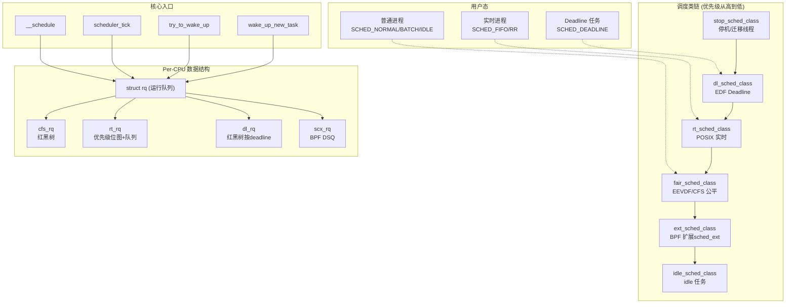
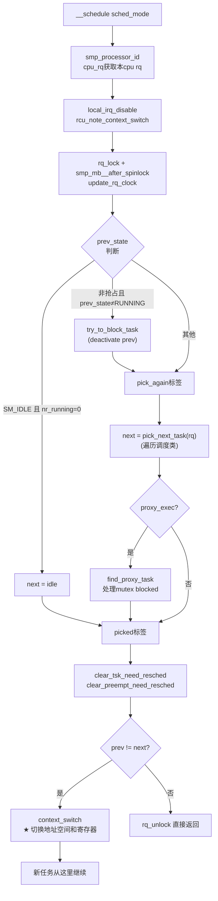
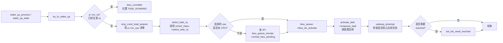
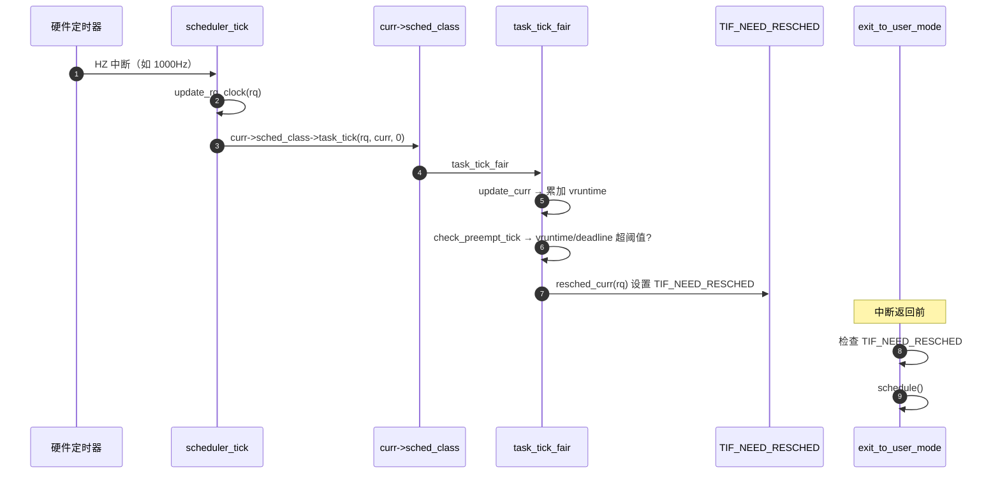
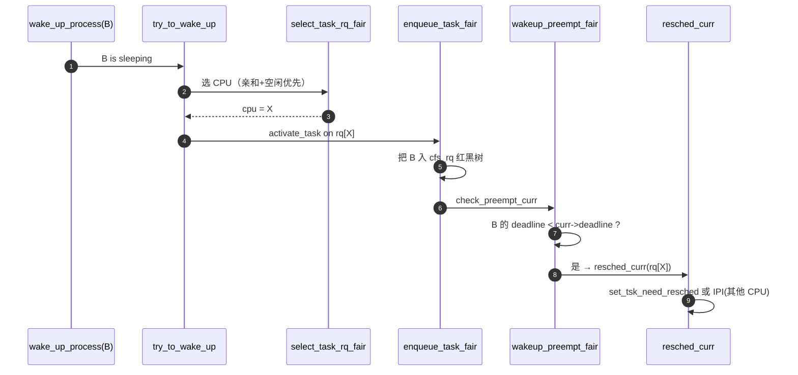

# Linux 内核调度器（Scheduler）深度分析

> 基于当前仓库 `v7.1`（代号 *Baby Opossum Posse*）。代码位于 [kernel/sched/](/linux/kernel/sched)。

## 一、调度器整体架构

Linux 调度器采用 **「调度类（sched_class）多态 + 优先级链 + Per-CPU 运行队列（rq）」** 的设计。每个 CPU 维护自己的运行队列，多种调度策略以 **可插拔的调度类** 形式共存，按优先级从高到低排成一条静态链。



**核心设计要点**：
- **调度类是一个 vtable**：[struct sched_class](/linux/kernel/sched/sched.h)（第 2585 行起）定义统一的回调接口，每个具体调度器实现自己的版本。
- **调度类之间无显式优先级数字**：而是通过 **链接脚本顺序** 决定优先级（地址低 = 优先级高）。
- **运行队列是 Per-CPU 的**：每 CPU 一个 `struct rq`，独立加锁（`rq->lock`），减少全局争用。

---

## 二、目录结构与文件分工

| 文件 | 大小 | 职责 |
|---|---|---|
| [core.c](/linux/kernel/sched/core.c) | 294 KB | **调度核心**：`__schedule()`、`pick_next_task()`、`context_switch()`、`try_to_wake_up()`、CPU 热插拔 |
| [fair.c](/linux/kernel/sched/fair.c) | 419 KB | **CFS/EEVDF 公平调度类**（最大文件，新版已切换到 EEVDF） |
| [rt.c](/linux/kernel/sched/rt.c) | 69 KB | **实时调度类**（SCHED_FIFO / SCHED_RR） |
| [deadline.c](/linux/kernel/sched/deadline.c) | 110 KB | **DL 调度类**（SCHED_DEADLINE，EDF + CBS） |
| [stop_task.c](/linux/kernel/sched/stop_task.c) | 2.6 KB | **stop 调度类**（最高优先级，用于 CPU stopper、迁移） |
| [idle.c](/linux/kernel/sched/idle.c) | 15 KB | **idle 调度类**（最低优先级，所有 rq 都会有 swapper） |
| [ext.c](/linux/kernel/sched/ext.c) + `ext_*.c` | 315 KB | **sched_ext / SCX**：用户可通过 BPF 编写自己的调度器（v6.12+ 主线特性） |
| [sched.h](/linux/kernel/sched/sched.h) | 114 KB | **调度器内部头文件**：`sched_class`、`rq`、`cfs_rq`、`rt_rq`、`dl_rq` 定义 |
| [pelt.c](/linux/kernel/sched/pelt.c) | 13 KB | **PELT**（Per-Entity Load Tracking）负载跟踪 |
| [topology.c](/linux/kernel/sched/topology.c) | 88 KB | **调度域**（sched_domain / sched_group），NUMA、SMT、MC、DIE 拓扑 |
| [cpufreq_schedutil.c](/linux/kernel/sched/cpufreq_schedutil.c) | 25 KB | **schedutil**：与 cpufreq 协作，按负载调频 |
| [psi.c](/linux/kernel/sched/psi.c) | 46 KB | **PSI**（Pressure Stall Information）压力指标 |
| [debug.c](/linux/kernel/sched/debug.c) | 35 KB | `/proc/sched_debug`、`/sys/kernel/debug/sched/` |
| [syscalls.c](/linux/kernel/sched/syscalls.c) | 38 KB | `sched_setattr/setscheduler/setaffinity/sched_yield` 等系统调用 |
| [autogroup.c](/linux/kernel/sched/autogroup.c) | 7 KB | 自动分组（按 session 隔离） |
| [cputime.c](/linux/kernel/sched/cputime.c) | 32 KB | CPU 时间统计（user/sys/iowait） |
| [loadavg.c](/linux/kernel/sched/loadavg.c) | 11 KB | `/proc/loadavg` 1/5/15 分钟负载 |
| [isolation.c](/linux/kernel/sched/isolation.c) | 10 KB | `isolcpus=` 隔离 |
| [membarrier.c](/linux/kernel/sched/membarrier.c) | 21 KB | `sys_membarrier` 内存屏障同步 |
| [core_sched.c](/linux/kernel/sched/core_sched.c) | 6.7 KB | **Core Scheduling**（同 SMT 核心强制同 cookie，缓解 L1TF） |
| [features.h](/linux/kernel/sched/features.h) | 3.7 KB | 调度特性 sysctl 开关（debugfs） |

---

## 三、调度类（sched_class）—— 多态机制

### 3.1 接口定义

[sched_class](/linux/kernel/sched/sched.h) 是一个函数表，关键回调（节选）：

```c
struct sched_class {
    /* 入队/出队 —— 任务变为 RUNNABLE/不再 RUNNABLE */
    void (*enqueue_task)(struct rq *rq, struct task_struct *p, int flags);
    bool (*dequeue_task)(struct rq *rq, struct task_struct *p, int flags);

    /* 让出 CPU */
    void (*yield_task)(struct rq *rq);
    bool (*yield_to_task)(struct rq *rq, struct task_struct *p);

    /* 抢占检查（被唤醒任务是否应该抢占当前任务） */
    void (*wakeup_preempt)(struct rq *rq, struct task_struct *p, int flags);

    /* SMP 负载均衡（pull 任务） */
    int  (*balance)(struct rq *rq, struct rq_flags *rf);

    /* 选择下一个任务运行 —— 调度核心 */
    struct task_struct *(*pick_task)(struct rq *rq, struct rq_flags *rf);

    /* 任务切换前后的处理 */
    void (*put_prev_task)(struct rq *rq, struct task_struct *p, struct task_struct *next);
    void (*set_next_task)(struct rq *rq, struct task_struct *p, bool first);

    /* 唤醒时为任务选 CPU */
    int  (*select_task_rq)(struct task_struct *p, int task_cpu, int flags);

    /* 周期性时钟节拍 */
    void (*task_tick)(struct rq *rq, struct task_struct *p, int queued);

    /* fork/dead/换调度类 */
    void (*task_fork)(struct task_struct *p);
    void (*task_dead)(struct task_struct *p);
    void (*switched_from)(struct rq *this_rq, struct task_struct *task);
    void (*switched_to)(struct rq *this_rq, struct task_struct *task);
    void (*prio_changed)(struct rq *this_rq, struct task_struct *task, int oldprio);

    /* 更新累计运行时间 */
    void (*update_curr)(struct rq *rq);
    /* ... */
};
```

### 3.2 调度类按优先级链接

[include/asm-generic/vmlinux.lds.h](/linux/include/asm-generic/vmlinux.lds.h) 第 155-162 行强制顺序：

```
__sched_class_highest = .;
*(__stop_sched_class)     // 1. 最高
*(__dl_sched_class)       // 2. Deadline
*(__rt_sched_class)       // 3. RT
*(__fair_sched_class)     // 4. CFS/EEVDF
*(__ext_sched_class)      // 5. sched_ext (BPF)
*(__idle_sched_class)     // 6. idle
__sched_class_lowest = .;
```

每个调度类用 [DEFINE_SCHED_CLASS](/linux/kernel/sched/sched.h) 宏放入对应 `__section`：

```c
#define DEFINE_SCHED_CLASS(name) \
const struct sched_class name##_sched_class \
    __aligned(__alignof__(struct sched_class)) \
    __section("__" #name "_sched_class")
```

遍历用 `for_each_class(class)` / `for_each_active_class(class)`（跳过被 SCX 接管的 fair）。

### 3.3 各调度类一览

| 调度类 | 调度策略 | 算法 | 适用场景 |
|---|---|---|---|
| `stop_sched_class` | — | 立即抢占 | CPU stopper、迁移线程 `migration/N`、热插拔 |
| `dl_sched_class` | `SCHED_DEADLINE` | **EDF + CBS**（Earliest Deadline First + Constant Bandwidth Server） | 硬实时（runtime/period/deadline 三参数） |
| `rt_sched_class` | `SCHED_FIFO` / `SCHED_RR` | 固定优先级（0~99，POSIX 实时） | 软实时 |
| `fair_sched_class` | `SCHED_NORMAL` / `BATCH` / `IDLE` | **EEVDF**（替代 CFS，6.6+ 主线） | 普通进程 |
| `ext_sched_class` | `SCHED_EXT` | **BPF 自定义** | 用户态/BPF 编写调度器（如 scx_lavd, scx_rusty） |
| `idle_sched_class` | — | 永远跑 idle | 没有可运行任务时 |

---

## 四、核心数据结构

### 4.1 `struct task_struct` 中的调度字段

[include/linux/sched.h](/linux/include/linux/sched.h) 第 870 行起：

```c
struct task_struct {
    /* ... */
    int                          prio;          /* 动态优先级（含 boost） */
    int                          static_prio;   /* nice 转换得来 */
    int                          normal_prio;   /* 不含 boost */
    unsigned int                 rt_priority;   /* 实时优先级 1-99 */

    struct sched_entity          se;            /* CFS/EEVDF 实体 */
    struct sched_rt_entity       rt;            /* RT 实体 */
    struct sched_dl_entity       dl;            /* DL 实体 */
    struct sched_dl_entity      *dl_server;
    struct sched_ext_entity      scx;           /* SCX BPF 实体 */
    const struct sched_class    *sched_class;   /* ★ 当前所属调度类 */

    struct task_group           *sched_task_group; /* CGroup 任务组 */
    /* ... */
};
```

### 4.2 `struct sched_entity`（EEVDF 关键）

[include/linux/sched.h](/linux/include/linux/sched.h) 第 575 行：

```c
struct sched_entity {
    struct load_weight   load;           /* 权重（由 nice 值映射） */
    struct rb_node       run_node;       /* 红黑树节点 */
    u64                  deadline;       /* ★ EEVDF: 虚拟截止时间 */
    u64                  min_vruntime;   /* 子树最小 vruntime */
    u64                  min_slice;
    u64                  max_slice;

    u64                  exec_start;
    u64                  sum_exec_runtime;
    u64                  prev_sum_exec_runtime;
    u64                  vruntime;       /* ★ 虚拟运行时间 */
    s64                  vlag;           /* ★ EEVDF: 近似虚拟滞后量 */
    u64                  vprot;          /* 受保护的最小 quantum */
    u64                  slice;          /* 期望的运行片 */

    /* 组调度: 形成 cfs_rq 的层级 */
    struct sched_entity *parent;
    struct cfs_rq       *cfs_rq;          /* 实体在哪个 cfs_rq */
    struct cfs_rq       *my_q;            /* 实体自身代表的 cfs_rq（仅 group） */

    struct sched_avg     avg;             /* PELT 负载平均 */
};
```

### 4.3 `struct rq`（Per-CPU 运行队列）

```c
struct rq {
    raw_spinlock_t      __lock;
    unsigned int        nr_running;       /* 总可运行任务数 */
    
    struct cfs_rq       cfs;              /* CFS 子队列 */
    struct rt_rq        rt;               /* RT 子队列 */
    struct dl_rq        dl;               /* DL 子队列 */
    struct scx_rq       scx;              /* SCX 子队列 */
    
    struct task_struct  *curr;            /* 当前运行任务 */
    struct task_struct  *idle;            /* idle 任务 */
    struct task_struct  *stop;            /* stopper 任务 */
    
    u64                 clock;            /* rq 时钟 */
    u64                 clock_task;       /* 去除 IRQ 时间的时钟 */
    
    struct sched_domain *sd;              /* 调度域 */
    /* ... 负载均衡、cpu_capacity、core scheduling 字段等 */
};
```

### 4.4 `struct cfs_rq`

```c
struct cfs_rq {
    struct load_weight   load;
    unsigned int         nr_queued;
    unsigned int         h_nr_queued;     /* hierarchical */
    
    u64                  exec_clock;
    u64                  min_vruntime;    /* ★ 用于新任务规范化 */
    
    struct rb_root_cached tasks_timeline; /* ★ 红黑树（按 deadline） */
    
    struct sched_entity *curr;
    struct sched_entity *next;            /* 抢占预选 */
    
    struct sched_avg     avg;             /* PELT 队列级负载 */
    
    /* CFS_BANDWIDTH（cgroup CPU 配额） */
    /* ... */
};
```

---

## 五、CFS / EEVDF —— 公平调度核心

### 5.1 从 CFS 到 EEVDF 的演进

- **CFS（Completely Fair Scheduler）**：2.6.23 引入，核心思想是用 **vruntime（虚拟运行时间）** 排序，永远选最小 vruntime 的任务跑。`vruntime += delta_exec * NICE_0_LOAD / weight`，权重越大 vruntime 增长越慢，跑得越多。
- **EEVDF（Earliest Eligible Virtual Deadline First）**：6.6 主线合入，替代 CFS。仍记录 vruntime，但 **选择策略改为：在所有 eligible（vlag ≥ 0）的任务中，选 deadline 最小的**。优势：
    - 天然支持 **请求"延迟敏感"**（短 slice → 早 deadline → 抢占）
    - 提供延迟保障，不再仅靠 wakeup_preempt 的启发式
    - 简化 `sched_yield`、`SCHED_BATCH`、唤醒抢占等逻辑

关键公式：
```
vruntime  : 虚拟运行时间（按权重缩放的物理时间）
vlag      : v - vruntime  (v 为系统平均虚拟时间，vlag>0 = 欠跑)
deadline  : vruntime + slice / weight  (虚拟截止时间)
eligible  : vlag >= 0 即 vruntime <= v
EEVDF选择 : eligible 集合中 deadline 最小者
```

红黑树 `tasks_timeline` 节点按 `deadline` 排序，每个节点子树维护 `min_vruntime` 用于快速过滤 eligible 集合。

### 5.2 fair_sched_class 注册

[fair.c](/linux/kernel/sched/fair.c) 第 15355 行：

```c
DEFINE_SCHED_CLASS(fair) = {
    .enqueue_task    = enqueue_task_fair,
    .dequeue_task    = dequeue_task_fair,
    .yield_task      = yield_task_fair,
    .wakeup_preempt  = wakeup_preempt_fair,
    .pick_task       = pick_task_fair,        /* EEVDF 选择 */
    .put_prev_task   = put_prev_task_fair,
    .set_next_task   = set_next_task_fair,
    .select_task_rq  = select_task_rq_fair,   /* 唤醒选 CPU */
    .migrate_task_rq = migrate_task_rq_fair,
    .task_tick       = task_tick_fair,
    .task_fork       = task_fork_fair,
    .reweight_task   = reweight_task_fair,    /* nice 改变时 */
    .switched_to     = switched_to_fair,
    .update_curr     = update_curr_fair,
#ifdef CONFIG_FAIR_GROUP_SCHED
    .task_change_group = task_change_group_fair,  /* 改 cgroup */
#endif
    /* ... */
};
```

### 5.3 PELT —— Per-Entity Load Tracking

[pelt.c](/linux/kernel/sched/pelt.c) 提供按实体粒度的负载平均。每个 `sched_entity` 和 `cfs_rq` 维护：

```c
struct sched_avg {
    u64    last_update_time;
    u64    load_sum;
    u64    runnable_sum;
    u32    util_sum;
    u32    period_contrib;
    unsigned long load_avg;
    unsigned long runnable_avg;
    unsigned long util_avg;     /* ★ 用作 cpufreq 调频依据 */
};
```

PELT 把时间分成 1ms 周期，按 **几何衰减 y = 0.978^32 ≈ 0.5**（半衰期 32ms）累积。`util_avg` 反映任务/队列的"实际 CPU 使用占比"，用于：
- 唤醒选 CPU（`select_task_rq_fair` 走 `find_idlest_cpu` 或 `select_idle_sibling`）
- **负载均衡**判断
- **schedutil**调频
- **EAS**（Energy Aware Scheduling，big.LITTLE 选小核或大核）
- uclamp 上下界裁剪

---

## 六、核心入口：`__schedule()` 主流程

[core.c](/linux/kernel/sched/core.c) 第 7055 行：



### 6.1 关键函数：`pick_next_task()`

[core.c](/linux/kernel/sched/core.c) 第 6118 行：

```c
static inline struct task_struct *
__pick_next_task(struct rq *rq, struct rq_flags *rf)
{
    /* 优化：如果系统中只有 fair 任务，直接调 pick_task_fair */
    if (likely(!sched_class_above(rq->donor->sched_class, &fair_sched_class) &&
               rq->nr_running == rq->cfs.h_nr_queued)) {
        p = pick_task_fair(rq, rf);
        if (!p) p = pick_task_idle(rq, rf);
        put_prev_set_next_task(rq, rq->donor, p);
        return p;
    }

restart:
    prev_balance(rq, rf);

    /* 慢路径：按优先级遍历所有调度类 */
    for_each_active_class(class) {
        p = class->pick_task(rq, rf);
        if (p) {
            put_prev_set_next_task(rq, rq->donor, p);
            return p;
        }
    }
    BUG();  /* idle 类必有可运行任务 */
}
```

### 6.2 上下文切换 `context_switch()`

```c
static __always_inline struct rq *
context_switch(struct rq *rq, struct task_struct *prev,
               struct task_struct *next, struct rq_flags *rf)
{
    prepare_task_switch(rq, prev, next);
    arch_start_context_switch(prev);

    /* ① 切换地址空间（mm_struct） */
    if (!next->mm) { /* 内核线程：用 prev 的 mm（lazy TLB） */
        ...
        enter_lazy_tlb(prev->active_mm, next);
    } else {
        switch_mm_irqs_off(prev->active_mm, next->mm, next);
    }

    /* ② 切换寄存器（架构相关）★ */
    switch_to(prev, next, prev);     // arch/x86/include/asm/switch_to.h
    barrier();

    /* ③ 切换后清理（被调度回来时执行） */
    return finish_task_switch(prev);
}
```

x86_64 上 `switch_to()` 调用 `__switch_to_asm`（[entry_64.S](/linux/arch/x86/entry/entry_64.S)）和 `__switch_to`：保存/恢复 callee-saved 寄存器、栈指针、FS/GS base、FPU 状态。

---

## 七、唤醒路径：`try_to_wake_up()`



`select_task_rq_fair()` 的关键逻辑：
- **WAKE_AFFINE**：被同 CPU 任务唤醒时，倾向唤醒到本地 CPU（缓存亲和）
- **EAS（如果开启）**：在 big.LITTLE 上结合能耗模型选 CPU
- **find_idlest_cpu / select_idle_sibling**：找空闲 sibling 或同 LLC 内空闲 CPU

---

## 八、SMP 负载均衡

### 8.1 调度域（sched_domain）层级

[topology.c](/linux/kernel/sched/topology.c) 构建多级调度域：

```
              NUMA (numa_node 之间)
               |
              DIE  (一颗芯片内)
               |
              MC   (Multi-Core，共享 LLC)
               |
              SMT  (同核心两个超线程)
               |
              CPU  (单个逻辑 CPU)
```

每级有 `sched_group`，记录 group 平均负载。负载均衡按层级**自下而上、间隔指数增大**地触发。

### 8.2 三种负载均衡时机

1. **被动均衡**：CPU 进入 idle 时主动 `pull` 任务（`newidle_balance`）
2. **周期均衡**：`scheduler_tick` 中触发 `trigger_load_balance` → `softirq SCHED_SOFTIRQ` → `run_rebalance_domains`
3. **NOHZ idle balance**：所有 CPU 都空闲时由一个"kick"出来的 CPU 代为均衡

均衡函数链：`load_balance()` → `find_busiest_group()` → `find_busiest_queue()` → `detach_tasks()` → `attach_tasks()`。

### 8.3 迁移策略
- 任务允许迁移：检查 `cpus_ptr` 亲和性
- 不能迁移当前正在跑的任务（除非 `active load balance`）
- 缓存亲和性：避免频繁迁移（`task_hot()` 启发）

---

## 九、实时调度（rt_sched_class）

### 9.1 SCHED_FIFO / SCHED_RR
- 优先级 1~99，**严格优先级抢占**
- FIFO：同优先级先到先服务，主动让出才切换
- RR：同优先级时间片轮转（默认 100ms，`/proc/sys/kernel/sched_rr_timeslice_ms`）

### 9.2 数据结构
```c
struct rt_rq {
    struct rt_prio_array   active;          /* 100 个优先级位图+队列 */
    unsigned int           rt_nr_running;
    int                    highest_prio;
    /* RT bandwidth 限速：默认 95%/100% */
    u64                    rt_time;
    u64                    rt_runtime;
    /* ... */
};
```

`active.bitmap` + `active.queue[100]` 实现 O(1) 选最高优先级。

### 9.3 RT throttling
为防止 RT 任务跑死系统，默认 1 秒周期内 RT 累计时间不超过 950ms（`sched_rt_runtime_us` / `sched_rt_period_us`），用 `rt_b->rt_runtime` 控制。

---

## 十、Deadline 调度（dl_sched_class）

### 10.1 SCHED_DEADLINE 三参数
```c
sched_attr {
    u64 sched_runtime;     /* 每周期最大运行时间 */
    u64 sched_deadline;    /* 相对 deadline */
    u64 sched_period;      /* 周期 */
};
```
满足 `runtime ≤ deadline ≤ period`。任务被保证在每个 `period` 内能跑 `runtime`，并在 `deadline` 前完成。

### 10.2 算法：EDF + CBS
- **EDF**（Earliest Deadline First）：按绝对 deadline 排序的红黑树，永远选 deadline 最早的
- **CBS**（Constant Bandwidth Server）：runtime 用尽则推迟 deadline 一个 period，防止越界占用 CPU

### 10.3 准入控制
[deadline.c](/linux/kernel/sched/deadline.c) 在创建 DL 任务时通过 `sched_dl_overflow()` 检查全局带宽（默认上限 95%），保证可调度。

---

## 十一、sched_ext（SCX）—— BPF 可编程调度器

[ext.c](/linux/kernel/sched/ext.c) 是 v6.12 主线引入的重大特性：

- 用户用 BPF 写一个调度器（`scx_lavd`、`scx_rusty`、`scx_layered` 等）
- 通过 `bpf(BPF_LINK_CREATE, BPF_TRACE_RAW_TP)` 加载，启用后接管 fair 类（甚至全部）
- 提供 DSQ（Dispatch Queue）作为 BPF 调度器与内核之间的标准接口
- 灾难恢复：BPF 调度器异常时自动 fallback 回 CFS

```c
DEFINE_SCHED_CLASS(ext) = { ... };
```

### 关键文件
- [ext.c](/linux/kernel/sched/ext.c)：核心
- [ext_idle.c](/linux/kernel/sched/ext_idle.c)：BPF 可调用的 idle CPU 查询辅助
- [ext_cid.c](/linux/kernel/sched/ext_cid.c)：CID（concurrency ID，类似 RSeq cid）支持
- [ext_arena.c](/linux/kernel/sched/ext_arena.c)：BPF arena 存储

`for_each_active_class()` 中通过 `scx_switched_all()` 与 `scx_enabled()` 决定是否跳过 fair 或 ext。

---

## 十二、抢占（Preemption）模型

Linux 支持几种抢占：

| 配置 | 含义 |
|---|---|
| `PREEMPT_NONE` | 仅在系统调用返回点检查 `need_resched`（吞吐优先） |
| `PREEMPT_VOLUNTARY` | 主动让出点 + cond_resched 散布在内核中 |
| `PREEMPT` | 任何非临界区都可被抢占（桌面/服务器） |
| `PREEMPT_RT` | 全抢占，几乎所有自旋锁变 sleeping mutex（实时） |
| `PREEMPT_DYNAMIC` | 启动时通过 `preempt=` 选择上述任一模型（用 static_key 切换） |
| `PREEMPT_LAZY` (新) | 把"需要 resched"分两级：`_TIF_NEED_RESCHED_LAZY` 仅在用户态边界生效；fair 类用 LAZY，rt/dl 用 EAGER。改善了 throughput vs latency 平衡 |

抢占点检查：
- **用户态返回**：`exit_to_user_mode_loop` 检查 `_TIF_NEED_RESCHED`
- **内核态抢占**：`preempt_enable()` → `preempt_count == 0 && need_resched` → `preempt_schedule_irq` / `preempt_schedule`
- **中断退出**：`irqentry_exit` 检查后调 `preempt_schedule_irq`

---

## 十三、组调度（Group Scheduling）与 CGroup CPU

### 13.1 task_group 层次

```
root_task_group
  ├── cfs_rq[cpu0..N]
  ├── rt_rq[cpu0..N]
  └── 子 task_group
        ├── cfs_rq[cpu0..N]
        └── ...
```

每个 `task_group` 是 cfs_rq 红黑树中的一个 `sched_entity`，从而实现"先在 group 之间公平，再在 group 内任务公平"的 **两级（多级）调度**。

### 13.2 CFS_BANDWIDTH（CPU 配额）
- 配置 `cpu.cfs_quota_us` / `cpu.cfs_period_us`
- 在每 period 内，组累计运行时间超过 quota 即被 throttle，整组从层级红黑树暂时移除
- 周期到期由高分辨率定时器解除节流

代码位于 fair.c 中 `__refill_cfs_bandwidth_runtime()`、`throttle_cfs_rq()`、`unthrottle_cfs_rq()`。

### 13.3 cgroup v2 接口
- `cpu.weight` / `cpu.weight.nice`：CPU 权重（替代 v1 的 `cpu.shares`）
- `cpu.max`：配额（quota period 形式）
- `cpu.stat`：统计（throttled 次数和时间，nr_burst 等）
- `cpu.idle`：把整组当 SCHED_IDLE
- `cpu.uclamp.{min,max}`：cgroup 级 uclamp

---

## 十四、外围子系统

### 14.1 schedutil（节能调频）
[cpufreq_schedutil.c](/linux/kernel/sched/cpufreq_schedutil.c)：直接读 PELT `util_avg`，把 "需要的频率" 作为 hint 给 cpufreq driver。比 ondemand/conservative 反应更快、更准。

### 14.2 PSI（压力指标）
[psi.c](/linux/kernel/sched/psi.c)：`/proc/pressure/{cpu,memory,io}` 输出 some/full 压力比例。被 OOM Killer、Android 等使用。

### 14.3 uclamp（频率/容量 clamping）
任务可指定 `uclamp_min` / `uclamp_max`（0~1024），影响 schedutil 选频和 EAS 选 CPU。在 [include/linux/sched.h](/linux/include/linux/sched.h) 中以 `uclamp_se uclamp_req[UCLAMP_CNT]` 存储。

### 14.4 Core Scheduling
[core_sched.c](/linux/kernel/sched/core_sched.c)：同一物理核（多个 SMT 兄弟）只能跑相同 `core_cookie` 的任务，缓解 L1TF/MDS 跨 SMT 侧信道。`pick_next_task` 中通过 `sched_core_enabled(rq)` 进入 core-wide 选择。

### 14.5 RSeq 时间片扩展
新版本中可见 `rseq_slice_extension_nsec`（[kernel/entry/common.c](/linux/kernel/entry/common.c)），允许用户态在 critical section 中请求短暂延迟抢占，用于无锁数据结构原子段保护。

---

## 十五、典型流程时序图

### 15.1 时钟节拍触发的抢占



### 15.2 任务唤醒抢占



---

## 十六、关键系统调用

集中在 [syscalls.c](/linux/kernel/sched/syscalls.c)：

| 系统调用 | 作用 |
|---|---|
| `sched_setscheduler / sched_setparam` | 设置策略和优先级 |
| `sched_setattr` | 设置全套属性（含 SCHED_DEADLINE 三参数、uclamp） |
| `sched_getattr` | 查询 |
| `sched_setaffinity / sched_getaffinity` | CPU 亲和性 |
| `sched_yield` | 主动让出（CFS 下惩罚 vruntime） |
| `sched_get_priority_max/min` | 查策略支持的优先级范围 |
| `sched_rr_get_interval` | RR 时间片 |
| `setpriority / getpriority` | nice 值（[kernel/sys.c](/linux/kernel/sys.c)） |

---

## 十七、设计要点小结

1. **多态分层**：`sched_class` vtable + 优先级链 + Per-CPU rq，新策略只需加文件与 `DEFINE_SCHED_CLASS`，主流程无侵入。
2. **细粒度锁**：每 CPU `rq->lock` + 任务 `pi_lock`；负载均衡用 `double_rq_lock` 严格锁序避免死锁。
3. **算法演进**：`O(n)` 调度 → `O(1)` 优先级位图 → CFS（红黑树+vruntime）→ EEVDF（vruntime+deadline）。
4. **可组合特性**：CFS BANDWIDTH、组调度、core scheduling、PSI、uclamp、EAS、autogroup、isolation、PREEMPT_RT、sched_ext，每一个都是独立 Kconfig，按需开启。
5. **能耗与异构感知**：PELT + EAS + schedutil 协作，首先解决了 ARM big.LITTLE，并扩展到 x86 混合架构（P-core/E-core）。
6. **可观测性**：`/proc/[pid]/sched`、`/proc/sched_debug`、`/sys/kernel/debug/sched/`、tracepoint（`sched_switch`、`sched_wakeup`、`sched_migrate_task`）、PSI、bpftrace。
7. **可扩展前沿**：`sched_ext` 让"调度策略"成为用户可编程的 BPF 程序，是近年最重要的开放性变更。

---

如果你想进一步聚焦某一点，比如：
- **EEVDF 算法的红黑树插入/选择源码细节**
- **`__schedule` → `context_switch` → `__switch_to_asm` 完整切栈流程**
- **CFS 负载均衡 `load_balance()` 算法**
- **CFS_BANDWIDTH 限速实现**
- **sched_ext BPF 调度器示例与内部协议**
- **PELT 衰减公式与 util_avg 推导**
- **Core Scheduling 的 cookie 匹配机制**
- **PREEMPT_RT 与 PREEMPT_LAZY 的差异**

告诉我具体方向，我可以基于源码继续展开。