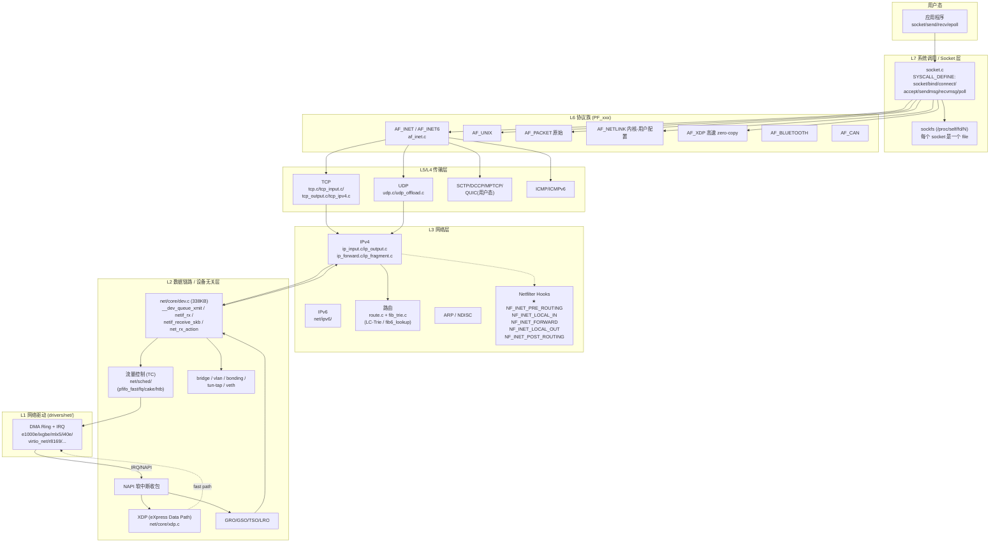
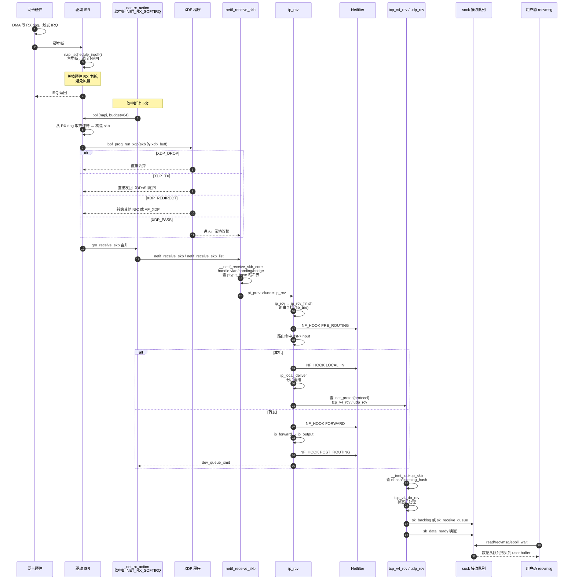
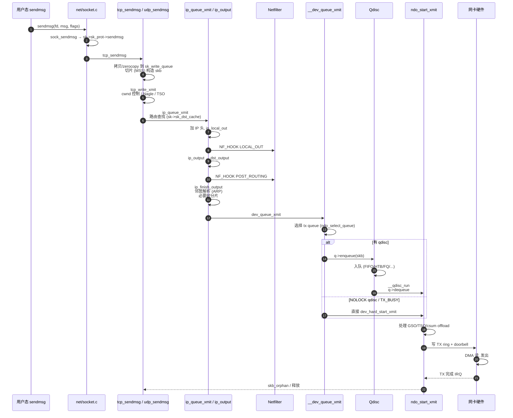
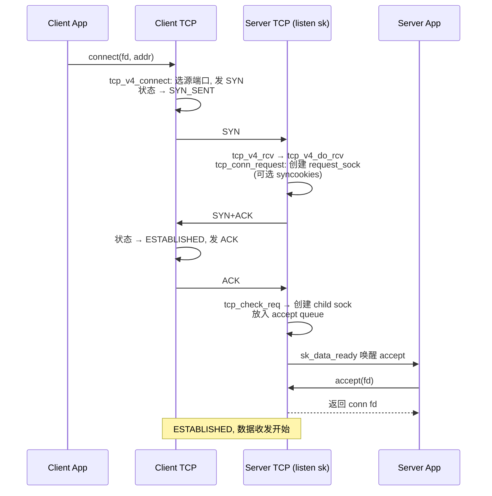

# Linux 内核网络栈深度分析

> 基于当前仓库 `v7.1`，代码主要分布于 [net/](/linux/net) 与 [include/net/](/linux/include/net)、[include/linux/](/linux/include/linux)（`skbuff.h`、`netdevice.h` 等）。这是内核仅次于 MM 的庞大子系统，特点是**协议族多、分层清晰、可插拔**。

---

## 一、整体分层架构

Linux 网络栈完美对应"修订版 OSI"模型，从上到下分 7 层：



**核心设计理念**：

1. **`struct sk_buff` 贯穿所有层**：一个数据包从网卡进入到送到用户态，全程是同一个 skb 在层层流动（指针偏移变化），避免拷贝。
2. **`struct net_device` 抽象一切设备**：物理网卡、veth、tun、bridge、vlan 都是 net_device。
3. **`struct sock` 是协议无关的连接状态**：上接 socket，下接具体协议（TCP/UDP/RAW）。
4. **可插拔**：`struct proto`、`struct proto_ops`、`struct net_protocol`、`struct packet_type`、`struct nf_hook_ops`、`struct tcp_congestion_ops` 全是函数表，注册即生效。
5. **网络命名空间**：`struct net` 隔离协议栈实例（容器基石）。

---

## 二、目录结构与核心文件

### 2.1 [net/core/](/linux/net/core) —— 协议无关核心

| 文件 | 大小 | 职责 |
|---|---|---|
| `dev.c` | **339 KB** | 网络设备核心：注册、收发包主循环（NAPI）、`netif_rx`、`netif_receive_skb`、`__dev_queue_xmit`、`net_rx_action` 软中断 |
| `skbuff.c` | 188 KB | sk_buff 操作：alloc/free/clone/copy/expand/segment(GSO)、frag list |
| `sock.c` | 113 KB | `struct sock` 通用层：sk_buff 队列、内存计费、超时、cgroup |
| `filter.c` | **343 KB** | **BPF/cBPF 过滤器**：socket filter、cls_bpf、verifier 入口 |
| `flow_dissector.c` | 56 KB | 解析 skb 提取 5 元组（用于 RPS/RFS/eBPF） |
| `gro.c` | 20 KB | **GRO**（Generic Receive Offload）合并小包 |
| `gso.c` / `tso.c` | 17 KB | **GSO/TSO**（Generic/TCP Segmentation Offload） |
| `xdp.c` | 27 KB | XDP 注册、redirect map、xdp_buff |
| `page_pool.c` | 36 KB | **page_pool**：高速网络页缓存（DMA 友好，零拷贝） |
| `neighbour.c` | 99 KB | 邻居子系统（ARP/NDISC 共用） |
| `rtnetlink.c` | **175 KB** | rtnetlink：路由/接口/邻居配置接口（iproute2 用） |
| `dst.c` / `dst_cache.c` | 13 KB | 路由缓存条目 (`struct dst_entry`) |
| `fib_rules.c` | 35 KB | 策略路由规则框架 |
| `net_namespace.c` | 37 KB | 网络命名空间 |
| `sock_map.c` | 47 KB | sockmap/sockhash（BPF socket redirect） |
| `sock_reuseport.c` | 19 KB | SO_REUSEPORT 套接字组 |
| `sock_diag.c` | 8 KB | ss 命令的 netlink 接口 |
| `pktgen.c` | 102 KB | 内核内置发包器 |
| `drop_monitor.c` | 42 KB | 丢包监控 |
| `netpoll.c` | 16 KB | netconsole/kgdboe |
| `bpf_sk_storage.c` | 23 KB | BPF 在 socket 上的存储 |
| `devmem.c` | 13 KB | DMABUF 网络收发（NIC→GPU 零拷贝） |

### 2.2 [net/socket.c](/linux/net/socket.c) —— 系统调用层

```
SYSCALL_DEFINE3(socket)         line 1805
SYSCALL_DEFINE4(socketpair)     line 1906
SYSCALL_DEFINE3(bind)
SYSCALL_DEFINE3(connect)
SYSCALL_DEFINE3(accept) / accept4
SYSCALL_DEFINE3(listen)
SYSCALL_DEFINE3(getsockname/getpeername)
SYSCALL_DEFINE6(sendto/recvfrom)
SYSCALL_DEFINE3(sendmsg/recvmsg)
SYSCALL_DEFINE4(setsockopt/getsockopt)
SYSCALL_DEFINE2(shutdown)

sock_sendmsg()                  line 801
sock_recvmsg()                  line 1144
SYSCALL_DEFINE2(socketcall)     line 3173 (s390/sparc legacy)
```

### 2.3 [net/ipv4/](/linux/net/ipv4) —— IPv4 协议族

| 文件 | 大小 | 职责 |
|---|---|---|
| `af_inet.c` | 50 KB | AF_INET 协议族注册、`inet_create`、`inet_release`、`inet_bind/connect` |
| `ip_input.c` | 20 KB | **IP 收包**：`ip_rcv` → `ip_rcv_finish` → `ip_local_deliver`/`ip_forward` |
| `ip_output.c` | 43 KB | **IP 发包**：`ip_queue_xmit`、`ip_output`、`ip_finish_output` |
| `ip_forward.c` | 4 KB | 路由转发路径 |
| `ip_fragment.c` | 18 KB | 分片重组 |
| `route.c` | **96 KB** | IPv4 路由（基于 dst） |
| `fib_trie.c` | **73 KB** | **LC-trie**：FIB 主表数据结构 |
| `fib_frontend.c` / `fib_semantics.c` / `fib_rules.c` | — | FIB 管理 |
| `nexthop.c` | **101 KB** | nexthop 对象（多路径/分组路由） |
| `arp.c` | 37 KB | ARP 协议 |
| `icmp.c` | 44 KB | ICMP |
| `igmp.c` | 76 KB | IGMP（组播） |
| `ipmr.c` | 82 KB | IPv4 组播路由 |
| `inet_hashtables.c` | 36 KB | TCP/UDP 全连接/半连接 hash 表 |
| `inet_connection_sock.c` | 42 KB | 面向连接 sock 公共代码（TCP/SCTP/DCCP） |
| `inet_timewait_sock.c` | 11 KB | TIME_WAIT 状态管理 |
| **TCP 系列** | — | **见下** |
| `udp.c` | **97 KB** | UDP |
| `udp_offload.c` | 26 KB | UDP GSO/GRO |
| `udp_tunnel_*.c` | — | VXLAN/Geneve 等隧道用 |
| `ping.c` | 28 KB | unprivileged ping (DGRAM ICMP) |
| `raw.c` | 25 KB | RAW socket |
| `xfrm4_*.c` | — | IPsec for IPv4 |

#### TCP 子系列（[net/ipv4/tcp*.c](/linux/net/ipv4)）

| 文件 | 大小 | 职责 |
|---|---|---|
| `tcp.c` | **146 KB** | TCP socket 层：`tcp_sendmsg`、`tcp_recvmsg`、`tcp_close`、`tcp_disconnect`、状态机 helper |
| `tcp_input.c` | **226 KB** ⭐ | **接收处理**：ack 处理、窗口、SACK、拥塞控制、快速重传、DSACK、FRTO、PRR |
| `tcp_output.c` | **136 KB** | **发送处理**：分段、ACK、重传、Nagle、TSO、Pacing |
| `tcp_ipv4.c` | 97 KB | IPv4 上的 TCP 接入：`tcp_v4_rcv`、`tcp_v4_connect`、`tcp_v4_send_synack` |
| `tcp_timer.c` | 27 KB | TCP 定时器（RTO、persist、keepalive、TIME_WAIT） |
| `tcp_minisocks.c` | 31 KB | request sock / TIME_WAIT mini sock |
| `tcp_metrics.c` | 28 KB | RTT/CWND 指标缓存（per-destination） |
| `tcp_fastopen.c` | 20 KB | **TFO**（TCP Fast Open） |
| `tcp_recovery.c` | 5 KB | RACK-TLP 丢包检测 |
| `tcp_ao.c` | 65 KB | TCP Authentication Option（RFC 5925） |
| `tcp_cong.c` | 13 KB | 拥塞控制框架 |
| `tcp_cubic.c` | 16 KB | **CUBIC**（默认） |
| `tcp_bbr.c` | 42 KB | **BBR/BBRv2** |
| `tcp_dctcp.c` | 9 KB | DCTCP（数据中心 TCP） |
| `tcp_bic.c`、`tcp_vegas.c`、`tcp_westwood.c`、`tcp_htcp.c`、`tcp_hybla.c`、`tcp_illinois.c`、`tcp_lp.c`、`tcp_nv.c`、`tcp_yeah.c`、`tcp_scalable.c`、`tcp_highspeed.c`、`tcp_cdg.c`、`tcp_veno.c` | — | 其他拥塞算法（可热插拔） |
| `tcp_bpf.c` | 18 KB | BPF 接管 TCP（sockmap） |
| `tcp_ulp.c` | 4 KB | Upper Layer Protocol（kTLS、TLS handshake） |
| `tcp_offload.c` | 11 KB | TSO/GRO |
| `tcp_plb.c` | 4 KB | PLB（Protective Load Balancing） |
| `syncookies.c` | 14 KB | SYN flood 防御 |

### 2.4 [net/ipv6/](/linux/net/ipv6) —— 与 IPv4 对称

`af_inet6.c`、`ip6_input.c`、`ip6_output.c`、`route.c`（基于 fib6 + radix tree）、`tcp_ipv6.c`、`udp.c`、`icmp.c`、`ndisc.c`（取代 ARP）、`addrconf.c`（SLAAC）、`mcast.c`、`xfrm6_*.c`。

### 2.5 [net/netfilter/](/linux/net/netfilter) —— 包过滤

```
nf_core.c           Netfilter 核心 (NF_HOOK 调用框架)
nf_conntrack_*      连接跟踪 (TCP/UDP/ICMP/SCTP/...)
nf_nat_*            NAT (SNAT/DNAT/MASQUERADE)
nf_tables_*         nftables 新框架（取代 iptables）
nft_*               nftables 各类表达式（match/target）
xt_*                xtables 兼容层（iptables 用）
ipvs/               IPVS（4 层负载均衡，用于 LVS/k8s service）
ipset/              IP set（高效 IP 集合匹配）
```

5 大 hook 点（IPv4/IPv6 各一套）：

```
   ┌─ PRE_ROUTING ─┐
   │               ├── 路由查找 ──┬── LOCAL_IN ─────→ 上层 (TCP/UDP)
   │               │              └── FORWARD ──→ POST_ROUTING ─→ 出网卡
                                                 ↑
   上层 → LOCAL_OUT → 路由查找 ─────────────────┘
```

### 2.6 [net/sched/](/linux/net/sched) —— TC 流量控制

```
sch_*               qdisc：pfifo_fast、tbf、prio、htb、fq、fq_codel、cake、netem、ets、taprio
cls_*               classifier：u32、bpf、flower、route、basic、matchall
act_*               action：mirror、police、gact、ct、bpf
em_*                ematch：cmp、meta、ipset、ipt
sch_api.c           qdisc 注册/层级
cls_api.c           classifier 注册
act_api.c           action 注册
```

### 2.7 [net/bridge/](/linux/net/bridge) / [net/8021q/](/linux/net/8021q) / [net/dsa/](/linux/net/dsa)

- `bridge`：软件 L2 网桥（FDB、STP、VLAN-aware bridge）
- `8021q`：VLAN 标签
- `dsa`：分布式交换机架构（边缘交换机芯片驱动框架）

### 2.8 [net/xdp/](/linux/net/xdp) / [net/bpf/](/linux/net/bpf)

- XDP：在驱动 hook 点跑 eBPF（XDP_PASS/DROP/TX/REDIRECT）
- AF_XDP：用户态 zero-copy 收发（DPDK 替代）
- net/bpf：BPF 测试 helper、bpf_iter

### 2.9 其他常见子系统

| 目录 | 说明 |
|---|---|
| `net/unix/` | AF_UNIX 本地 IPC |
| `net/netlink/` | netlink（内核-用户态配置通道） |
| `net/packet/` | AF_PACKET（tcpdump/libpcap） |
| `net/tls/` | kTLS（内核 TLS 卸载） |
| `net/mptcp/` | Multipath TCP |
| `net/sctp/` | SCTP |
| `net/smc/` | SMC（Shared Memory Communications，RDMA） |
| `net/rxrpc/` | RxRPC（AFS 用） |
| `net/sunrpc/` | SunRPC（NFS 用） |
| `net/ceph/`、`net/9p/` | 文件系统专用 |
| `net/can/` | CAN 总线（车载） |
| `net/bluetooth/` | 蓝牙完整栈 |
| `net/wireless/`、`net/mac80211/` | WiFi |
| `net/openvswitch/` | OVS 数据面 |
| `net/xfrm/` | IPsec 框架 |
| `net/handshake/` | TLS handshake upcall |

---

## 三、核心数据结构

### 3.1 `struct sk_buff` —— 网络包描述符

[include/linux/skbuff.h](/linux/include/linux/skbuff.h) 第 886 行起。是网络栈的"原子单位"：

```c
struct sk_buff {
    /* 双向链表（队列连接） */
    union {
        struct {
            struct sk_buff   *next;
            struct sk_buff   *prev;
            ...
        };
        struct rb_node    rbnode;   /* TCP 乱序队列用 */
        struct list_head  list;
    };

    union {
        struct sock      *sk;       /* 关联 socket */
        int               ip_defrag_offset;
    };

    /* 关键时间戳 */
    union {
        ktime_t           tstamp;
        u64               skb_mstamp_ns; /* TCP 用 */
    };

    /* 控制块（48 字节，每协议自由用） */
    char                  cb[48] __aligned(8);

    /* 头部偏移：解析后的指针 */
    __u32                 priority;
    int                   skb_iif;     /* 入接口 */
    int                   ifindex;     /* 出接口 */
    
    __be16                protocol;     /* L3 协议号（ETH_P_IP / ETH_P_IPV6） */
    __u16                 transport_header;
    __u16                 network_header;
    __u16                 mac_header;
    
    /* 数据指针：head ≤ data ≤ tail ≤ end */
    sk_buff_data_t        tail;
    sk_buff_data_t        end;
    unsigned char        *head, *data;
    unsigned int          truesize;     /* 总占用（含 frag） */
    refcount_t            users;
    
    unsigned int          len;          /* 包总长（含 frag） */
    unsigned int          data_len;     /* frag 部分长度 */
    __u16                 mac_len;
    __u16                 hdr_len;
    
    /* 一堆位标志 */
    __u8                  cloned:1, ip_summed:2, nohdr:1,
                          pkt_type:3, fclone:2,
                          peeked:1, head_frag:1, ...;
    
    /* GSO/checksum */
    __u16                 inner_protocol;
    __u16                 inner_transport_header;
    __u16                 inner_network_header;
    __u16                 inner_mac_header;
    
    union {
        __wsum            csum;
        struct {
            __u16         csum_start;
            __u16         csum_offset;
        };
    };
    
    __u32                 hash;          /* RSS/RPS 哈希 */
    __u16                 vlan_proto;
    __u16                 vlan_tci;
    
    union {
        u32               mark;
        u32               reserved_tailroom;
    };
    
    /* 路由结果 */
    union {
        struct dst_entry *dst;
        unsigned long     _skb_refdst;
    };
    struct sec_path      *sp;
    ...
};
```

#### 3.1.1 数据布局

```
┌─────────────────────────────────────────────────────┐
│  skb_shared_info (尾部，引用计数 / GSO / frags[])    │
├─────────────────────────────────────────────────────┤
│                  tailroom (可往后扩)                  │
├─────────────────────────────────────────────────────┤  ← end
│                      data 区                          │
│   ┌───────────────────────────────────────────────┐  │
│   │  Eth Hdr │  IP Hdr  │ TCP Hdr │  Payload      │  │
│   └─────────┬───────────┬─────────┬───────────────┘  │
│   mac_hdr   network_hdr transport_hdr               │
├─────────────────────────────────────────────────────┤  ← tail
│                  headroom (可往前扩)                  │
├─────────────────────────────────────────────────────┤  ← head=data 起点
                                                          ← head
```

发送时**自顶向下**层层加头，`skb_push()` 使 data 指针前移，`skb_pull()` 使 data 指针后移（剥头）。接收时反之。

#### 3.1.2 frag/frag_list

大包用 **scatter-gather**（页帧数组 + frag list）避免线性大块分配，TSO/GSO 都依赖此。

#### 3.1.3 clone vs copy

- `skb_clone()`：共享 data 区，仅复制 skb 元数据（写时拷贝）
- `skb_copy()`：完整拷贝
- `pskb_copy()`：仅拷贝头，data 仍共享
- `skb_get()` / `kfree_skb()`：引用计数

### 3.2 `struct sock` & `struct socket`

```
用户视角：socket fd
   ↓
struct socket  (sockfs inode 的私有数据，VFS 层)
   - 类型 SOCK_STREAM/DGRAM/RAW
   - struct sock *sk;           ★ 真正的协议状态在这
   - const struct proto_ops *ops;  (BSD socket API 的实现表)
   - struct file *file;
   ↓
struct sock  (协议无关基类)
   - struct sock_common  __sk_common  (key: 哈希查找用)
   - 接收队列 sk_receive_queue
   - 发送队列 sk_write_queue
   - 错误队列 sk_error_queue
   - 内存计费 sk_wmem_alloc / sk_rmem_alloc / sk_forward_alloc
   - 拥塞、SO_* 选项、回调 sk_data_ready / sk_state_change / sk_write_space
   - struct proto *sk_prot;     ★ 协议特定操作表
   ↓ (向下继承)
struct inet_sock          (AF_INET 公共)
struct inet_connection_sock  (TCP 等面向连接)
struct tcp_sock           (TCP 状态机、SACK、cwnd、rtt...)
struct udp_sock
struct raw_sock
```

#### `struct proto`（协议操作表）

```c
struct proto {
    void  (*close)(struct sock *sk, long timeout);
    int   (*pre_connect)(struct sock *, ...);
    int   (*connect)(struct sock *, struct sockaddr *, int);
    int   (*disconnect)(struct sock *, int);
    struct sock *(*accept)(struct sock *, ...);
    int   (*ioctl)(struct sock *, int, int *);
    int   (*init)(struct sock *);
    void  (*destroy)(struct sock *);
    void  (*shutdown)(struct sock *, int);
    int   (*setsockopt)(struct sock *, int, int, sockptr_t, unsigned int);
    int   (*getsockopt)(struct sock *, int, int, char __user *, int __user *);
    int   (*sendmsg)(struct sock *, struct msghdr *, size_t);
    int   (*recvmsg)(struct sock *, struct msghdr *, size_t, int, int *);
    int   (*bind)(struct sock *, struct sockaddr *, int);
    int   (*backlog_rcv)(struct sock *, struct sk_buff *);
    void  (*release_cb)(struct sock *);
    int   (*hash)(struct sock *);
    void  (*unhash)(struct sock *);
    int   (*get_port)(struct sock *, unsigned short);
    void  (*put_port)(struct sock *);
    /* 内存计费 */
    bool  (*stream_memory_free)(const struct sock *, int);
    /* TCP 才有的 */
    int   (*memory_pressure);
    long *sysctl_mem;
    int  *sysctl_wmem;
    int  *sysctl_rmem;
    /* hash 桶 */
    struct inet_hashinfo *h;
    char    name[32];
};

/* 全局：tcp_prot、udp_prot、raw_prot、ping_prot... */
```

#### `struct proto_ops`（BSD API 表）

`sock_create` 时根据 family/type 选定，例如 `inet_stream_ops`、`inet_dgram_ops`、`unix_stream_ops`。

### 3.3 `struct net_device`

[include/linux/netdevice.h](/linux/include/linux/netdevice.h) 第 2139 行（庞大，几百字段）：

```c
struct net_device {
    char       name[IFNAMSIZ];
    int        ifindex;
    unsigned int flags;       /* IFF_UP/IFF_BROADCAST/... */
    unsigned int mtu;
    unsigned char dev_addr[];  /* MAC */
    
    netdev_features_t features;
    netdev_features_t hw_features;     /* TSO/GSO/CSUM/NETIF_F_GRO/... */
    
    const struct net_device_ops *netdev_ops;   /* ndo_open/ndo_start_xmit/... */
    const struct ethtool_ops    *ethtool_ops;
    const struct header_ops     *header_ops;
    
    /* 收发队列 */
    struct netdev_rx_queue   *_rx;
    unsigned int              num_rx_queues;
    struct netdev_queue      *_tx;
    unsigned int              num_tx_queues;
    
    struct Qdisc             *qdisc;     /* 根 qdisc */
    
    struct list_head          napi_list;  /* NAPI poll 实例 */
    
    /* 邻居 */
    void                     *atalk_ptr;
    struct in_device __rcu   *ip_ptr;     /* 配的 IP 信息 */
    struct inet6_dev __rcu   *ip6_ptr;
    
    struct net_device       *master;
    struct net_device       *upper;       /* bridge/bond 上层设备 */
    
    /* 统计 */
    struct rtnl_link_stats64 stats;
    
    possible_net_t           nd_net;      /* netns 归属 */
    ...
};
```

**关键回调** `struct net_device_ops`：

```c
ndo_init / ndo_uninit
ndo_open / ndo_stop
ndo_start_xmit          ★ 驱动发包入口
ndo_select_queue        多队列选择
ndo_set_rx_mode
ndo_get_stats64
ndo_change_mtu
ndo_bpf                 XDP / AF_XDP
...
```

### 3.4 `struct dst_entry` & 路由表

```c
struct dst_entry {
    struct net_device *dev;
    struct dst_ops    *ops;
    unsigned long      _metrics;
    unsigned long      expires;
    struct xfrm_state *xfrm;          /* IPsec */
    int (*input)(struct sk_buff *);   /* 收方向 */
    int (*output)(struct net *, struct sock *, struct sk_buff *);
    short              error;
    short              obsolete;
    unsigned short     header_len;
    ...
};

struct rtable {                       /* IPv4 路由缓存条目 */
    struct dst_entry  dst;
    int               rt_genid;
    unsigned int      rt_flags;
    __be32            rt_dst;
    __be32            rt_src;
    int               rt_iif;
    __be32            rt_gateway;
    u32               rt_pmtu;
    ...
};
```

IPv4 主路由表用 **LC-trie**（Level Compressed Trie，[fib_trie.c](/linux/net/ipv4/fib_trie.c)），查找 O(W) 但常数小，缓存友好。IPv6 用 **基数树/radix**（fib6）。

---

## 四、收包路径（RX）—— "从网卡到用户态"



### 4.1 关键阶段详解

#### (1) 硬中断 → NAPI（软中断）
传统模型每包一次中断在 10Gbps+ 下崩溃。**NAPI** 在第一次中断后**关中断 + 轮询**：
- 一次 poll 处理至多 `budget`（默认 64）个包
- 用完 budget 仍有包 → 继续在 softirq 排队
- 包处理完 → 重新开中断
- 若 softirq 占用过久 → 唤醒 `ksoftirqd/N`

[net/core/dev.c](/linux/net/core/dev.c) 第 7910 行：`net_rx_action()` 是 NET_RX_SOFTIRQ 的主循环。

#### (2) GRO（Generic Receive Offload）
[net/core/gro.c](/linux/net/core/gro.c)：在驱动 poll 中把"同流的多个小包"合并成一个大 skb，减少协议栈开销。TCP 上特别有效，常把 64 个 1500B 包合并成 ~64KB 大包送上去。

#### (3) RPS / RFS / RSS / aRFS
- **RSS**（硬件）：网卡按哈希分发到多 RX 队列
- **RPS**（软件）：在软中断里二次分发到其他 CPU
- **RFS**（软件）：根据 socket 所在 CPU 反向引导
- **aRFS**（硬件辅助）：把 RFS 决策反馈到网卡，硬件直接送对 CPU

#### (4) `netif_receive_skb` 核心
[dev.c](/linux/net/core/dev.c) 第 6226 / 6458 行：
- 处理 vlan、bridge、bonding 等"软设备"
- 查 `ptype_all`（tcpdump 等抓包钩子）和 `ptype_base[skb->protocol]`
- 调用对应 L3 协议的 `func`（ip_rcv / ipv6_rcv / arp_rcv / ...）

#### (5) IP 收包 `ip_rcv`
[ip_input.c](/linux/net/ipv4/ip_input.c) 第 603 行：
- 校验 IP 头 / 校验和
- NF_HOOK(PRE_ROUTING) → 用户的 raw/mangle/nat PREROUTING 链
- `ip_route_input` 路由 → `dst->input`
- 本机：`ip_local_deliver` → 分片重组 → NF_HOOK(LOCAL_IN) → `ip_local_deliver_finish` → 查 `inet_protos[]` → TCP/UDP 处理函数

#### (6) TCP 收包 `tcp_v4_rcv`
[tcp_ipv4.c](/linux/net/ipv4/tcp_ipv4.c) 第 2067 行：
- 校验 TCP 头
- `__inet_lookup_skb` 在 `ehash`（established）/ `listening_hash` 查 `struct sock`
- 加 socket lock：
    - 进程没占用：立即处理 `tcp_v4_do_rcv`
    - 进程在用：放 `sk_backlog`，进程释放 lock 时再处理
- `tcp_rcv_established` / `tcp_rcv_state_process`：状态机驱动
- 入队 `sk_receive_queue` → `sk_data_ready` 唤醒等待者

#### (7) 用户态 recvmsg
- `tcp_recvmsg` 把 skb 拷贝到用户 buffer
- 支持 MSG_PEEK、MSG_WAITALL、MSG_DONTWAIT
- 支持 MSG_ZEROCOPY、TCP_ZEROCOPY_RECEIVE（mmap 拿数据）

---

## 五、发包路径（TX）—— "从用户态到网卡"



### 5.1 TCP 发送细节

[tcp.c](/linux/net/ipv4/tcp.c) `tcp_sendmsg` 路径：
1. 上锁 `lock_sock`
2. 等待写空间（`sk_stream_wait_memory`）
3. 拷贝（或 zerocopy 引用 user pages）
4. 拼到 `sk_write_queue` 末尾的 skb（如果还有空间）或新建
5. 调 `tcp_push` → `__tcp_push_pending_frames` → `tcp_write_xmit`
6. 在 `tcp_write_xmit` 中按 cwnd / rwnd / TSO 限制循环发包
7. `tcp_transmit_skb` 加 TCP 头 → 调 `__tcp_transmit_skb` → `ip_queue_xmit`

### 5.2 拥塞控制可插拔
[tcp_cong.c](/linux/net/ipv4/tcp_cong.c) 定义 `struct tcp_congestion_ops`：

```c
struct tcp_congestion_ops {
    u32  (*ssthresh)(struct sock *sk);
    void (*cong_avoid)(struct sock *sk, u32 ack, u32 acked);
    void (*set_state)(struct sock *sk, u8 new_state);
    void (*cwnd_event)(struct sock *sk, enum tcp_ca_event ev);
    void (*in_ack_event)(struct sock *sk, u32 flags);
    u32  (*undo_cwnd)(struct sock *sk);
    void (*pkts_acked)(struct sock *sk, const struct ack_sample *sample);
    u32  (*min_tso_segs)(struct sock *sk);
    u32  (*sndbuf_expand)(struct sock *sk);
    void (*cong_control)(struct sock *sk, u32 ack, int flag, const struct rate_sample *rs);
    ...
    char name[TCP_CA_NAME_MAX];
};
```

CUBIC（默认）、BBR、Reno、Vegas、DCTCP 均实现此结构，`tcp_register_congestion_control()` 注册，`/proc/sys/net/ipv4/tcp_congestion_control` 切换。

### 5.3 Qdisc（流量控制）
[net/sched/](/linux/net/sched)：
- 默认根 qdisc 是 `pfifo_fast` 或 `fq_codel`（看 sysctl）
- 多队列设备：每个 tx queue 一个 qdisc
- 经典 qdisc 有锁（`__QDISC_STATE_RUNNING`），同 queue 串行
- **NOLOCK qdisc**（`pfifo_fast` 之 lockless 版）：per-cpu，多核扩展性好
- HTB/CAKE 等做层级整形

---

## 六、Socket 层与系统调用

### 6.1 socket 创建链路

```
sys_socket(AF_INET, SOCK_STREAM, 0)
  → __sys_socket
  → sock_create_kern → __sock_create
      → 查 net_families[AF_INET] = &inet_family_ops
      → inet_family_ops->create() = inet_create
          → 查 inetsw[SOCK_STREAM] (注册时 inet_register_protosw)
          → sk_alloc(net, AF_INET, prio, &tcp_prot)
          → sock->ops = inet_stream_ops
          → sk->sk_prot = &tcp_prot
          → sk->sk_prot->init(sk) = tcp_v4_init_sock
              → icsk->icsk_ca_ops = tcp_init_congestion_ops
              → 初始化 cwnd/ssthresh/...
  → sock_map_fd → 分配 fd, 安装 file (sockfs)
  → 返回 fd
```

### 6.2 BSD API ↔ proto_ops ↔ proto

```
sys_bind   → sock->ops->bind     (inet_bind)        → sk->sk_prot->bind
sys_listen → sock->ops->listen   (inet_listen)      → inet_csk_listen_start
sys_accept → sock->ops->accept   (inet_accept)      → sk->sk_prot->accept (inet_csk_accept)
sys_connect→ sock->ops->connect  (inet_stream_connect)→ sk->sk_prot->connect (tcp_v4_connect)
sys_sendmsg→ sock_sendmsg        → sock->ops->sendmsg (inet_sendmsg) → sk->sk_prot->sendmsg (tcp_sendmsg)
sys_recvmsg→ sock_recvmsg        → sock->ops->recvmsg → sk->sk_prot->recvmsg (tcp_recvmsg)
sys_setsockopt → sock->ops->setsockopt
sys_close  → sock_close → sock->ops->release → sk->sk_prot->close
```

### 6.3 sockfs：socket = fd

每个 socket 有一个 inode（在 sockfs 这个内核 pseudo-fs 上），有一个 `struct file`，所以：
- 可以用 `read/write/poll/epoll/select` 操作 socket
- `/proc/PID/fd/N` 显示 `socket:[inode]`
- `SCM_RIGHTS` 可以把 socket fd 通过 AF_UNIX 传给别的进程

---

## 七、TCP 状态机与拥塞控制核心

### 7.1 状态机

```
                     CLOSED
                       │
                  passive open       active open
                       │                 │
                       ▼                 ▼
                    LISTEN          SYN_SENT
                  ┌───┴───┐             │
              recv SYN   recv RST       │
                  │       │            recv SYN+ACK
                  ▼       ▼            send ACK
              SYN_RCVD ──┐                │
              recv ACK   │                ▼
                  │      │           ESTABLISHED
                  ▼      └──────────────┐│
              ESTABLISHED ←──────────────┘│
                  │                       │
              close│                close │
                  ▼                       ▼
              FIN_WAIT_1               CLOSE_WAIT
                  │                       │
              recv ACK                close│
                  ▼                       ▼
              FIN_WAIT_2               LAST_ACK
                  │                       │
              recv FIN              recv ACK
                  ▼                       ▼
              TIME_WAIT (2MSL) ─────→  CLOSED
```

实现于 [tcp_input.c](/linux/net/ipv4/tcp_input.c) `tcp_rcv_state_process` + [tcp.c](/linux/net/ipv4/tcp.c) `tcp_close` 等。

### 7.2 接收处理 fast path / slow path

`tcp_rcv_established`：
- **fast path** (`tcp_header_prediction`)：仅 ACK + 数据、无乱序、无窗口变化 → 直接入队
- **slow path**：处理 SACK、窗口缩放、PAWS、ECN、乱序队列（rbtree）、重组、重传

### 7.3 关键算法
- **SACK** + **DSACK**：选择性确认
- **RACK-TLP**：基于 RTT 的丢包检测（替代 NewReno 计 dup-ack）
- **F-RTO**：避免虚假超时重传
- **PRR**（Proportional Rate Reduction）：丢包恢复期更平滑
- **TCP Small Queues (TSQ)**：限制每 socket 待发字节，降 bufferbloat
- **Pacing**：BBR 用，按 cwnd/rtt 定速发，硬件辅助 EDT (Earliest Departure Time)

---

## 八、Netfilter & nftables

### 8.1 5 hook + 5 表

```
hook 点：
  PRE_ROUTING、LOCAL_IN、FORWARD、LOCAL_OUT、POST_ROUTING

iptables 表：
  raw     → conntrack 之前 (NOTRACK)
  mangle  → 改包属性
  nat     → SNAT/DNAT/MASQ
  filter  → 默认表 (ACCEPT/DROP/REJECT)
  security→ SELinux
```

### 8.2 conntrack
[net/netfilter/nf_conntrack_*.c](/linux/net/netfilter)：
- 用 5 元组哈希追踪连接（含 TCP 状态、UDP/ICMP 流）
- 是 NAT、stateful filter、IPVS 的基础
- 表条目过多会爆 `nf_conntrack: table full`

### 8.3 nftables（推荐）
- 一个统一 family（inet 同时管 IPv4/IPv6）
- 字节码引擎（vmd-table），用户态编译规则到字节码
- 性能、可读性、表达力都优于 iptables；但 iptables-nft 仍提供兼容

### 8.4 IPVS / IP set
- **IPVS**（[net/netfilter/ipvs/](/linux/net/netfilter/ipvs)）：内核 4 层负载均衡器（DR/NAT/TUN 模式），k8s `kube-proxy --proxy-mode=ipvs` 用
- **IP set**：高效集合匹配（hash:ip / hash:net / bitmap），对大规模黑白名单友好

---

## 九、高速路径：XDP / AF_XDP / kTLS

### 9.1 XDP（eXpress Data Path）
最早的内核 hook 点（在驱动 RX 把页转 skb **之前**）：
- 在 NIC 驱动收到包后，**先跑一段 eBPF 程序**
- 返回值：`XDP_PASS` / `XDP_DROP` / `XDP_TX` / `XDP_REDIRECT` / `XDP_ABORTED`
- 性能：DDoS 防护可在小包下 100Mpps+
- offload 模式：直接 jit 到智能网卡

### 9.2 AF_XDP
- 用户态 zero-copy 收发框架
- 在 XDP 程序里 `XDP_REDIRECT → xskmap`，把包送到 user 共享内存的 ring
- DPDK 的内核态替代，安全、命名空间友好

### 9.3 kTLS（[net/tls/](/linux/net/tls)）
- TLS 加解密下沉到内核（甚至网卡硬件）
- `setsockopt(TLS_TX, ...)` 后，`sendmsg` 数据由内核加密
- 配合 sendfile + GSO 实现零拷贝 HTTPS
- nginx、HAproxy 已支持

### 9.4 io_uring + 网络
- `IORING_OP_SEND/RECV/SENDMSG/RECVMSG/ACCEPT/CONNECT`
- multi-shot accept、zerocopy send
- 超低延迟代理（envoy、proxygen）逐步采用

---

## 十、网络命名空间（netns）

```c
struct net {
    refcount_t          passive;
    spinlock_t          rules_mod_lock;
    unsigned int        dev_base_seq;
    int                 ifindex;
    struct list_head    list;          /* 全局链表 */
    struct list_head    exit_list;
    struct user_namespace *user_ns;
    
    struct proc_dir_entry *proc_net;
    struct net_device     *loopback_dev;
    
    struct list_head      dev_base_head;
    struct hlist_head    *dev_name_head;
    struct hlist_head    *dev_index_head;
    
    /* 每个子系统的 per-netns 数据 */
    struct netns_ipv4    ipv4;
    struct netns_ipv6    ipv6;
    struct netns_nf      nf;
    struct netns_xt      xt;
    struct netns_ct      ct;
    ...
};
```

每个 netns 都有：
- 独立的网络接口（`ip link`、回环设备）
- 独立的路由表（`ip route`）
- 独立的 iptables/nftables/conntrack
- 独立的 socket/端口空间
- 独立的 sysctl

容器（Docker/k8s pod）就是基于这个：每个 pod 一个 netns，veth pair 把它接到 host bridge / cni 插件管理的拓扑。

---

## 十一、典型场景全链路时序

### 11.1 TCP 三次握手（client）



### 11.2 一次 HTTP GET 数据包路径

```
Client send "GET /\n":
  app → write(fd, "GET /\n", 7)
    → sys_write → vfs_write → sock_write_iter → sock_sendmsg
    → tcp_sendmsg
        → 拷贝 7B 到 sk_write_queue 中现有 skb（合并）
        → tcp_push → tcp_write_xmit
        → tcp_transmit_skb（加 TCP 头，序列号=N+1）
    → ip_queue_xmit
        → __sk_dst_check（路由缓存命中）
        → 加 IP 头
        → ip_local_out → __ip_local_out → NF_HOOK(LOCAL_OUT)
        → ip_output → ip_finish_output
        → neigh_output → dev_queue_xmit
    → __dev_queue_xmit
        → q->enqueue → __qdisc_run → q->dequeue
        → dev_hard_start_xmit → ndo_start_xmit (e1000_xmit_frame)
    → 网卡 DMA 发出

Server recv:
  网卡 DMA 写 RX ring → IRQ → driver napi_schedule
  → softirq net_rx_action → driver poll
    → 构造 skb → XDP (PASS) → GRO → netif_receive_skb
    → ip_rcv → NF_HOOK(PRE_ROUTING) → ip_route_input
    → ip_local_deliver → NF_HOOK(LOCAL_IN) → ip_local_deliver_finish
    → tcp_v4_rcv → __inet_lookup_skb 查 ehash 找到 sock
    → tcp_v4_do_rcv → tcp_rcv_established (fast path)
        → 入队 sk_receive_queue
        → 发 ACK（延迟 ACK 框架）
        → sk_data_ready
  app: epoll_wait 返回 → read(fd, buf, 4096)
    → tcp_recvmsg → 拷贝 7B 到 buf
```

---

## 十二、可观测与调试

| 工具 / 接口 | 用途 |
|---|---|
| `/proc/net/{tcp,udp,raw,unix,packet,...}` | 老接口，sock 列表 |
| `ss` (基于 sock_diag netlink) | 现代接口，更快 |
| `ip` (rtnetlink) | 配置链路/地址/路由 |
| `ethtool` | 驱动统计、ring、offload 开关 |
| `tcpdump` (AF_PACKET) | 抓包 |
| `iptables -L -nv` / `nft list ruleset` | 防火墙规则 |
| `conntrack -L` | 连接跟踪 |
| `tc qdisc show` / `tc -s class` | 流控 |
| `bpftrace`、`bcc` | 动态追踪：`tcpconnect`、`tcpaccept`、`tcpretrans`、`tcptracer`、`tcplife` |
| `perf trace -e net:*` | tracepoint |
| `/sys/class/net/<dev>/statistics/*` | 接口统计 |
| `nstat`、`ip -s link` | 协议统计 |
| **drop_monitor** | 内核丢包点采样 |
| **TCP_INFO** getsockopt | 单连接 RTT/cwnd/重传等 |
| **PSI** (`/proc/pressure/io`) | 间接反映网络瓶颈 |
| **BPF CO-RE 工具** | bpftool prog/map 列表 |

主要 tracepoint 类：
```
net:netif_rx / net:netif_receive_skb / net:net_dev_queue
net:napi_poll
tcp:tcp_send_reset / tcp:tcp_retransmit_skb / tcp:tcp_probe / tcp:tcp_destroy_sock
sock:sock_rcvqueue_full / sock:sock_exceed_buf_limit / sock:inet_sock_set_state
fib:fib_table_lookup
qdisc:qdisc_dequeue
```

---

## 十三、设计要点总结

1. **分层 + 函数指针表**：每层都有"协议表"（`net_protocol`、`packet_type`、`proto`、`proto_ops`、`net_device_ops`、`tcp_congestion_ops`、`nf_hook_ops`），可注册插拔。
2. **零拷贝优先**：sk_buff frag、`MSG_ZEROCOPY`、`splice/sendfile`、kTLS、AF_XDP、io_uring zerocopy。
3. **NAPI 中断节流**：避免高速场景下硬中断风暴。
4. **多队列扩展**：RSS/RPS/RFS、per-CPU softirq、NOLOCK qdisc，单机多核扩展性。
5. **网络命名空间 + cgroup**：原生支持容器化（network 隔离 + bandwidth 控制）。
6. **eBPF 全面渗透**：socket filter、XDP、tc-bpf、cgroup-bpf、struct_ops（拥塞控制、sched_ext）、kprobe → 几乎可在任意点注入策略。
7. **Netfilter / nftables**：完备的有状态防火墙 + NAT 框架。
8. **可热插拔的拥塞控制**：CUBIC/BBR/DCTCP 自由切换。
9. **大量 offload**：TSO/GSO/GRO/LRO/CSUM/RSS/VXLAN-offload/IPsec-offload/kTLS-offload 减轻 CPU。
10. **持续重构**：从 iptables→nftables，从 LRO→GRO，从 dst cache→fib 直接查，从单一 qdisc→NOLOCK，体现性能与可维护性的演进。

---

如果你想再深入某个具体方向，下面这些点都可以基于源码进一步剖析，告诉我聚焦哪个：

- **`__dev_queue_xmit` 完整路径与 NOLOCK qdisc 细节**
- **`net_rx_action` + NAPI budget + softirq 与 ksoftirqd 调度**
- **`tcp_rcv_established` fast/slow path 的状态机**
- **TCP cwnd 机器：从 slow start 到 BBR 的实现差异**
- **TIME_WAIT 与 reuseport_filter / tcp_tw_reuse 的工程实现**
- **GRO 流匹配与合并算法**
- **inet_hashtables：ehash + lhash + bhash 的并发设计**
- **fib_trie 路由查找算法**
- **netfilter conntrack hash + GC + helper（FTP ALG 等）**
- **XDP/eBPF verifier 与 prog 装载流程**
- **AF_XDP zerocopy ring 协议**
- **kTLS TX/RX 数据流**
- **veth/bridge/macvlan 工作机制（容器网络基础）**
- **rtnetlink 消息处理（iproute2 怎么和内核通信）**