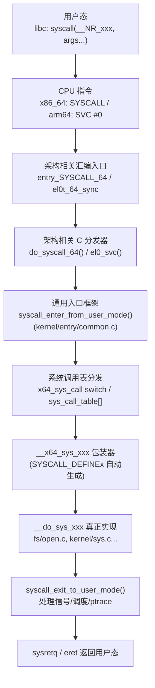
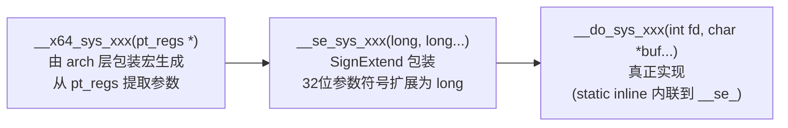
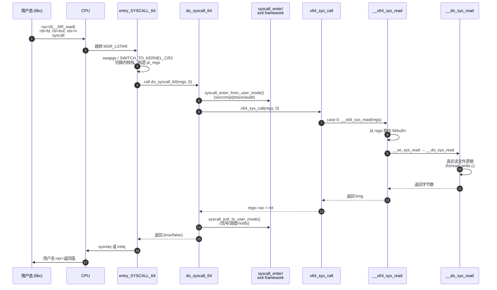

# Linux 内核系统调用入口分析

> 基于当前仓库 `v7.1`（代号 *Baby Opossum Posse*）。以 x86_64 为主线，并对比 ARM64。

## 一、整体架构总览

系统调用是用户态程序进入内核态的"标准受控通道"。从用户态触发到具体内核函数执行，要穿过 **5 个层次**：



---

## 二、关键入口数据/代码位置

| 层次 | 关键文件 | 关键符号 |
|---|---|---|
| 系统调用号定义 | [arch/x86/entry/syscalls/syscall_64.tbl](/linux/arch/x86/entry/syscalls/syscall_64.tbl) | `0 read sys_read`、`1 write sys_write`... |
| 汇编入口 (x86_64) | [arch/x86/entry/entry_64.S](/linux/arch/x86/entry/entry_64.S) | `entry_SYSCALL_64` (第 87 行) |
| C 分发 (x86_64) | [arch/x86/entry/syscall_64.c](/linux/arch/x86/entry/syscall_64.c) | `do_syscall_64()`、`x64_sys_call()` |
| 架构无关入口框架 | [kernel/entry/common.c](/linux/kernel/entry/common.c) | `exit_to_user_mode_loop()` |
| 框架头文件（内联部分） | [include/linux/entry-common.h](/linux/include/linux/entry-common.h) | `syscall_enter_from_user_mode()` |
| 系统调用宏 | [include/linux/syscalls.h](/linux/include/linux/syscalls.h) | `SYSCALL_DEFINE0..6`、`__SYSCALL_DEFINEx` |

---

## 三、x86_64 入口逐层剖析

### 3.1 用户态触发：`syscall` 指令

用户态 glibc 把系统调用号放入 `%rax`，参数依次放入 `%rdi, %rsi, %rdx, %r10, %r8, %r9`，然后执行 `syscall` 指令。

CPU 根据 `MSR_LSTAR` 寄存器跳转到内核中预先注册的入口 `entry_SYSCALL_64`，并完成：
- `RIP → RCX`、`RFLAGS → R11`
- `CS/SS` 切到内核段，**但栈指针 RSP 不切换**（这点与中断不同）

### 3.2 汇编入口：`entry_SYSCALL_64`

代码位于 [arch/x86/entry/entry_64.S](/linux/arch/x86/entry/entry_64.S) 第 87 行起。核心流程：

```asm
SYM_CODE_START(entry_SYSCALL_64)
    swapgs                              ; 切换 GS_BASE 到内核
    movq    %rsp, PER_CPU_VAR(... TSS_sp2)  ; 保存用户 RSP
    SWITCH_TO_KERNEL_CR3 scratch_reg=%rsp   ; KPTI: 切换页表
    movq    PER_CPU_VAR(cpu_current_top_of_stack), %rsp ; 切换内核栈

    pushq   $__USER_DS / SP / FLAGS / __USER_CS / RIP / orig_ax  ; 构造 pt_regs
    PUSH_AND_CLEAR_REGS rax=$-ENOSYS         ; 保存通用寄存器并清零

    movq    %rsp, %rdi                       ; arg1: pt_regs *
    movslq  %eax, %rsi                       ; arg2: 系统调用号 (符号扩展)

    IBRS_ENTER / UNTRAIN_RET / CLEAR_BRANCH_HISTORY  ; Spectre/分支历史防御
    call    do_syscall_64                    ; ★ 进入 C 代码
    
    ; 返回路径：尽可能 sysret，否则 iret
    ALTERNATIVE "testb %al, %al; jz swapgs_restore_regs_and_return_to_usermode", ...
```

**关键安全机制**：
- `SWITCH_TO_KERNEL_CR3`：**KPTI**（页表隔离），缓解 Meltdown
- `IBRS_ENTER / UNTRAIN_RET / CLEAR_BRANCH_HISTORY`：缓解 Spectre/Retbleed/BHI
- `STACKLEAK_ERASE_NOCLOBBER`：返回前清栈

### 3.3 C 分发：`do_syscall_64()`

位于 [arch/x86/entry/syscall_64.c](/linux/arch/x86/entry/syscall_64.c)：

```c
__visible noinstr bool do_syscall_64(struct pt_regs *regs, int nr)
{
    nr = syscall_enter_from_user_mode(regs, nr);   // ① 进入工作

    instrumentation_begin();
    add_random_kstack_offset();                    // ② 栈偏移随机化（强化）

    if (!do_syscall_x64(regs, nr) && !do_syscall_x32(regs, nr) && nr != -1) {
        regs->ax = __x64_sys_ni_syscall(regs);     // ③ 非法调用号
    }

    instrumentation_end();
    syscall_exit_to_user_mode(regs);               // ④ 退出工作

    /* ⑤ 判断能否走 sysret 快路径 */
    if (cpu_feature_enabled(X86_FEATURE_XENPV))    return false;
    if (regs->cx != regs->ip || regs->r11 != regs->flags) return false;
    if (regs->cs != __USER_CS || regs->ss != __USER_DS)   return false;
    if (regs->ip >= TASK_SIZE_MAX) return false;
    if (regs->flags & (X86_EFLAGS_RF | X86_EFLAGS_TF))    return false;
    return true;
}
```

### 3.4 系统调用号 → 函数：`x64_sys_call()`

同文件中通过 **宏展开技巧** 让 `syscall_64.tbl` 复用三次：

```c
/* 第①次：声明每个 __x64_sys_xxx 原型 */
#define __SYSCALL(nr, sym) extern long __x64_##sym(const struct pt_regs *);
#include <asm/syscalls_64.h>           // 由脚本从 syscall_64.tbl 生成
#undef  __SYSCALL

/* 第②次：构造函数指针表（仅供 trace_syscalls 使用） */
#define __SYSCALL(nr, sym) __x64_##sym,
const sys_call_ptr_t sys_call_table[] = { #include <asm/syscalls_64.h> };

/* 第③次：构造 switch 分发器（实际使用） */
#define __SYSCALL(nr, sym) case nr: return __x64_##sym(regs);
long x64_sys_call(const struct pt_regs *regs, unsigned int nr)
{
    switch (nr) {
        #include <asm/syscalls_64.h>
        default: return __x64_sys_ni_syscall(regs);
    }
}
```

> **重要变化**：从 v6.x 开始，主流路径已从「跳表 `sys_call_table[nr]`」改为 `switch-case`。这是为了 **CFI（控制流完整性）兼容** 和让编译器更好地优化、内联，配合 `array_index_nospec()` 防 Spectre v1。

`do_syscall_x64()` 用 `array_index_nospec()` 把越界号转成"很大数"以避免预测越界访问：

```c
static __always_inline bool do_syscall_x64(struct pt_regs *regs, int nr)
{
    unsigned int unr = nr;
    if (likely(unr < NR_syscalls)) {
        unr = array_index_nospec(unr, NR_syscalls);
        regs->ax = x64_sys_call(regs, unr);
        return true;
    }
    return false;
}
```

### 3.5 系统调用号表：`syscall_64.tbl`

[syscall_64.tbl](/linux/arch/x86/entry/syscalls/syscall_64.tbl) 是单一权威源（Single Source of Truth）：

```
# <number> <abi> <name> <entry point> [<compat entry point> [noreturn]]
0   common  read           sys_read
1   common  write          sys_write
2   common  open           sys_open
...
```

构建时 [scripts/syscalltbl.sh](/linux/scripts) 把它转换成 `arch/x86/include/generated/asm/syscalls_64.h`，每行形如 `__SYSCALL(0, sys_read)`。

---

## 四、`SYSCALL_DEFINEx` 宏：从 `sys_xxx` 到 `__x64_sys_xxx`

[include/linux/syscalls.h](/linux/include/linux/syscalls.h) 第 218 行起：

```c
#define SYSCALL_DEFINE0(sname)                          \
    asmlinkage long sys_##sname(void);                  \
    asmlinkage long sys_##sname(void)

#define SYSCALL_DEFINE1..6(name, ...)  SYSCALL_DEFINEx(...)

#define __SYSCALL_DEFINEx(x, name, ...)                                        \
    asmlinkage long sys##name(__MAP(x,__SC_DECL,__VA_ARGS__))                  \
        __attribute__((alias(__stringify(__se_sys##name))));                   \
    static inline long __do_sys##name(...);                                    \
    asmlinkage long __se_sys##name(__MAP(x,__SC_LONG,__VA_ARGS__))             \
    {                                                                          \
        long ret = __do_sys##name(__MAP(x,__SC_CAST,__VA_ARGS__));             \
        __MAP(x,__SC_TEST,__VA_ARGS__);                                        \
        __PROTECT(x, ret,__MAP(x,__SC_ARGS,__VA_ARGS__));                      \
        return ret;                                                            \
    }                                                                          \
    static inline long __do_sys##name(__MAP(x,__SC_DECL,__VA_ARGS__))
```

宏展开后产生 **3 层函数**：



举例：`SYSCALL_DEFINE3(read, unsigned int, fd, char __user *, buf, size_t, count) { ... }` 展开后会生成：
- `__x64_sys_read(const struct pt_regs *regs)` — `pt_regs` 入口（CFI 兼容、防 Spectre）
- `__se_sys_read(long fd, long buf, long count)` — sign-extend 包装
- `__do_sys_read(unsigned int fd, char __user *buf, size_t count)` — 真实实现

`__x64_sys_*` 这层是 **架构相关的包装层**，由 `arch/x86/include/asm/syscall_wrapper.h` 中的 `__SYSCALL_DEFINEx` **重写覆盖** 通用版本，把参数从 `pt_regs->di/si/dx/r10/r8/r9` 抽取出来传给 `__se_sys_*`。

> 这种"pt_regs 入口 + sign-extend 中间层 + 真实实现"的设计，从 4.17 起统一了 syscall ABI，让所有 syscall 都可以用同一个函数指针类型 `long (*)(const struct pt_regs *)`，并很好地配合 CFI、KCFI、Retpoline。

---

## 五、架构无关的入口框架（kernel/entry/）

[include/linux/entry-common.h](/linux/include/linux/entry-common.h) 提供 **`syscall_enter_from_user_mode()`** / **`syscall_exit_to_user_mode()`**，所有架构（x86、arm64、riscv、s390 …）共用这一套：

```c
static __always_inline long syscall_enter_from_user_mode(struct pt_regs *regs, long syscall)
{
    enter_from_user_mode(regs);                  // 退出 RCU EQS、context tracking
    instrumentation_begin();
    local_irq_enable();
    ret = syscall_enter_from_user_mode_work(regs, syscall);
    /*  里面会处理：
     *  - SECCOMP（_TIF_SECCOMP）  → __secure_computing()
     *  - SYSCALL_TRACE / TRACEPOINT / EMU  → ptrace_report_syscall_entry / trace_sys_enter
     *  - AUDIT  → audit_syscall_entry()
     *  - SYSCALL_USER_DISPATCH（glibc rseq 等）
     */
    instrumentation_end();
    return ret;
}
```

退出阶段 `exit_to_user_mode_loop()` 在 [kernel/entry/common.c](/linux/kernel/entry/common.c) 中循环检查 TIF 标志，处理：
- `_TIF_NEED_RESCHED / _TIF_NEED_RESCHED_LAZY` → `schedule()`
- `_TIF_UPROBE` → uprobe 回调
- `_TIF_PATCH_PENDING` → kpatch/livepatch
- `_TIF_SIGPENDING / _TIF_NOTIFY_SIGNAL` → `arch_do_signal_or_restart()`
- `_TIF_NOTIFY_RESUME` → `resume_user_mode_work()`（rseq、io_uring task_work…）

> 这是 **5.x 重构后的关键统一**：早期每个架构都自己写一套"check_pending_signals + reschedule"，现在都收敛到 `kernel/entry/`。

---

## 七、特殊机制与边角

### 7.1 vDSO（用户态调用，不进内核）
[arch/x86/entry/vdso/](/linux/arch/x86/entry/vdso) 把 `gettimeofday`、`clock_gettime`、`getcpu`、`getrandom`、`futex_waitv` 等热点 syscall 的纯计算部分以 `.so` 形式映射到用户态，内核维护数据页，用户态直接读取，**完全跳过 syscall 陷入**。

新版本中能看到：
- `arch/x86/entry/vdso/common/vfutex.c`
- `arch/x86/entry/vdso/vdso64/vgetrandom.c`、`vgetrandom-chacha.S`
- `arch/x86/entry/vdso/vdso64/vsgx.S`（SGX）

### 7.2 vsyscall（已弃用兼容层）
[arch/x86/entry/vsyscall/vsyscall_64.c](/linux/arch/x86/entry/vsyscall/vsyscall_64.c)：固定地址 `0xffffffffff600000` 上的旧机制，现在多通过 emulation 模式触发 `#PF` 进内核模拟，仅为兼容老程序。

### 7.3 FRED（Flexible Return and Event Delivery）
Intel 新事件投递机制。[arch/x86/entry/entry_64_fred.S](/linux/arch/x86/entry/entry_64_fred.S) 与 [entry_fred.c](/linux/arch/x86/entry/entry_fred.c) 是替代传统 IDT/SYSCALL 的新路径，统一 syscall 与中断的入口逻辑。当 CPU 支持 `X86_FEATURE_FRED` 时启用。

### 7.4 32 位 / x32 / compat
- 32 位 syscall：`int 0x80` → `entry_INT80_compat` / `sysenter` → `entry_SYSENTER_compat`，分发到 [syscall_32.c](/linux/arch/x86/entry/syscall_32.c)
- x32 ABI：64 位 CPU 上的 32 位指针 ILP32 兼容，号段以 `__X32_SYSCALL_BIT` 标记，由 `do_syscall_x32()` 分发
- ARM64 compat 32：`do_el0_svc_compat()` → `compat_sys_call_table`

### 7.5 seccomp & syscall_user_dispatch
- [kernel/seccomp.c](/linux/kernel/seccomp.c)：BPF 过滤 syscall（沙箱），由 `syscall_enter_from_user_mode_work` 调用
- [kernel/entry/syscall_user_dispatch.c](/linux/kernel/entry/syscall_user_dispatch.c)：允许用户进程把指定地址范围内的 syscall **重定向回用户态**（Wine、glibc rseq 用）

### 7.6 ptrace / audit / tracepoint
- ptrace：通过 `_TIF_SYSCALL_TRACE`，在 enter/exit 拦截
- audit：`auditsc.c` 记录调用号、参数、返回值
- 静态 tracepoint：`trace_sys_enter` / `trace_sys_exit`，定义在 [kernel/entry/syscall-common.c](/linux/kernel/entry/syscall-common.c)

---

## 八、一次完整调用时序（以 `read(fd, buf, n)` 为例）



---