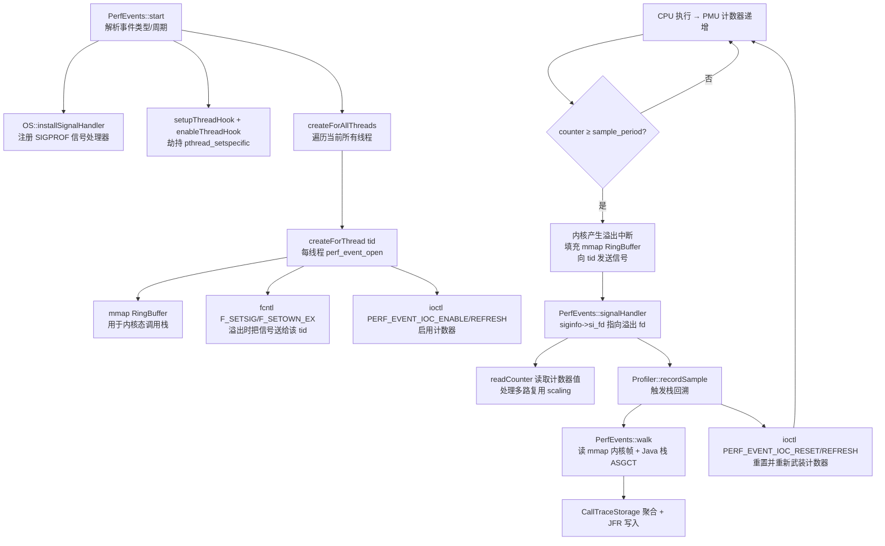
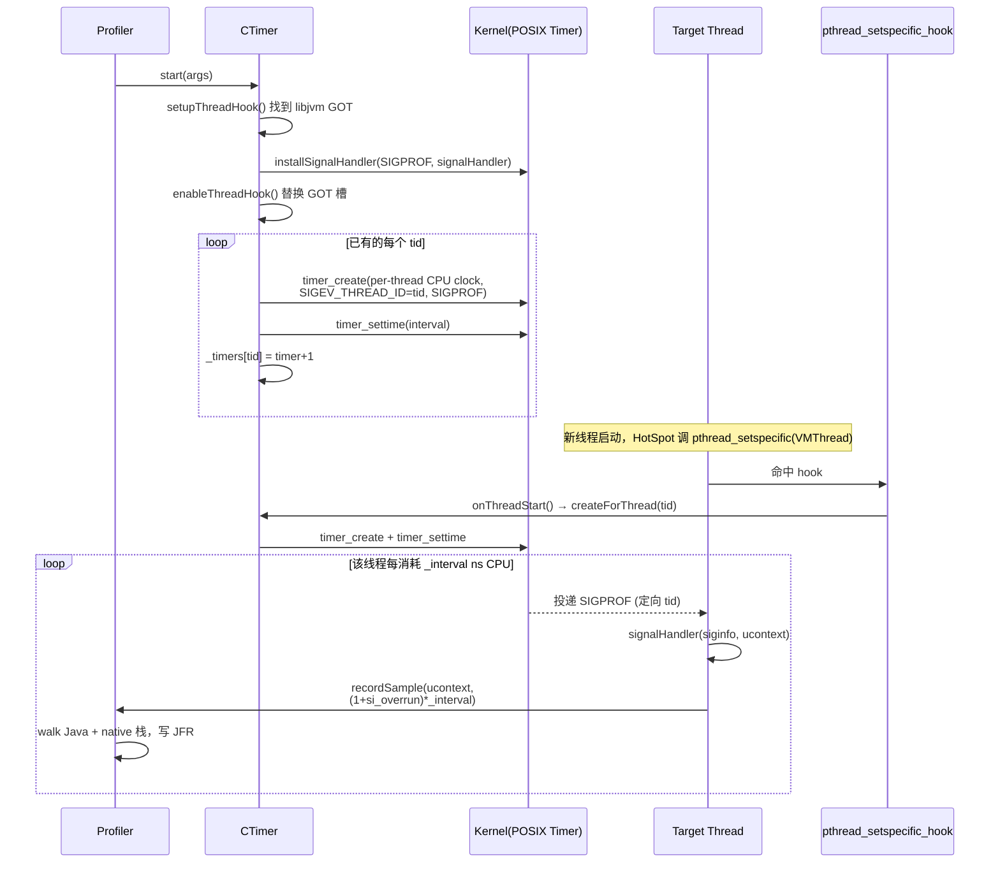

# PerfEvents CPU 采样实现原理深度剖析

## 一、整体架构概览

async-profiler 的 PerfEvents 引擎本质上是 Linux 内核 `perf_event_open` 系统调用的封装。它把"PMU 硬件计数器/软件计数器溢出 → 内核异步发送信号 → 用户态信号处理器抓取调用栈"这一闭环串联了起来。

整体流程可用下图概括：



---

## 二、关键阶段详解

### 1. 启动阶段 `PerfEvents::start`（[perfEvents_linux.cpp:812](/async-profiler/src/perfEvents_linux.cpp)）

这是入口函数，负责一系列初始化：

- **事件类型解析**：通过 `PerfEventType::forName(args._event)` 将用户传入的字符串（如 `"cpu"`、`"cycles"`、`"cache-misses"`、`"mem:..."`、`"kprobe:..."`）映射到 `PerfEventType` 表项。CPU 默认对应 `cpu-clock`（`PERF_TYPE_SOFTWARE`+`PERF_COUNT_SW_CPU_CLOCK`）。
- **采样周期 `_interval`**：要么由用户指定，要么使用每个事件的 `default_interval`，例如 cycles 默认每 100 万次采一次。
- **信号选择**：`_signal = OS::getProfilingSignal(0)`，优先 `SIGPROF`，由 [os_linux.cpp:289](/async-profiler/src/os_linux.cpp) 实现。
- **是否启用 mmap RingBuffer**：当需要内核栈、CSTACK_DEFAULT 或记录 CPU 编号时 `_use_perf_mmap = true`。
- **`_ioc_enable` 选择**：
    - 默认用 `PERF_EVENT_IOC_REFRESH`（计数器溢出后内核自动 disable，更省 ioctl）。
    - 如果运行在内核 6.16/6.17（存在 IOC_REFRESH 卡死 bug，见 `hasPerfEventRefreshBug()`），降级为 `PERF_EVENT_IOC_ENABLE`，由信号处理器手动 disable/enable。
- **注册信号处理器**：OpenJ9 用 `signalHandlerJ9`，HotSpot 用 `signalHandler`。
- **启用线程钩子**：`enableThreadHook()` 替换 `libjvm` GOT 中的 `pthread_setspecific` 入口，使每次 JVM 线程启动/退出都会回调 `CpuEngine::onThreadStart/onThreadEnd`，进而调用 `createForThread / destroyForThread`，实现新线程自动安装 perf_event。
- **创建已存在线程的 perf_event**：`createForAllThreads()` 遍历 `/proc/<pid>/task/`。

### 2. 单线程武装 `createForThread`（[perfEvents_linux.cpp:632](/async-profiler/src/perfEvents_linux.cpp)）

这是核心的"武装"过程：

```c
struct perf_event_attr attr = {0};
attr.type = event_type->type;            // PERF_TYPE_SOFTWARE / HARDWARE / HW_CACHE / RAW ...
attr.config = event_type->config;        // 具体事件号
attr.sample_period = _interval;          // 多少次"事件"产生一次中断
attr.sample_type = PERF_SAMPLE_CALLCHAIN;// 让内核同时填充内核态调用链
attr.disabled = 1;
attr.wakeup_events = 1;
attr.read_format = PERF_FORMAT_TOTAL_TIME_ENABLED | PERF_FORMAT_TOTAL_TIME_RUNNING; // 多路复用 scaling
```

随后：
1. **`syscall(__NR_perf_event_open, &attr, tid, _target_cpu, -1, PERF_FLAG_FD_CLOEXEC)`** —— 为该 tid 创建一个 fd，绑定到 PMU/软件计数器。
2. **`mmap(NULL, 2*page_size, ..., fd, 0)`** —— 申请共享环形缓冲区 `perf_event_mmap_page`，内核会把每次溢出时的 PERF_RECORD_SAMPLE（含内核调用链）写入该缓冲。
3. **关键的"信号路由"**：
    - `fcntl(fd, F_SETFL, O_ASYNC)` 让 fd 在数据可用时发送信号；
    - `fcntl(fd, F_SETSIG, _signal)` 指定使用 `SIGPROF` 而不是默认 SIGIO；
    - `fcntl(fd, F_SETOWN_EX, {F_OWNER_TID, tid})` 把信号定向投递到 **正在运行该计数器的那个线程本身**——这是 PMU 采样能精确反映该线程上下文的关键。
4. **`ioctl(fd, PERF_EVENT_IOC_RESET, 0)` + `ioctl(fd, _ioc_enable, 1)`** —— 重置并启动计数器。

至此，每条线程都有一个独立的 PMU 计数器在自己的运行时间内累加；累加到 `_interval` 阈值即触发 NMI/中断。

### 3. 内核侧：PMU 溢出 → 信号投递

当线程 T 运行时，CPU 的 PMU 硬件寄存器（如 cycles）持续累加；累计到 `sample_period`，PMU 触发 NMI/中断。内核的 perf 子系统：

1. **抓取此刻的内核态调用链**（因 `PERF_SAMPLE_CALLCHAIN`），写入对应 fd 的 mmap RingBuffer，更新 `data_head`。
2. **生成异步信号**：根据 `F_SETSIG`/`F_SETOWN_EX` 设定，向线程 T 投递 `SIGPROF`，并把溢出的 fd 放在 `siginfo->si_fd`、把溢出计数 `siginfo->si_overrun` 等元信息一起送入。
3. 如果设置了 `PERF_EVENT_IOC_REFRESH`，内核会**自动 disable 该计数器**，等待用户态处理完后再 refresh 一次，避免信号处理过程中再次触发。

### 4. 用户态信号处理器 `PerfEvents::signalHandler`（[perfEvents_linux.cpp:781](/async-profiler/src/perfEvents_linux.cpp)）

```cpp
void PerfEvents::signalHandler(int signo, siginfo_t* siginfo, void* ucontext) {
    if (siginfo->si_code <= 0) return;          // 过滤 kill 等外部信号

    if (_ioc_enable == PERF_EVENT_IOC_ENABLE) {
        ioctl(siginfo->si_fd, PERF_EVENT_IOC_DISABLE, 0); // 6.16/6.17 bug 兜底
    }

    if (_enabled) {
        ExecutionEvent event(TSC::ticks());
        u64 counter = readCounter(siginfo, ucontext);
        Profiler::instance()->recordSample(ucontext, counter, PERF_SAMPLE, &event);
    } else {
        resetBuffer(OS::threadId());            // 已停止采样，丢弃 mmap 数据
    }

    ioctl(siginfo->si_fd, PERF_EVENT_IOC_RESET, 0);
    ioctl(siginfo->si_fd, _ioc_enable, 1);      // refresh：重新武装
}
```

要点：

- **`siginfo->si_code <= 0`**：表明信号来自 `kill`/`tgkill` 而非内核异步事件，直接忽略，避免外部干扰把当前栈错误地当作采样。
- **`ucontext`**：被中断瞬间的 CPU 寄存器现场（PC、SP、FP、寄存器组），它就是接下来栈回溯的起点。
- **重要的对称性**：因为 `F_OWNER_TID` 把信号定向投递到了"被采样线程"自身，所以 `ucontext` 里的 PC/SP 就是采样目标线程的真实运行位置——这正是 perf_events 相对于 ITimer 的优势之一。
- **重新武装**：`PERF_EVENT_IOC_RESET` 把硬件计数清零，`PERF_EVENT_IOC_REFRESH` 让计数器再次开始累加，下一轮溢出会再产生信号。

### 5. 计数器读取与多路复用补偿 `readCounter`（[perfEvents_linux.cpp:743](/async-profiler/src/perfEvents_linux.cpp)）

这是 PerfEvents 处理"多事件 PMU 多路复用"的精彩之处：

- 当用户事件不是普通的 cpu-clock，而是某个 `counter_arg`（如 malloc 大小、IO bytes），通过寄存器参数读取（`StackFrame::arg0..arg3`）。
- 否则从 fd `read(siginfo->si_fd, &counter, sizeof(counter))` 读出 `{value, time_enabled, time_running}`。
- 当 PMU 物理寄存器不够、内核做时间分片时，`time_running < time_enabled`。代码用每 fd 的 `multiplex_state` 缓存"上次读到的时间"，计算 **delta_enabled / delta_running** 比例对计数值做线性外推：

  ```cpp
  double ratio = (double)delta_enabled / delta_running;
  return (u64)(current_val * ratio);
  ```

  这样就能得到"如果一直在跑"的等效计数。

### 6. 调用栈采集 `PerfEvents::walk`（[perfEvents_linux.cpp:902](/async-profiler/src/perfEvents_linux.cpp)）

`recordSample` 内部最终会调到 `PerfEvents::walk` 来收集本地栈：

```cpp
struct perf_event_mmap_page* page = event->_page;
u64 tail = page->data_tail;
u64 head = page->data_head;
rmb();                                       // 与内核写 head 配对的内存屏障

RingBuffer ring(page);
while (tail < head) {
    struct perf_event_header* hdr = ring.seek(tail);
    if (hdr->type == PERF_RECORD_SAMPLE) {
        if (_record_cpu) *cpu = ring.next();
        u64 nr = ring.next();
        while (nr-- > 0) {
            u64 ip = ring.next();
            if (ip < PERF_CONTEXT_MAX) {
                if (CodeHeap::contains(iptr) || depth >= max_depth)
                    goto stack_complete;     // 进入 Java 区域则停下，交给 ASGCT
                callchain[depth++] = iptr;
            }
        }
        break;
    }
    tail += hdr->size;
}
page->data_tail = head;                      // 通知内核可回收
```

随后：
- `CSTACK_FP` → `StackWalker::walkFP` 用帧指针续走；
- `CSTACK_DWARF` → `StackWalker::walkDwarf` 解 DWARF unwind；
- 最终把内核帧（来自 mmap RingBuffer）和 Java 帧（由 `recordSample` 内部的 ASGCT/AsyncGetCallTrace）拼起来，形成完整跨 JVM/native/kernel 的火焰图栈。

### 7. 样本归集 `Profiler::recordSample`（[profiler.cpp:392](/async-profiler/src/profiler.cpp)）

- 通过 `_locks[lock_index].tryLock()` 三选一抢锁，避免多线程信号同时进入造成阻塞（信号处理器是不可重入的关键路径）。
- 调 ASGCT 抓 Java 栈、合并 native/kernel 栈，整成一条 `ASGCT_CallFrame[]`。
- `_call_trace_storage.put(...)` 把"栈 → ID + 累计 counter"写入哈希表。
- `_jfr.recordEvent(...)` 写入 JFR 流，最终落盘成 .jfr / 火焰图。

---


# CTimer 采样的实现原理

CTimer 是 async-profiler 在 Linux 上的"二号"CPU 采样引擎，源码集中在 [ctimer_linux.cpp](/async-profiler/src/ctimer_linux.cpp)、[cpuEngine.cpp](/async-profiler/src/cpuEngine.cpp)。它的本质可以一句话概括：

> 给**每个线程**分别 `timer_create` 一个绑定到该线程 CPU 时钟（`CPUCLOCK_SCHED | CPUCLOCK_PERTHREAD_MASK`）的 POSIX 定时器，让定时器在该线程消耗够 `_interval` ns 的 CPU 时间后向"该线程自身"投递 `SIGPROF`，信号处理器中走通用的 `recordSample()` 完成栈采集。

下面把它拆解成 5 个关键点。

## 二、`start()`：四步把所有线程武装起来

[ctimer_linux.cpp:72-114](/async-profiler/src/ctimer_linux.cpp)

```cpp
Error CTimer::start(Arguments& args) {
    if (!setupThreadHook()) { ... }                       // ① 找到 libjvm 的 GOT 入口
    _interval = args._interval ? args._interval : DEFAULT_INTERVAL;
    _cstack   = args._cstack;
    _signal   = args._signal == 0 ? OS::getProfilingSignal(0) : args._signal & 0xff;
    _count_overrun = true;                                // ②

    int max_timers = OS::getMaxThreadId();                // 读 /proc/sys/kernel/pid_max
    if (max_timers != _max_timers) {
        free(_timers);
        _timers = (int*)calloc(max_timers, sizeof(int));  // ③ 用 tid 索引的 timer 表
        _max_timers = max_timers;
    }

    if (VM::isOpenJ9()) {
        OS::installSignalHandler(_signal, signalHandlerJ9);
    } else {
        OS::installSignalHandler(_signal, signalHandler); // ④ 注册信号处理器
    }
    enableThreadHook();
    int err = createForAllThreads();                      // 给每一个已存在线程建 timer
    ...
}
```

### ① 找到 pthread_setspecific GOT 槽位

`setupThreadHook()` 定位到 libjvm/libazsys/libj9thr 的导入表项 `pthread_setspecific`，把它替换为 [`pthread_setspecific_hook`](/async-profiler/src/cpuEngine.cpp)：

```cpp
static int pthread_setspecific_hook(pthread_key_t key, const void* value) {
    if (key != VMThread::key()) return pthread_setspecific(key, value);
    ...
    if (value != NULL) { ...; CpuEngine::onThreadStart(); ... }   // 新线程
    else               { CpuEngine::onThreadEnd(); ... }          // 线程退出
}
```

HotSpot 在线程启动/结束时会把 `VMThread*` 写入或清空 TLS，这一时机恰好可被拦截。`onThreadStart` 内部调用 `current->createForThread(OS::threadId())`——这就是 **新线程动态加入采样** 的关键。

### ② 信号选择

`OS::getProfilingSignal(0)` 优先使用 `SIGPROF`，避免与已被占用或被 JVM 使用的信号冲突。CTimer 使用同一个进程级信号编号，但通过 `SIGEV_THREAD_ID` 把信号定向到具体线程。

### ③ 用 tid 直接索引的 timer 表

```cpp
_timers = (int*)calloc(OS::getMaxThreadId(), sizeof(int));
```

数组以 Linux tid 为下标，`_timers[tid]` 存放该线程对应的 kernel timer id（**+1** 表示存在，`0` 表示空槽）。这样在信号处理器之外、新建/销毁线程时都能 O(1) 操作，无锁。

### ④ 注册全进程信号处理器

`OS::installSignalHandler` 用 `SA_SIGINFO | SA_RESTART` 注册一份共享处理器；同一份处理器会被所有目标线程在收到信号时执行（**信号是定向到线程的，但处理器是全进程共享的**）。

## 三、`createForThread`：每个线程一个 per-thread CPU clock

这是 CTimer 与其它引擎最本质的差异点。看 [ctimer_linux.cpp:21-59](/async-profiler/src/ctimer_linux.cpp)：

```cpp
static inline clockid_t thread_cpu_clock(unsigned int tid) {
    return ((~tid) << 3) | 6;   // CPUCLOCK_SCHED | CPUCLOCK_PERTHREAD_MASK
}

int CTimer::createForThread(int tid) {
    struct sigevent sev;
    sev.sigev_value.sival_ptr = NULL;
    sev.sigev_signo  = _signal;
    sev.sigev_notify = SIGEV_THREAD_ID;        // 关键：定向投递
    (&sev.sigev_notify)[1] = tid;              // _sigev_un._tid（绕过 glibc 没暴露的字段）

    // glibc 不允许构造 per-thread clock，必须直接走 syscall
    clockid_t clock = thread_cpu_clock(tid);
    int timer;
    if (syscall(__NR_timer_create, clock, &sev, &timer) < 0) return -1;

    if (!__sync_bool_compare_and_swap(&_timers[tid], 0, timer + 1)) {
        // 另有线程并发为同一个 tid 建过了，撤销
        syscall(__NR_timer_delete, timer);
        return -1;
    }

    struct itimerspec ts;
    ts.it_interval.tv_sec  =  _interval / 1000000000;
    ts.it_interval.tv_nsec =  _interval % 1000000000;
    ts.it_value = ts.it_interval;              // 周期定时
    syscall(__NR_timer_settime, timer, 0, &ts, NULL);
    return 0;
}
```

要点：

| 设计点 | 作用 |
|---|---|
| `clockid = ((~tid) << 3) \| 6` | Linux 的"per-thread CPU 时钟"编码：高位 `~tid`，低 3 位 `CPUCLOCK_SCHED(2) \| CPUCLOCK_PERTHREAD_MASK(4) = 6`。这种 clock **只有目标线程消耗 CPU 时才走时**，线程在 sleep/IO 时时钟不前进。 |
| `SIGEV_THREAD_ID + _tid` | 让定时器到期时把信号**精确投递给该 tid**，而非整个进程；从而处理器一定运行在被采样线程的上下文里。 |
| 直接用 `syscall(__NR_timer_create)` | glibc `timer_create()` 拒绝非预定义 clock，所以走裸系统调用绕开。 |
| `it_interval` 周期触发 | 每累计 `_interval` ns CPU 时间触发一次（默认 10ms / 1 cpu 样本，由 `args._interval` 决定）。 |
| `__sync_bool_compare_and_swap(&_timers[tid], 0, timer+1)` | 防止 hook 与 `createForAllThreads` 对同一 tid 并发建 timer。`+1` 是为了把 kernel 返回的 0 也变成"非空"。 |

### 与已有线程的批量绑定

`createForAllThreads()`（[cpuEngine.cpp:95](/async-profiler/src/cpuEngine.cpp)）通过 `OS::listThreads()` 遍历 `/proc/self/task`，对每个 tid 调一次 `createForThread`。新生线程则由前面提到的 `pthread_setspecific_hook → onThreadStart` 兜住——两者合在一起保证不漏线程。

## 四、信号路径：`SIGPROF → CpuEngine::signalHandler → recordSample`

定时器到期后，内核会用 `SIGEV_THREAD_ID` 模式把 `SIGPROF` 投递到 **线程自身**。处理器是在 `cpuEngine.cpp:114` 注册的通用版本：

```cpp
void CpuEngine::signalHandler(int signo, siginfo_t* siginfo, void* ucontext) {
    if (!_enabled) return;

    ExecutionEvent event(TSC::ticks());
    // 估算这次"代表"了多少 CPU 时间：1 + 错过的过载次数
    u64 total_cpu_time = _count_overrun
        ? u64(_interval) * (1 + OS::overrun(siginfo))   // siginfo->si_overrun
        : u64(_interval);
    Profiler::instance()->recordSample(ucontext, total_cpu_time, EXECUTION_SAMPLE, &event);
}
```

两个细节：

1. **`ucontext` 直接来自被中断处的寄存器现场**——`PC/SP/FP` 都在里头，`recordSample()` 据此完成 Java 栈（AsyncGetCallTrace / VMStructs）+ Native 栈（DWARF/FP）的回溯。因为信号是在被采样线程上下文里跑的，所以拿到的栈就是那个线程自己的栈。
2. **`OS::overrun(siginfo) = siginfo->si_overrun`**：当线程执行采集本身或被其它高优任务挤占时，可能在两次信号之间内核累计了多次超时但只送达 1 次信号，`si_overrun` 给出"丢失"的次数。`_count_overrun = true` 让这一次样本按 `(1 + overrun) * _interval` 计入总 CPU 时间——保证总采样时间 ≈ 线程实际 CPU 时间，不会因为漏信号而偏小。这是 CTimer 相对 ITimer 的一个突出优点。

## 六、与 PerfEvents / ITimer 的对比

| 维度 | PerfEvents (cpu) | **CTimer** | ITimer |
|---|---|---|---|
| 触发源 | 内核 PMU 硬件/软件计数器（`PERF_COUNT_SW_CPU_CLOCK` 等） | per-thread POSIX timer + `CPUCLOCK_SCHED` | `setitimer(ITIMER_PROF)` 进程级 |
| 是否只在跑 CPU 时计 | 是 | **是**（per-thread CPU 时钟） | 是（进程级 prof 时钟） |
| 信号定向 | 由 perf fd 的 SIGIO/SIGPROF 投到拥有 fd 的线程 | `SIGEV_THREAD_ID` 精确到 tid | 内核随机选一个线程 |
| 采样公平性 | 高（每线程独立计数） | **高**（每线程独立时钟+独立投递） | 低（容易偏向少数线程） |
| 依赖权限 | `perf_event_paranoid`、CAP_PERFMON、seccomp | 仅需 `timer_create` 等普通 syscall，**容器友好** | 普通 syscall |
| 过载补偿 | perf 自带 lost record / period | `siginfo->si_overrun` × `_interval` | 无 |
| 资源开销 | 每线程一个 fd（受 `nofile` 限制） | 每线程一个 kernel timer（受 `RLIMIT_SIGPENDING`/`/proc/sys/kernel/pid_max` 影响） | 一个 itimer |
| 是否能拿硬件事件 | 是（cycles, cache-misses…） | 只能 CPU-time | 只能 CPU-time |

## 七、流程总览



## 八、几条值得记住的工程细节

1. **per-thread CPU clock 是 CTimer 的灵魂**：保证只在该线程占用 CPU 时累积时间，因此其语义与 PerfEvents 的 `cpu` 等价，是真正的 CPU profile，而不是 wall clock。
2. **timer 是 per-thread 资源**：线程数极大时要小心 `RLIMIT_SIGPENDING` 与内核 timer 上限。源码里 `tid >= _max_timers` 时会 `Log::warn` 提示重启，因为采样开始时一次性确定了 `pid_max`。
3. **过载补偿** (`si_overrun`) 是 CTimer 与 ITimer 体验差异的核心，自动校正了"信号合并"造成的样本权重偏差。
4. **GOT hook 是动态加入新线程的唯一手段**：纯 POSIX 没有"创建即注册" 的 API，async-profiler 通过劫持 `pthread_setspecific(VMThread::key())` 拿到一个高度可靠的"线程已就绪"事件。
5. **容器/CVM 的兜底**：相对 PerfEvents 需要 `perf_event_paranoid`、seccomp、capability，CTimer 仅靠 `timer_create` 系列普通 syscall——这正是它在受限环境下成为 CPU 采样首选降级方案的原因。


### CpuEngine 选择逻辑

PerfEvents  >  CTimer  >  WallClock

- CTimer 基于 POSIX 的 timer_create + CPUCLOCK_PERTHREAD_MASK per-thread CPU 时钟，每个线程一个 timer，仅在该线程消耗 CPU 时累计，溢出后通过 SIGEV_THREAD_ID 把 SIGPROF 精确投递给该线程

- WallClock 是"挂钟时间"采样，会把 sleeping/blocked 线程也算进样本


[任务规划完成]
# 信号处理器(signalHandler(WallClock、CTimer、PerfEvents))对目标应用的影响分析

## 三、对目标应用的"宏观影响"模型

### 1. 直接 CPU 开销

| 模式 | 频率 | 单次耗时 | 单线程占用 |
|---|---|--------|---|
| CPU profile, interval=10ms（默认） | 100 Hz | 30 μs  | **0.3%** |
| CPU profile, interval=1ms | 1000 Hz | 30 μs  | **3%** |
| CPU profile, interval=100μs（接近 MIN_INTERVAL） | 10000 Hz | 30 μs  | **30%**（不可接受） |
| Wall clock, 100 线程, 10ms tick | 全进程 ~10000 Hz | 30 μs  | 摊到每个核约 **3%** |
| Wall clock, 1000 线程, 1ms tick | 全进程 ~1M Hz | 30 μs  | 单核满载，应用基本被拖死 |

### 2. 间接放大效应（更隐蔽，常被忽视）

信号处理器即便只跑 30 μs，但对业务线程而言它带来的"实际损失"远不止 30 μs：

1. **CPU 微架构污染**
    - L1/L2 cache、ITLB、Branch Target Buffer 全被 `recordSample` 的代码和栈结构置换。
    - 业务回到原指令时，需要重新 warm up cache，**加剧 cache miss 率 5–20 倍**，持续几十 μs 才能恢复。
    - 这是为什么"看起来 1% 开销，实际 QPS 降 3%"的根因。

2. **延迟敏感路径上的尾延迟放大**
    - 信号会打断**任何指令**，包括锁临界区、网络发包、JIT 安全点轮询。
    - 临界区被打断 30 μs ⇒ 后面所有等锁线程都被阻塞 ⇒ **锁等待队列雪崩**。
    - 对 P999 / max latency 影响远大于平均值，常见把 P999 拉长 1–2 个数量级。

3. **JIT / GC 干扰**
    - `AsyncGetCallTrace` 会读 `CodeCache` 元数据，与 JIT 编译器 / GC 标记抢内存带宽。
    - HotSpot safepoint 检查页可能因为 page fault handler 占信号处理时机被推迟。

4. **系统调用被中断**
    - `EINTR` 被 `WallClock::getThreadState()` 显式探测到，但目标程序如果没设 `SA_RESTART`，自己的 `read/poll/recvfrom` 可能因此返回 EINTR，引入逻辑分支。
    - async-profiler 自己的 `unblock_signals` + `installSignalHandler` 用了 `SA_RESTART` 来缓解，但只覆盖到自己注册的信号。

5. **跨核 IPI 成本（WallClock 特有）**
    - `OS::sendSignalToThread` ⇒ `tgkill` ⇒ 内核给目标 CPU 发 IPI。
    - 频率高时 IPI 风暴会拉满内核中断处理器，尤其在大核数机器上。

### 3. 并发挤兑：lock_index 三槽自旋

[profiler.cpp:397](/async-profiler/src/profiler.cpp)：

```cpp
if (!_locks[lock_index].tryLock() &&
    !_locks[lock_index = (lock_index + 1) % CONCURRENCY_LEVEL].tryLock() &&
    !_locks[lock_index = (lock_index + 2) % CONCURRENCY_LEVEL].tryLock())
{
    atomicInc(_failures[-ticks_skipped]);
    ...
    return 0;        // 直接放弃这次样本
}
```

- `CONCURRENCY_LEVEL` 默认 16，分散写竞争。
- **一旦三个槽都被占**：当前样本直接丢弃，但**信号已经付出了上下文切换成本**——业务线程白白被打断了。
- 频率越高，丢弃比 (`_failures[ticks_skipped] / _total_samples`) 越高，"既被干扰又拿不到数据"是最差结果。

## 四、async-profiler 是怎样把伤害控制住的

虽然原生设计不可避免有上述开销，但 async-profiler 用了一组工程手段把"高频采样"从致命变成可接受。结合 [wallClock.cpp](/async-profiler/src/wallClock.cpp) 的代码，对应关系如下：

| 控制项 | 代码位置 | 作用 |
|---|---|---|
| `MIN_INTERVAL = 100 μs` | [wallClock.cpp:23](/async-profiler/src/wallClock.cpp) | 强制下限，避免把机器打死。"smaller intervals are practically unusable due to large overhead" |
| `THREADS_PER_TICK = 8` | [wallClock.cpp:19](/async-profiler/src/wallClock.cpp) | 一次 tick 最多打 8 个线程的 `tgkill`，避免一瞬间百千个信号风暴 |
| 摊匀周期 `cycle_start_time + interval × index / count` | [wallClock.cpp:235](/async-profiler/src/wallClock.cpp) | 把所有线程的信号在一个 `_interval` 窗口里**均匀分散**，避免毛刺 |
| `WALL_BATCH` 模式 + `RUNNABLE_THRESHOLD_NS = 10 μs` | [wallClock.cpp:208-230](/async-profiler/src/wallClock.cpp) | 通过对比 `OS::threadCpuTime` 判定线程是否仍在 sleep；**sleeping 的线程跳过 tgkill**，只在内存里递增 `tss.counter`，到 1000 才落一条事件。idle 线程**完全不被打断** |
| `MAX_IDLE_BATCH = 1000` | [wallClock.cpp:30](/async-profiler/src/wallClock.cpp) | 一条 WallClock 事件可代表 1000 次"睡眠样本"，极大降低 idle 线程的事件量 |
| `CPU_ONLY` 模式预过滤 | [wallClock.cpp:204](/async-profiler/src/wallClock.cpp) | `OS::threadState(thread_id) == THREAD_SLEEPING` 时直接跳过；只对 RUNNING 线程发信号 |
| `tryLock` 三槽 + 直接丢弃 | [profiler.cpp:397](/async-profiler/src/profiler.cpp) | 处理器**有界**，不会自旋等待 |
| 后台线程批量回收 `_thread_cpu_time_buf` | [wallClock.cpp:246](/async-profiler/src/wallClock.cpp) | 信号处理器只 push 一次进 lockfree 环；CPU 时间这种慢调用放后台 |
| `safeAlloc` / `SafeAccess::checkFault` | profiler.cpp 多处 | 防止信号里访问到无效内存导致 SIGSEGV，避免目标进程崩溃 |
| ThreadFilter | [wallClock.cpp:198](/async-profiler/src/wallClock.cpp) | 只采样指定线程，缩减影响面 |

## 五、不同采样引擎的相对影响排序

从对目标应用扰动**由小到大**：

```
PerfEvents (cpu)  ≈  CTimer       <  WallClock(BATCH)  <  WallClock(LEGACY) 
                                                                            
                                     (随线程数线性放大)   (idle 线程也打)   
```

- **PerfEvents/CTimer**：信号只有该线程跑 CPU 才触发；自然限频在 `1/_interval × CPU_in_use` 上。**1ms interval 在 16 核满载下也只有 16 kHz**，可控。
- **WallClock**：与运行状态无关，**线程数 × 频率**全部叠加。1000 线程 × 1ms = 1 MHz 信号速率，机器必然受重创——这就是为什么 WallClock 默认 `_interval` 在 [wallClock.cpp:170](/async-profiler/src/wallClock.cpp) 被故意调成 `DEFAULT_INTERVAL * 5`。

## 六、实际场景下的建议（落地版）

| 场景 | 推荐配置 | 理由 |
|---|---|---|
| 生产 always-on profiling | `--cpu` (PerfEvents)，`-i 10ms`（默认） | 总开销 < 1%，对 P99 几乎不可见 |
| 容器/无 perf 权限的生产 | `--cpu` 自动降级成 CTimer，仍 `-i 10ms` | 与 PerfEvents 同量级开销 |
| 排查 RPC 长尾阻塞（含 IO/锁等待） | `--wall 50ms` + `-t <关键线程>` | BATCH 模式 + 线程过滤，把扰动局限到目标线程 |
| 短期定位 hot 函数 | `-i 1ms` + 最多跑 30s | 高频但短时，可接受 3–5% 的瞬时开销 |
| ❌ 不要做的 | `-i 100us` 或 wall mode 不加过滤跑大量线程 | 单线程 30%+ overhead，IPI 风暴，业务受损明显 |

---