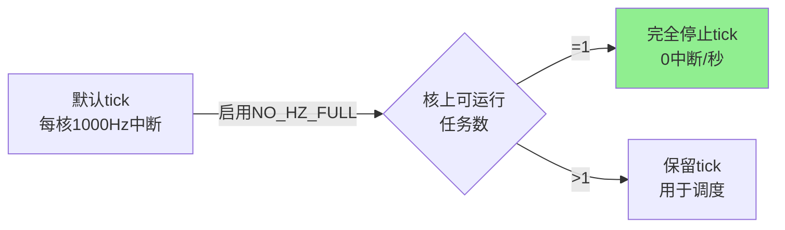
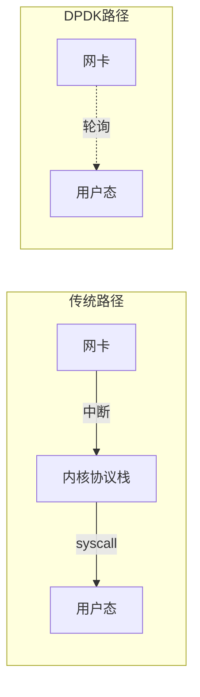

软中断与硬中断的核心区别在于触发源、同步性及处理时机：硬中断由外部硬件异步触发，强调实时响应；软中断由软件指令或内核机制同步/延迟触发，侧重任务拆分与资源优化。

核心差异对比

- 触发源不同
    - 硬中断：来自外部硬件设备（如网卡、键盘、磁盘），通过物理信号线（IRQ）经中断控制器发送给 CPU。
    - 软中断：来自 CPU 内部，由程序执行特定指令（如 `INT`、`syscall`）主动触发，或由内核在硬中断处理后标记触发。

- 同步性与可预测性
    - 硬中断：异步事件，发生时间随机且不可预测，随时可能打断当前执行流。
    - 软中断：同步事件（指令触发时立即发生）或受控延迟执行，发生时机由程序逻辑或内核调度决定。

- 处理机制与上下文
    - 硬中断：属于“上半部”处理，要求极快完成（如读取寄存器、置位标志），通常屏蔽同级中断，支持嵌套（高优先级打断低优先级）。
    - 软中断：属于“下半部”处理，用于承接硬中断的耗时工作（如协议栈解析），不可嵌套（同一 CPU 串行执行），但多核下可并行；运行在中断上下文，仍不能睡眠，但比硬中断宽松。

- 可屏蔽性
    - 硬中断：可屏蔽（通过关闭中断标志位 IF 暂时忽略），非可屏蔽中断（NMI）除外。
    - 软中断：不可屏蔽，一旦触发必在适当时机执行，确保系统逻辑完整性。

典型应用场景

- 硬中断：实时响应外设事件，如键盘输入、网络数据包到达通知、定时器心跳。
- 软中断：实现系统调用（用户态转内核态）、异常处理、以及将硬中断后的复杂逻辑（如 TCP/IP 重组）推迟执行以优化性能。


[任务规划完成]
# RT敏感低延迟场景的全方位优化指南

在低延迟场景（高频交易、实时音视频、工业控制、DPDK网络处理等）中，仅优化线程调度远远不够。**业务代码被打断的来源极其多样**，需要从硬件、内核、用户态多层协同优化。

---

## 一、干扰源全景图

```mermaid
flowchart TB
    BIZ[业务代码<br/>在Core N上运行]
    
    subgraph 中断类干扰
        TIMER[周期性时钟中断]
        IRQ[设备中断/网卡/磁盘]
        IPI[处理器间中断IPI]
        NMI[不可屏蔽中断]
        SMI[系统管理中断SMI]
    end
    
    subgraph 内核类干扰
        SCHED[调度器抢占]
        SOFTIRQ[软中断/tasklet]
        WORKQ[内核工作队列]
        RCU[RCU回调]
        KTHREAD[kthread迁移]
    end
    
    subgraph 内存类干扰
        TLB[TLB miss/shootdown]
        CACHE[Cache miss/抖动]
        NUMA[跨NUMA访问]
        PF[缺页中断]
        SWAP[swap换入换出]
        THP[透明大页整理]
    end
    
    subgraph 硬件类干扰
        FREQ[CPU频率切换]
        CSTATE[C-state深度睡眠]
        TURBO[Turbo抖动]
        HT[超线程争用]
        MEMBW[内存带宽争用]
    end
    
    subgraph 系统类干扰
        DAEMON[系统守护进程]
        CGROUP[cgroup限制]
        SECURITY[安全模块hook]
    end
    
    TIMER --> BIZ
    IRQ --> BIZ
    IPI --> BIZ
    NMI --> BIZ
    SMI --> BIZ
    SCHED --> BIZ
    SOFTIRQ --> BIZ
    WORKQ --> BIZ
    RCU --> BIZ
    KTHREAD --> BIZ
    TLB --> BIZ
    CACHE --> BIZ
    NUMA --> BIZ
    PF --> BIZ
    SWAP --> BIZ
    THP --> BIZ
    FREQ --> BIZ
    CSTATE --> BIZ
    TURBO --> BIZ
    HT --> BIZ
    MEMBW --> BIZ
    DAEMON --> BIZ
    CGROUP --> BIZ
    SECURITY --> BIZ
```



---

## 二、CPU隔离与亲和性

### 1. CPU Isolation（核隔离）
将专用核从普通调度域中剥离，避免一切非业务任务跑上来。

```bash
# 内核启动参数（grub）
isolcpus=2-7              # 2-7号核不参与默认调度
nohz_full=2-7             # 这些核启用 tickless（无周期时钟中断）
rcu_nocbs=2-7             # RCU回调不在这些核上执行
rcu_nocb_poll             # 让 rcuo 线程主动poll而非被唤醒
irqaffinity=0,1           # 所有中断只送到0,1号核
```

### 2. 线程绑定
```c
cpu_set_t set;
CPU_ZERO(&set);
CPU_SET(3, &set);  // 绑定到Core 3
pthread_setaffinity_np(pthread_self(), sizeof(set), &set);
```

### 3. 中断亲和性
```bash
# 把网卡中断挪到非业务核
echo 3 > /proc/irq/24/smp_affinity   # 二进制掩码：核0,1
# 禁止 irqbalance 干预
systemctl stop irqbalance
```

---

## 三、消除时钟中断干扰（NO_HZ_FULL）



**前提条件**：
- 内核编译开启 `CONFIG_NO_HZ_FULL=y`
- 启动参数 `nohz_full=2-7`
- 业务核上**只能有1个可运行任务**（多了tick会自动恢复）
- `rcu_nocbs` 必须包含相同的核

**效果**：业务核可以做到 **0 timer interrupt/sec**，单次延迟抖动从微秒级降到纳秒级。

---

## 四、内存子系统优化

### 1. 锁定内存，禁止换页
```c
mlockall(MCL_CURRENT | MCL_FUTURE);  // 锁住所有当前+未来的内存
// 或者只锁特定区域
mlock(buffer, size);
```

### 2. 预触摸（Pre-fault）
```c
// 启动时把堆栈、堆全部走一遍，触发缺页提前完成
char *p = malloc(SIZE);
for (size_t i = 0; i < SIZE; i += 4096) p[i] = 0;
```

### 3. 大页（HugePages）
减少 TLB miss，提升页表命中率。

```bash
# 预留2M大页
echo 1024 > /proc/sys/vm/nr_hugepages

# 或1G大页（启动参数）
default_hugepagesz=1G hugepagesz=1G hugepages=16
```

```c
// mmap使用大页
void *p = mmap(NULL, size, PROT_READ|PROT_WRITE,
               MAP_PRIVATE|MAP_ANONYMOUS|MAP_HUGETLB, -1, 0);
```

### 4. 关闭透明大页（THP）
THP的后台整理（khugepaged）会引入不确定延迟。

```bash
echo never > /sys/kernel/mm/transparent_hugepage/enabled
echo never > /sys/kernel/mm/transparent_hugepage/defrag
```

### 5. NUMA本地化
```bash
numactl --cpunodebind=0 --membind=0 ./your_app
```

```c
// 代码中绑定
numa_set_localalloc();
numa_run_on_node(0);
```

### 6. 关闭Swap
```bash
swapoff -a
# /etc/fstab 注释掉swap行
```

---

## 五、Cache优化（最容易被忽视）

### 1. False Sharing 消除
```c
// ❌ 两个变量共享一个cache line（64字节）
struct bad {
    int a;  // Core 0频繁写
    int b;  // Core 1频繁写  → cache line反复弹跳
};

// ✅ 强制对齐到独立cache line
struct good {
    alignas(64) int a;
    alignas(64) int b;
};
```

### 2. 数据布局
- **热数据集中**：把高频访问字段放一起，塞进一个cache line。
- **冷热分离**：避免冷字段污染热cache line。

### 3. 预取（Prefetch）
```c
__builtin_prefetch(&data[i+8], 0, 3);  // 提前加载未来要访问的数据
```

### 4. Cache分区（Intel CAT/AMD QoS）
高端服务器CPU支持 **Cache Allocation Technology**，可以为业务核独占一部分L3 cache，避免被其他进程污染。

```bash
# 通过 resctrl 接口
mount -t resctrl resctrl /sys/fs/resctrl
mkdir /sys/fs/resctrl/lowlat
echo "L3:0=0xff;1=0xff" > /sys/fs/resctrl/lowlat/schemata
echo $PID > /sys/fs/resctrl/lowlat/tasks
```

---

## 六、CPU频率与电源管理

低延迟场景下**电源管理是头号隐形杀手**——CPU从C6唤醒可能需要几十微秒。

### 1. 锁定最高性能频率
```bash
# governor 设为 performance
cpupower frequency-set -g performance

# 或手动锁频
for cpu in /sys/devices/system/cpu/cpu*/cpufreq; do
    echo performance > $cpu/scaling_governor
done
```

### 2. 禁止深度C-state
```bash
# 启动参数
intel_idle.max_cstate=0 processor.max_cstate=1 idle=poll
```

| C-state | 唤醒延迟 | 说明 |
|---------|---------|------|
| C0 | 0 | 运行中 |
| C1 | ~1µs | Halt |
| C3 | ~50µs | L1/L2 cache flush |
| C6 | ~100µs+ | 关闭核心电压 |

`idle=poll` 让CPU空闲时**自旋**而不睡眠，代价是功耗高。

### 3. 关闭Turbo Boost（视情况）
Turbo频率波动大，对**延迟稳定性**敏感场景反而需要关闭：

```bash
echo 1 > /sys/devices/system/cpu/intel_pstate/no_turbo
```

### 4. 关闭超线程（HT/SMT）
两个逻辑核共享物理核执行单元，会互相争用ALU、cache，引入抖动：

```bash
echo off > /sys/devices/system/cpu/smt/control
```

或BIOS中关闭。

---

## 七、内核机制干扰排除

### 1. RCU回调隔离
```bash
rcu_nocbs=2-7         # 这些核不跑RCU回调
rcu_nocb_poll         # rcuo守护线程主动poll
```

### 2. Workqueue/kthread亲和性
```bash
# 把kworker迁出业务核
for f in /sys/devices/virtual/workqueue/*/cpumask; do
    echo 3 > $f   # 只允许在Core 0,1运行
done
```

### 3. 关闭审计/安全hook（如果允许）
```bash
# auditd 在每次系统调用引入开销
systemctl stop auditd
# 关闭SELinux强制模式
setenforce 0
```

### 4. 软中断隔离
通过 `irqaffinity` 把硬中断挪走后，对应的softirq也会跟随。

### 5. 写回脏页节流
```bash
# 减小脏页比例，避免突发回写
echo 5 > /proc/sys/vm/dirty_background_ratio
echo 10 > /proc/sys/vm/dirty_ratio
```

### 6. 关闭周期性内核任务
```bash
# 关闭NMI watchdog
echo 0 > /proc/sys/kernel/nmi_watchdog
# 关闭机器检查（视场景）
mce=off
```

---

## 八、用户态编程实践

### 1. 避免系统调用
每次syscall都有 ~100ns 开销（含上下文切换、SPECTRE缓解）：

```c
// ❌ 频繁 gettimeofday
gettimeofday(&t, NULL);

// ✅ 用 RDTSC（vDSO 实现的clock_gettime也可）
uint64_t tsc = __rdtsc();

// ✅ 用 CLOCK_MONOTONIC + vDSO
clock_gettime(CLOCK_MONOTONIC, &ts);  // 不进内核
```

### 2. 内核旁路（Kernel Bypass）
- **网络**：DPDK、Solarflare OpenOnload、XDP
- **存储**：SPDK
- **思想**：用户态轮询硬件队列，0 syscall、0 中断



### 3. 无锁数据结构
```c
// 用 atomic CAS 替代 mutex
atomic_compare_exchange_strong(&head, &expected, new);

// SPSC环形队列（单生产者单消费者，最快）
// 例：DPDK rte_ring、boost::lockfree::spsc_queue
```

### 4. Busy-poll替代阻塞
```c
// ❌ epoll_wait 会让线程睡眠
epoll_wait(epfd, events, MAX, -1);

// ✅ 设置忙等
int busy = 50;  // 50us 内忙等
setsockopt(fd, SOL_SOCKET, SO_BUSY_POLL, &busy, sizeof(busy));

// 或直接自旋检查队列
while (!ring_dequeue(&r, &msg)) cpu_relax();
```

### 5. 实时调度策略
```c
struct sched_param p = { .sched_priority = 99 };
pthread_setschedparam(tid, SCHED_FIFO, &p);

// 或 SCHED_DEADLINE（更精确的时间保证）
struct sched_attr attr = {
    .sched_policy = SCHED_DEADLINE,
    .sched_runtime = 100000,    // 100us
    .sched_deadline = 1000000,  // 1ms
    .sched_period = 1000000,
};
sched_setattr(0, &attr, 0);
```

### 6. 内存分配避免抖动
```c
// 启动时预分配 + 对象池
// 运行时禁止 malloc/free（会触发brk/mmap）
// 用 tcmalloc/jemalloc/mimalloc 替代glibc ptmalloc
```

---

## 九、硬件层面优化

| 项目 | 操作 | 收益 |
|------|------|------|
| BIOS禁用SMI | 关闭厂商管理代码（USB legacy、温度控制） | 消除毫秒级毛刺 |
| 关闭C-state/P-state | BIOS层面也要关 | 频率稳定 |
| 内存通道均衡 | 所有DIMM插槽插满 | 带宽最大化 |
| PCIe亲和性 | 网卡插在与CPU同NUMA节点的slot | 跨QPI惩罚-30% |
| 网卡特性 | 启用 Receive Side Scaling、TSO/GSO视情况 | 中断分担 |
| 选RT内核 | `linux-rt`（PREEMPT_RT补丁） | 抢占延迟微秒级 |

### SMI（最阴险的干扰）
SMI是BIOS触发的、**优先级高于一切**的中断（包括NMI），内核完全感知不到。常见来源：
- USB 2.0 legacy支持
- 内存ECC纠错日志
- 温度/风扇控制
- 厂商RAS功能

**检测**：
```bash
turbostat --quiet --show SMI -i 1
# 或读 MSR 0x34 (MSR_SMI_COUNT)
```

理想值：**业务运行期间 SMI 计数为0**。如有，需进 BIOS 关闭对应功能。

---

## 十、监控与验证工具

| 工具 | 用途 |
|------|------|
| `cyclictest` | RT延迟基准测试（必备） |
| `hwlatdetect` | 检测SMI/硬件造成的停顿 |
| `perf sched` | 调度延迟分析 |
| `ftrace`/`trace-cmd` | 追踪函数调用、中断、调度 |
| `bpftrace` | 动态probe，定位毛刺 |
| `turbostat` | C-state、频率、SMI计数 |
| `numastat` | NUMA命中率 |
| `perf c2c` | False sharing检测 |
| `perf stat -e cache-misses,...` | 硬件事件计数 |

### 典型cyclictest示例
```bash
# 业务核Core 3，FIFO优先级99，运行1小时
cyclictest -p 99 -t 1 -a 3 -m -n -D 1h -h 100 -q

# 关注：Max latency 应稳定在 < 10us（普通内核 < 100us）
```

---

## 十一、配置优先级建议（投入产出比）

```mermaid
flowchart TB
    L1[第一档:必做<br/>收益最大]
    L2[第二档:推荐]
    L3[第三档:极致优化]
    
    L1 --> L1a[CPU隔离isolcpus]
    L1 --> L1b[中断亲和性]
    L1 --> L1c[线程绑核+实时优先级]
    L1 --> L1d[关闭swap+mlockall]
    L1 --> L1e[performance governor]
    L1 --> L1f[关闭THP]
    
    L2 --> L2a[NO_HZ_FULL]
    L2 --> L2b[关闭C-state深睡眠]
    L2 --> L2c[HugePages]
    L2 --> L2d[NUMA本地化]
    L2 --> L2e[关闭超线程]
    L2 --> L2f[RCU隔离]
    
    L3 --> L3a[PREEMPT_RT内核]
    L3 --> L3b[Cache分区CAT]
    L3 --> L3c[BIOS关SMI]
    L3 --> L3d[Kernel Bypass DPDK]
    L3 --> L3e[关闭Turbo锁频]
    L3 --> L3f[忙等替代epoll]
    
    style L1 fill:#90EE90
    style L2 fill:#FFE4B5
    style L3 fill:#FFB6C1
```



---

## 十二、典型部署模板（高频交易场景）

```bash
# /etc/default/grub 启动参数
GRUB_CMDLINE_LINUX="\
  isolcpus=2-15 \
  nohz_full=2-15 \
  rcu_nocbs=2-15 \
  rcu_nocb_poll \
  irqaffinity=0,1 \
  intel_idle.max_cstate=0 \
  processor.max_cstate=1 \
  idle=poll \
  intel_pstate=disable \
  nosoftlockup \
  nmi_watchdog=0 \
  audit=0 \
  mce=off \
  default_hugepagesz=1G \
  hugepagesz=1G \
  hugepages=32 \
  transparent_hugepage=never \
  skew_tick=1 \
  tsc=reliable"
```

```bash
# 运行时
systemctl stop irqbalance auditd cron
swapoff -a
echo never > /sys/kernel/mm/transparent_hugepage/enabled
cpupower frequency-set -g performance
echo off > /sys/devices/system/cpu/smt/control
```

```c
// 应用启动
mlockall(MCL_CURRENT | MCL_FUTURE);
prefault_memory();
pin_to_cpu(3);
set_sched_fifo(99);
busy_poll_loop();
```

---

## 总结

> **低延迟优化的本质是"消除一切不确定性"**：从硬件SMI到电源C-state，从TLB miss到cache抖动，从内核中断到调度抢占，每一层都可能引入微秒甚至毫秒级毛刺。
>
> 调度优化只是入口，**真正的低延迟系统是软硬件协同设计的产物**：业务核必须独占、独静、独热（cache已warm）、独频（频率锁定）、独中断（无外部打扰）。

**核心心法**：
1. **隔离** — 把业务核与系统其他部分物理/逻辑切开
2. **预热** — 内存、cache、TLB都提前准备好
3. **轮询** — 用CPU换延迟，避免任何形式的睡眠唤醒
4. **静默** — 消除tick、IPI、SMI等一切周期性中断
5. **测量** — `cyclictest` + `perf` 持续监控，毛刺必究