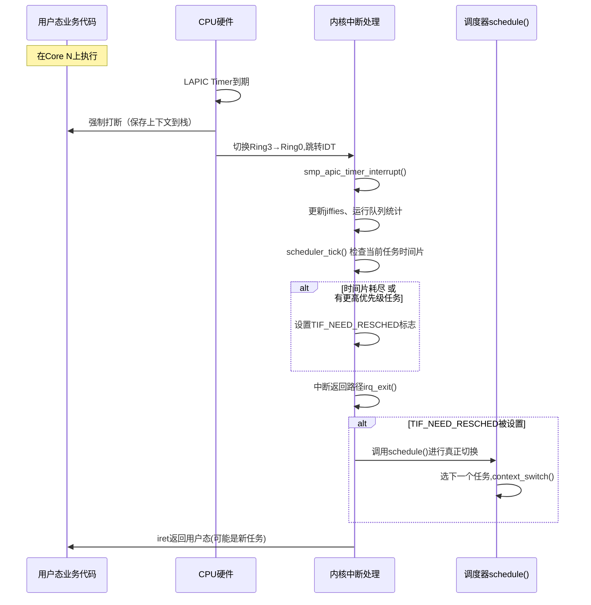
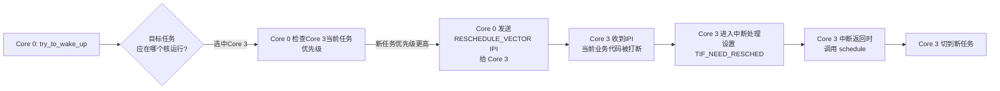
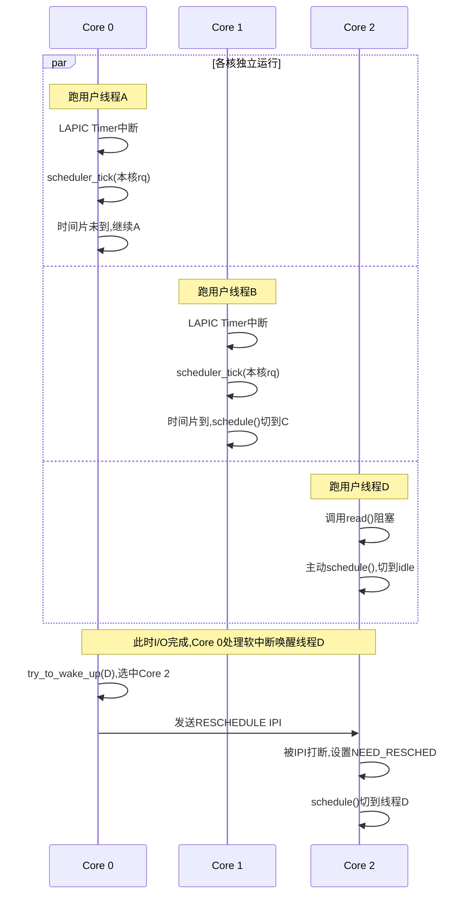

[任务规划完成]
# 多核CPU抢占式线程调度的实现逻辑分析

这是一个非常深入的操作系统底层问题。我来从硬件机制到内核实现，分层剖析。

---

## 一、核心结论先行

| 问题 | 答案 |
|------|------|
| 每个跑业务代码的核是否都会受时钟中断影响？ | **是的，每个核都有自己独立的本地时钟中断（Local APIC Timer）** |
| 中断时是否一定会切换到内核代码？ | **是的，中断必然进入内核态（Ring 0）执行中断处理程序** |
| 是否每次中断都会触发调度？ | **不一定**，只有在满足条件时才真正调用 `schedule()` |
| 内核调度是否必然抢占某个核来运行调度代码？ | **不是"抢占某个核"，而是"在当前核上自然进入"** —— 调度代码运行在被中断的那个核上，而非由另一个核去抢占它 |

---

## 二、硬件层面：每个核的独立时钟中断

现代多核CPU（x86_64 为例）上，**每个逻辑核（CPU）都有自己独立的 Local APIC**，其中包含一个 **APIC Timer**。

```
┌─────────────────────────────────────────────────┐
│              多核CPU (例如 8核)                   │
│  ┌──────┐  ┌──────┐  ┌──────┐  ┌──────┐       │
│  │Core 0│  │Core 1│  │Core 2│  │Core 3│  ...  │
│  │      │  │      │  │      │  │      │       │
│  │LAPIC │  │LAPIC │  │LAPIC │  │LAPIC │       │
│  │Timer │  │Timer │  │Timer │  │Timer │       │
│  └──┬───┘  └──┬───┘  └──┬───┘  └──┬───┘       │
│     │         │         │         │            │
│     ▼         ▼         ▼         ▼            │
│  独立触发 timer interrupt（每核各自独立）         │
└─────────────────────────────────────────────────┘
```

**关键点**：
- 每个核的 LAPIC Timer 独立计时，独立触发中断（向量号通常是 `LOCAL_TIMER_VECTOR`，在 Linux 中为 `0xec`）。
- 中断**只会打断它所在的那个核**，不会影响其他核。
- 这是 **per-CPU（每CPU私有）** 的机制，不需要核间协调。

所以：**是的，每个正在执行业务代码的核都会被自己核上的时钟周期中断打断，进入内核态。**

---

## 三、中断进入内核的流程（per-core）

以 Linux 为例，每个核上发生时钟中断时的流程：



---

## 四、关键澄清：调度并非"抢占某个核"

你问的"内核调度是必然会抢占某个核来运行其调度代码吗"，这里有个**根本性的概念需要修正**：

### ❌ 错误的心智模型
> 有一个"中央调度器"在某个特殊位置运行，它要"抢占"业务核来执行调度。

### ✅ 正确的心智模型
> **调度器代码就运行在被中断的那个核上**。每个核轮流"自己执行自己的调度逻辑"。

```
Core 0 业务代码执行 → 时钟中断 → Core 0 自己跑schedule() → Core 0 切到新任务继续跑
Core 1 业务代码执行 → 时钟中断 → Core 1 自己跑schedule() → Core 1 切到新任务继续跑
... （各核独立、并行进行）
```

**Linux 的 CFS 调度器是 per-CPU 的**：
- 每个核维护自己的 `struct rq`（运行队列）。
- 调度决策**通常**只看本核的 rq，不需要全局锁。
- 只有在负载均衡（load balance）、唤醒迁移时才会跨核访问其他核的 rq。

---

## 五、跨核抢占的特殊情况：IPI（处理器间中断）

虽然调度主要是 per-core，但确实存在**一个核主动"打断"另一个核**的场景：

### 场景：Core 0 唤醒了一个高优先级任务，目标核是 Core 3



**这才是"抢占某个核来运行调度代码"的真实形态**：
- 由 **IPI（Inter-Processor Interrupt）** 实现，对应 Linux 的 `smp_reschedule_interrupt`。
- 但**注意**：Core 0 并不是"代替 Core 3 运行调度代码"，而是**通知 Core 3 自己去运行调度代码**。
- 真正的 `schedule()` 调用仍然发生在 Core 3 自身上。

---

## 六、不只是时钟中断会触发调度

抢占点其实更丰富，并非只有时钟中断：

| 触发源 | 机制 | 是否per-core |
|--------|------|--------------|
| 本核时钟中断（tick） | LAPIC Timer 周期触发 | ✅ |
| 高精度定时器 hrtimer | 用于sched_deadline等 | ✅ |
| 系统调用返回路径 | 返回用户态前检查`TIF_NEED_RESCHED` | ✅ |
| 中断返回路径 | 任何中断退出时检查抢占标志 | ✅ |
| 唤醒任务（wakeup） | 可能发IPI给目标核 | 跨核 |
| 主动让出 `yield/sleep` | 直接调`schedule()` | ✅ |
| 内核抢占点（CONFIG_PREEMPT） | spin_unlock等处检查 | ✅ |

---

## 七、Tickless 内核（NO_HZ）的优化

值得补充：**现代Linux并不一定每个核都持续收到时钟中断**。

- `CONFIG_NO_HZ_IDLE`：核空闲时关闭tick，省电。
- `CONFIG_NO_HZ_FULL`：在指定的核上，**只要该核只有一个可运行任务**，也关闭tick（用于HPC、低延迟场景，避免tick抖动）。

也就是说：
- 如果一个核上**只有一个业务线程在跑且没有其他可调度任务**，tick 可以被完全关掉。
- 此时该核**不会受周期性时钟中断打扰**，直到有新事件（IPI、I/O中断、新任务唤醒）才会进入内核。

这对低延迟交易、DPDK 等场景非常重要。

---

## 八、综合时序图（多核协同视角）



---

## 九、回答你的两个具体问题

### Q1：每个正在跑业务代码的核是否都会受时钟周期中断影响切换到内核代码检查是否要让出cpu核？

**默认情况下：是。** 每个核的 LAPIC Timer 独立产生中断，将该核从用户态打断进内核态，执行 `scheduler_tick()` 检查是否需要重调度。

**但有例外**：
- `NO_HZ_FULL` 模式下，单任务跑的核可以完全不收tick。
- 核空闲时（idle）也不会有tick。

### Q2：内核调度是必然会抢占某个核来运行其调度代码吗？

**需要分两种情形理解**：

1. **本核自身的调度**（绝大多数情况）：不是"抢占"，而是该核**自己在中断/系统调用返回时顺路调用** `schedule()`。调度代码就**在被打断的那个核上跑**，没有"另一个核去抢占它"这回事。

2. **跨核唤醒的场景**：源核通过 **IPI** 通知目标核，目标核被中断打断后，**自己**去执行调度。所以"抢占"的本质是**发个信号让对方核自觉调度**，而不是替对方核执行调度代码。

---

## 总结一句话

> **多核抢占式调度是高度 per-CPU 的：每个核都有独立时钟中断，独立运行队列，独立执行自己的 `schedule()`。跨核协调通过 IPI 完成，但调度代码永远运行在"被调度的那个核"自身上。**