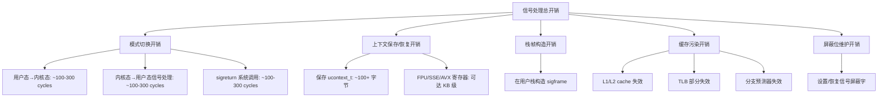
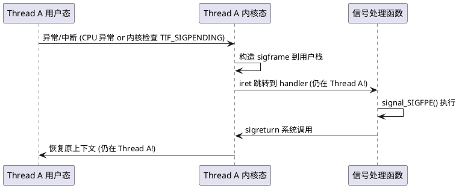
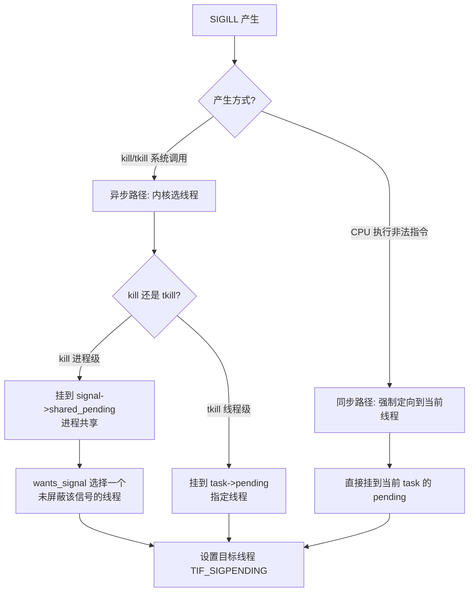
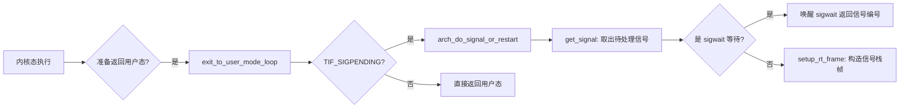
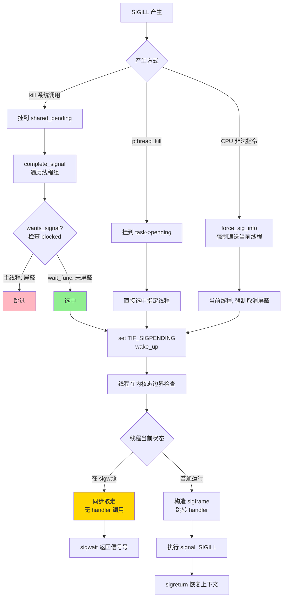

软中断与硬中断的核心区别在于触发源、同步性及处理时机：硬中断由外部硬件异步触发，强调实时响应；软中断由软件指令或内核机制同步/延迟触发，侧重任务拆分与资源优化。
- 触发源不同
   - 硬中断：来自外部硬件设备（如网卡、键盘、磁盘），通过物理信号线（IRQ）经中断控制器发送给 CPU。
   - 软中断：来自 CPU 内部，由程序执行特定指令（如 `INT`、`syscall`）主动触发，或由内核在硬中断处理后标记触发。

- 同步性与可预测性
   - 硬中断：异步事件，发生时间随机且不可预测，随时可能打断当前执行流。
   - 软中断：同步事件（指令触发时立即发生）或受控延迟执行，发生时机由程序逻辑或内核调度决定。

- 处理机制与上下文
   - 硬中断：属于“上半部”处理，要求极快完成（如读取寄存器、置位标志），通常屏蔽同级中断，支持嵌套（高优先级打断低优先级）。
   - 软中断：属于“下半部”处理，用于承接硬中断的耗时工作（如协议栈解析），不可嵌套（同一 CPU 串行执行），但多核下可并行；运行在中断上下文，仍不能睡眠，但比硬中断宽松。

- 可屏蔽性
   - 硬中断：可屏蔽（通过关闭中断标志位 IF 暂时忽略），非可屏蔽中断（NMI）除外。
   - 软中断：不可屏蔽，一旦触发必在适当时机执行，确保系统逻辑完整性。

典型应用场景
- 硬中断：实时响应外设事件，如键盘输入、网络数据包到达通知、定时器心跳。
- 软中断：实现系统调用（用户态转内核态）、异常处理、以及将硬中断后的复杂逻辑（如 TCP/IP 重组）推迟执行以优化性能。


信号与中断
- 中断是由硬件设备触发的用来通知CPU事件的发生，通常被同步处理(软中断可以被异步处理)
- 信号‌是在软件层面上用于通知进程事件的发生，信号可以在任何时候异步到达
- 硬件中断可能产生软件信号(如磁盘故障触发中断后产生SIGBUS信号)


在多线程场景中推荐用专用线程同步处理信号，以避免异步信号处理的复杂性和不安全性：
- 单线程程序：直接用 signal() 或 sigaction() 注册信号处理函数即可，无需新建线程；信号会在当前执行流被异步打断时触发。
- 多线程程序：不应在多个线程中随意注册信号处理函数（因处理函数是进程共享的），而应由主线程在创建其他线程前屏蔽相关信号，再创建一个专用线程调用  sigwait() 同步等待并处理信号，其余工作线程屏蔽所有信号避免干扰。
- 致命信号（如 SIGSEGV、SIGFPE）：必须用 sigaction 在主线程或适当线程中异步捕获，无法靠 sigwait 替代，因为它们需在引发线程上下文中响应。
- 关键限制：信号处理函数中只能调用异步信号安全函数（如 write，不能用 printf、malloc 等）；若需复杂逻辑，用 sigwait 的专用线程更安全、可读、可控

[任务规划完成]
# 信号处理对线程执行的性能损耗分析

## 一、核心结论先行

**信号处理不会触发线程级（task）的上下文切换**，但会触发**用户态↔内核态的特权级切换**，以及**用户态内的执行流切换**。这与常规理解的"上下文切换"（CPU 调度切换到另一个线程/进程）有本质区别。

下面结合你的 [signal_block.c](/Users/liyang/IdeaProjects/c_demo/signal_block.c) 代码，从内核机制层面详细分析。

---

## 二、信号处理的执行流程（关键：发生在哪个线程？）

### 2.1 同步信号 vs 异步信号

你的代码里同时演示了两类信号，这两类的性能开销差异巨大：

| 类型 | 触发方式 | 代码示例 | 由谁处理 |
|------|---------|---------|---------|
| **同步信号** | CPU 异常指令触发（除零、非法指令、段错误） | `c = a / b;` 触发 SIGFPE | **必然由触发指令的那个线程**处理 |
| **异步信号** | `kill()`、`pthread_kill()`、终端信号 | `kill -SIGILL <pid>` | 内核选一个**未屏蔽**该信号的线程处理 |

### 2.2 信号递送的完整流程（以 SIGFPE 为例）

```
线程正常执行用户态代码 (c = a / b)
        ↓
CPU 检测到除零异常 → 触发 #DE 异常 (Trap)
        ↓
[硬件] 切换到内核态，保存用户态寄存器到内核栈
        ↓
[内核] do_divide_error() → force_sig_info(SIGFPE)
        ↓
[内核] 准备返回用户态时，检查 TIF_SIGPENDING 标志
        ↓
[内核] do_signal() → setup_rt_frame()
       在用户栈上构造 sigframe（保存原始上下文 ucontext_t）
       修改返回地址为信号处理函数 signal_SIGFPE
        ↓
[硬件] iret 返回用户态 → 执行 signal_SIGFPE()
        ↓
信号处理函数返回 → 执行 sigreturn 系统调用
        ↓
[内核] 从 sigframe 恢复原始用户态上下文
        ↓
[硬件] 返回用户态原触发点（但 SIGFPE 会再次触发，所以你 exit(1)）
```

**关键点**：整个过程**线程没变**，CPU 调度器没介入，`current` 指针始终指向同一个 `task_struct`。

---

## 三、性能损耗的精确分解

### 3.1 信号处理的开销组成



### 3.2 量化对比（典型 x86_64 Linux）

| 操作 | 大致 CPU 周期 | 大致耗时 |
|------|------------|---------|
| 普通函数调用 | ~5 cycles | <2 ns |
| 系统调用（如 `getpid`） | ~100-300 cycles | ~50-100 ns |
| **一次完整信号处理** | **~1500-3000 cycles** | **~500-1500 ns** |
| 线程上下文切换 | ~3000-10000 cycles | ~1-5 μs |
| 进程上下文切换 | ~10000+ cycles | ~3-10 μs |

> 信号处理的开销 ≈ 3 次系统调用，比线程切换便宜，但比函数调用贵 200-500 倍。

---

## 四、对照你的代码分析具体场景

### 场景 1：`run()` 中触发 SIGFPE（同步信号）

```c
int a = 1, b = 0, c;
c = a / b;   // CPU 异常 → 信号
```

- **没有线程切换**：`signal_SIGFPE()` 在创建的子线程 `thrd1` 中执行
- **有特权级切换**：用户态 → 内核态 → 用户态（信号处理）→ 内核态（sigreturn）→ 用户态
- **缓存影响小**：信号处理函数代码量小，对 cache 影响有限
- **特殊情况**：你 `exit(1)` 退出了，否则 SIGFPE 返回后会**再次触发**（指令异常无法跳过）

### 场景 2：`wait_func()` 中 `sigwait()`（同步等待）

```c
sigwait(&set, &sig);
```

这是**最优雅、性能最好**的信号处理方式：
- 线程被挂起在内核中（`TASK_INTERRUPTIBLE`）
- 信号到达时直接唤醒该线程，**不走异步信号处理流程**
- 不构造 sigframe，不调用信号处理函数
- 相当于一次普通的"被唤醒"，开销 ≈ 一次系统调用

### 场景 3：主线程 `wait_signal()` 屏蔽 SIGILL

```c
pthread_sigmask(SIG_BLOCK, &mask, &old_mask);
```

- **零运行时开销**：屏蔽后，内核根本不会向该线程递送 SIGILL
- 信号被挂起在 `task_struct->pending`，直到取消屏蔽
- 这是高性能场景下"避免信号干扰"的标准做法

---

## 五、信号 vs 上下文切换：本质区别

### 5.1 真正的线程上下文切换需要

| 步骤 | 信号处理 | 线程切换 |
|------|---------|---------|
| 切换 `current` 指针 | ❌ | ✅ |
| 切换内核栈 | ❌ | ✅ |
| 切换地址空间（`mm_struct`/CR3） | ❌ | ✅（跨进程时） |
| 刷新 TLB | ❌ | ✅（跨进程时） |
| 经过调度器 `schedule()` | ❌ | ✅ |
| 修改用户态 PC | ✅ | ✅ |
| 保存/恢复用户寄存器 | ✅ | ✅ |

### 5.2 信号处理更像"用户态的中断"



**整个流程，调度器从未介入，线程身份从未改变。**

---

## 六、性能优化建议

基于以上分析，对你代码这种使用模式：

### ✅ 推荐做法

1. **关键热点线程屏蔽信号**
   ```c
   pthread_sigmask(SIG_BLOCK, &mask, NULL);  // 你已经在 wait_signal() 中这样做了
   ```
   将信号集中到一个专门线程处理。

2. **使用 `sigwait` 替代异步 handler**
   ```c
   sigwait(&set, &sig);  // 你的 wait_func 已经这样做了
   ```
   这是最高效的信号处理范式，无 sigframe 开销。

3. **使用 `signalfd` 集成到 epoll**
   将信号转为文件描述符事件，彻底走 IO 多路复用路径。

### ❌ 避免

1. 在高频路径上让线程响应异步信号
2. 信号处理函数中调用非异步信号安全（async-signal-safe）函数
3. 频繁触发同步信号（SIGFPE/SIGSEGV）作为正常控制流

---

## 七、总结一句话

> **信号处理 ≠ 线程上下文切换**：它是同一个线程内、用户态↔内核态的"小切换"，开销约 500-1500ns，相当于 3 次系统调用；只有缓存污染、寄存器保存恢复、sigframe 构造等中等开销，远小于真正的线程/进程调度切换。在你的代码中，`sigwait` 路径和 `pthread_sigmask` 屏蔽路径都是高性能的最佳实践。


[任务规划完成]
# SIGILL 信号递送完整流程深度剖析

下面以你 [signal_block.c](/Users/liyang/IdeaProjects/c_demo/signal_block.c) 中 `test_signal_SIGILL()` 的运行场景为例，追踪一个 SIGILL 从产生到被处理的全链路。

---

## 一、场景设定（基于你的代码）

你的程序运行时存在 **3 个相关线程**：

| 线程 | 角色 | SIGILL 状态 |
|------|------|------------|
| **主线程** | 执行 `wait_signal()` | **屏蔽** SIGILL（`pthread_sigmask SIG_BLOCK`）|
| **wait_func 线程** | 调用 `sigwait()` | **同步等待** SIGILL |
| **外部 shell** | 执行 `kill -SIGILL <pid>` | 信号源 |

`signal(SIGILL, signal_SIGILL)` 注册了异步 handler，但因为 `sigwait` 的存在，handler 实际不会被触发。

---

## 二、信号递送的两条路径

SIGILL 有两种产生方式，递送路径**完全不同**：



---

## 三、完整流程（以 `kill -SIGILL <pid>` 为例）

### 阶段 1：信号产生（内核生成阶段）

```
shell: kill -ILL <pid>
        ↓
sys_kill() 系统调用
        ↓
kill_something_info() → kill_pid_info()
        ↓
group_send_sig_info(SIGILL, info, target_proc)
        ↓
__send_signal_locked()
```

**关键代码逻辑（内核 kernel/signal.c 简化版）：**

```c
// 进程级 kill 走 shared_pending
pending = (type != PIDTYPE_PID) ? 
          &t->signal->shared_pending :  // 进程共享队列
          &t->pending;                  // 线程私有队列

// 分配 sigqueue 节点，挂到 pending 链表
list_add_tail(&q->list, &pending->list);
sigaddset(&pending->signal, SIGILL);
```

### 阶段 2：选择目标线程（complete_signal）

```c
complete_signal(SIGILL, p, type)
        ↓
找一个能处理 SIGILL 的线程：
    do {
        if (wants_signal(SIGILL, t))  // 关键判断！
            goto found;
    } while_each_thread(p, t);
```

`wants_signal()` 的核心检查：

```c
static inline bool wants_signal(int sig, struct task_struct *p) {
    if (sigismember(&p->blocked, sig))
        return false;                   // 该线程屏蔽了，跳过
    if (p->flags & PF_EXITING)
        return false;
    if (sig == SIGKILL)
        return true;
    if (task_is_stopped_or_traced(p))
        return false;
    return task_curr(p) || !task_sigpending(p);
}
```

**对应到你的代码**：

| 线程 | `blocked` 中含 SIGILL? | 是否被选中 |
|------|----------------------|----------|
| 主线程 | ✅ 是（你 `pthread_sigmask` 屏蔽了） | ❌ 跳过 |
| wait_func 线程 | ❌ 否（`sigwait` 内部临时取消屏蔽来等待） | ✅ **选中** |

> 🎯 这就是为什么你的代码能精准命中 wait_func 线程的根本原因。

### 阶段 3：标记目标线程（signal_wake_up）

```c
found:
    signal_wake_up(t, sig == SIGKILL);
        ↓
    set_tsk_thread_flag(t, TIF_SIGPENDING);  // 设置标志位
        ↓
    if (t 在睡眠) wake_up_state(t, TASK_INTERRUPTIBLE);
```

此刻 wait_func 线程在 `sigwait()` 中睡眠，会被立即唤醒。

### 阶段 4：信号检查点（return-to-userspace）

**关键概念**：内核**不会立即**跳转到信号处理，而是在以下"边界点"检查 `TIF_SIGPENDING`：



### 阶段 5：sigwait 路径（你的实际场景）⭐

因为 wait_func 线程调用了 `sigwait()`，走的是**同步等待路径**，**不走异步 handler**：

```c
// glibc sigwait → 内核 do_sigtimedwait
do_sigtimedwait(&these, &info, ts) {
    spin_lock_irq(&tsk->sighand->siglock);
    sig = dequeue_signal(tsk, &mask, &info, &type);  // 直接取出
    spin_unlock_irq(&tsk->sighand->siglock);
    // 把信号编号填回用户态变量
}
```

**关键**：
- ❌ **不构造 sigframe**
- ❌ **不调用 signal_SIGILL handler**
- ✅ 直接从内核返回 `sig=SIGILL` 给用户态
- ✅ 你的代码 `printf("wait signal %d ...", sig, ...)` 会打印（注释里写"不会执行"是错误的，第一次会执行；除非你循环 `sigwait`）

### 阶段 6：假设没有 sigwait（异步 handler 路径）

如果 wait_func 没调用 `sigwait`，而是只注册了 `signal(SIGILL, signal_SIGILL)`，则走完整异步路径：

```
get_signal() 取出 SIGILL
        ↓
handle_signal(ksig, regs)
        ↓
setup_rt_frame(ksig, regs)：
    1. 在用户栈上分配 rt_sigframe 结构
    2. 保存当前用户态完整上下文 (ucontext_t)
       - 通用寄存器 (rax, rbx, rcx, ...)
       - 段寄存器
       - FPU/SSE/AVX 状态 (xstate)
       - 信号屏蔽字
    3. 设置返回地址 = signal_SIGILL 函数地址
    4. 设置返回时栈顶指针指向 sigframe
    5. 返回地址处填入 __restore_rt (sigreturn trampoline)
        ↓
[硬件] iretq 返回用户态
        ↓
执行 signal_SIGILL() 函数
        ↓
函数返回 → 跳转到 trampoline → syscall(sigreturn)
        ↓
[内核] sys_rt_sigreturn()
    1. 从 sigframe 恢复 ucontext_t
    2. 恢复信号屏蔽字
    3. 返回到原中断点
```

---

## 五、几个反直觉的关键点

### 5.1 `signal(SIGILL, signal_SIGILL)` 是进程级的

```c
signal(SIGILL, signal_SIGILL);  // 设置的是 sighand_struct，整个进程共享
```

但是否**真正调用** handler，由**线程级**的两个东西决定：
- 该线程的 `task_struct->blocked` 屏蔽字
- 是否在 `sigwait/sigtimedwait/sigsuspend` 中

### 5.2 `sigwait` 比 handler 优先级更高

当一个线程在 `sigwait` 等待 SIGILL 时：
- 即使该线程没屏蔽 SIGILL
- 即使该进程注册了 SIGILL 的 handler
- 信号也会**优先**被 `sigwait` 取走，**handler 不会执行**

### 5.3 屏蔽 ≠ 忽略

```c
pthread_sigmask(SIG_BLOCK, &mask, ...);  // 屏蔽：信号挂起，等取消屏蔽再处理
signal(SIGILL, SIG_IGN);                  // 忽略：信号直接丢弃
```

你的代码主线程是**屏蔽**：信号会一直挂在 pending 队列，直到取消屏蔽或被其他线程取走。

### 5.4 `kill` vs CPU 异常产生的 SIGILL

| 来源 | 是否能选目标线程 |
|------|---------------|
| `kill(pid, SIGILL)` | ✅ 可选，走 shared_pending |
| `pthread_kill(tid, SIGILL)` | ❌ 强制定向到 tid |
| CPU 执行非法指令 | ❌ 强制定向到触发线程 |

如果是 CPU 异常产生的 SIGILL（执行了非法指令），即使该线程屏蔽了 SIGILL，**也不能屏蔽**——内核会强制取消屏蔽并 coredump（`force_sig_info` 路径）。

---

## 六、用一张全景图收尾



---

## 七、一句话总结

> 在你的代码场景下，`kill -SIGILL <pid>` 后：内核把信号挂到进程的 `shared_pending`，遍历线程组发现主线程屏蔽了 SIGILL，跳过；wait_func 线程在 `sigwait` 中等待，被选中并唤醒，**直接从内核取走信号**，**不构造 sigframe、不调用 `signal_SIGILL` handler**——这是 POSIX 推荐的最高效信号处理范式。