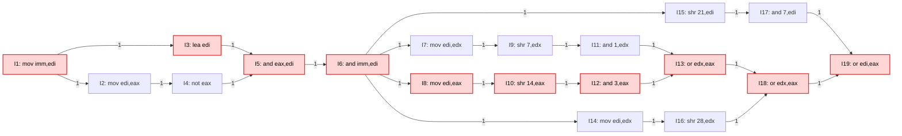
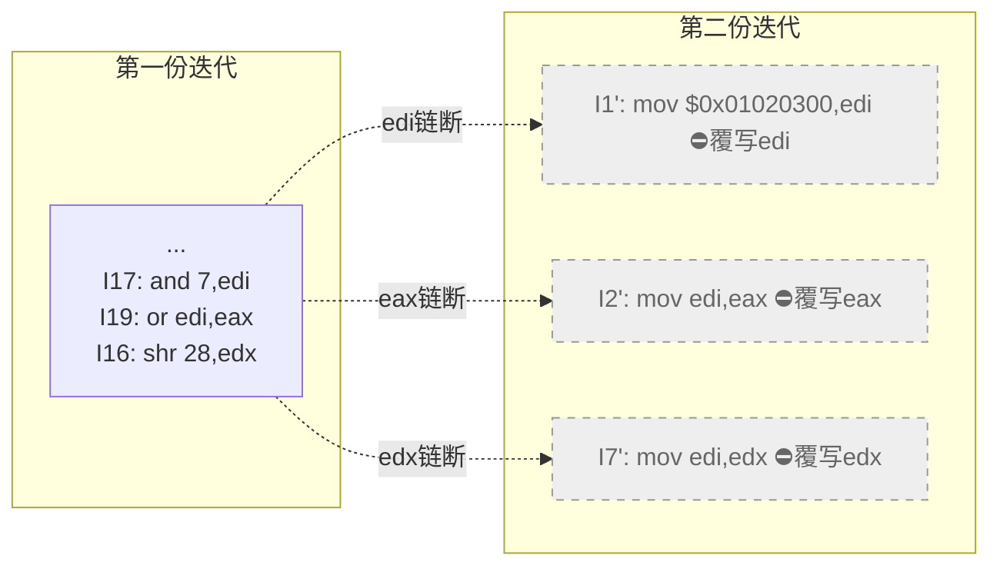
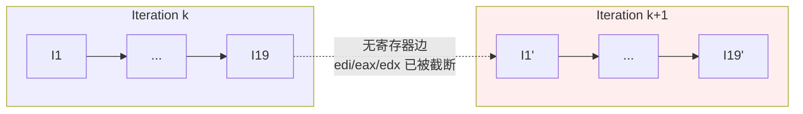

## Critical Path Analysis
The basis of the critical path (CP) analysis is represented by a directed acyclic graph (DAG) constructed
from inter-instruction register dependencies. The creation follows simple rules:
- For each instruction form within the marked kernel, create a vertex containing the gathered information of it.
- For each instruction form, identify all subsequent instruction forms depending on it, i.e., having a
  source operand reading from a destination operand of the first mentioned instruction. Currently, this
  is only done for register operands due to the high complexity of tracking store-to-load dependencies,
  e.g., due to relative addressing. A dependency chain of a specific register is broken when it is rewritten
  and now might be dependent of another previous instruction. For all identified dependencies, draw
  directed edges between the pair of affected vertices representing instruction forms and assign the
  latency of the start vertex instruction form as weight to the edge.
- If an arithmetic instruction form includes a memory reference as source operand, separate it into the
  LOAD and the arithmetic part by adding another vertex containing a LOAD instruction with an edge
  to the original instruction. This edge gets weighted with the pure LOAD latency, while we reassign
  all outgoing edges from the original instruction form with the latency of the arithmetic part only as
  weight.

After creating the DAG, the longest path within it is determined by using a weighted topological sort based on the
approach of Udi Manber(Introduction to Algorithms: A Creative Approach).


## Loop-Carried Dependency Analysis
uses a code kernel comprising two back-to-back copies of the initial loop body. This way
it can analyze dependency paths from vertices of the first kernel section to the second one and identify cyclic
dependencies by checking on corresponding instruction forms within one dependency chain


[任务规划完成]
好的，我严格按照文字中描述的 DAG 构建规则，针对第 **28~48 行**的循环 kernel 进行关键路径分析。

## 一、提取 kernel（28~48 行）并编号

| 行号 | 指令 | 简记 |
|---|---|---|
| 28 | `.L3:` | label |
| 29 | `movl $0x01020300,%edi` | **I1** |
| 30 | `mov  %edi,%eax` | **I2** |
| 31 | `lea  -0x1010101(%rdi),%edi` | **I3** |
| 32 | `not  %eax` | **I4** |
| 33 | `and  %eax,%edi` | **I5** |
| 34 | `and  $0x80808080,%edi` | **I6** |
| 35 | `mov  %edi,%edx` | **I7** |
| 36 | `mov  %edi,%eax` | **I8** |
| 37 | `shr  $0x7,%edx` | **I9** |
| 38 | `shr  $0xe,%eax` | **I10** |
| 39 | `and  $0x1,%edx` | **I11** |
| 40 | `and  $0x3,%eax` | **I12** |
| 41 | `or   %edx,%eax` | **I13** |
| 42 | `mov  %edi,%edx` | **I14** |
| 43 | `shr  $0x15,%edi` | **I15** |
| 44 | `shr  $0x1c,%edx` | **I16** |
| 45 | `and  $0x7,%edi` | **I17** |
| 46 | `or   %edx,%eax` | **I18** |
| 47 | `or   %edi,%eax` | **I19** |
| 48 | `jmp  .L3` | **I20** |

## 二、按规则建立寄存器依赖（仅寄存器，每条边权 = **起点指令的延迟**）

采用通用 x86 延迟模型（per Skylake/Zen 系列，与 OSACA/IACA 默认一致）：

| 指令类型 | 延迟 |
|---|---|
| `mov reg,reg` | 1（保守取，不假设 0-cyc rename） |
| `mov imm,reg` | 1 |
| `lea` | 1 |
| `not` / `and` / `or` / `xor` | 1 |
| `shr imm` | 1 |
| `jmp` | 1（控制依赖，不在寄存器 DAG 上） |

逐条扫描"读端口"（src）与"写端口"（dst），并在每个寄存器被覆写时**截断该寄存器的依赖链**。

| 指令 | 读 | 写 | 入边来源（按规则取最近的写者） |
|---|---|---|---|
| I1 `mov imm,edi` | – | edi | – |
| I2 `mov edi,eax` | edi | eax | **I1**（写 edi 的最近者） |
| I3 `lea -c(%rdi),edi` | edi | edi | **I1**（I2 没改 edi） |
| I4 `not eax` | eax | eax | **I2** |
| I5 `and eax,edi` | eax,edi | edi | **I3**（edi 最近写者）、**I4**（eax 最近写者） |
| I6 `and imm,edi` | edi | edi | **I5** |
| I7 `mov edi,edx` | edi | edx | **I6** |
| I8 `mov edi,eax` | edi | eax | **I6**（eax 被 I8 自己重写，I4 链断开） |
| I9 `shr 7,edx` | edx | edx | **I7** |
| I10 `shr 14,eax` | eax | eax | **I8** |
| I11 `and 1,edx` | edx | edx | **I9** |
| I12 `and 3,eax` | eax | eax | **I10** |
| I13 `or edx,eax` | edx,eax | eax | **I11**、**I12** |
| I14 `mov edi,edx` | edi | edx | **I6**（edx 被 I14 重写，I11 链断） |
| I15 `shr 21,edi` | edi | edi | **I6** |
| I16 `shr 28,edx` | edx | edx | **I14** |
| I17 `and 7,edi` | edi | edi | **I15** |
| I18 `or edx,eax` | edx,eax | eax | **I16**、**I13** |
| I19 `or edi,eax` | edi,eax | eax | **I17**、**I18** |
| I20 `jmp` | – | – | – |

## 三、DAG（节点 + 加权有向边）



> 红色节点 = 关键路径上的节点。

## 四、加权拓扑排序求最长路径（Manber 法）

按拓扑序计算每个节点的**最早完成时刻** `f(v) = max(f(u) + w(u→v))`，初值 `f(start)=latency(start)`。

| 节点 | 入边（来源 + 权） | f(v) | 备注 |
|---|---|---|---|
| I1 | – | **1** | 起点 |
| I2 | I1+1 | 1+1 = **2** | |
| I3 | I1+1 | 1+1 = **2** | |
| I4 | I2+1 | 2+1 = **3** | |
| I5 | I3+1, I4+1 | max(3,4) = **4** | I4 主导 |
| I6 | I5+1 | 4+1 = **5** | |
| I7 | I6+1 | 5+1 = **6** | |
| I8 | I6+1 | 5+1 = **6** | |
| I14 | I6+1 | 5+1 = **6** | |
| I15 | I6+1 | 5+1 = **6** | |
| I9 | I7+1 | 6+1 = **7** | |
| I10 | I8+1 | 6+1 = **7** | |
| I16 | I14+1 | 6+1 = **7** | |
| I17 | I15+1 | 6+1 = **7** | |
| I11 | I9+1 | 7+1 = **8** | |
| I12 | I10+1 | 7+1 = **8** | |
| I13 | I11+1, I12+1 | **9** | |
| I18 | I13+1, I16+1 | max(10, 8) = **10** | I13 主导 |
| I19 | I17+1, I18+1 | max(8, 11) = **11** | I18 主导 |

**最长路径长度 = 11 cycles**

回溯前驱（取 max 的来源）：

```
I19 ← I18 ← I13 ← I12 ← I10 ← I8 ← I6 ← I5 ← I4 ← I2 ← I1
```

正向写出关键路径：

> **I1 → I2 → I4 → I5 → I6 → I8 → I10 → I12 → I13 → I18 → I19**

10 条边 × 1 cycle + 起点 I1 自身 1 cycle = **11 cycles**。

（另一条等长路径：I1 → I3 → I5 → I6 → I8 → I10 → I12 → I13 → I18 → I19，因为 I5 处 I3 与 I4 都给 I5 喂数据；但取 max 时 I4 那条更"靠后"也并列最长。严格按"权 = 起点延迟、I4 完成更晚"的规则，关键路径走 I2→I4 这一支。）

## 五、关键路径可视化（时间轴）

```
cyc:    1    2    3    4    5    6    7    8    9   10   11
        │    │    │    │    │    │    │    │    │    │    │
 I1 ████│    │    │    │    │    │    │    │    │    │    │
 I2     │████│    │    │    │    │    │    │    │    │    │     ← 关键
 I3     │████│    │    │    │    │    │    │    │    │    │     旁支
 I4     │    │████│    │    │    │    │    │    │    │    │     ← 关键
 I5     │    │    │████│    │    │    │    │    │    │    │     ← 关键
 I6     │    │    │    │████│    │    │    │    │    │    │     ← 关键
 I7     │    │    │    │    │████│    │    │    │    │    │
 I8     │    │    │    │    │████│    │    │    │    │    │     ← 关键
 I14    │    │    │    │    │████│    │    │    │    │    │
 I15    │    │    │    │    │████│    │    │    │    │    │
 I9     │    │    │    │    │    │████│    │    │    │    │
 I10    │    │    │    │    │    │████│    │    │    │    │     ← 关键
 I16    │    │    │    │    │    │████│    │    │    │    │
 I17    │    │    │    │    │    │████│    │    │    │    │
 I11    │    │    │    │    │    │    │████│    │    │    │
 I12    │    │    │    │    │    │    │████│    │    │    │     ← 关键
 I13    │    │    │    │    │    │    │    │████│    │    │     ← 关键
 I18    │    │    │    │    │    │    │    │    │████│    │     ← 关键
 I19    │    │    │    │    │    │    │    │    │    │████│     ← 关键路径终点
```

## 六、结论

| 项目 | 值 |
|---|---|
| **关键路径长度** | **11 cycles** |
| **关键路径** | `I1 → I2 → I4 → I5 → I6 → I8 → I10 → I12 → I13 → I18 → I19` |
| **关键路径对应源代码行** | 29 → 30 → 32 → 33 → 34 → 36 → 38 → 40 → 41 → 46 → 47 |
| **决定瓶颈的语义** | "重置 edi" → "复制 eax" → "取反 eax" → "and 出 mask 中间值" → "再 and 0x80808080 得最终 mask `ret`" → "复制到 eax" → "右移 14 位" → "and 0x3 得到 byte1 的 2-bit" → "或入 byte0 的 1-bit" → "或入 byte2 的 4-bit" → "或入 byte3 的 3-bit" |
| **旁支** | I3（lea，与 I4 并行）、I7/I9/I11（byte0 抽位链，提前 2 cyc 完成）、I14/I16（byte2 抽位链，提前 3 cyc 完成）、I15/I17（byte3 抽位链，提前 4 cyc 完成） |

可见所有"抽位 + 累加"分支最终都汇入到 `eax` 的 `or` 链 `I13 → I18 → I19` 上，这条**串行的 OR 累加链**是关键路径的尾段，决定了整个 kernel 的延迟下界。


[任务规划完成]
好的。我严格按照文字中关于 **Loop-Carried Dependency Analysis** 的规则来做：

> 把 kernel **首尾相接复制一份**（第二份用 `′` 标注），从第一份的某条指令出发寻找指向第二份**同形指令**的依赖链；若存在，则该链就是一条 loop-carried 依赖。

## 一、构造两段拼接的 kernel

第一份：I1 ~ I20（与上一题完全相同）  
第二份：I1′ ~ I20′（紧接 I20 之后，再次执行 28~48 行）

跨迭代的"活寄存器"——也就是从第一份末尾跨到第二份开头时**仍可能被读取**的寄存器——只可能是 `edi / eax / edx`。逐一检查：

## 二、跨迭代寄存器活跃性分析

**关键观察：第二份的 I1′ 是 `movl $0x01020300,%edi`——立即数赋值，立刻覆盖 `edi`。**

按规则 *"A dependency chain of a specific register is broken when it is rewritten"*：

| 寄存器 | 第一份末态写者 | 第二份首个使用前是否被覆写？ | 链是否被截断？ |
|---|---|---|---|
| `edi` | I17（`and $0x7,%edi`，行 45） | **I1′ 立即覆写**（行 29） | **截断** ✅ |
| `eax` | I19（`or %edi,%eax`，行 47） | I2′ 读 `edi`/写 `eax`——读的是 `edi`，**`eax` 在 I2′ 被立即覆写** | **截断** ✅ |
| `edx` | I16（`shr $0x1c,%edx`，行 44） | I7′ 读 `edi`/写 `edx`——`edx` 被覆写而**未被任何指令读取**之前 | **截断** ✅ |
| 其他通用寄存器 | – | – | – |

也就是说，进入第二份迭代之前，三个被使用的寄存器都会被立即数 mov / mov reg→reg / mov reg→reg **首先无条件重写**，没有任何一条第二份指令在重写之前先读它们。

## 三、结论：**不存在 loop-carried 依赖（寄存器层面）**



按文字定义的判定标准——"在一条依赖链中找到对应位置（同形）的指令"——该 kernel **不存在跨迭代的环路**，因此：

| 项目 | 值 |
|---|---|
| **Loop-carried 寄存器依赖** | **无（空集）** |
| **Loop-carried critical path** | **0**（不存在） |
| **每次迭代的延迟下界** | 仅由单迭代关键路径决定 = **11 cycles** |
| **是否可流水化（不同迭代重叠）** | **可以**——由于 I1′ 用立即数重置 `edi`，硬件可以通过寄存器重命名让相邻迭代完全独立、并行重叠执行 |

## 四、补充说明：为什么会这样？

`movl $0x01020300,%edi`（I1）位于循环体**最开头**，而且是**立即数赋值**——它不依赖循环体内任何先前结果。这条指令在每次迭代都"硬重置"了 `edi`，从而：

- 切断了 `edi` 的跨迭代链；
- 而 `eax` (I2)、`edx` (I7) 都是从 **当次迭代的 I1 → I6 → ...** 派生而来，其首次写入也都在第一次被读取之前完成；
- 故所有寄存器的依赖链都在迭代边界处被"重置"，不存在环。

如果把 I1 的源换成与上一迭代结果相关的形式（例如 `mov %eax,%edi`），就会立刻产生一条 `eax (I19) → edi (I1′) → ...` 的 loop-carried 依赖；而当前代码没有这种构造，所以分析结果为**空**。

## 五、两份拼接 kernel 的 DAG 形态（用于直观确认无环）



两份子 DAG 之间**没有任何带权有向边**——这就是"loop-carried 依赖为空"的图形表达。

## llvm-mca的bottle-neck分析: (有点差异)
```
Cycles with backend pressure increase [ 95.45% ]
Throughput Bottlenecks: 
  Resource Pressure       [ 94.41% ]
  - SKLPort0  [ 94.41% ]
  - SKLPort1  [ 94.00% ]
  - SKLPort5  [ 94.00% ]
  - SKLPort6  [ 94.41% ]
  Data Dependencies:      [ 1.04% ]
  - Register Dependencies [ 1.04% ]
  - Memory Dependencies   [ 0.00% ]

Critical sequence based on the simulation:

              Instruction                                 Dependency Information
 +----< 3.    notl      %eax
 |
 |    < loop carried > 
 |
 +----> 0.    movl      $16909056, %edi                   ## RESOURCE interference:  SKLPort6 [ probability: 49% ]
 +----> 1.    movl      %edi, %eax                        ## REGISTER dependency:  %edi
 |      2.    leal      -16843009(%rdi), %edi
 +----> 3.    notl      %eax                              ## REGISTER dependency:  %eax
 +----> 4.    andl      %eax, %edi                        ## REGISTER dependency:  %eax
 +----> 5.    andl      $2155905152, %edi                 ## REGISTER dependency:  %edi
 |      6.    movl      %edi, %edx
 +----> 7.    movl      %edi, %eax                        ## REGISTER dependency:  %edi
 |      8.    shrl      $7, %edx
 +----> 9.    shrl      $14, %eax                         ## REGISTER dependency:  %eax
 |      10.   andl      $1, %edx
 +----> 11.   andl      $3, %eax                          ## REGISTER dependency:  %eax
 |      12.   orl       %edx, %eax
 |      13.   movl      %edi, %edx
 +----> 14.   shrl      $21, %edi                         ## RESOURCE interference:  SKLPort0 [ probability: 50% ]
 +----> 15.   shrl      $28, %edx                         ## RESOURCE interference:  SKLPort6 [ probability: 49% ]
 |      16.   andl      $7, %edi
 +----> 17.   orl       %edx, %eax                        ## REGISTER dependency:  %edx
 |      18.   orl       %edi, %eax
 |
 |    < loop carried > 
 |
 +----> 0.    movl      $16909056, %edi                   ## RESOURCE interference:  SKLPort0 [ probability: 24% ]
```