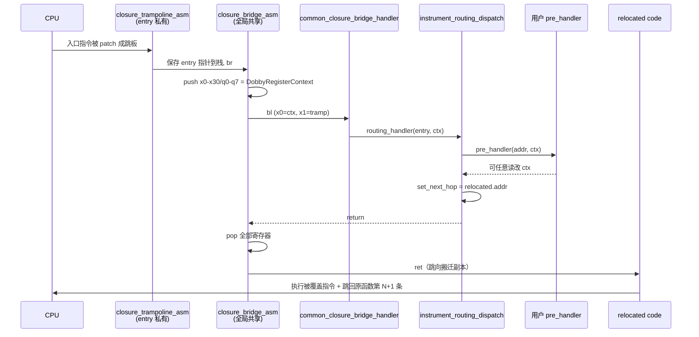
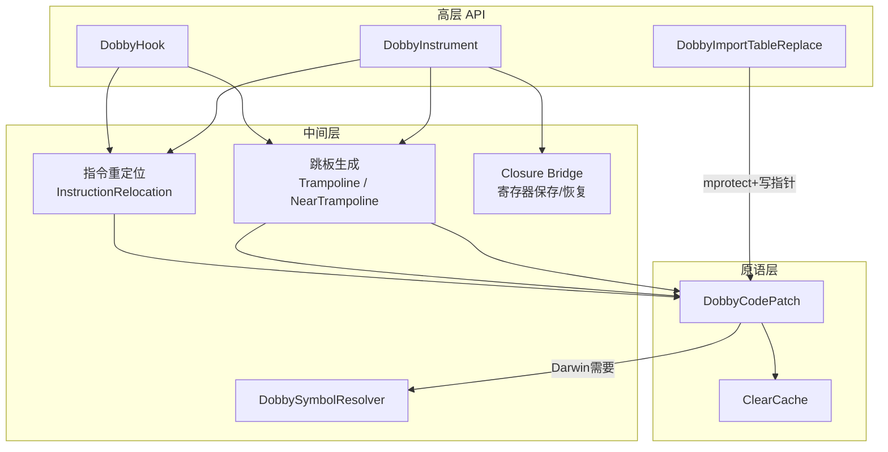
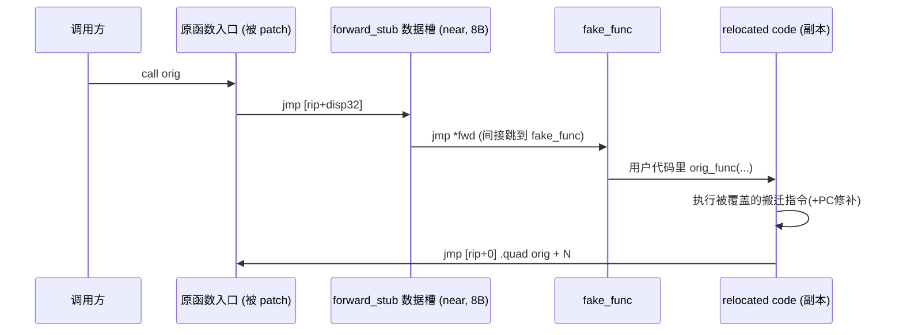
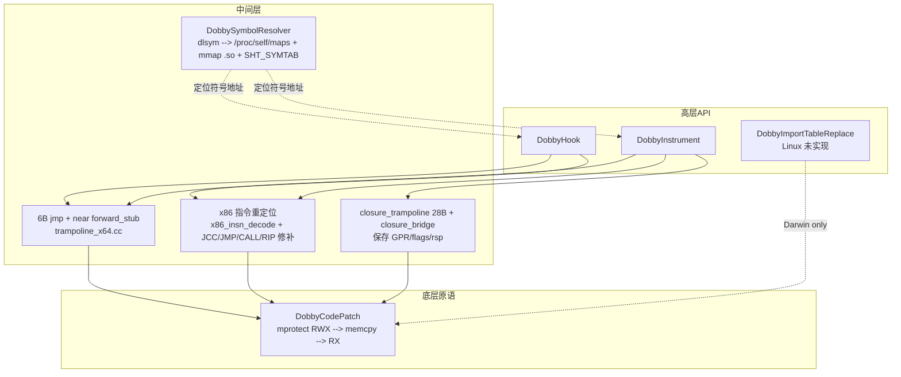

# Dobby 五大核心 API 功能与实现分析

Dobby 是一个跨平台的动态二进制插桩/Hook 框架，`include/dobby.h` 中对外暴露的 5 个核心 API 覆盖了「代码打补丁 → 函数级替换 → 指令级插桩 → 符号定位 → 导入表替换」这条完整的动态逆向 Hook 链路。下面按调用层次自底向上分析。

---

## 1. `DobbyCodePatch`：原语级代码补丁

**声明**（[dobby.h](/Dobby/include/dobby.h) L117）：
```c
int DobbyCodePatch(void *address, uint8_t *buffer, uint32_t buffer_size);
```

### 功能
往任意地址 `address` 写入一段字节流 `buffer`，可跨可执行页写代码/数据。它是所有更高层 Hook（`DobbyHook`、`DobbyInstrument`、`DobbyDestroy`）实际"下手改指令"的唯一底层入口。

### 实现（分平台）

#### Darwin/iOS —— [code-patch-tool-darwin.cc](/Dobby/source/Backend/UserMode/ExecMemory/code-patch-tool-darwin.cc)
核心逻辑：
1. **跨页处理**：若 `[address, address+buffer_size)` 跨越了页边界，则递归地拆成两段分别 patch（第 51-65 行）。
2. **权限翻转**：通过动态解析 `vm_protect`（避免自己被 Hook 时死锁）把目标页改成 `VM_PROT_READ | VM_PROT_WRITE | VM_PROT_COPY`，其中 `VM_PROT_COPY` 会触发 COW，绕过 iOS 上代码段共享映射的写保护。
   ```cpp
   vm_protect_fn = DobbySymbolResolver("dyld", "vm_protect");
   kr = vm_protect_fn(self_task, remap_dest_page, page_size, false,
                      VM_PROT_READ | VM_PROT_WRITE | VM_PROT_COPY);
   memcpy(..., buffer, buffer_size);
   kr = vm_protect_fn(..., VM_PROT_READ | VM_PROT_EXECUTE);
   ```
3. **备选 remap 路径**（当前用 `if (0)` 关闭）：先 `mach_vm_allocate` 一个匿名页 → 拷贝原页 + 补丁 → `mach_vm_remap` 用 `VM_FLAGS_OVERWRITE` 覆盖回原地址；用于代码签名严格的场景。
4. **ARM64 内联 svc 版 mprotect**：预留了直接 `svc 0x80` 触发 74 号系统调用的 `mprotect_impl`，避免走 libSystem 的 stub。
5. **指令缓存刷新**：`ClearCache(address, address+buffer_size)` 保证 I-Cache 与刚写的新指令一致。

#### Linux/Android —— [code-patch-tool-posix.cc](/Dobby/source/Backend/UserMode/ExecMemory/code-patch-tool-posix.cc)
经典三段式：`mprotect(RWX)` → `memcpy` → `mprotect(RX)` → `ClearCache`，同样处理起止页横跨。

---

## 2. `DobbyHook`：函数级 Inline Hook

**声明**（[dobby.h](/Dobby/include/dobby.h) L120）：
```c
int DobbyHook(void *address, void *fake_func, void **out_origin_func);
```

### 功能
把 `address` 处的函数替换成 `fake_func`；同时将原函数的前 N 条指令搬迁重写到一块新代码块，末尾接一条跳回原函数第 N+1 条指令的分支，把该新块地址通过 `out_origin_func` 返回给调用者作为"原函数指针"。这样在 `fake_func` 里就可以通过 `orig(...)` 继续调用真正的实现。

### 实现（[InlineHookRouting.h](/Dobby/source/InterceptRouting/InlineHookRouting.h)）

顶层入口：
```cpp
PUBLIC inline int DobbyHook(void *address, void *fake_func, void **out_origin_func) {
    ...
    auto entry   = new Interceptor::Entry((addr_t)address);
    auto routing = new InlineHookRouting(entry, (addr_t)fake_func);
    routing->BuildRouting();
    routing->Active();
    ...
    if (out_origin_func) *out_origin_func = (void *)entry->relocated.addr();
    gInterceptor.add(entry);
}
```

关键三步（见 [InterceptRouting.h](/Dobby/source/InterceptRouting/InterceptRouting.h)）：

### ① `GenerateTrampoline`：生成"入口→假函数"的短跳板
- 若开启 near-trampoline，则调用 `GenerateNearTrampolineBuffer`，尝试用一条 `b imm26` 就近跳转（±128MB 内）。
- 否则用 `GenerateNormalTrampolineBuffer`。以 ARM64 为例（[trampoline_arm64.cc](/Dobby/source/TrampolineBridge/Trampoline/trampoline_arm64.cc)）：
   - 距离 `< ±4GB` (`adrp` 覆盖范围)：`adrp x17, page; add x17, x17, off; br x17` （12 字节）
   - 更远：`ldr x17, [pc, #imm]; br x17; .quad target` （PC 相对绝对跳转，16 字节）

### ② `GenerateRelocatedCode`：重定位原始指令
调用 `GenRelocateCodeAndBranch`（`InstructionRelocation/arm64/InstructionRelocationARM64.cc` 等），把被跳板覆盖的 N 条指令搬迁到新代码块，并对**PC 相关指令**做修补：
- ARM64：`b/bl imm26`、`b.cond imm19`、`cb(n)z`、`tb(n)z`、`adr/adrp` 等重新计算立即数或改写为 `ldr` + literal。
- x86/x64：处理 `jmp/jcc rel8/rel32`、`call rel32`、`rip 相对寻址` 等。

搬完后末尾追加一条无条件跳转到 `address + N`，形成完整可执行的"原始函数副本"。

### ③ `BackupOriginCode` + `Active`：写入跳板 + 备份原字节
- `backup_orig_code()` 先 `memcpy` 保留原始机器码，供 `DobbyDestroy` 恢复用。
- `Active()` 调用 `DobbyCodePatch(entry->addr, trampoline_addr, trampoline_size)` 把跳板机器码写到函数入口。

### 数据结构：`Interceptor` 单例
所有 hook 记录在全局 `gInterceptor.entries`（[Interceptor.h](/Dobby/source/Interceptor.h)）里，`Entry` 保存 `addr / patched / relocated / routing / origin_code_`，`DobbyDestroy` 根据 `patched.addr()` 查找并调用 `restore_orig_code()` 还原。

### 流程图


---

## 3. `DobbyInstrument`：指令级动态插桩

**声明**（[dobby.h](/Dobby/include/dobby.h) L124-125）：
```c
typedef void (*dobby_instrument_callback_t)(void *address, DobbyRegisterContext *ctx);
int DobbyInstrument(void *address, dobby_instrument_callback_t pre_handler);
```

### 功能
在任意指令地址处插入回调点，回调收到当前地址与**完整寄存器上下文** `DobbyRegisterContext`（GPR + SP + FP + LR + Q0-Q7/Q0-Q31 浮点），可以读也可以改；返回后指令流继续像没被中断一样往下走。等价于"软件断点 + 回调"，是 `DobbyHook` 的超集。

### 实现（[InstrumentRouting.h](/Dobby/source/InterceptRouting/InstrumentRouting.h)）

相比 `InlineHookRouting`，多了一步"闭包跳板"，用来在跳到用户回调前后自动完成寄存器保存/恢复。

流程 `BuildRouting()`：
```cpp
GenerateInstrumentClosureTrampoline();   // 生成 closure trampoline
GenerateTrampoline();                    // 生成 入口->closure 的短跳
GenerateRelocatedCode();                 // 搬迁并修补被覆盖指令
BackupOriginCode();
```

### 闭包跳板（Closure Trampoline）架构

三层 asm 结构（以 ARM64 为参考）：

**a. `closure_trampoline_asm`**（[ClosureTrampolineARM64.cc](/Dobby/source/TrampolineBridge/ClosureTrampolineBridge/arm64/ClosureTrampolineARM64.cc)）
每次 `GenerateClosureTrampoline` 从一份模板复制 64 字节，动态回填两个字面量：
- `carry_data` = 当前 `Interceptor::Entry *`
- `closure_bridge_addr` = 公共桥地址

作用只是把 "本次 Entry 指针 + 目标 bridge" 压栈后跳到 `closure_bridge_asm`。

**b. `closure_bridge_asm`**（[closure_bridge_arm64.cc](/Dobby/source/TrampolineBridge/ClosureTrampolineBridge/arm64/closure_bridge_arm64.cc)）
一次生成、全局共享的公共桥。作用：
1. 把 `x0-x30`、`q0-q7`（可选 `q8-q31`）依次压栈 → SP 布局与 `DobbyRegisterContext` 完全一致。
2. `mov x0, sp`（ctx 指针），`ldr x1, [sp, #ctx_size]`（closure trampoline 保存的 entry 指针）。
3. `bl common_closure_bridge_handler` —— 这是 C++ 世界的入口。
4. 回来后按逆序 `ldp` 恢复所有寄存器，`ret` 到 `TMP_REG_0`（下一跳）。

**c. `common_closure_bridge_handler`**（[common_bridge_handler.h](/Dobby/source/TrampolineBridge/ClosureTrampolineBridge/common_bridge_handler.h)）
```cpp
routing_handler((Interceptor::Entry *)tramp->carry_data, ctx);
```
把控制权转发给 Entry 上挂载的 `carry_handler`，也就是：

**d. `instrument_routing_dispatch`**（[instrument_routing_handler.cpp](/Dobby/source/InterceptRouting/InstrumentRouting/instrument_routing_handler.cpp)）
```cpp
entry->pre_handler((void *)entry->addr, ctx);          // ← 用户回调
set_routing_bridge_next_hop(ctx, (void *)entry->relocated.addr()); // 让 ret 跳向搬迁副本
```
即：调用用户 `pre_handler` → 通过修改 `TMP_REG_0`（`x17`）把 bridge 出口重定向到 relocated code，从而"补执行"被跳板覆盖的原始指令，再自然衔接到原函数后续。

### 完整调用链


---

## 4. `DobbySymbolResolver`：跨镜像符号解析

**声明**（[dobby.h](/Dobby/include/dobby.h) L135）：
```c
void *DobbySymbolResolver(const char *image_name, const char *symbol_name);
```

### 功能
在指定镜像（可为 `NULL` 表示全部）内查找符号地址，覆盖 `dlsym` 找不到的**私有符号**、**dyld_shared_cache** 里的库、以及 stripped 二进制中的符号表。是很多 Hook 场景（尤其是 iOS 系统私有 API）的起点。

### 实现

#### Mach-O（iOS/macOS）—— [macho/dobby_symbol_resolver.cc](/Dobby/builtin-plugin/SymbolResolver/macho/dobby_symbol_resolver.cc)
遍历 `ProcessRuntime::getModuleMap()` 拿到进程加载的所有 Mach-O：
1. **image_name 过滤**：`strstr(module.path, image_name)`，未指定则跳过 `dyld` 自身以免踩坑。
2. **shared cache 分支**（arm/arm64）：如果 `header` 落在 `dyld_shared_cache` 范围内，用 `shared_cache_ctx` 读该镜像在 cache 里的独立符号表 `symtab/strtab` 做遍历（cache 从 iOS 15/macOS 12 起把符号表挪出了各库自身，针对apple arm架构的优化）。
3. **普通 Mach-O 分支**：用 `macho_ctx_t::symbol_resolve` 解析 `LC_SYMTAB`。
4. **dyld 特例**：`image_name == "dyld"` 时通过 `task_info(TASK_DYLD_INFO)` 拿到 dyld 加载地址，直接 `macho_ctx_t` 解析；若 dyld 也在 cache 里则回退到磁盘文件解析（`macho_file_symbol_resolve`）。

#### ELF（Linux/Android）—— [elf/dobby_symbol_resolver.cc](/Dobby/builtin-plugin/SymbolResolver/elf/dobby_symbol_resolver.cc)
1. 先用 `dlsym(RTLD_DEFAULT, ...)`，命中就返回。
2. 未命中则 `resolve_elf_internal_symbol`：把目标 `.so` 从磁盘 `mmap` 一份（`MmapFileManager`），初始化 `elf_ctx_t`（解析 `PT_DYNAMIC/PT_LOAD/PT_PHDR`、遍历 `SHT_SYMTAB/.strtab` 与 `SHT_DYNSYM/.dynstr` 两套符号表），线性搜索符号名，再用 `load_bias` 换算回内存中运行地址：
   ```
   runtime_addr = st_value + (module.load_address - (file_mem - ctx.load_bias))
   ```

### 关键点
用磁盘映射解析文件符号表是为了拿到运行时可能被裁掉的 `SHT_SYMTAB`（stripped 库仅剩 `.dynsym`），因此能解析出私有函数。

---

## 5. `DobbyImportTableReplace`：GOT / PLT / Stub 替换

**声明**（[dobby.h](/Dobby/include/dobby.h) L138）：
```c
int DobbyImportTableReplace(char *image_name, char *symbol_name,
                            void *fake_func, void **orig_func);
```

### 功能
不动目标函数一个字节，只在**调用方模块**的"导入表/间接符号表指针槽"里把 `symbol_name` 对应的函数指针换成 `fake_func`；`orig_func` 输出被替换掉的原指针。适用于只想拦截"某个 image 对某函数的调用"、避免全局副作用的场景。

### 实现（Mach-O）—— [dobby_import_replace.cc](/Dobby/builtin-plugin/ImportTableReplace/dobby_import_replace.cc)

Mach-O 的间接符号解析走 `__DATA/__DATA_CONST` 里的 `__la_symbol_ptr`（lazy）和 `__got`（non-lazy），本函数就是遍历这些节找到对应的槽后覆写。

**`get_global_offset_table_stub`**：解析 Mach-O 头
1. 扫 load commands，收集 `__TEXT / __DATA / __LINKEDIT` 段头 + `LC_SYMTAB` + `LC_DYSYMTAB`。
2. 用 `slide = header - text_segment->vmaddr` 得 ASLR 偏移。
3. 从 `__LINKEDIT` 找 `symtab / strtab / indirect_symtab`。

**`iterate_indirect_symtab`**：定位并覆写
- 对每个 `S_LAZY_SYMBOL_POINTERS / S_NON_LAZY_SYMBOL_POINTERS` 节，用 `section->reserved1` 索引进 indirect symbol 表，再用 `symtab_index` 取符号名。
- 名字匹配（支持 `_` 前缀去掉再比）后返回槽地址 `&indirect_symbol_bindings[i]`。
- `__DATA_CONST` 段先 `mprotect(RW)` 使其可写。

**替换动作**：
```cpp
orig_func   = *(void **)stub;         // 保存原指针
*orig_func_ptr = orig_func;
*(void **)stub = fake_func;           // 覆盖为假函数
```

**PAC 处理**（arm64e）：读取时 `ptrauth_strip` 去签名再重新用 `key_asia` 空签名，写入时用 `stub` 地址作 discriminator 重签，确保 arm64e 上仍能通过 `blraaz` 校验。

### 与 `DobbyHook` 的差异
| 维度 | DobbyHook | DobbyImportTableReplace |
|---|---|---|
| 修改位置 | 目标函数入口机器码 | 调用方模块的间接指针槽 |
| 影响范围 | 全进程所有调用者 | 仅指定 `image_name` 内的调用 |
| 需要重定位指令 | 是 | 否 |
| 需要生成跳板 | 是 | 否 |
| 底层依赖 | `DobbyCodePatch` | `mprotect` + 指针赋值 |

---

## 6. 五个 API 的依赖关系总览



- **`DobbyCodePatch`** 是所有代码修改的底座；在 Darwin 上它自己又反向依赖 **`DobbySymbolResolver`** 动态取 `vm_protect`。
- **`DobbyHook`** 通过 `Trampoline + Relocated Code` 完成"入口跳走 + 补执行原指令"两段式。
- **`DobbyInstrument`** 在 `DobbyHook` 基础上加了一层 `Closure Bridge`，用于**保存/恢复完整寄存器上下文**并回调用户函数，天然支持"任意地址插桩"。
- **`DobbyImportTableReplace`** 不动代码只改指针，是完全独立的一条轻量替换路径。
- **`DobbySymbolResolver`** 是四者定位符号地址的共同工具。

这套设计的核心思想是：**用最小可用的底层原语（CodePatch）+ 组合式的中间层（Trampoline / Relocation / Closure Bridge）拼出所有形态的 Hook**，因此易于跨 ARM/ARM64/x86/x64 与 Darwin/Linux/Windows/Kernel 多平台适配。

---


# Dobby 五大核心 API 在 **x86_64 + Linux** 下的实现分析

先明确调用栈：Dobby 对外只暴露 [dobby.h](/Dobby/include/dobby.h) 的 C API，具体的机器代码生成、内存权限修改、指令重定位、闭包桥都会分别落到 `TARGET_ARCH_X64` + Linux 分支上的实现文件里。以下逐一展开。

---

## 一、`DobbyCodePatch` —— 底层代码补丁原语

x86_64 Linux 下走的是 [code-patch-tool-posix.cc](/Dobby/source/Backend/UserMode/ExecMemory/code-patch-tool-posix.cc)（编译时 `!defined(__APPLE__)` 生效）。

### 实现要点
```c
int DobbyCodePatch(void *address, uint8_t *buffer, uint32_t buffer_size) {
  int page_size = (int)sysconf(_SC_PAGESIZE);           // 通常 4KB
  uintptr_t patch_page     = ALIGN_FLOOR(address, page_size);
  uintptr_t patch_end_page = ALIGN_FLOOR((uintptr_t)address + buffer_size, page_size);

  // 1) 起始页改成 RWX
  mprotect((void *)patch_page, page_size, PROT_READ | PROT_WRITE | PROT_EXEC);
  if (patch_page != patch_end_page) {                  // 2) 跨页则同样处理末页
    mprotect((void *)patch_end_page, page_size, PROT_READ | PROT_WRITE | PROT_EXEC);
  }

  memcpy(address, buffer, buffer_size);                // 3) 直接覆写机器码

  mprotect((void *)patch_page,     page_size, PROT_READ | PROT_EXEC);  // 4) 恢复 RX
  if (patch_page != patch_end_page) {
    mprotect((void *)patch_end_page, page_size, PROT_READ | PROT_EXEC);
  }

  ClearCache((void *)address, (void *)((addr_t)address + buffer_size)); // 5) 刷缓存
  return 0;
}
```

### 特点
- **不需要 `VM_PROT_COPY` 那样的 COW 技巧**：Linux 只要 `mprotect` 拿到写权限就能改，不像 iOS 需要绕代码签名。
- **RWX 中转是刚性依赖**：如果内核策略（如 SELinux/W^X）禁止 `PROT_WRITE|PROT_EXEC` 共存，这里 `mprotect` 会失败。多数桌面 Linux 默认允许。
- **`ClearCache` 在 x86 上是空操作**：x86 硬件维护 I-Cache 一致性，不需要显式 `clflush`；只有 ARM/ARM64 才真正刷缓存。
- **是所有更上层 API 的最终写入通道**：`DobbyHook`、`DobbyInstrument`、`DobbyDestroy` 想改任何字节都得走它。

---

## 二、`DobbyHook` —— x86_64 函数级 Inline Hook

顶层入口 [InlineHookRouting.h](/Dobby/source/InterceptRouting/InlineHookRouting.h) 是架构无关的模板，真正体现 x86_64 特色的有两个地方：**跳板长什么样**、**指令重定位怎么做**。

### 1) 生成跳板 —— [trampoline_x64.cc](/Dobby/source/TrampolineBridge/Trampoline/trampoline_x64.cc)

在 x86_64 上 `dobby_set_near_trampoline(true)` 的近跳板函数直接返回 `nullptr`（第 55 行注释 *"x64 near branch trampoline enable default"*），因此 x64 **一律走绝对间接跳板**。

`GenerateNormalTrampolineBuffer(from, to)` 的做法：

```
gNearMemoryAllocator.allocNearDataBlock(sizeof(void*), from+6, 2GB)
                    → 得到一个位于 ±2GB 内的 8 字节数据槽 forward_stub
*(addr_t *)forward_stub = to;              // 槽里放最终目标地址（fake_func）
codegen.JmpNearIndirect(forward_stub);     // 生成 6 字节：jmp qword ptr [rip + disp32]
```

生成出来的入口跳板只有 **6 字节** —— `FF 25 xx xx xx xx`，`disp32` 就是从下一条指令地址到 `forward_stub` 的相对偏移。这样最终形态是：

```
原函数首 6 字节  →  jmp [rip+disp32]  ──►  forward_stub (8 字节数据)  →  fake_func
```

优点：跳板只占 6 字节，被覆盖的原始指令区最短；缺点：需要在被 hook 地址 ±2GB 范围内额外分配一块可读可写数据块（由 `NearMemoryAllocator` 做管理）。若分配失败则 hook 失败并打印 "Not found near forward stub"。

### 2) 指令重定位 —— [InstructionRelocationX86Shared.cc](/Dobby/source/InstructionRelocation/x86/InstructionRelocationX86Shared.cc)

因为跳板要占 6 字节，可能覆盖原函数好几条 x86 指令；这些"被覆盖 + 后续可能被吃到边界"的指令必须搬迁重写到 relocated 块，交给 `out_origin_func` 让调用者能"继续执行原始逻辑"。

由 x64 的 [InstructionRelocationX64.cc](/Dobby/source/InstructionRelocation/x64/InstructionRelocationX64.cc) 里 `GenRelocateCodeFixed` 驱动：
1. 用 `x86_insn_decode` 解一条指令。
2. 交给 `GenRelocateSingleX86Insn` 决定这条要不要改写。
3. 尾部 `codegen.JmpNearIndirect(stub_addr); .quad curr_orig_ip;` 拼一条 `jmp [rip+0]` + 8 字节绝对地址，把控制流跳回**原函数第 N+1 条**。

`GenRelocateSingleX86Insn` 对 x64 会改写的关键指令（PC 相关的都得改）：

| 原指令形态 | 改写策略（x64） |
|---|---|
| `Jcc rel8`（0x70~0x7F） | 展开成 **`Jcc +2; jmp +8; jmp [rip+0]; .quad target`** —— 短跳条件跳转扩展成 8 字节绝对目标 |
| `jmp rel8`（0xEB） | `jmp [rip+0]; .quad target` |
| `jmp rel32`（0xE9） | `jmp [rip+0]; .quad target` |
| `call rel32`（0xE8） | `call [rip+2]; jmp +8; .quad target` —— 让 `ret` 地址仍指向搬迁后的下一条 |
| **RIP-relative** 内存操作数（`mov rax, [rip+disp]` 等） | 关键：**不能就地展开**（会破坏原指令语义/长度），因此另分配一段 near 数据块 `rip_insn_seq`，把原指令改用重算过的 `disp32` 放到 `rip_insn_seq` 里执行；relocated 中只放一条 `jmp [rip+0]; .quad rip_insn_seq_addr` 去执行、再 `jmp [rip+0]; .quad relo_next_ip` 跳回来 |
| `LOOP/JECXZ`（0xE0-0xE3） | `UNIMPLEMENTED()` —— 不支持 |
| 其他所有 IP 无关指令 | 原样 `EmitBuffer` 复制 |

对 `Jcc rel8` 的 x64 展开可以看这个片段：

```cpp
// jcc_true stage 1
__ Emit<int8_t>(insn.primary_opcode);
__ Emit<int8_t>(label_jcc_cond_true_stage2);    // 满足则跳过下面 jcc_false
// jcc_false
__ Emit<int8_t>(0xEB);
__ Emit<int8_t>(label_cond_false);              // 跳过 stage 2
// jcc_true stage 2, jmp to orig dst
codegen_x64_jmp_absolute_addr(code_buffer, orig_dst_ip);   // jmp [rip+0]; .quad target
```

这样一条 2 字节的 `Jcc rel8` 被"扩容"成 14 字节，逻辑等价但可寻址 64bit。

`GenRelocateCodeX86Shared` 是一个自动重试循环：先猜 32 字节的输出空间，如果 `GenRelocateCodeFixed` 返回 -1（空间不够），就 +16 再试，直到装得下。

### 3) 装载激活 —— `InterceptRouting.h::Active`
```cpp
DobbyCodePatch((void *)entry->addr, (uint8_t *)trampoline_addr(), trampoline_size());
```
即把 6 字节 `jmp [rip+disp32]` 写到原函数入口，`entry->relocated.addr()` 作为返回给调用者的 `orig_func`。

### 4) 端到端调用图（x86_64）


---

## 三、`DobbyInstrument` —— 任意地址寄存器上下文插桩

上层 [InstrumentRouting.h](/Dobby/source/InterceptRouting/InstrumentRouting.h) 比 InlineHook 多做了一步：先 `GenerateInstrumentClosureTrampoline` 造一个"闭包跳板"，然后把整个 hook 的目的地指向该跳板。x64 上闭包体系由三段汇编 + 一段 C 桥组成。

### 1) 每 Entry 私有的 closure trampoline —— [closure_trampoline_x64.asm](/Dobby/source/TrampolineBridge/ClosureTrampolineBridge/x64/closure_trampoline_x64.asm)

模板只有 4 条指令 + 2 个 8 字节字面量，共 28 字节：

```asm
closure_trampoline_asm:
  push [rip + 6]        ; 把 closure_tramp_entry_addr（本 Entry 的 ClosureTrampoline*）压栈
  jmp  [rip + 8]        ; 跳到 closure_bridge_addr（全局桥）
closure_tramp_entry_addr: .quad 0
closure_bridge_addr:     .quad 0
```

[ClosureTrampolineX64.cc](/Dobby/source/TrampolineBridge/ClosureTrampolineBridge/x64/ClosureTrampolineX64.cc) 用 `memcpy` 把这份模板拷到一段可执行内存，并在 offset 12/20 处**回填两个 quad**：一个是当前 `ClosureTrampoline*`，一个是全局共享的 `closure_bridge_addr`。这样每个 Instrument 点都有自己的 28 字节跳板，但共用后端桥代码。

### 2) 全局共享的 closure bridge —— [closure_bridge_x64.asm](/Dobby/source/TrampolineBridge/ClosureTrampolineBridge/x64/closure_bridge_x64.asm)

一次生成、进程内所有 Instrument 点共用。逻辑严格对应 [dobby.h](/Dobby/include/dobby.h) 里 `DobbyRegisterContext` for x86_64 的布局：

1. `pushfq` 保存 flags；`sub rsp, 8` 对齐。
2. 依次 `mov [rsp+8*i], rXX` 保存 `rax rbx rcx rdx rbp rsp rdi rsi r8 r9 r10 r11 r12 r13 r14 r15`。注意 `[rsp+8*5]` 位置随后会被覆写成"原始 rsp"（进入桥之前的值）—— 这就是 `DobbyRegisterContext` 里那个 `rsp` 字段的值来源。
3. 计算并回填原始 `rsp`：`rax = rsp + (16*8 + 2*8 + 8)`（跳过所保存寄存器、flags、`push [rip+6]` 压入的 closure_tramp_entry 8 字节），写进 `[rsp+rsp_offset]`。
4. 按 System V AMD64 ABI 准备参数：
    - `rdi = rsp`（指向 `DobbyRegisterContext`）
    - `rsi = [rsp + closure_tramp_entry_offset]`（进入 bridge 之前 `push [rip+6]` 放上来的 `ClosureTrampoline*`，也就是 `carry_data`）
5. **16 字节栈对齐检查**：因为不确定被 hook 的位置进桥时 `rsp` 对齐状态，测试 `rsp & 0xF`，是 0 就直接 `call common_closure_bridge_handler`；不是 0 就先 `push rax` 补齐再 `call`，回来再 `pop rax`。这是 System V ABI 对 `call` 前必须 16 字节对齐的硬性要求，否则 handler 内使用 SSE/AVX 会崩。
6. 调用返回后按 push 的逆序 `pop` 回全部通用寄存器（`rsp` 位置用 `add rsp, 8` 跳过，不能真 `pop rsp`）。
7. `popfq` 恢复 flags。
8. `ret` —— **利用了栈上"closure_tramp_entry_addr"这个 push 上来的 8 字节槽当作返回地址**：因为在 C 层 `instrument_routing_dispatch` 会调用 `set_routing_bridge_next_hop(ctx, entry->relocated.addr())`（[helper_x64.cc](/Dobby/source/TrampolineBridge/ClosureTrampolineBridge/x64/helper_x64.cc)：`ctx->ret = (uint64_t)address`），这里 `ctx->ret` 恰好映射到 `DobbyRegisterContext` 中的 `ret` 字段，就是栈上那个"返回槽"的位置。于是 `ret` 直接把控制流甩去 `relocated` 副本。

### 3) C 桥 + 分发 —— [common_bridge_handler.h](/Dobby/source/TrampolineBridge/ClosureTrampolineBridge/common_bridge_handler.h) & [instrument_routing_handler.cpp](/Dobby/source/InterceptRouting/InstrumentRouting/instrument_routing_handler.cpp)

```cpp
// common_bridge_handler
routing_handler((Interceptor::Entry *)tramp->carry_data, ctx);

// instrument_routing_dispatch
instrument_callback_fn((void *)entry->addr, ctx);                         // 用户回调
set_routing_bridge_next_hop(ctx, (void *)entry->relocated.addr());       // 让 ret 跳到搬迁副本
```

### 4) 完整调用链

```mermaid
flowchart LR
    A[被 hook 地址<br/>入口 6B jmp] --> B[closure_trampoline_x64<br/>28B, per-Entry<br/>push entry, jmp bridge]
    B --> C[closure_bridge_x64<br/>全局共享<br/>保存 GPR+flags+rsp]
    C --> D[common_closure_bridge_handler<br/>C++]
    D --> E[instrument_routing_dispatch]
    E --> F[用户 pre_handler<br/>可读写 ctx]
    F --> G[set next_hop = relocated]
    G --> H[bridge 恢复寄存器 + ret]
    H --> I[relocated code<br/>补执行被覆盖指令]
    I --> J[jmp 回原函数 orig+N]
```


### 5) x86_64 上的字段可见性提醒
x86_64 的 `DobbyRegisterContext` 只保存了 GPR + flags + ret，**没有** XMM/YMM/ZMM 寄存器。因此用户 `pre_handler` 里不要期望能读写浮点/SIMD 上下文；若需要（比如 hook 一段用到 xmm0 的函数）需自行扩展 bridge。

---

## 四、`DobbySymbolResolver` —— Linux ELF 符号解析

x86_64 Linux 走 [elf/dobby_symbol_resolver.cc](/Dobby/builtin-plugin/SymbolResolver/elf/dobby_symbol_resolver.cc)。

### 实现路径（三级回退）

```cpp
PUBLIC void *DobbySymbolResolver(const char *image_name, const char *symbol_name_pattern) {
  // ① 先用 dlsym(RTLD_DEFAULT, ...) 快速尝试导出符号
  void *result = dlsym(RTLD_DEFAULT, symbol_name_pattern);
  if (result) return result;

  // ② 未命中 → 磁盘 mmap 目标 .so，遍历完整 SHT_SYMTAB
  return resolve_elf_internal_symbol(image_name, symbol_name_pattern);
}
```

### 关键：`resolve_elf_internal_symbol`
1. `ProcessRuntime::getModule(library_name)` —— Linux 实现见 [ProcessRuntime.cc](/Dobby/source/Backend/UserMode/PlatformUtil/Linux/ProcessRuntime.cc)，**通过读 `/proc/self/maps`** 拿到模块列表（`r-xp / r--p` 权限 + ELF magic 校验 + 排除 `[stack]/[vdso]` 等特殊行）；顺带过 `dl_iterate_phdr` 分支（当前 `#if defined(__LP64__) && 0`，被禁用），因为它拿不到主二进制。
2. 用 `MmapFileManager(module.path).map()` 把这个 `.so` 从磁盘**再映射一份**到内存。
3. `elf_ctx_init(&ctx, file_mem)` 解析 ELF：
    - 遍历 program header (`PT_DYNAMIC / PT_LOAD / PT_PHDR`)，得到 `load_bias`。
    - 遍历 section header：
        - `SHT_SYMTAB` + section 名 `.symtab` → `ctx.symtab_ / ctx.sym_sh_`
        - `SHT_STRTAB` + `.strtab` → `ctx.strtab_`
        - `SHT_DYNSYM` + `.dynsym` → `ctx.dynsymtab_ / ctx.dynsym_sh_`
        - `SHT_STRTAB` + `.dynstr` → `ctx.dynstrtab_`
4. `elf_ctx_iterate_symbol_table(&ctx, symbol_name)`：**先查 `.symtab` 再查 `.dynsym`**，逐个 `strcmp(strtab + sym->st_name, symbol_name) == 0`，命中返回 `sym->st_value`（文件内虚拟地址）。
5. 换算回运行时地址：
   ```
   runtime = st_value + module.load_address - (file_mem - ctx.load_bias)
   ```
   即"文件内偏移 → 运行时基址 + slide"。

### 相较于 `dlsym` 的优势
- `dlsym` 只能看到 `.dynsym`（动态符号表），链接器 strip 后**私有函数、静态函数、隐藏可见性符号都拿不到**。
- 本实现从磁盘文件读的是完整 `.symtab`，`.symtab` 通常在 strip 前保留了所有本地/私有符号（除非用了 `strip --strip-all`）。因此常用于 hook glibc 或第三方 .so 里的私有函数。
- 但对**已经完全 strip 的二进制无能为力**（`.symtab` 段本身不存在）。

### 依赖
- `/proc/self/maps` 存在（Linux 特性）；容器/沙盒里若 procfs 被限制会失败。
- 目标 `.so` 磁盘文件可读（`mmap` 需要真实文件）。

---

## 五、`DobbyImportTableReplace` —— Linux 上的现状

搜索结果显示 [dobby_import_replace.cc](/Dobby/builtin-plugin/ImportTableReplace/dobby_import_replace.cc) 的实现里满是 Mach-O 特有的数据结构：`mach_header_t / segment_command_t / nlist_t`、`LC_SEGMENT / LC_SYMTAB / LC_DYSYMTAB`、`__la_symbol_ptr / __got` 中的间接符号槽、`__DATA_CONST` 权限翻转、`ptrauth_sign_unauthenticated` 等，且 include 了 `<mach-o/dyld.h>`、`<mach-o/nlist.h>`、`<mach/vm_map.h>`。

**结论：这个 API 在 x86_64 Linux 上没有 ELF 版实现(有成熟的实现 xhook等)，直接编译期无法进入或者链接失败，属于 Darwin-only。**

如果目标平台就是 Linux/x86_64，需要"替换某 so 对 libc 函数的调用"，可以做的替代方案是：
- **改 GOT/PLT**：Linux 的等价物在 `.got.plt`（普通导入函数）或 `.got`（`-fno-plt` 下），依赖 `DT_JMPREL / DT_RELA` 表 + `DT_STRTAB / DT_SYMTAB` 定位；本仓库未内置该实现，可参考 PLT Hook 类库（如 xhook、bhook）自己接一层。
- **退而求其次用 `DobbyHook`**：直接 hook `libc.so` 里的目标函数入口，代价是全进程生效（不是仅指定 image 生效）。

### （补充：Mach-O 下它的原理，便于类比）
1. 遍历 `ProcessRuntime::getModuleMap()`，按 `image_name` 匹配到目标 Mach-O。
2. `get_global_offset_table_stub`：解析 load commands，找到 `__DATA/__DATA_CONST` 段里 flags 为 `S_LAZY_SYMBOL_POINTERS / S_NON_LAZY_SYMBOL_POINTERS` 的 section，通过 `indirect_symtab[section->reserved1 + i]` 定位符号，用 `strtab` 匹配名字，返回该指针槽地址。
3. `mprotect(RW)` → 读旧值到 `*orig_func_ptr` → 写入 `fake_func` → （arm64e 上）重签 PAC → 完成。

在 ELF 上要复刻这个语义，思路对应是：
- 找 `.rela.plt` 里 `r_info` 指向 `.dynsym` 中目标符号的 relocation entry，其 `r_offset` 就是 `.got.plt` 中对应槽地址；改写该槽即可让 image 内所有调用重定向。

---

## 六、五个 API 在 x86_64 Linux 上的整体关系



### 平台特化速查表

| 关注点 | x86_64 Linux 实现 |
|---|---|
| 写代码权限翻转 | `mprotect(RWX)` → `memcpy` → `mprotect(RX)` |
| I-Cache 刷新 | 空操作（x86 硬件维护一致性） |
| 跳板机器码 | 6B `jmp [rip+disp32]` + 8B near forward_stub 数据槽 |
| 近跳板 | 未启用，一律走绝对间接跳 |
| 指令重定位需要修补的指令 | `Jcc rel8`、`jmp rel8/rel32`、`call rel32`、任何 **RIP-relative** 内存访问；`LOOP/JECXZ` 不支持 |
| 闭包桥保存的寄存器 | flags、16 个 GPR、原始 rsp；**不保存** xmm/ymm |
| ABI 关注点 | 桥内必须做 16B 栈对齐判断（`rsp & 0xF`），否则违反 System V AMD64 ABI |
| 模块枚举 | `/proc/self/maps` + ELF magic 校验 |
| 符号解析 | `dlsym(RTLD_DEFAULT)` → 磁盘 `mmap` + 遍历 `SHT_SYMTAB / SHT_DYNSYM` |
| 导入表替换 | **无 ELF 实现，仅 Mach-O 可用** |

以上就是这五个 API 在 x86_64 + Linux 平台上具体走的每一条代码路径与设计取舍。核心思想是：用"最小 6 字节 `jmp[rip]` + near 数据槽"作为跳板降低对被 hook 函数字节的破坏度；把复杂的 RIP-relative 语义修补集中到 `GenRelocateSingleX86Insn`；再用 closure bridge + `DobbyRegisterContext` 把任意插桩点抽象成 C 回调，同时依靠 `mprotect` 这一 Linux 原生原语避免了 Darwin 那套 mach_vm/PAC 的复杂性。