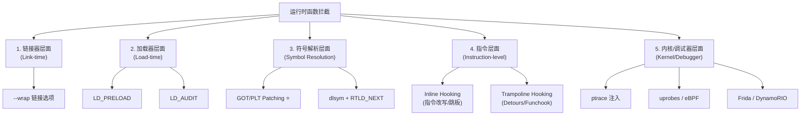

[任务规划完成]
# Linux/Unix 运行时函数拦截技术全景

## 一、技术分类总览



---

## 二、各方案详细介绍

### 1. `LD_PRELOAD`（最经典、最常用）

**原理**：动态链接器（`ld-linux.so`）在解析符号时，会优先查找 `LD_PRELOAD` 指定的库。利用这个特性，可以让自定义库覆盖系统库的同名函数。

**示例**：
```c
// myhook.c
#define _GNU_SOURCE
#include <dlfcn.h>
#include <stdio.h>

typedef void* (*malloc_t)(size_t);

void* malloc(size_t size) {
    static malloc_t real_malloc = NULL;
    if (!real_malloc) real_malloc = (malloc_t)dlsym(RTLD_NEXT, "malloc");
    void* p = real_malloc(size);
    fprintf(stderr, "malloc(%zu) = %p\n", size, p);
    return p;
}
```
```bash
gcc -shared -fPIC myhook.c -o myhook.so -ldl
LD_PRELOAD=./myhook.so ./your_program
```

**优点**：实现简单、无需修改目标程序。  
**缺点**：
- 只能在**进程启动前**设置，已运行进程无效。
- 对 `setuid` 程序失效（安全限制）。
- 静态链接的程序不受影响。
- 只能 hook 通过 PLT 调用的函数（库内部直接调用不会走 PLT）。

---

### 2. GOT/PLT Patching（async-profiler 用的就是这个）⭐

**原理**：动态链接生成的可执行文件/共享库中，每个外部函数调用都通过 **PLT (Procedure Linkage Table)** 跳转，PLT 又读取 **GOT (Global Offset Table)** 中的实际地址。运行时直接改写 GOT 表项，所有后续调用都会被劫持。

```
caller code:  call   plt_dlopen
plt_dlopen:   jmp    *GOT[dlopen]   <-- 我们改这个指针
              ↓
         dlopen_hook (我们的函数)
```

**与 `LD_PRELOAD` 的关键区别**：

| 维度 | LD_PRELOAD | GOT/PLT Patching |
|------|-----------|------------------|
| 生效时机 | 进程启动前 | **运行时任意时刻** |
| 对已加载库 | 全部一并替换 | 可以选择性 patch（async-profiler 就跳过自己） |
| 实现复杂度 | 低 | 中（需要遍历 ELF、`mprotect` GOT 页） |
| 对 attach 模式 | 不可用 | **可用**（这是 profiler 选它的核心原因） |

**代表项目**：async-profiler、bytehook（字节跳动 Android）、plthook。

---

### 3. `dlsym(RTLD_NEXT, ...)` 配合 `LD_PRELOAD`

**原理**：在 hook 函数内部用 `dlsym(RTLD_NEXT, "func")` 拿到下一个同名符号（即原函数）。这是 `LD_PRELOAD` 方案中**调用原函数**的标准做法。

async-profiler 也用了这个，看代码：

```cpp
#define ADDRESS_OF(sym) ({ \
    void* addr = dlsym(RTLD_NEXT, #sym); \
    addr != NULL ? (sym##_t)addr : sym;  \
})
```

`_orig_pthread_create = ADDRESS_OF(pthread_create);` 就是用它拿到 libc 真正的 `pthread_create`。

---

### 4. `LD_AUDIT`（rtld-audit 接口）

**原理**：glibc 提供的动态链接器审计接口（`man rtld-audit`），允许第三方库在动态链接事件（库加载、符号绑定）时被回调。常用于符号绑定阶段直接替换返回值。

**示例**：
```c
unsigned int la_version(unsigned int v) { return v; }

uintptr_t la_symbind64(Elf64_Sym *sym, unsigned int ndx,
                       uintptr_t *refcook, uintptr_t *defcook,
                       unsigned int *flags, const char *symname) {
    if (strcmp(symname, "malloc") == 0)
        return (uintptr_t)my_malloc;   // 替换符号绑定结果
    return sym->st_value;
}
```
```bash
LD_AUDIT=./audit.so ./your_program
```

**优点**：比 `LD_PRELOAD` 更细粒度，可监控库加载、所有符号绑定。  
**缺点**：仅 glibc 支持，运行开销高（关闭 BIND_NOW 优化），调试困难。

---

### 5. Inline Hooking / Trampoline Hooking（指令改写）

**原理**：**直接修改目标函数开头的几条机器指令**，用一条 `jmp` 跳到 hook 函数。原指令保存在"trampoline"中，用于回调原函数。

```
原函数开头:   push %rbp           变成      jmp hook_func
              mov %rsp,%rbp                 ...
              ...

trampoline:   push %rbp           ; 保留的原始指令
              mov %rsp,%rbp
              jmp 原函数+N        ; 跳回继续执行
```

**代表项目**：
- **funchook**（Linux/Mac/Windows，C 库）
- **subhook**（轻量、跨平台）
- **Microsoft Detours**（Windows 起家，已支持 Linux）
- **Frida-gum**（Frida 的核心）

**优点**：能 hook **任意函数**，不依赖 PLT/GOT，包括库内部调用、静态链接函数、甚至中间地址。  
**缺点**：
- 必须解决**指令长度问题**（x86 变长指令需要反汇编引擎来确定指令长度，避免单条指令被拦截断）。
- 多线程下改写代码段需要暂停其他线程，否则可能在执行半改写指令时崩溃。
- 需要 `mprotect` 把 `.text` 改为可写（破坏 W^X）。
- ARM/AArch64 上指令对齐和分支跳转距离(定长指令带来的限制)都更复杂。
- 相对寻址和重定位的重新计算。

---

### 6. `ptrace` 注入

**原理**：使用 `ptrace(PTRACE_ATTACH, ...)` 附加目标进程，修改其寄存器和内存，使其在目标进程内调用 `dlopen` 加载我们的 `.so`，再让我们的代码做 hook。

**代表项目**：
- **GDB**（调试器）
- **strace** / **ltrace**（系统调用/库调用跟踪）
- 各种"游戏外挂"和热更新框架

**优点**：可以注入**已经运行**的进程，无需任何前置条件。  
**缺点**：需要 `CAP_SYS_PTRACE` 权限；对目标进程有暂停影响；与 seccomp、Yama LSM (`ptrace_scope`) 冲突。

---

### 7. uprobes + eBPF（现代内核方案）

**原理**：利用 Linux 内核的 **uprobes** 机制在用户空间函数入口下断点（INT3），命中时陷入内核，由 eBPF 程序处理。

**示例（bpftrace）**：
```bash
bpftrace -e 'uprobe:/lib/x86_64-linux-gnu/libc.so.6:malloc { 
    printf("pid=%d size=%d\n", pid, arg0); 
}'
```

**优点**：
- **无需修改目标进程的内存或代码**（断点在内核侧管理）。
- 性能开销可控、安全（eBPF 验证器）。
- 系统级观测（同时观测所有进程）。

**缺点**：
- 需要内核支持（4.x+）和 root/`CAP_BPF` 权限。
- **只能观测，不能替换**函数行为（无法改返回值/参数 *直接* 走主路径，需要 `bpf_override_return`，仅限 error injection）。
- 不适合做"功能性 hook"，更多用于性能分析和追踪。

**代表工具**：bpftrace、bcc、Pixie、Parca。

---

### 8. 动态二进制插桩（DBI）

**原理**：把整个进程的指令流先**翻译/重写**到一个内部缓存再执行，可以在任意指令边界插入回调。

**代表项目**：
- **Frida**（基于 Stalker，跨平台，JS 脚本）
- **DynamoRIO**（Google）
- **Intel Pin**
- **Valgrind**（慢但精确）

**优点**：表达能力最强，可以拦截任意位置（甚至单条指令）。  
**缺点**：性能开销大（5×~50×），实现复杂。

---

### 9. 链接期 `--wrap`

**原理**：GNU ld 的 `-Wl,--wrap=malloc` 选项，在链接时把所有 `malloc` 调用替换为 `__wrap_malloc`，原函数变成 `__real_malloc`。

```c
void* __wrap_malloc(size_t size) {
    void* p = __real_malloc(size);
    log("malloc %zu -> %p", size, p);
    return p;
}
```

**优点**：编译期决定，零运行时开销。  
**缺点**：**只能在自己控制构建过程时用**，不能用于已经发布的二进制。

---

## 三、async-profiler 的选择逻辑

回看 `Hooks::init`：

```cpp
if (attach) {
    ...
    _orig_pthread_create = ADDRESS_OF(pthread_create);  // dlsym RTLD_NEXT
    _orig_dlopen = ADDRESS_OF(dlopen);
    patchLibraries();                                   // GOT patching
}
```

它实际上**组合使用了多种技术**：

1. **`LD_PRELOAD` 模式**：当作为预加载库启动时，定义弱符号（`extern "C" WEAK`）的 `pthread_create`/`dlopen`/`pthread_exit` 直接覆盖 libc 同名函数。
2. **Attach 模式**：进程已经运行，`LD_PRELOAD` 没用，所以用 **GOT/PLT patching** 改写所有已加载库的导入表。
3. **`dlsym(RTLD_NEXT)`**：拿到原始函数地址用于 fallback 调用。
4. **新库加载时持续 patch**：通过 hook `dlopen` 实现"以后再加载的库也要 patch"——这是 GOT patching 的固有限制（只能 patch 已加载的库），用 `dlopen_hook` 弥补。

## 四、对比速查表

| 方案 | 启动前 | Attach 已运行进程 | 静态链接 | 库内部调用 | 权限要求 | 性能开销 |
|------|--------|-------------------|----------|------------|----------|----------|
| `LD_PRELOAD` | ✅ | ❌ | ❌ | ❌ | 普通 | 极低 |
| GOT/PLT patching | ✅ | ✅ | ❌ | ❌ | 普通 | 极低 |
| `LD_AUDIT` | ✅ | ❌ | ❌ | ❌ | 普通 | 中 |
| Inline hooking | ✅ | ✅ | ✅ | ✅ | 普通(同进程) | 低 |
| `--wrap` | ✅(编译期) | ❌ | ✅ | ✅ | 需源码 | 零 |
| `ptrace` 注入 | ✅ | ✅ | ✅ | ✅ | CAP_SYS_PTRACE | 注入瞬间高 |
| uprobes+eBPF | ✅ | ✅ | ✅ | ✅ | root/CAP_BPF | 低 |
| Frida/DBI | ✅ | ✅ | ✅ | ✅ | 普通(同进程) | 高 |

## 五、选择建议

- **想做 APM/Profiler，需要随时 attach**：GOT/PLT patching（async-profiler、Pyroscope）。
- **写个 mock/fault injection 测试库**：`LD_PRELOAD` + `dlsym(RTLD_NEXT)`。
- **要 hook 某个库的内部函数**：inline hooking（funchook/Frida）。
- **观测整机所有进程的行为**：uprobes + eBPF（bpftrace/bcc）。
- **逆向分析、动态调试**：Frida、GDB、DynamoRIO。
- **自己控制构建，想零开销**：`-Wl,--wrap`。