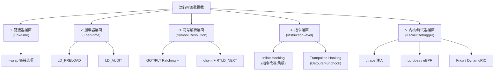
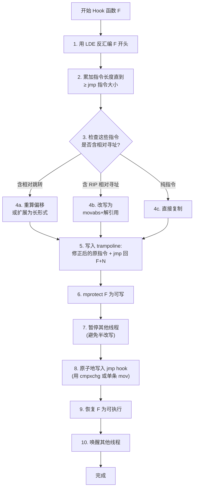
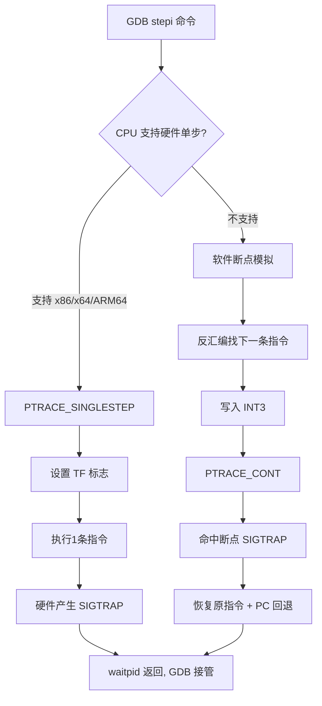

[任务规划完成]
# Linux/Unix 运行时函数拦截技术全景

## 一、技术分类总览


```mermaid
flowchart TD
    Root["运行时函数拦截"]
    Root --> A["1. 链接器层面<br/>(Link-time)"]
    Root --> B["2. 加载器层面<br/>(Load-time)"]
    Root --> C["3. 符号解析层面<br/>(Symbol Resolution)"]
    Root --> D["4. 指令层面<br/>(Instruction-level)"]
    Root --> E["5. 内核/调试器层面<br/>(Kernel/Debugger)"]

    A --> A1["--wrap 链接选项"]
    B --> B1["LD_PRELOAD"]
    B --> B2["LD_AUDIT"]
    C --> C1["GOT/PLT Patching ⭐"]
    C --> C2["dlsym + RTLD_NEXT"]
    D --> D1["Inline Hooking<br/>(指令改写/跳板)"]
    D --> D2["Trampoline Hooking<br/>(Detours/Funchook)"]
    E --> E1["ptrace 注入"]
    E --> E2["uprobes / eBPF"]
    E --> E3["Frida / DynamoRIO"]
```

---

## 二、各方案详细介绍

### 1. `LD_PRELOAD`（最经典、最常用）

**原理**：动态链接器（`ld-linux.so`）在解析符号时，会优先查找 `LD_PRELOAD` 指定的库。利用这个特性，可以让自定义库覆盖系统库的同名函数。

**示例**：
```c
// myhook.c
#define _GNU_SOURCE
#include <dlfcn.h>
#include <stdio.h>

typedef void* (*malloc_t)(size_t);

void* malloc(size_t size) {
    static malloc_t real_malloc = NULL;
    if (!real_malloc) real_malloc = (malloc_t)dlsym(RTLD_NEXT, "malloc");
    void* p = real_malloc(size);
    fprintf(stderr, "malloc(%zu) = %p\n", size, p);
    return p;
}
```
```bash
gcc -shared -fPIC myhook.c -o myhook.so -ldl
LD_PRELOAD=./myhook.so ./your_program
```

**优点**：实现简单、无需修改目标程序。  
**缺点**：
- 只能在**进程启动前**设置，已运行进程无效。
- 对 `setuid` 程序失效（安全限制）。
- 静态链接的程序不受影响。
- 只能 hook 通过 PLT 调用的函数（库内部直接调用不会走 PLT）。

---

### 2. GOT/PLT Patching（async-profiler 用的就是这个）⭐

**原理**：动态链接生成的可执行文件/共享库中，每个外部函数调用都通过 **PLT (Procedure Linkage Table)** 跳转，PLT 又读取 **GOT (Global Offset Table)** 中的实际地址。运行时直接改写 GOT 表项，所有后续调用都会被劫持。

```
caller code:  call   plt_dlopen
plt_dlopen:   jmp    *GOT[dlopen]   <-- 我们改这个指针
              ↓
         dlopen_hook (我们的函数)
```

**与 `LD_PRELOAD` 的关键区别**：

| 维度 | LD_PRELOAD | GOT/PLT Patching |
|------|-----------|------------------|
| 生效时机 | 进程启动前 | **运行时任意时刻** |
| 对已加载库 | 全部一并替换 | 可以选择性 patch（async-profiler 就跳过自己） |
| 实现复杂度 | 低 | 中（需要遍历 ELF、`mprotect` GOT 页） |
| 对 attach 模式 | 不可用 | **可用**（这是 profiler 选它的核心原因） |

**代表项目**：async-profiler、bytehook（字节跳动 Android）、plthook。

---

### 3. `dlsym(RTLD_NEXT, ...)` 配合 `LD_PRELOAD`

**原理**：在 hook 函数内部用 `dlsym(RTLD_NEXT, "func")` 拿到下一个同名符号（即原函数）。这是 `LD_PRELOAD` 方案中**调用原函数**的标准做法。

async-profiler 也用了这个，看代码：

```cpp
#define ADDRESS_OF(sym) ({ \
    void* addr = dlsym(RTLD_NEXT, #sym); \
    addr != NULL ? (sym##_t)addr : sym;  \
})
```

`_orig_pthread_create = ADDRESS_OF(pthread_create);` 就是用它拿到 libc 真正的 `pthread_create`。

---

### 4. `LD_AUDIT`（rtld-audit 接口）

**原理**：glibc 提供的动态链接器审计接口（`man rtld-audit`），允许第三方库在动态链接事件（库加载、符号绑定）时被回调。常用于符号绑定阶段直接替换返回值。

**示例**：
```c
unsigned int la_version(unsigned int v) { return v; }

uintptr_t la_symbind64(Elf64_Sym *sym, unsigned int ndx,
                       uintptr_t *refcook, uintptr_t *defcook,
                       unsigned int *flags, const char *symname) {
    if (strcmp(symname, "malloc") == 0)
        return (uintptr_t)my_malloc;   // 替换符号绑定结果
    return sym->st_value;
}
```
```bash
LD_AUDIT=./audit.so ./your_program
```

**优点**：比 `LD_PRELOAD` 更细粒度，可监控库加载、所有符号绑定。  
**缺点**：仅 glibc 支持，运行开销高（关闭 BIND_NOW 优化），调试困难。

---

### 5. Inline Hooking / Trampoline Hooking（指令改写）

**原理**：**直接修改目标函数开头的几条机器指令**，用一条 `jmp` 跳到 hook 函数。原指令保存在"trampoline"中，用于回调原函数。

```
原函数开头:   push %rbp           变成      jmp hook_func
              mov %rsp,%rbp                 ...
              ...

trampoline:   push %rbp           ; 保留的原始指令
              mov %rsp,%rbp
              jmp 原函数+N        ; 跳回继续执行
```

**代表项目**：
- **funchook**（Linux/Mac/Windows，C 库）
- **subhook**（轻量、跨平台）
- **Microsoft Detours**（Windows 起家，已支持 Linux）
- **Frida-gum**（Frida 的核心）

**优点**：能 hook **任意函数**，不依赖 PLT/GOT，包括库内部调用、静态链接函数、甚至中间地址。  
**缺点**：
- 必须解决**指令长度问题**（x86 变长指令需要反汇编引擎来确定指令长度，避免单条指令被拦截断）。
- 多线程下改写代码段需要暂停其他线程，否则可能在执行半改写指令时崩溃。
- 需要 `mprotect` 把 `.text` 改为可写（破坏 W^X）。
- ARM/AArch64 上指令对齐和分支跳转距离(定长指令带来的限制)都更复杂。
- 相对寻址和重定位的重新计算。
- 需要绕过硬件安全机制，PAC负责给所有敏感指针（返回地址、虚表指针等）打上专属防伪签名，从源头杜绝攻击者伪造合法跳转指针；BTI则给所有允许作为间接跳转目标的代码入口打上专属标识，仅带合法标识的地址才能被跳转命中，二者配合从“指针合法性”和“跳转目的地准入”两个维度，彻底封堵ROP、JOP类控制流劫持。

---

### 6. `ptrace` 注入

**原理**：使用 `ptrace(PTRACE_ATTACH, ...)` 附加目标进程，修改其寄存器和内存，使其在目标进程内调用 `dlopen` 加载我们的 `.so`，再让我们的代码做 hook。

**代表项目**：
- **GDB**（调试器）
- **strace** / **ltrace**（系统调用/库调用跟踪）
- 各种"游戏外挂"和热更新框架

**优点**：可以注入**已经运行**的进程，无需任何前置条件。  
**缺点**：需要 `CAP_SYS_PTRACE` 权限；对目标进程有暂停影响；与 seccomp、Yama LSM (`ptrace_scope`) 冲突。

---

### 7. uprobes + eBPF（现代内核方案）

**原理**：利用 Linux 内核的 **uprobes** 机制在用户空间函数入口下断点（INT3），命中时陷入内核，由 eBPF 程序处理。

**示例（bpftrace）**：
```bash
bpftrace -e 'uprobe:/lib/x86_64-linux-gnu/libc.so.6:malloc { 
    printf("pid=%d size=%d\n", pid, arg0); 
}'
```

**优点**：
- **无需修改目标进程的内存或代码**（断点在内核侧管理）。
- 性能开销可控、安全（eBPF 验证器）。
- 系统级观测（同时观测所有进程）。

**缺点**：
- 需要内核支持（4.x+）和 root/`CAP_BPF` 权限。
- **只能观测，不能替换**函数行为（无法改返回值/参数 *直接* 走主路径，需要 `bpf_override_return`，仅限 error injection）。
- 不适合做"功能性 hook"，更多用于性能分析和追踪。

**代表工具**：bpftrace、bcc、Pixie、Parca。

---

### 8. 动态二进制插桩（DBI）

**原理**：把整个进程的指令流先**翻译/重写**到一个内部缓存再执行，可以在任意指令边界插入回调。

**代表项目**：
- **Frida**（基于 Stalker，跨平台，JS 脚本）
- **DynamoRIO**（Google）
- **Intel Pin**
- **Valgrind**（慢但精确）

**优点**：表达能力最强，可以拦截任意位置（甚至单条指令）。  
**缺点**：性能开销大（5×~50×），实现复杂。

---

### 9. 链接期 `--wrap`

**原理**：GNU ld 的 `-Wl,--wrap=malloc` 选项，在链接时把所有 `malloc` 调用替换为 `__wrap_malloc`，原函数变成 `__real_malloc`。

```c
void* __wrap_malloc(size_t size) {
    void* p = __real_malloc(size);
    log("malloc %zu -> %p", size, p);
    return p;
}
```

**优点**：编译期决定，零运行时开销。  
**缺点**：**只能在自己控制构建过程时用**，不能用于已经发布的二进制。

---

## 三、async-profiler 的选择逻辑

回看 `Hooks::init`：

```cpp
if (attach) {
    ...
    _orig_pthread_create = ADDRESS_OF(pthread_create);  // dlsym RTLD_NEXT
    _orig_dlopen = ADDRESS_OF(dlopen);
    patchLibraries();                                   // GOT patching
}
```

它实际上**组合使用了多种技术**：

1. **`LD_PRELOAD` 模式**：当作为预加载库启动时，定义弱符号（`extern "C" WEAK`）的 `pthread_create`/`dlopen`/`pthread_exit` 直接覆盖 libc 同名函数。
2. **Attach 模式**：进程已经运行，`LD_PRELOAD` 没用，所以用 **GOT/PLT patching** 改写所有已加载库的导入表。
3. **`dlsym(RTLD_NEXT)`**：拿到原始函数地址用于 fallback 调用。
4. **新库加载时持续 patch**：通过 hook `dlopen` 实现"以后再加载的库也要 patch"——这是 GOT patching 的固有限制（只能 patch 已加载的库），用 `dlopen_hook` 弥补。

## 四、对比速查表

| 方案 | 启动前 | Attach 已运行进程 | 静态链接 | 库内部调用 | 权限要求 | 性能开销 |
|------|--------|-------------------|----------|------------|----------|----------|
| `LD_PRELOAD` | ✅ | ❌ | ❌ | ❌ | 普通 | 极低 |
| GOT/PLT patching | ✅ | ✅ | ❌ | ❌ | 普通 | 极低 |
| `LD_AUDIT` | ✅ | ❌ | ❌ | ❌ | 普通 | 中 |
| Inline hooking | ✅ | ✅ | ✅ | ✅ | 普通(同进程) | 低 |
| `--wrap` | ✅(编译期) | ❌ | ✅ | ✅ | 需源码 | 零 |
| `ptrace` 注入 | ✅ | ✅ | ✅ | ✅ | CAP_SYS_PTRACE | 注入瞬间高 |
| uprobes+eBPF | ✅ | ✅ | ✅ | ✅ | root/CAP_BPF | 低 |
| Frida/DBI | ✅ | ✅ | ✅ | ✅ | 普通(同进程) | 高 |

## 五、选择建议

- **想做 APM/Profiler，需要随时 attach**：GOT/PLT patching（async-profiler、Pyroscope）。
- **写个 mock/fault injection 测试库**：`LD_PRELOAD` + `dlsym(RTLD_NEXT)`。
- **要 hook 某个库的内部函数**：inline hooking（funchook/Frida）。
- **观测整机所有进程的行为**：uprobes + eBPF（bpftrace/bcc）。
- **逆向分析、动态调试**：Frida、GDB、DynamoRIO。
- **自己控制构建，想零开销**：`-Wl,--wrap`。

___

# Inline Hooking 中的指令长度问题详解

这是 Inline Hooking 实现中**最核心也最容易出错**的环节。下面我从原理、问题、解决方案三个层面展开。

---

## 一、问题根源：x86/x64 是变长指令集

不同于 ARM/AArch64（固定 4 字节），x86/x64 指令长度从 **1 字节到 15 字节**不等，而 Inline Hook 要往函数开头**写一条无条件跳转指令**跳到 hook 函数：

```
x86-64 长跳转 (绝对地址)：
  FF 25 00 00 00 00       jmp *(%rip)        ; 6 字节
  XX XX XX XX XX XX XX XX <hook_addr>        ; 8 字节
                                              共 14 字节

或短一点的相对跳转 (±2GB 内)：
  E9 XX XX XX XX          jmp rel32           ; 5 字节
```

**问题来了：原函数开头那 14 字节（或 5 字节）覆盖了几条指令？最后一条是不是被切到一半？**

---

## 二、具体场景演示

### 跳板（trampoline）的构造

正确做法：搬走**完整的若干条指令**，且总长度 ≥ jmp 长度，然后接一条回跳。

```
trampoline:
   55                    push %rbp           ; 复制原指令1
   48 89 E5              mov %rsp,%rbp       ; 复制原指令2
   48 83 EC 20           sub $0x20,%rsp      ; 复制原指令3 (此时已 8 字节 ≥ 5)
   E9 XX XX XX XX        jmp 0x40050B        ; 回跳到原函数 +8 处
```

**关键点**：必须知道每条指令的精确长度，才能：
1. 决定搬几条指令到 trampoline（直到累计长度 ≥ jmp 大小）。
2. 计算原函数中 jmp 之后的"垃圾区"会落在哪里（要 padding 成 nop 或就让它死掉，反正不会被执行）。
3. 算出 trampoline 末尾要跳回原函数的哪个偏移。

**这就是为什么必须有反汇编引擎** —— 你必须能把字节流解析成"这条 3 字节、那条 4 字节"。

---

## 三、还不止于此：相对寻址指令的修正

更棘手的问题是：**搬走的指令里如果有"相对地址"指令，搬到新位置后含义就变了！**

### 典型危险指令

#### 1. `call rel32` / `jmp rel32`（相对跳转）

```
原函数 0x400500: E8 FB FA BF FF    call 0x100000    ; 调用相对偏移
                                                    ; 0x400505 + 0xFFBFFAFB = 0x100000
```

如果原封不动复制到 trampoline `0x7F1234560000`：
```
trampoline 0x7F1234560000: E8 FB FA BF FF    
                                 ; 实际跳转到 0x7F1234560005 + 0xFFBFFAFB
                                 ; = 0x7F12345200FB ❌ 完全错了！
```

#### 2. `jcc rel8/rel32`（条件跳转）

```
74 0A          je +10
0F 84 XX XX XX XX  je rel32
```

同样需要修正偏移。但更糟的是 **rel8 范围只有 ±127 字节**，搬到远处 trampoline 后可能根本跳不到原目标——需要**改写为 rel32 形式或 jmp 跳板链**。

#### 3. `mov rax, [rip+offset]`（RIP 相对寻址，x86-64 特有）

```
48 8B 05 12 00 00 00    mov rax, [rip+0x12]
```

x86-64 PIC 代码大量使用 RIP 相对寻址访问全局变量。一旦搬走，`rip` 变了，访问的就是 trampoline 附近的随机内存。

#### 4. `lea rax, [rip+offset]`（同样的问题）

#### 5. 极端情况：跳转目标落在被覆盖区内

```
0x400500: 55              push %rbp
0x400501: 48 89 E5        mov %rsp,%rbp
0x400504: 74 FA           je 0x400500     ; 跳回函数开头！
```

如果我们把前 5 字节改成 jmp，那这条 `je 0x400500` 跳回去的就是我们的 jmp 了——形成无限递归。这种函数**根本无法 inline hook**，必须放弃或换策略。

---

## 四、反汇编引擎的核心职责

一个 inline hooking 框架内部的反汇编引擎（**长度解析器，length disassembler**）至少要做：

| 职责 | 说明 |
|------|------|
| 1. 解析指令长度 | 给定字节流，返回每条指令的精确字节数 |
| 2. 识别相对寻址 | 判断是否含 `rel8/rel16/rel32` 或 `RIP+disp32` |
| 3. 提取偏移字段位置 | 知道哪几个字节是位移立即数 |
| 4. 重定位（relocate） | 把搬到新地址的指令偏移重新计算 |
| 5. 处理无法重定位指令 | 报错或扩展为长形式 |

---

## 五、完整的 Inline Hook 算法流程


```mermaid
flowchart TD
    Start["开始 Hook 函数 F"] --> A["1. 用 LDE 反汇编 F 开头"]
    A --> B["2. 累加指令长度直到<br/>≥ jmp 指令大小"]
    B --> C{"3. 检查这些指令<br/>是否含相对寻址?"}
    C -->|含相对跳转| D["4a. 重算偏移<br/>或扩展为长形式"]
    C -->|含 RIP 相对寻址| E["4b. 改写为<br/>movabs+解引用"]
    C -->|纯指令| F["4c. 直接复制"]
    D --> G["5. 写入 trampoline:<br/>修正后的原指令 + jmp 回 F+N"]
    E --> G
    F --> G
    G --> H["6. mprotect F 为可写"]
    H --> I["7. 暂停其他线程<br/>(避免半改写)"]
    I --> J["8. 原子地写入 jmp hook<br/>(用 cmpxchg 或单条 mov)"]
    J --> K["9. 恢复 F 为可执行"]
    K --> L["10. 唤醒其他线程"]
    L --> End["完成"]
```

## 七、ARM/AArch64 上的对应问题

虽然 ARM 是定长指令（A64 全是 4 字节），但**也有自己的麻烦**：

1. **PC 相对加载**：`ldr x0, [pc, #imm]`、`adrp` 等，搬走后偏移失效。
2. **跳转范围限制**：
    - `B`（无条件分支）±128MB
    - `BL`（带链接分支）±128MB
    - `B.cond`（条件分支）±1MB
    - 超出范围必须用多指令组合：`adrp + add + br x16`
3. **指令缓存**：ARM 上修改代码后必须 `dc cvau` + `ic ivau` + `isb` 清 I-Cache，否则 CPU 可能执行旧指令。

所以 ARM 上 inline hook 不需要"长度反汇编"，但仍然需要"指令重定位（relocator）"。

---

## 八、总结

| 难点 | 本质 | 解决方案 |
|------|------|----------|
| 指令变长 | x86 一条指令 1~15 字节 | 长度反汇编引擎（LDE） |
| 切到指令中间 | 5 字节 jmp 不一定整齐覆盖 | 找到≥5字节的最小完整指令组 |
| 相对跳转失效 | 搬走后 PC 不同 | 重算 rel32 偏移 |
| RIP 相对寻址失效 | 同上，且可能超出 ±2GB | 改写为 movabs+间接访问 |
| rel8 范围不够 | ±127 字节根本跳不到 | 扩展为 rel32 形式 |
| 跳转目标在被覆盖区 | 形成自我修改的死循环 | 检测到后放弃 hook |
| 多线程时序问题 | 有线程正在执行被改写的字节 | 暂停线程 / 原子单指令写入 |

这就是为什么 **Inline Hooking 远没有 GOT/PLT Patching 简单**——后者只改一个 8 字节指针，前者要做"微型 JIT 编译器"的工作。这也是 async-profiler 选 GOT patching 的另一个重要原因：**简单、可靠、不依赖反汇编引擎**。

___

# GDB 如何使用 ptrace 实现单步执行（每条指令后断点）

GDB 实现"每条指令执行后进入断点"的功能叫做 **单步执行（single-stepping）**，主要通过 `ptrace` 系统调用实现。有两种主要方式：

---

## 方式一：硬件单步（PTRACE_SINGLESTEP）—— 最常用

这是 GDB 默认使用的方式，依赖 CPU 的**硬件单步支持**（如 x86 的 TF 标志位）。

### 核心调用

```c
ptrace(PTRACE_SINGLESTEP, pid, 0, 0);
```

### 工作原理

1. **调用 `PTRACE_SINGLESTEP`** 让目标进程执行**一条指令**后自动停下
2. 内核实现（以 x86 为例）：
    - 设置 CPU 的 **EFLAGS 寄存器 TF (Trap Flag) 位**
    - 恢复被 tracee 执行
    - CPU 每执行完一条指令，硬件自动产生 `#DB` 调试异常（SIGTRAP）
    - 内核捕获 SIGTRAP 后清除 TF 位，让 tracee 停下（`TASK_STOPPED`）
3. **GDB 通过 `waitpid()` 接收 SIGTRAP**，恢复控制权，检查寄存器/内存

---

## 方式二：软件单步（INT3 断点模拟）

当**硬件不支持单步**（某些 RISC 架构如早期 MIPS、部分 ARM 模式）时，GDB 会用软件模拟：

### 工作原理

1. **反汇编当前 PC 处的指令**，分析出**下一条指令的地址**（需要处理分支/跳转）
2. 在下一条指令处**写入 INT3（0xCC）断点指令**：
   ```c
   long orig = ptrace(PTRACE_PEEKTEXT, pid, next_pc, 0);
   long trap = (orig & ~0xFF) | 0xCC;
   ptrace(PTRACE_POKETEXT, pid, next_pc, trap);
   ```
3. **PTRACE_CONT 让 tracee 继续执行**：
   ```c
   ptrace(PTRACE_CONT, pid, 0, 0);
   ```
4. 执行到 INT3 触发 SIGTRAP，`waitpid` 返回
5. **恢复原指令**、把 PC 回退 1 字节（因为 x86 INT3 会 PC++）
6. 循环处理下一条指令

### 分支指令的挑战

条件跳转指令有两个可能的下一条指令位置，需要：
- 在两个可能地址都放 INT3，或
- 先解析条件+寄存器状态推断实际会跳的位置

---

## 方式对比


```mermaid
flowchart TB
    A[GDB stepi 命令] --> B{CPU 支持硬件单步?}
    B -->|支持 x86/x64/ARM64| C[PTRACE_SINGLESTEP]
    B -->|不支持| D[软件断点模拟]
    C --> E[设置 TF 标志]
    E --> F[执行1条指令]
    F --> G[硬件产生 SIGTRAP]
    D --> H[反汇编找下一条指令]
    H --> I[写入 INT3]
    I --> J[PTRACE_CONT]
    J --> K[命中断点 SIGTRAP]
    G --> L[waitpid 返回, GDB 接管]
    K --> M[恢复原指令 + PC 回退]
    M --> L
```

---

## 补充要点

| 要点 | 说明 |
|------|------|
| **信号传递** | 每次 SIGTRAP 都会让 tracee 进入 `TASK_STOPPED`，直到 tracer 再次 `PTRACE_CONT/SINGLESTEP` |
| **多线程** | GDB 需要对每个 LWP（线程）分别 `PTRACE_ATTACH` 和单步 |
| **PC 修正** | 硬件单步后 PC 已指向下一条指令；软件 INT3 触发后 PC 在 INT3 之后，需要减 1（x86） |
| **性能** | 硬件单步 >> 软件单步；基本块单步 > 单指令单步 |
| **权限** | 需要 `CAP_SYS_PTRACE` 或者是被跟踪进程的 owner，且受 `/proc/sys/kernel/yama/ptrace_scope` 限制 |

## 软件单步优化

**软件单步会不停冲刷或污染流水线的指令缓存组件：**
1. **I-Cache（指令缓存）** —— L1iCache
2. **uop Cache（微操作缓存，x86）** —— DSB/LSD
3. **流水线中已 in-flight 的指令**
4. **BTB（分支目标缓冲）/ BPU（分支预测器）**
5. **TLB（如果跨页）**

### 1. **批量 patch**（Displaced Stepping / Out-of-line Stepping）
GDB 的 `displaced-stepping` 特性：把原指令**复制到一块 scratch pad 内存**执行，避免反复 patch 原代码。
```
原代码:  0x400000: mov %rax, %rbx   ← 只 patch 一次为 INT3
Scratch: 0x500000: mov %rax, %rbx   ← 单独执行这里，不动原代码
         0x500003: jmp 0x400003     ← 执行完跳回
```
避免了"patch → 恢复 → patch → 恢复"的循环。

### 2. **硬件调试寄存器 (DR0-DR7)**
x86 有 4 个硬件断点寄存器，不需要修改代码。GDB 的 `hbreak` 命令。
- 优点：**零代码修改**，无 SMC nuke
- 缺点：数量少（x86 只有 4 个），只能设置在指令边界

---