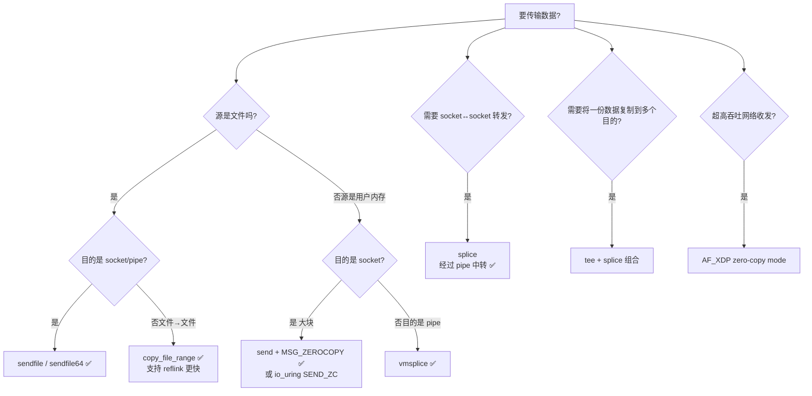

# 与 `sendfile` 同类的零拷贝系统调用全景

---

## 一、按"零拷贝程度"分级总览

| 系统调用 | 平台 | 数据走向 | CPU 拷贝次数 | DMA 次数 | 是否经过用户态 |
|---|---|---|---|---|---|
| `read + write` (传统) | 全平台 | 文件 ↔ socket | 2 次 | 2 次 | ✅ 经过 |
| `mmap + write` | 全平台 | 文件 → socket | 1 次 | 2 次 | ⚠️ 虚拟映射，不实际拷贝 |
| `sendfile` / `sendfile64` | Linux | 文件 → socket/pipe | 0 或 1 次 | 2 次 | ❌ 不经过 |
| **`splice`** | Linux | fd ↔ pipe ↔ fd | **0 次** | 2 次 | ❌ 不经过 |
| **`vmsplice`** | Linux | 用户内存 → pipe（页映射） | 0 次 | 1 次 | ⚠️ 仅映射页 |
| **`tee`** | Linux | pipe → pipe（复制描述符） | 0 次 | 0 次 | ❌ |
| **`copy_file_range`** | Linux 4.5+ | 文件 → 文件 | 0 次（同 fs 可 reflink） | 2 次或 0 次 | ❌ |
| **`MSG_ZEROCOPY`** (`send/sendmsg`) | Linux 4.14+ | 用户内存 → socket | 0 次 | 2 次 | ⚠️ 页锁定 |
| **`io_uring` + `IORING_OP_SEND_ZC`** | Linux 6.0+ | 用户内存 → socket | 0 次 | 2 次 | ⚠️ |
| **`AF_XDP` / `XDP_ZEROCOPY`** | Linux 4.18+ | 用户内存 ↔ 网卡 | 0 次 | 1 次 | ⚠️ 共享 UMEM |

---

## 二、Linux 平台的零拷贝家族（重点）

### 2.1 `splice(2)` — 真正"管道驱动"的零拷贝

```c
ssize_t splice(int fd_in, loff_t *off_in,
               int fd_out, loff_t *off_out,
               size_t len, unsigned int flags);
```

- **核心思想**：在内核里把一个 fd 的数据"嫁接"到 pipe，再从 pipe 嫁接到另一个 fd，**只移动 page cache 的引用（page 描述符），不复制数据本身**。
- **限制**：`fd_in` 或 `fd_out` 必须有一端是 pipe（这是它最大的"门槛"）。
- **典型用法**：socket → pipe → socket、file → pipe → socket。
- **flags**：
    - `SPLICE_F_MOVE`：尝试移动而不是拷贝页（仅 hint）。
    - `SPLICE_F_MORE`：告诉内核后面还会有数据（类似 `MSG_MORE`）。
    - `SPLICE_F_NONBLOCK`：非阻塞。

> Java 层目前未直接暴露 splice，但 Netty 在 epoll 传输模式下通过 JNI 调用 splice 实现 socket-to-socket 转发的零拷贝。

### 2.2 `vmsplice(2)` — 用户内存 → pipe 的零拷贝

```c
ssize_t vmsplice(int fd, const struct iovec *iov,
                 size_t nr_segs, unsigned int flags);
```

- 把用户态 buffer 的页**映射**进 pipe（不拷贝数据，仅"借用"页）。
- 需要小心：在内核消费完这些页之前，用户态不能修改 buffer，否则会数据竞争。

### 2.3 `tee(2)` — pipe 之间的零拷贝复制

```c
ssize_t tee(int fd_in, int fd_out, size_t len, unsigned int flags);
```

- 在两个 pipe 间"复制"数据，但实际上只是把页引用计数 +1，不真正搬数据。
- 常用于一份数据要同时发到两个目的地（比如：日志 + 网络）。

### 2.4 `copy_file_range(2)` — 文件到文件的零拷贝

```c
ssize_t copy_file_range(int fd_in, off_t *off_in,
                        int fd_out, off_t *off_out,
                        size_t len, unsigned int flags);
```

- 内核内完成 file-to-file 复制；
- 在支持 **reflink** 的文件系统（btrfs、xfs、ocfs2）上甚至能做成 **CoW 引用**，磁盘上都不真复制数据，秒级完成 TB 级"复制"。
- JDK 17+ 的 `Files.copy` 在 Linux 上会优先尝试此调用。

### 2.5 `MSG_ZEROCOPY` —— `send/sendmsg` 的零拷贝标志

```c
setsockopt(sock, SOL_SOCKET, SO_ZEROCOPY, &one, sizeof(one));
send(sock, buf, len, MSG_ZEROCOPY);
```

- 内核**锁定**用户态 buffer 的页，直接 DMA 给网卡，无 CPU 拷贝。
- 异步语义：发送完成通过 `MSG_ERRQUEUE` 通知，应用必须等到通知后才能复用/释放 buffer。
- 适合大块（≥10KB）TCP 发送；小块反而因簿记开销变慢。

### 2.6 `io_uring` 的零拷贝操作（最现代）

- `IORING_OP_SEND_ZC` / `IORING_OP_SENDMSG_ZC`（5.19/6.0+）：异步零拷贝发送，回调通知释放。
- `IORING_OP_SPLICE`：包装 `splice`。
- `IORING_OP_TEE`：包装 `tee`。
- 配合 **registered buffers / fixed files** 还能进一步省去每次 syscall 的 fd/buffer 查找开销。

### 2.7 `AF_XDP` / `XDP` — 旁路内核协议栈的零拷贝

- 在网卡驱动里把数据帧直接 DMA 到用户态共享的 **UMEM** 区域；
- 用于高性能数据面（DPDK 替代品），可达 Mpps 级别。

---

## 五、Linux 零拷贝调用之间的"路径选择"决策图



---

## 六、哪些是 JDK 中实际未用到的？

JDK 自身**未直接使用** `splice / vmsplice / tee / copy_file_range / MSG_ZEROCOPY / io_uring`，但：

- **Netty** 的 `EpollSocketChannel` 在 Linux 下提供了 `spliceTo()` API，底层走 `splice`。
- **JDK 19+** 引入的 Foreign Function & Memory API 让用户可以自己 JNI 调 `io_uring`、`AF_XDP`。
- **`Files.copy`（JDK 17+）** 在 Linux 上会尝试 `copy_file_range`，失败再回退普通 read/write。

---