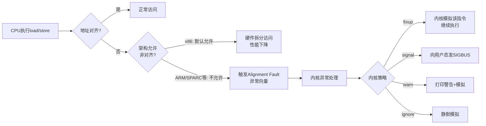

x86和ARM在内存对齐规则上的核心差异，本质是「兼容性优先」与「效率优先」两种设计哲学的碰撞，具体差异如下：

一、x86架构内存对齐规则
x86属于兼容性优先的宽松规则，核心特点是：
1. 默认规则：硬件原生支持非对齐访问，绝大多数场景下允许非对齐数据访问，对程序员透明。
2. 结构体内存对齐规范：
   - 第一个数据成员放在偏移量`0`位置，后续成员对齐到「编译器指定对齐值」和「成员自身大小」中较小值的整数倍地址。
   - 结构体总大小为最大成员对齐数的整数倍，不足的补填充字节。
3. 非对齐访问的影响：不会触发硬件异常，但会产生显著性能惩罚，延迟通常是对齐访问的2~3倍，且不保证访问原子性。

二、ARM架构内存对齐规则
ARM属于效率精简优先的严格规则，核心特点是：
1. 默认规则：默认要求严格对齐，指令本身要求操作数地址与数据大小对齐（如4字节数据访问地址必须是4的倍数）。
2. 非对齐支持演进：仅ARMv6及之后架构引入可选非对齐支持，需系统层配置开启，且仅支持单数据访问（LDR/STR），多加载指令（LDM/STM）仍必须对齐；双字访问即使在新架构下也要求严格对齐。
3. 非对齐访问的影响：未开启支持时直接触发硬件异常（Data Abort）导致程序崩溃；开启后仍比对齐访问性能差，且Device内存（外设寄存器）绝对禁止非对齐访问。

三、核心差异对比

| 对比维度                | x86架构                          | ARM架构（现代内核）              |
|-------------------------|----------------------------------|----------------------------------|
| 设计哲学                | 兼容性优先（CISC）               | 效率/精简优先（RISC）            |
| 默认对齐要求            | 硬件支持非对齐，要求宽松         | 默认强制严格对齐                 |
| 非对齐访问后果          | 性能惩罚，硬件透明处理不崩溃     | 性能惩罚，触发硬件异常SIGBUS   |
| 对开发者的影响          | 宽松不易出错，性能问题隐蔽难排查 | 严格易崩溃，错误立即暴露易定位   |
| 原子性保证              | 仅对齐访问保证原子性             | 仅对齐访问保证原子性，非对齐不支持 |

这种差异完全匹配两大架构的应用场景：x86主打PC/服务器，优先保障兼容性和开发便捷性；ARM主打移动/嵌入式设备，优先保障性能和低功耗，这也是设计选择差异的核心原因。

[任务规划完成]
# Linux Alignment Faults 触发逻辑深度分析

## 一、什么是 Alignment Fault

**对齐故障（Alignment Fault）** 是 CPU 在执行内存访问指令时，发现访问地址**不满足该数据类型所要求的对齐边界**而产生的硬件异常（trap/exception）。

例如：
- 访问 4 字节 `int` 时地址不是 4 的倍数
- 访问 8 字节 `long`/`double` 时地址不是 8 的倍数
- 访问 16 字节 SSE/NEON 向量时地址不是 16 的倍数



---

## 二、不同架构的硬件行为差异

这是理解 alignment fault 的**第一关键点**——不同 CPU 架构对非对齐访问的容忍度完全不同：

| 架构 | 标量非对齐 | 向量非对齐 | 原子操作非对齐 |
|------|-----------|-----------|---------------|
| **x86 / x86_64** | ✅ 硬件支持（性能略降，跨cache line时显著） | ⚠️ `MOVAPS/MOVDQA` 严格对齐，`MOVUPS/MOVDQU` 允许 | ❌ `LOCK` 前缀跨 cache line 触发 `#AC`（部分场景） |
| **ARMv7** | ⚠️ 受 `SCTLR.A` 控制；strongly-ordered/Device 内存严格对齐 | ❌ NEON 严格对齐 | ❌ LDREX/STREX 严格对齐 |
| **ARMv8 / aarch64** | ✅ Normal memory 默认允许；Device memory 严格 | ⚠️ 多数 SIMD 允许，部分严格 | ❌ LDXR/STXR 严格对齐 |
| **MIPS** | ❌ 严格对齐 | ❌ 严格对齐 | ❌ 严格 |
| **SPARC** | ❌ 严格对齐 | ❌ 严格 | ❌ 严格 |
| **RISC-V** | 实现相关（`Zicclsm` 扩展） | 实现相关 | 严格 |
| **PowerPC** | ⚠️ 部分支持，跨页/Device memory 触发 | ❌ AltiVec严格 | ❌ 严格 |

**关键结论**：
- **x86 上几乎看不到 alignment fault**（除了 `EFLAGS.AC=1` + CR0.AM=1 + ring3 的 `#AC` 检查模式，几乎没人开）
- **ARM/MIPS/SPARC 上 alignment fault 是真实且常见的问题**

---

## 四、ARM/aarch64 的触发与处理路径（核心场景）

### 1. 硬件触发条件

aarch64 上以下情况**必然触发 alignment fault**：

| 场景 | 说明 |
|------|------|
| 访问 **Device memory**（MMIO映射）非对齐 | 即使 SCTLR_EL1.A=0 也触发 |
| 访问 **SCTLR_EL1.A=1** 时任何非对齐 Normal memory | 内核启用严格对齐检查 |
| **LDXR/STXR**（独占访问，原子）非对齐 | 始终触发 |
| **DC ZVA**（cache line 清零）地址非对齐 | 始终触发 |
| 部分 **SIMD 加载** 要求自然对齐 | 取决于具体指令 |
| **PC 不是 4 字节对齐**（指令获取） | PC alignment fault |
| **SP 不是 16 字节对齐**（开启 SCTLR.SA） | SP alignment fault |

### 2. 内核异常入口（aarch64）

```c
// arch/arm64/kernel/entry-common.c → entry.S
// 异常向量 → el0_sync / el1_sync
//   → ESR_EL1 解码异常类
//   → EC_DABT (Data Abort)  → do_mem_abort
//   → EC_PC_ALIGN          → do_sp_pc_abort  (PC对齐)
//   → EC_SP_ALIGN          → do_sp_pc_abort  (SP对齐)

// arch/arm64/mm/fault.c
static const struct fault_info fault_info[] = {
    ...
    { do_alignment_fault, SIGBUS,  BUS_ADRALN, "alignment fault" },
    ...
};

void do_alignment_fault(unsigned long far, unsigned long esr,
                        struct pt_regs *regs)
{
    // 1. 内核态出错 → die（kernel BUG）
    // 2. 用户态出错 → 发送 SIGBUS, BUS_ADRALN
    do_bad_area(far, esr, regs);
}
```

## 六、典型代码触发场景

### 1. 强制类型转换打破对齐
```c
char buf[100];
int *p = (int *)(buf + 1);   // ⚠️ buf+1 大概率不是4字节对齐
*p = 0x12345678;             // ARM上可能触发alignment fault
```

### 2. 网络/文件协议解析
```c
// 解析以太网帧、TLV、二进制协议
struct pkt_hdr {
    uint8_t  type;
    uint32_t length;   // 偏移1，未对齐！
} __attribute__((packed));

uint32_t len = hdr->length;  // ARM上读packed字段触发
```

GCC 对 `__attribute__((packed))` 字段的访问**会自动用字节拼接**避免 fault，但如果你**取该字段地址再解引用**就会出问题：

```c
uint32_t *plen = &hdr->length;   // 这里指针没有packed信息
uint32_t v = *plen;              // 💥 ARM上fault
```

### 3. mmap 文件偏移导致非对齐
```c
char *p = mmap(NULL, size, ..., fd, offset);
struct foo *f = (struct foo *)(p + odd_offset);
f->member;   // 可能未对齐
```

### 4. SIMD 指令对齐失误
```c
// x86 SSE
__m128 v = _mm_load_ps(ptr);    // 要求16字节对齐，否则 #GP
__m128 v = _mm_loadu_ps(ptr);   // 不要求对齐
```

### 5. atomic / lock 跨 cache line（split lock）
```c
struct s {
    char pad[60];
    uint64_t counter;   // 偏移60，跨过64字节cache line边界
};
__sync_fetch_and_add(&s.counter, 1);   // x86触发split lock #AC
```
---

## 十二、一句话总结

> **Alignment Fault** 是 CPU 在非对齐访问时由硬件发起的同步异常，触发与否取决于 **架构 + 内存类型 + 指令类型 + 系统配置**