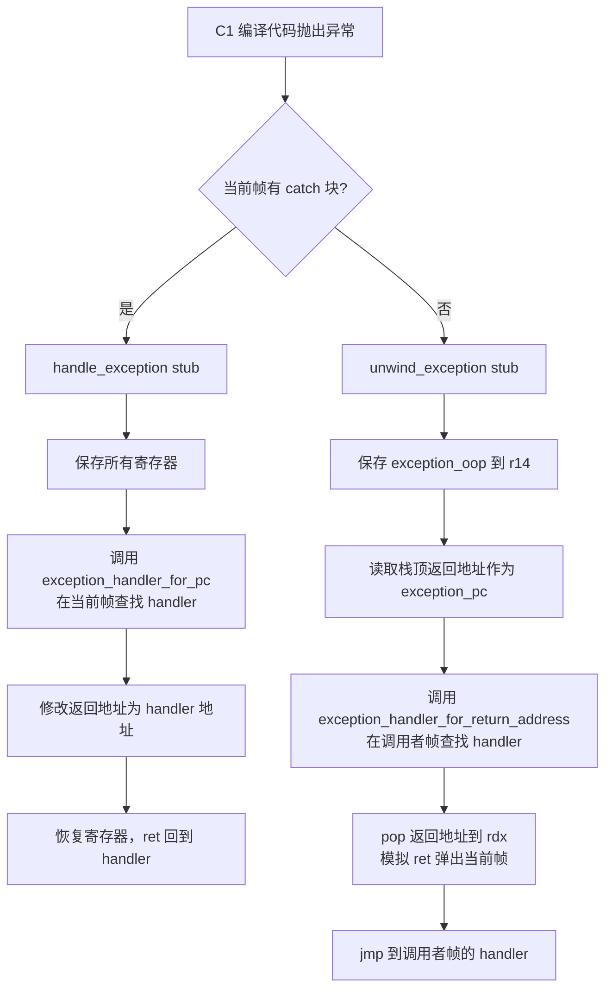

[任务规划完成]
[读取文件]
再读取 `SharedRuntime::exception_handler_for_return_address` 的实现，以及 `generate_handle_exception` 的相关代码，以便完整理解 unwind 流程。
[查找文件]
[读取文件]
现在我已经掌握了完整的实现细节，可以给出全面的分析。

---

# `generate_unwind_exception` 实现原理

## 背景：两种 C1 异常处理路径

C1（Client Compiler）中有两条异常处理路径，理解它们的区别是理解 `unwind_exception` 的关键：

| 路径 | 入口 Stub | 场景 |
|------|-----------|------|
| **当前帧处理** | `handle_exception` | 当前编译帧内有 catch 块，直接在本帧处理 |
| **展开（Unwind）** | `unwind_exception` | 当前帧没有 catch 块，需要**弹出当前帧**，交给调用者处理 |

---

## `generate_unwind_exception` 完整流程

### 寄存器约定（x86-64）

```
rax  = exception_oop          (入参：异常对象)
rdx  = exception_pc           (抛出点 PC，即当前帧的返回地址)
rbx  = handler_addr           (查找到的处理器地址)
r14  = exception_oop_callee_saved  (跨 call 保存 exception_oop)
r15  = thread                 (JavaThread*)
```

### 执行步骤详解

```
调用者帧
┌─────────────────────────────┐
│  ...                        │
│  return address  ← rsp[0]   │  ← 这就是 exception_pc（调用者的返回地址）
├─────────────────────────────┤
│  当前帧（已执行 leave，rbp已恢复）│
└─────────────────────────────┘
```

**Step 1：断言检查（DEBUG 模式）**

```cpp
// 确保 JavaThread 中的 exception_oop / exception_pc 字段为空
// 这两个字段是 handle_exception 路径使用的，unwind 路径不走那里
__ cmpptr(Address(thread, JavaThread::exception_oop_offset()), 0);
__ jcc(Assembler::equal, oop_empty);
__ stop("exception oop must be empty");
```

> 这个断言说明：`unwind_exception` 被调用时，线程的 exception 字段必须是干净的，它走的是**完全不同于 `handle_exception` 的路径**。

**Step 2：清空 FPU 栈**

```cpp
__ empty_FPU_stack();
```

防止 FPU 状态污染后续帧。

**Step 3：保存 exception_oop 到 callee-saved 寄存器**

```cpp
__ movptr(exception_oop_callee_saved, exception_oop);  // r14 = rax
```

因为接下来要调用 C++ 函数，`rax` 会被破坏，所以先保存到 callee-saved 的 `r14`。

**Step 4：获取返回地址（= 抛出点 PC）**

```cpp
__ movptr(exception_pc, Address(rsp, 0));  // rdx = [rsp]
```

此时 `rsp` 指向的是**当前帧的返回地址**（即调用者调用当前方法的 call 指令的下一条指令地址）。这个地址用于在**调用者帧**中查找异常处理器。

**Step 5：调用运行时查找异常处理器**

```cpp
__ call_VM_leaf(CAST_FROM_FN_PTR(address,
    SharedRuntime::exception_handler_for_return_address),
    thread, exception_pc);
// 返回值 rax = 调用者帧中的异常处理器地址
```

`SharedRuntime::exception_handler_for_return_address` 的逻辑：

```
根据 return_address 找到对应的 CodeBlob：
  ├── 是 nmethod（JIT 编译方法）？
  │     ├── 是 deopt PC？→ 返回 deopt_blob->unpack_with_exception()
  │     └── 否？         → 返回 nm->exception_begin()
  ├── 是 call stub？     → 返回 StubRoutines::catch_exception_entry()
  └── 是解释器？         → 返回 Interpreter::rethrow_exception_entry()
```

**Step 6：恢复寄存器**

```cpp
__ movptr(handler_addr, rax);           // rbx = 处理器地址（保存，因为 rax 要被 exception_oop 占用）
__ movptr(exception_oop, exception_oop_callee_saved);  // rax = 异常对象（从 r14 恢复）
```

**Step 7：弹出返回地址（模拟 ret 效果）**

```cpp
__ pop(exception_pc);  // rdx = 返回地址，同时 rsp += 8（弹出栈顶）
```

这一步非常关键：
- 将栈顶的返回地址弹入 `rdx`（即 `exception_pc`）
- `rsp` 向上移动，**相当于弹出了当前帧的返回地址**，模拟了 `ret` 的效果

**Step 8：跳转到异常处理器**

```cpp
__ jmp(handler_addr);  // jmp rbx
```

此时寄存器状态满足异常处理器的调用约定：
- `rax` = exception_oop（异常对象）
- `rdx` = exception_pc（抛出点 PC）
- `rsp` 已经弹出返回地址，指向调用者帧

---

## 与 `handle_exception` 的对比



| 特性 | `handle_exception` | `unwind_exception` |
|------|--------------------|--------------------|
| 查找范围 | **当前帧**（`exception_handler_for_pc`） | **调用者帧**（`exception_handler_for_return_address`） |
| 帧是否弹出 | 否，通过修改返回地址跳转 | **是**，通过 `pop` 模拟 `ret` 弹出当前帧 |
| 寄存器保存 | 保存所有活跃寄存器 | 只保存 exception_oop 到 callee-saved |
| JavaThread 字段 | 写入 `exception_oop/pc` 字段 | **不写入**，断言这两个字段必须为空 |
| 返回方式 | `ret`（通过修改栈上返回地址） | `jmp handler_addr`（直接跳转） |

---

## 关键设计点

1. **`pop exception_pc` 而非 `mov`**：`pop` 同时完成了两件事——读取返回地址到 `rdx`，并将 `rsp` 推进，使栈帧状态与"已经从当前方法返回"一致。

2. **不修改 JavaThread 的 exception 字段**：`unwind_exception` 是纯寄存器传递协议（`rax`=oop, `rdx`=pc），而 `handle_exception` 通过 JavaThread 字段传递。这是两条完全独立的路径。

3. **注释中的重要说明**：
   ```cpp
   // note: do *not* remove arguments when unwinding the activation
   // since the caller assumes having all arguments on the stack
   // when entering the runtime to determine the exception handler
   // (GC happens at call site with arguments!)
   ```
   展开时**不能清理调用参数**，因为 GC 在 call site 处需要扫描这些参数中的 oop 引用。